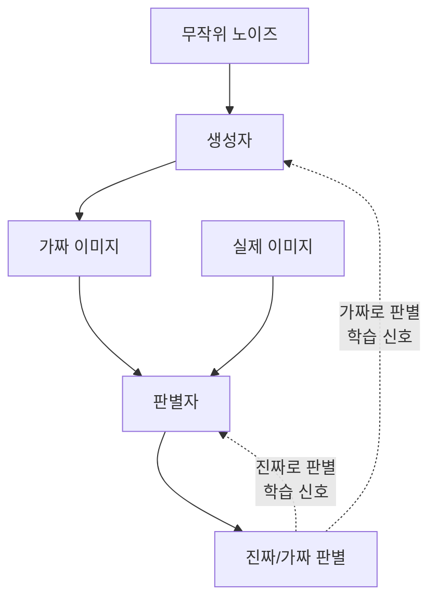

# 이미지 생성 (GAN & 확산 모델)

## 1. 핵심 개념 (Core Concept)

이미지 생성은 인공지능이 기존에 없던 새로운 이미지를 만들어내는 기술입니다. 대표적인 두 가지 방법론인 \*\*생성적 적대 신경망(GAN, Generative Adversarial Network)\*\*과 \*\*확산 모델(Diffusion Model)\*\*은 서로 다른 접근 방식을 통해 실제와 유사한 고품질 이미지를 생성합니다. GAN은 생성자와 판별자의 적대적 경쟁을 통해 학습하고, 확산 모델은 이미지에 노이즈를 추가했다가 다시 제거하는 과정을 학습하여 이미지를 생성합니다.

______________________________________________________________________

## 2. 상세 설명 (Detailed Explanation)

### 2.1 생성적 적대 신경망 (GAN)

GAN은 두 개의 신경망, 즉 \*\*생성자(Generator)\*\*와 \*\*판별자(Discriminator)\*\*가 서로 경쟁하며 학습하는 구조입니다.

- **생성자 (Generator)**: 위조지폐범에 비유할 수 있습니다. 무작위 노이즈 벡터를 입력받아 실제 이미지와 최대한 유사한 가짜 이미지를 생성하는 것을 목표로 합니다.
- **판별자 (Discriminator)**: 경찰에 비유할 수 있습니다. 실제 이미지와 생성자가 만든 가짜 이미지를 구별하도록 학습합니다. 진짜 이미지에는 '진짜(1)'를, 가짜 이미지에는 '가짜(0)'를 출력하려고 노력합니다.

이 둘은 서로 적대적인 목표를 가지고 경쟁합니다. 생성자는 판별자를 속이기 위해 점점 더 진짜 같은 이미지를 만들고, 판별자는 생성자의 속임수를 간파하기 위해 점점 더 정교하게 진짜와 가짜를 구별합니다. 이 과정이 반복되면서 생성자는 결국 매우 사실적인 이미지를 생성하는 능력을 갖추게 됩니다.

### 2.2 확산 모델 (Diffusion Model)

확산 모델은 이미지에 점진적으로 노이즈를 추가하는 \*\*순방향 프로세스(Forward Process)\*\*와, 노이즈로부터 원본 이미지를 복원하는 \*\*역방향 프로세스(Reverse Process)\*\*를 학습합니다.

- **순방향 프로세스 (Forward Process)**: 원본 이미지에 여러 단계에 걸쳐 가우시안 노이즈를 조금씩 추가하여, 최종적으로는 완전한 노이즈 이미지로 만듭니다. 이 과정은 정해진 스케줄에 따라 진행되므로 제어가 가능합니다.
- **역방향 프로세스 (Reverse Process)**: 모델의 핵심 학습 과정입니다. 순방향 프로세스를 거꾸로 돌려, 노이즈 이미지에서 점진적으로 노이즈를 제거하여 원본 이미지를 복원하도록 신경망을 훈련시킵니다.

이미지를 생성할 때는 완전한 무작위 노이즈에서 시작하여, 학습된 역방향 프로세스를 통해 단계적으로 노이즈를 제거해 나가면서 새로운 이미지를 만들어냅니다.

______________________________________________________________________

## 3. GAN vs. 확산 모델

| 특징                   | 생성적 적대 신경망 (GAN)                 | 확산 모델 (Diffusion Model)              |
| :--------------------- | :--------------------------------------- | :--------------------------------------- |
| **핵심 아이디어**      | 생성자와 판별자의 적대적 경쟁            | 노이즈 추가 및 제거 과정 학습            |
| **학습 안정성**        | 불안정 (Mode Collapse 등 문제 발생 가능) | 비교적 안정적                            |
| **생성 속도**          | 빠름 (한 번의 Forward Pass)              | 느림 (여러 단계의 노이즈 제거 과정 필요) |
| **이미지 품질/다양성** | 고품질이지만 다양성이 부족할 수 있음     | 매우 높은 품질과 뛰어난 다양성 보장      |
| **대표 모델**          | StyleGAN, CycleGAN                       | DALL-E 2, Imagen, Stable Diffusion       |

______________________________________________________________________

## 4. 예상 면접 질문 (Potential Interview Questions)

- **Q. GAN의 "Mode Collapse"란 무엇이며, 왜 발생하나요?**

  - **A.** Mode Collapse는 생성자가 판별자를 속이기 가장 쉬운, 즉 안전하다고 판단되는 소수의 특정 이미지만을 계속해서 생성하는 현상입니다. 이는 생성자가 전체 데이터 분포의 다양성을 학습하지 못하고 특정 모드(mode)에만 갇히게 되는 것으로, 학습 과정에서 생성자와 판별자 간의 균형이 깨졌을 때 주로 발생합니다.

- **Q. 확산 모델이 GAN에 비해 이미지 생성 품질이 더 뛰어난 경향을 보이는 이유는 무엇이라고 생각하나요?**

  - **A.** 확산 모델은 점진적인 노이즈 제거 과정을 통해 이미지의 복잡한 데이터 분포를 매우 세밀하게 학습할 수 있습니다. 각 단계에서 미세한 노이즈를 예측하고 제거하는 작업을 반복하면서, GAN이 놓칠 수 있는 이미지의 세부적인 디테일과 전체적인 일관성을 더 잘 포착하는 경향이 있습니다. 또한, 학습 과정이 GAN보다 안정적이어서 다양한 모드를 안정적으로 학습할 수 있습니다.

- **Q. 이미지 생성 모델을 선택해야 할 때, 어떤 상황에서 GAN을, 어떤 상황에서 확산 모델을 고려하겠습니까?**

  - **A.** 실시간 또는 빠른 속도의 이미지 생성이 중요한 애플리케이션(예: 실시간 비디오 필터, 빠른 프로토타이핑)이라면 생성 속도가 빠른 GAN을 우선적으로 고려하겠습니다. 반면, 생성 속도보다는 이미지의 품질, 사실성, 다양성이 가장 중요한 경우(예: 고품질 예술 작품 생성, 포토 리얼리스틱한 이미지 합성)에는 시간이 더 걸리더라도 결과물이 뛰어난 확산 모델을 선택할 것입니다.

______________________________________________________________________

## 5. 더 읽어보기 (Further Reading)

- [GAN 원 논문: Generative Adversarial Nets](https://arxiv.org/abs/1406.2661)
- [확산 모델 원 논문: Deep Unsupervised Learning using Nonequilibrium Thermodynamics](https://arxiv.org/abs/1503.03585)
- [The Illustrated Stable Diffusion](https://jalammar.github.io/illustrated-stable-diffusion/)
