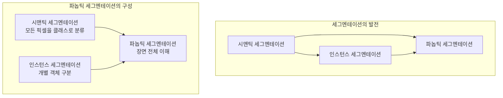

# 인스턴스 & 파놉틱 세그멘테이션

## 1. 핵심 개념 (Core Concept)

\*\*인스턴스 세그멘테이션(Instance Segmentation)\*\*과 \*\*파놉틱 세그멘테이션(Panoptic Segmentation)\*\*은 이미지를 픽셀 단위로 이해하는 가장 발전된 컴퓨터 비전 기술입니다. 인스턴스 세그멘테이션은 이미지 내의 특정 객체들을 개별 인스턴스로 구분하여 분할하는 데 집중하는 반면, 파놉틱 세그멘테이션은 한 걸음 더 나아가 이미지의 모든 픽셀을 '객체(Things)' 또는 '배경(Stuff)'으로 나누고, 각 객체 인스턴스까지 식별하여 장면 전체에 대한 포괄적인 이해를 제공합니다.

______________________________________________________________________

## 2. 상세 설명 (Detailed Explanation)

이미지 세그멘테이션 기술은 다음과 같이 발전해왔습니다.

- **시맨틱 세그멘테이션 (Semantic Segmentation)**: 이미지의 각 픽셀을 소속된 클래스(예: 사람, 자동차, 하늘)로 분류합니다. 하지만 같은 클래스의 다른 객체들을 구분하지 못합니다. (예: 모든 사람을 하나의 '사람' 영역으로 표시)
- **인스턴스 세그멘테이션 (Instance Segmentation)**: 시맨틱 세그멘테이션에서 한 단계 발전하여, 같은 클래스에 속하더라도 각 객체(인스턴스)를 개별적으로 식별하고 분할합니다. (예: 1번 사람, 2번 사람을 따로 구분) 하지만 배경(Stuff) 영역은 무시합니다.
- **파놉틱 세그멘테이션 (Panoptic Segmentation)**: 시맨틱 세그멘테이션과 인스턴스 세그멘테이션을 통합한 개념입니다. 이미지 내의 모든 픽셀에 대해 클래스를 예측하고(시맨틱), 동시에 각 객체 인스턴스를 고유하게 식별(인스턴스)합니다.

### 2.1 인스턴스 세그멘테이션 (Instance Segmentation)

- **목표**: 이미지에 있는 모든 \*\*객체(Things)\*\*의 위치를 찾고, 각 객체를 픽셀 단위로 정확하게 분할하여 마스크(mask)를 생성하는 것입니다.
- **특징**: '객체'로 간주되는 것들(예: 사람, 자동차, 동물)에만 집중하며, 하늘, 도로, 벽과 같은 '배경(Stuff)'은 처리하지 않습니다. 따라서 결과물인 객체 마스크들은 서로 겹칠 수 있습니다.
- **대표 모델**: Mask R-CNN, YOLACT

### 2.2 파놉틱 세그멘테이션 (Panoptic Segmentation)

- **목표**: 장면(scene)에 대한 전체적인 이해를 목표로, 이미지의 **모든 픽셀**을 (클래스, 인스턴스 ID) 쌍으로 할당하는 것입니다.
- **규칙**:
  1. 모든 픽셀은 단 하나의 시맨틱 레이블과 인스턴스 ID를 가져야 합니다.
  1. 서로 다른 인스턴스는 다른 ID를 가져야 합니다.
  1. 배경(Stuff) 클래스에 속하는 픽셀은 인스턴스 ID를 갖지 않습니다.
- **특징**: 인스턴스 세그멘테이션과 달리 결과 마스크가 서로 겹치지 않으며, 이미지 전체를 포괄하는 일관된 해석을 제공합니다.

______________________________________________________________________

## 3. 비교: 시맨틱 vs. 인스턴스 vs. 파놉틱

| 구분                 | 시맨틱 세그멘테이션   | 인스턴스 세그멘테이션                           | 파놉틱 세그멘테이션                                          |
| :------------------- | :-------------------- | :---------------------------------------------- | :----------------------------------------------------------- |
| **주요 목표**        | 픽셀 단위 클래스 분류 | 개별 객체 분할                                  | 장면 전체 분할 및 이해                                       |
| **객체 구분**        | 불가                  | 가능                                            | 가능                                                         |
| **배경(Stuff) 처리** | 처리함 (클래스로)     | 처리 안 함                                      | 처리함 (클래스로)                                            |
| **결과물 겹침**      | 해당 없음             | 가능                                            | 불가능                                                       |
| **질문**             | "이 픽셀은 무엇인가?" | "이 이미지에 있는 모든 자동차는 어디에 있는가?" | "이 이미지에 있는 모든 것은 무엇이며, 각각은 어디에 있는가?" |

______________________________________________________________________

## 4. 예상 면접 질문 (Potential Interview Questions)

- **Q. 파놉틱 세그멘테이션이 인스턴스 세그멘테이션과 근본적으로 다른 점은 무엇인가요?**

  - **A.** 가장 근본적인 차이는 처리의 범위와 목표입니다. 인스턴스 세그멘테이션은 셀 수 있는 '객체(Things)'에만 집중하여 각 개체를 분리하는 반면, 파놉틱 세그멘테이션은 '객체'뿐만 아니라 하늘이나 도로 같은 '배경(Stuff)'까지 포함하여 이미지의 모든 픽셀을 분할하고 분류합니다. 즉, 파놉틱 세그멘테이션은 더 포괄적인 장면 전체에 대한 이해를 목표로 합니다.

- **Q. 파놉틱 세그멘테이션 모델을 어떻게 평가할 수 있을까요?**

  - **A.** 파놉틱 품질(Panoptic Quality, PQ)이라는 전용 메트릭을 사용합니다. PQ는 세그멘테이션 품질(Segmentation Quality, SQ)과 인식 품질(Recognition Quality, RQ)의 곱으로 계산됩니다. SQ는 매칭된 예측과 실제 마스크 간의 평균 IoU를 측정하고, RQ는 예측과 실제 인스턴스 간의 F1 스코어(정밀도와 재현율의 조화 평균)를 나타냅니다. 이를 통해 모델이 얼마나 정확하게 객체를 분할하고 분류하는지를 종합적으로 평가할 수 있습니다.

- **Q. 자율주행 시스템을 개발한다면, 세 가지 세그멘테이션 기법 중 어떤 것을 사용하고 그 이유는 무엇인가요?**

  - **A.** 파놉틱 세그멘테이션을 사용하겠습니다. 자율주행은 단순히 다른 자동차나 사람(객체)을 인식하는 것을 넘어, 주행 가능한 도로 영역, 차선, 하늘, 건물(배경) 등 주변 환경 전체를 완벽하게 이해해야 하기 때문입니다. 파놉틱 세그멘테이션은 이미지의 모든 픽셀에 대한 시맨틱 정보와 인스턴스 정보를 모두 제공하므로, 가장 안전하고 신뢰할 수 있는 주행 판단을 내리는 데 필수적인 종합적인 정보를 제공할 수 있습니다.

______________________________________________________________________

## 5. 더 읽어보기 (Further Reading)

- [Panoptic Segmentation (원 논문)](https://arxiv.org/abs/1801.00868)
- [Understanding Semantic, Instance, and Panoptic Segmentation](https://www.v7labs.com/blog/semantic-instance-panoptic-segmentation)
- [The Hitchhiker's Guide to Panoptic Segmentation](https://medium.com/vooo/the-hitchhikers-guide-to-panoptic-segmentation-345427c38439)
