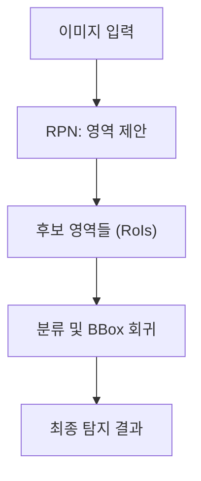

# 객체 탐지 (1-Stage vs 2-Stage Detectors)

## 1. 핵심 개념 (Core Concept)

객체 탐지(Object Detection)는 이미지나 비디오에서 특정 객체들의 위치를 바운딩 박스(Bounding Box)로 찾아내고, 각 객체가 어떤 클래스에 속하는지 분류하는 기술입니다. 현대 딥러닝 기반 객체 탐지 모델은 크게 **2-Stage Detector**와 **1-Stage Detector**의 두 가지 접근 방식으로 나뉩니다. 2-Stage 방식은 '어디에 객체가 있는가?'와 '이 객체는 무엇인가?'를 순차적으로 해결하는 반면, 1-Stage 방식은 이 두 질문에 동시에 답하여 속도를 높인 것이 핵심적인 차이입니다.

---

## 2. 상세 설명 (Detailed Explanation)

### 2.1 2-Stage Detectors (2단계 탐지기)

2-Stage 탐지기는 이름 그대로 객체 탐지를 두 단계에 걸쳐 수행합니다. **정확도**를 우선시하는 접근 방식입니다.

1.  **1단계: 영역 제안 (Region Proposal)**
    *   먼저 이미지에서 객체가 있을 법한 후보 영역(Region of Interest, RoI)들을 수백~수천 개 제안합니다. 이 역할을 하는 네트워크를 RPN(Region Proposal Network)이라고 합니다.
2.  **2단계: 분류 및 바운딩 박스 회귀 (Classification & BBox Regression)**
    *   제안된 각 후보 영역에 대해 클래스를 분류하고(예: 사람, 자동차), 바운딩 박스의 위치를 더 정확하게 조정합니다.

*   **장점**: 후보 영역에 집중하여 처리하므로, 작은 객체나 겹쳐 있는 객체에 대해서도 높은 정확도를 보입니다.
*   **단점**: 여러 단계를 거치므로 계산량이 많아 속도가 상대적으로 느립니다.
*   **대표 모델**: R-CNN, Fast R-CNN, **Faster R-CNN**, Mask R-CNN

### 2.2 1-Stage Detectors (1단계 탐지기)

1-Stage 탐지기는 영역 제안 단계를 생략하고, 전체 이미지를 한 번만 보고 객체의 위치와 클래스를 동시에 예측합니다. **속도**를 우선시하는 접근 방식입니다.

*   **작동 방식**: 이미지를 그리드(grid)로 나누거나 미리 정의된 다양한 크기와 비율의 앵커 박스(Anchor Box)를 사용하여, 각 위치에서 바로 바운딩 박스와 클래스 확률을 직접 회귀(regression) 문제로 풉니다.

*   **장점**: 단일 네트워크에서 모든 과정이 처리되므로 구조가 간단하고 매우 빠릅니다. 실시간 영상 처리와 같은 애플리케이션에 적합합니다.
*   **단점**: 초기 모델들은 2-Stage 방식에 비해 정확도가 다소 떨어졌으나, RetinaNet(Focal Loss 도입) 등 최신 모델들은 정확도 격차를 크게 줄였습니다.
*   **대표 모델**: **YOLO (You Only Look Once)**, **SSD (Single Shot MultiBox Detector)**, RetinaNet

---

## 3. 비교: 1-Stage vs 2-Stage

| 특징 | 2-Stage Detector | 1-Stage Detector |
| :--- | :--- | :--- |
| **핵심 아이디어** | 영역 제안 후 분류 (순차적) | 위치와 클래스를 동시 예측 (병렬적) |
| **정확도** | **높음** (특히 작은 객체) | 상대적으로 낮았으나 격차 감소 중 |
| **속도** | 상대적으로 느림 | **매우 빠름** (실시간 가능) |
| **복잡도** | 높음 (다단계 구조) | 낮음 (단일 네트워크) |
| **대표 모델** | Faster R-CNN | YOLO, SSD |
| **주요 사용처** | 높은 정밀도가 요구되는 분야 (의료 영상, 자율주행) | 실시간 처리가 중요한 분야 (CCTV, 비디오 분석) |

---

## 4. 예상 면접 질문 (Potential Interview Questions)

*   **Q. 1-Stage와 2-Stage 탐지기의 가장 큰 차이점은 무엇인가요?**
    *   **A.** 가장 큰 차이는 **영역 제안 단계(Region Proposal Step)의 유무**입니다. 2-Stage 탐지기는 객체가 있을 만한 후보 영역을 먼저 찾고, 그 영역에 대해서만 분류와 위치 보정을 수행하는 2단계 접근을 사용합니다. 반면, 1-Stage 탐지기는 이 영역 제안 단계 없이 전체 이미지를 한 번만 보고 객체의 위치와 클래스를 동시에 예측합니다.

*   **Q. YOLO가 Faster R-CNN보다 훨씬 빠른 이유는 무엇인가요?**
    *   **A.** YOLO는 1-Stage 탐지기로, 전체 이미지를 단일 신경망에 한 번만 통과시켜 모든 객체에 대한 예측을 동시에 수행합니다. 반면, Faster R-CNN은 2-Stage 탐지기로, 먼저 RPN을 통해 후보 영역을 생성하고, 이후 각 후보 영역에 대해 별도의 분류 및 회귀 작업을 수행해야 합니다. 이러한 다단계 구조 때문에 Faster R-CNN은 YOLO보다 더 많은 계산 과정을 거치게 되어 속도가 느립니다.

*   **Q. 1-Stage 탐지기는 초기에 정확도가 낮다는 문제가 있었습니다. 이 문제를 해결하기 위해 어떤 아이디어들이 제시되었나요?**
    *   **A.** 주요 문제점은 객체가 있는 영역(foreground)에 비해 객체가 없는 배경(background) 영역이 압도적으로 많아, 학습이 배경에 치우치는 '클래스 불균형(Class Imbalance)' 문제였습니다. 이를 해결하기 위해 **Focal Loss**라는 개념이 RetinaNet에서 제시되었습니다. Focal Loss는 이미 잘 분류되는 쉬운 예제(대부분의 배경)에는 낮은 가중치를 부여하고, 분류하기 어려운 예제(객체)에 더 집중하여 학습하도록 손실 함수(Loss Function)를 수정한 것입니다. 이로써 1-Stage 탐지기의 정확도를 크게 향상시킬 수 있었습니다.

---

## 5. 더 읽어보기 (Further Reading)

*   [Faster R-CNN 논문: Towards Real-Time Object Detection with Region Proposal Networks](https://arxiv.org/abs/1506.01497)
*   [YOLO 논문: You Only Look Once: Unified, Real-Time Object Detection](https://arxiv.org/abs/1506.02640)
*   [A-Step-by-Step-Introduction-to-the-Basic-Object-Detection-Algorithms](https://www.v7labs.com/blog/object-detection-algorithms)