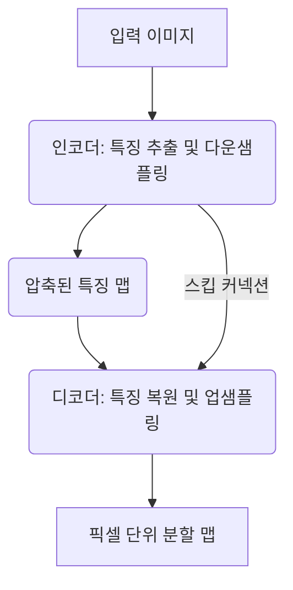

# 시맨틱 세그멘테이션 (Semantic Segmentation)

## 1. 핵심 개념 (Core Concept)

시맨틱 세그멘테이션(Semantic Segmentation)은 이미지의 모든 픽셀을 특정 클래스(class)로 분류하는 기술입니다. 즉, 이미지 내 각 픽셀이 '사람', '자동차', '하늘', '도로' 중 어떤 의미(semantic)에 속하는지 라벨링하는 작업입니다. 이 기술은 단순히 객체의 위치를 찾는 것을 넘어, 객체의 정확한 모양과 경계를 픽셀 단위로 이해하는 것을 목표로 합니다.

---

## 2. 상세 설명 (Detailed Explanation)

시맨틱 세그멘테이션은 이미지 분류(Image Classification)에서 한 단계 더 나아간 개념입니다. 이미지 분류가 이미지 전체에 대해 단일 레이블(예: '이 사진은 고양이 사진이다')을 할당하는 반면, 시맨틱 세그멘테이션은 이미지 내 모든 픽셀에 대해 레이블을 할당하여 "이 픽셀들은 고양이, 저 픽셀들은 배경"과 같이 상세한 분할 맵(Segmentation Map)을 생성합니다.

### 2.1 인코더-디코더 아키텍처

대부분의 현대 시맨틱 세그멘테이션 모델은 **인코더-디코더(Encoder-Decoder)** 구조를 따릅니다.

*   **인코더 (Encoder)**: 다운샘플링(Downsampling) 경로라고도 불립니다. 주로 ResNet, VGG와 같은 이미지 분류 모델을 기반으로 하여, 입력 이미지에서 점차 공간적인 차원(해상도)을 줄여나가며 문맥적, 의미적 정보(contextual, semantic information)를 추출합니다. 즉, 이미지에 '무엇이' 있는지를 파악하는 역할을 합니다.

*   **디코더 (Decoder)**: 업샘플링(Upsampling) 경로라고도 불립니다. 인코더에서 압축된 저해상도 특징 맵(feature map)을 다시 원래 이미지의 해상도로 점차 복원하면서, 픽셀 단위의 정확한 위치 정보를 되살립니다. 즉, 객체가 '어디에' 있는지를 파악하는 역할을 합니다.

이 구조에서 인코더의 특징을 디코더로 직접 연결하는 **스킵 커넥션(Skip Connection)**은 고해상도의 세밀한 특징 정보를 보존하여 더 정교한 분할 결과를 얻는 데 핵심적인 역할을 합니다. (예: U-Net)

### 2.2 다른 세그멘테이션과의 차이

| 구분 | 시맨틱 세그멘테이션 | 인스턴스 세그멘테이션 |
| :--- | :--- | :--- |
| **목표** | 모든 픽셀을 클래스로 분류 | 같은 클래스 내 개별 객체(인스턴스)까지 구별하여 분할 |
| **결과 예시** | 이미지 내 모든 '사람' 픽셀을 하나의 '사람' 클래스로 라벨링 | 이미지 내 '1번 사람', '2번 사람'과 같이 각 사람을 별개의 객체로 인식하고 분할 |

---

## 3. 예시 (Example)

### 사용 사례 (Use Case)

*   **자율 주행**: 주행 가능한 도로 영역, 차선, 보행자, 다른 차량 등을 픽셀 단위로 정밀하게 인식하여 안전한 주행 경로를 계획합니다.
*   **의료 영상 분석**: MRI, CT, X-ray 이미지에서 종양이나 특정 장기의 영역을 정확하게 분할하여 의사의 진단을 보조합니다.
*   **위성 이미지 분석**: 위성 사진에서 건물, 숲, 강, 농경지 등을 자동으로 분류하여 지도 제작, 도시 계획, 환경 변화 모니터링에 활용합니다.
*   **배경 제거 및 가상 배경**: 화상 회의에서 인물만 정확히 분할하여 배경을 흐리게 하거나 다른 이미지로 교체합니다.

---

## 4. 예상 면접 질문 (Potential Interview Questions)

*   **Q. 시맨틱 세그멘테이션과 객체 탐지(Object Detection)는 어떻게 다른가요?**
    *   **A.** 객체 탐지는 이미지 내 객체의 위치를 사각형의 바운딩 박스로 표시하고 클래스를 분류하는 작업입니다. 반면, 시맨틱 세그멘테이션은 바운딩 박스를 넘어, 객체의 실제 모양대로 픽셀 하나하나를 해당 클래스로 분류하여 훨씬 더 정교한 정보를 제공합니다.

*   **Q. 시맨틱 세그멘테이션에서 인코더-디코더 구조가 사용되는 이유는 무엇인가요?**
    *   **A.** 인코더는 이미지의 전체적인 문맥(context)을 파악하기 위해 해상도를 줄여나가며 고차원적인 특징을 추출하고, 디코더는 이 문맥 정보를 바탕으로 다시 해상도를 높여가며 각 픽셀의 정확한 위치를 예측하기 위함입니다. 즉, '무엇인지'와 '어디인지'를 모두 효과적으로 처리하기 위한 구조입니다.

*   **Q. U-Net 모델의 스킵 커넥션(Skip Connection)은 어떤 역할을 하며 왜 중요한가요?**
    *   **A.** 스킵 커넥션은 인코더의 다운샘플링 과정에서 손실될 수 있는 저수준의 공간적, 경계선 정보(low-level spatial information)를 디코더로 직접 전달하는 역할을 합니다. 디코더는 업샘플링 과정에서 이 정보를 활용하여 더 선명하고 정확한 경계를 가진 분할 맵을 생성할 수 있습니다. 따라서 스킵 커넥션은 세밀한 분할 성능에 매우 중요합니다.

---

## 5. 더 읽어보기 (Further Reading)

*   [FCN 논문: Fully Convolutional Networks for Semantic Segmentation](https://arxiv.org/abs/1411.4038)
*   [U-Net 논문: Convolutional Networks for Biomedical Image Segmentation](https://arxiv.org/abs/1505.04597)
*   [A 2022 Guide to Semantic Segmentation](https://www.v7labs.com/blog/semantic-segmentation-guide)