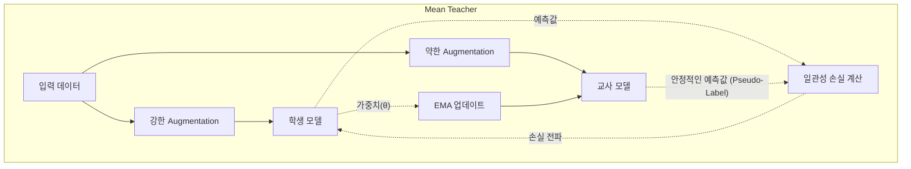

# 준지도 학습 (Pseudo-Label, Mean Teacher, FixMatch)

## 1. 핵심 개념 (Core Concept)

준지도 학습(Semi-Supervised Learning, SSL)은 \*\*소량의 레이블된 데이터(labeled data)\*\*와 \*\*대량의 레이블 없는 데이터(unlabeled data)\*\*를 함께 사용하여 모델을 학습시키는 패러다임입니다. 이는 막대한 레이블링 비용 없이도 대규모 데이터셋의 이점을 활용하여 지도 학습의 성능을 뛰어넘고자 하는 접근 방식입니다. 핵심 아이디어는 레이블된 데이터로 학습한 모델을 사용하여 레이블 없는 데이터에 대한 예측을 생성하고, 이 예측을 '가짜 레이블(pseudo-label)'처럼 활용하여 모델을 다시 학습시키는 것입니다.

______________________________________________________________________

## 2. 상세 설명 (Detailed Explanation)

준지도 학습은 크게 \*\*일관성 정규화(Consistency Regularization)\*\*와 \*\*엔트로피 최소화(Entropy Minimization)\*\*라는 두 가지 원칙에 기반합니다. 일관성 정규화는 동일한 데이터에 약간의 노이즈나 변형(augmentation)이 가해져도 모델의 예측은 일관되어야 한다는 가정이며, 엔트로피 최소화는 모델이 예측 경계면에서 낮은 밀도를 가져야 한다는, 즉 예측에 대한 확신이 높아야 한다는 가정입니다.

### 2.1 Pseudo-Labeling (의사 레이블링)

가장 간단한 형태의 준지도 학습 방법입니다.

1. 먼저, 가지고 있는 소량의 레이블된 데이터만으로 모델을 학습시킵니다.
1. 학습된 모델을 사용하여 레이블 없는 데이터에 대한 예측을 수행합니다.
1. 이 예측값 중 신뢰도(confidence)가 특정 임계값(threshold) 이상인 것들만 선별하여, 이를 진짜 레이블처럼 간주하고 데이터셋에 추가합니다.
1. 원래의 레이블된 데이터와 새로 생성된 의사 레이블 데이터를 합쳐 모델을 다시 학습시킵니다.

- **단점**: 모델이 잘못된 예측을 높은 신뢰도로 내놓을 경우, 오류가 누적되어 성능이 저하될 수 있습니다(Confirmation Bias).

### 2.2 Mean Teacher

일관성 정규화를 적용한 대표적인 방법으로, **학생(Student) 모델**과 **교사(Teacher) 모델**이라는 두 개의 동일한 구조의 모델을 사용합니다.

- **학생 모델**: 일반적인 지도 학습처럼 학습을 진행합니다.
- **교사 모델**: 학생 모델의 가중치를 직접 복사하는 것이 아니라, 각 스텝마다의 학생 모델 가중치를 \*\*지수 이동 평균(Exponential Moving Average, EMA)\*\*하여 부드럽게 업데이트합니다. 이는 앙상블과 유사한 효과를 내어 더 안정적이고 정확한 예측을 만듭니다.

학습 시, 동일한 입력 데이터에 서로 다른 노이즈(augmentation)를 가하여 각각 학생 모델과 교사 모델에 통과시킨 후, 두 모델의 예측값이 일관되도록(예: 두 출력의 MSE Loss를 최소화) 학습시킵니다. 교사 모델의 예측값이 더 안정적이므로 이를 의사 레이블처럼 사용합니다.

### 2.3 FixMatch

Pseudo-Labeling과 일관성 정규화를 결합한, 현재 가장 널리 쓰이는 강력한 준지도 학습 알고리즘입니다.

1. 레이블 없는 데이터에 대해 \*\*약한 증강(Weak Augmentation)\*\*과 \*\*강한 증강(Strong Augmentation)\*\*을 각각 적용합니다.
1. 약하게 증강된 이미지를 모델에 통과시켜 예측을 얻습니다. 이 예측의 신뢰도가 임계값보다 높으면, 이를 \*\*의사 레이블(pseudo-label)\*\*로 확정합니다.
1. 강하게 증강된 이미지를 모델에 통과시킨 예측값이, 위에서 생성된 의사 레이블과 일치하도록 **Cross-Entropy 손실**을 계산하여 모델을 학습시킵니다.

- **핵심**: 모델이 간단한 버전의 이미지(약한 증강)에서 내린 예측을, 어려운 버전의 이미지(강한 증강)에서도 일관되게 내놓도록 강제하는 것입니다.

______________________________________________________________________

## 3. 예시 (Example)

### 사용 사례 (Use Case)

- **의료 영상 분석**: 소수의 전문의가 레이블링한 의료 영상(예: 암 진단)과 대량의 레이블 없는 영상을 함께 사용하여 진단 모델의 정확도를 높입니다.
- **공장 불량품 검출**: 소수의 불량품 샘플(레이블 데이터)과 대량의 정상 제품 이미지(레이블 없는 데이터)를 활용하여 불량 검출 시스템의 성능을 강화합니다.
- **위성 사진 분석**: 일부 지역만 전문가가 분석(레이블링)한 위성 사진과 나머지 방대한 지역의 위성 사진을 함께 학습하여 토지 피복 분류 모델을 구축합니다.

______________________________________________________________________

## 4. 예상 면접 질문 (Potential Interview Questions)

- **Q. 준지도 학습은 어떤 상황에서 유용한가요?**

  - **A.** 레이블된 데이터를 얻기는 어렵고 비용이 많이 들지만, 레이블 없는 데이터는 쉽게 대량으로 얻을 수 있는 상황에서 매우 유용합니다. 예를 들어, 의료, 제조, 위성 분석 등 전문적인 지식이 필요하거나 데이터 수집 자체가 방대한 분야에서 레이블링 비용을 획기적으로 줄이면서도 모델 성능을 높일 수 있습니다.

- **Q. Pseudo-Labeling 방식의 가장 큰 문제점과 이를 Mean Teacher가 어떻게 개선했는지 설명해주세요.**

  - **A.** Pseudo-Labeling의 가장 큰 문제점은 모델이 초기에 잘못된 예측을 높은 신뢰도로 할 경우, 이 오류가 계속해서 학습에 반영되어 성능을 악화시키는 '확증 편향(Confirmation Bias)'입니다. Mean Teacher는 학생 모델의 가중치를 EMA로 업데이트하는 교사 모델을 도입하여 이 문제를 개선했습니다. 교사 모델은 여러 학습 스텝에 걸친 지식을 평균내는 효과가 있어, 단일 모델보다 훨씬 안정적이고 정확한 의사 레이블을 생성함으로써 확증 편향의 위험을 줄여줍니다.

- **Q. FixMatch가 효과적으로 작동하는 핵심 원리는 무엇인가요?**

  - **A.** FixMatch의 핵심 원리는 '일관성 정규화'와 '의사 레이블링'의 강력한 조합입니다. 모델이 스스로 예측한 레이블(의사 레이블)을 정답으로 삼되, 약하게 증강된 이미지에 대한 예측과 강하게 증강된 이미지에 대한 예측이 서로 일관성을 유지하도록 강제합니다. 이를 통해 모델은 데이터의 본질적인 특징을 학습하게 되어 일반화 성능이 크게 향상됩니다.

______________________________________________________________________

## 5. 더 읽어보기 (Further Reading)

- [Pseudo-Label : The Simple and Efficient Semi-Supervised Learning Method](https://arxiv.org/abs/1306.5876)
- [Mean teachers are better role models](https://arxiv.org/abs/1703.01780)
- [FixMatch: Simplifying Semi-Supervised Learning with Consistency and Confidence](https://arxiv.org/abs/2001.07685)
