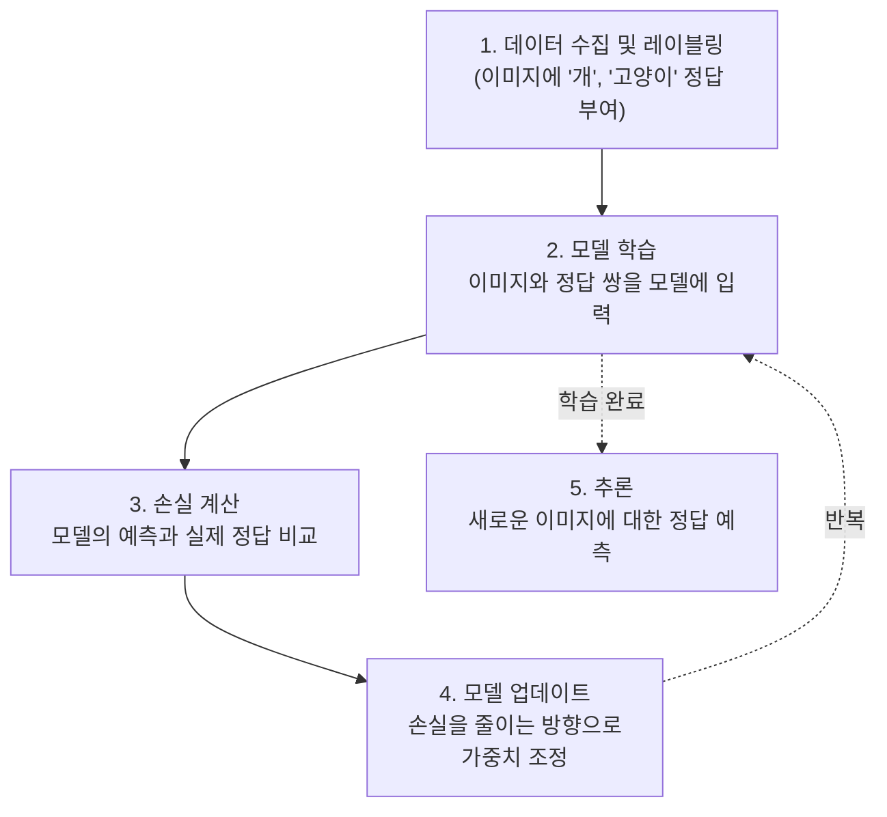

# 지도 학습 (Supervised Learning)

## 1. 핵심 개념 (Core Concept)

지도 학습(Supervised Learning)은 **정답(label)이 있는 데이터**를 사용하여 모델을 학습시키는 패러다임입니다. 컴퓨터 비전 분야에서는 이미지(입력)와 그에 해당하는 정답(예: '고양이'라는 클래스, 객체의 바운딩 박스 좌표)을 쌍으로 제공하여, 모델이 이미지와 정답 사이의 관계를 학습하도록 합니다. 이는 마치 정답지가 있는 문제집으로 공부하는 것과 같으며, 컴퓨터 비전의 가장 기본적이고 널리 사용되는 학습 방식입니다.

---

## 2. 상세 설명 (Detailed Explanation)

지도 학습의 핵심은 **명시적인 정답**을 통해 모델의 학습 방향을 이끌어주는 것입니다. 모델은 자신의 예측값이 실제 정답과 얼마나 다른지(손실, Loss)를 계산하고, 이 손실을 최소화하는 방향으로 내부 파라미터를 반복적으로 업데이트하며 학습을 진행합니다.

### 2.1 학습 과정



### 2.2 대표적인 컴퓨터 비전 태스크

대부분의 기본적인 컴퓨터 비전 문제는 지도 학습을 통해 해결됩니다.

*   **이미지 분류 (Image Classification)**: 이미지 전체가 어떤 클래스에 속하는지 분류합니다. (예: ImageNet 데이터셋)
*   **객체 탐지 (Object Detection)**: 이미지 내 객체의 위치를 바운딩 박스로 찾고 클래스를 분류합니다. (예: COCO 데이터셋)
*   **시맨틱 세그멘테이션 (Semantic Segmentation)**: 이미지의 모든 픽셀을 해당하는 클래스로 분류합니다.

---

## 3. 예시 (Example)

### 코드 예시 (PyTorch - 이미지 분류)

다음은 PyTorch를 사용하여 레이블이 있는 이미지 데이터셋(예: CIFAR-10)으로 간단한 CNN 모델을 학습시키는 지도 학습 과정의 의사 코드입니다.

```python
import torch
import torch.nn as nn
import torch.optim as optim

# 모델, 손실 함수, 옵티마이저 정의
model = SimpleCNN() # 사전에 정의된 CNN 모델
criterion = nn.CrossEntropyLoss() # 분류 문제에 사용하는 손실 함수
optimizer = optim.SGD(model.parameters(), lr=0.001, momentum=0.9)

# labeled_dataloader: (이미지, 정답_레이블) 쌍을 제공
for epoch in range(num_epochs):
    for images, labels in labeled_dataloader:
        # 1. 옵티마이저 초기화
        optimizer.zero_grad()

        # 2. 모델 예측
        outputs = model(images)

        # 3. 손실 계산
        loss = criterion(outputs, labels)

        # 4. 역전파 및 모델 업데이트
        loss.backward()
        optimizer.step()

    print(f'Epoch [{epoch+1}/{num_epochs}], Loss: {loss.item():.4f}')
```

### 사용 사례 (Use Case)

*   **의료 영상 분석**: 정상/비정상 소견이 레이블링된 X-ray, MRI 이미지 학습을 통해 질병을 진단합니다.
*   **제조업 품질 검사**: 정상 제품과 불량 제품 이미지를 학습하여 생산 라인에서 자동으로 불량을 검출합니다.
*   **얼굴 인식 시스템**: 특정 인물의 얼굴 이미지를 학습하여 출입 통제나 보안 시스템에 활용합니다.

---

## 4. 예상 면접 질문 (Potential Interview Questions)

*   **Q. 지도 학습의 가장 큰 장점과 단점은 무엇인가요?**
    *   **A.** 가장 큰 장점은 명확한 정답을 기반으로 학습하므로 특정 태스크에 대해 매우 높은 성능과 정확도를 달성할 수 있다는 점입니다. 반면, 가장 큰 단점은 고품질의 레이블링된 데이터를 대규모로 구축하는 데 많은 시간과 비용이 소요된다는 점입니다. 이를 '데이터 병목 현상'이라고도 합니다.

*   **Q. 지도 학습 기반의 이미지 분류와 객체 탐지는 어떻게 다른가요?**
    *   **A.** 이미지 분류는 이미지 전체에 대해 '무엇'인지를 나타내는 단일 클래스를 출력합니다. 반면, 객체 탐지는 이미지 안에서 '무엇'이 '어디에' 있는지를 알아내기 위해 객체의 클래스와 위치(바운딩 박스)를 모두 출력합니다. 따라서 객체 탐지가 더 복잡하고 많은 정보를 제공하는 태스크입니다.

*   **Q. 레이블링 비용 문제를 완화하기 위해 지도 학습 대신 고려할 수 있는 다른 학습 패러다임은 무엇이 있나요?**
    *   **A.** 비지도 학습(Unsupervised Learning), 준지도 학습(Semi-supervised Learning), 자기지도 학습(Self-supervised Learning) 등을 고려할 수 있습니다. 특히 자기지도 학습은 레이블이 없는 데이터 자체에서 감독 신호(supervisory signal)를 만들어 학습하므로, 대규모 데이터셋을 효과적으로 활용하여 레이블링 비용 없이도 우수한 표현(representation)을 학습할 수 있어 최근 각광받고 있습니다.

---

## 5. 더 읽어보기 (Further Reading)

*   [Supervised Learning (Wikipedia)](https://en.wikipedia.org/wiki/Supervised_learning)
*   [What is Supervised Learning? (IBM)](https://www.ibm.com/topics/supervised-learning)