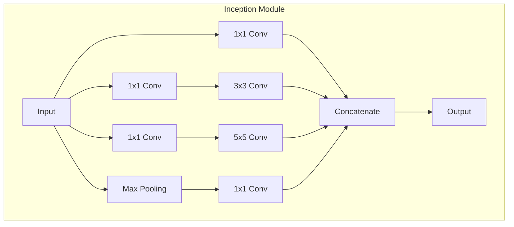
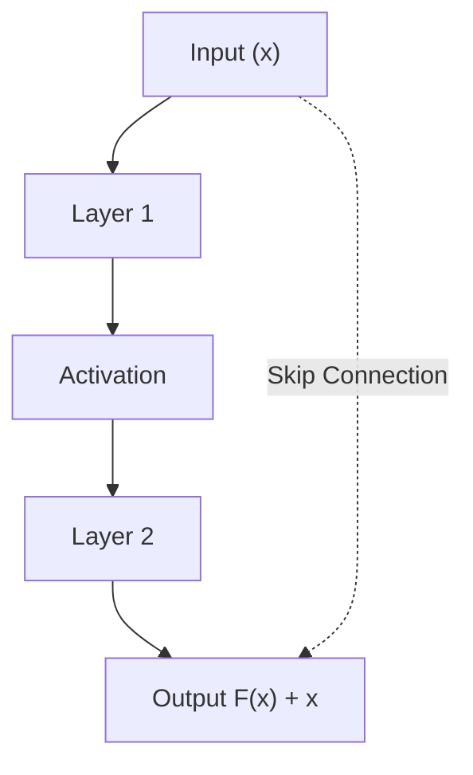

# CNN 계열: GoogleNet, ResNet, DenseNet

## 1. 핵심 개념 (Core Concept)

GoogLeNet, ResNet, DenseNet은 깊은 신경망(Deep Neural Network) 학습의 한계를 극복하고 컴퓨터 비전 분야에 큰 획을 그은 대표적인 CNN(Convolutional Neural Network) 아키텍처들임. **GoogLeNet**은 계산 효율성을 높인 `Inception` 모듈을, **ResNet**은 깊은 네트워크의 학습을 가능하게 한 `Skip Connection`을, **DenseNet**은 특징(feature) 재사용을 극대화한 `Dense Connectivity`를 도입하여 모델의 성능과 효율성을 크게 향상시켰음.

______________________________________________________________________

## 2. 상세 설명 (Detailed Explanation)

### 2.1 GoogLeNet (Inception)

GoogLeNet은 2014년 ILSVRC(ImageNet Large Scale Visual Recognition Challenge)에서 우승한 모델로, **Inception 모듈**이라는 혁신적인 아이디어를 제안했음. Inception 모듈은 하나의 레이어에서 다양한 크기의 필터(1x1, 3x3, 5x5)와 Max Pooling을 병렬적으로 처리하고 그 결과를 합쳐(concatenate) 다양한 스케일의 특징을 한 번에 추출함.

- **계산 효율성**: 3x3, 5x5 컨볼루션 연산 전에 **1x1 컨볼루션**을 두어 채널 수를 줄이는 'bottleneck' 구조를 사용하여 계산량을 획기적으로 줄였음.
- **Global Average Pooling**: 모델 마지막 단에서 Fully Connected Layer 대신 Global Average Pooling을 사용하여 파라미터 수를 크게 줄이고 과적합(overfitting)을 방지했음.

### 2.2 ResNet (Residual Network)

ResNet은 2015년 ILSVRC에서 우승했으며, 네트워크가 깊어질수록 오히려 성능이 저하되는 **Degradation 문제**를 해결했음. 이는 **Residual Block(잔차 블록)** 과 **Skip Connection(혹은 Shortcut Connection)** 개념을 통해 이루어짐.

- **Skip Connection**: 입력 `x`를 몇 개의 레이어를 건너뛰어 출력에 그대로 더해주는 구조. 이를 통해 네트워크는 변화량(residual), 즉 `F(x) = H(x) - x` 만을 학습하면 되므로 학습이 훨씬 쉬워짐.
- **깊은 네트워크 학습**: Skip Connection 덕분에 그래디언트가 소실되지 않고 깊은 층까지 잘 전달되어 100개 이상의 레이어를 가진 매우 깊은 네트워크의 학습이 가능해졌음.

### 2.3 DenseNet (Densely Connected Network)

DenseNet은 ResNet의 Skip Connection 개념을 더욱 발전시켜, 각 레이어가 **이전의 모든 레이어**의 출력에 연결되는 **Dense Connectivity** 구조를 제안했음.

- **특징 재사용 (Feature Reuse)**: 모든 이전 레이어의 특징 맵(feature map)이 현재 레이어의 입력으로 연결(concatenation)되므로, 초반 레이어에서 추출된 특징이 후반 레이어까지 직접적으로 전달됨. 이는 특징의 재사용을 극대화하여 모델을 매우 파라미터 효율적으로 만듦.
- **파라미터 효율성**: ResNet보다 훨씬 적은 파라미터로 동등하거나 더 나은 성능을 달성함.
- **Transition Layer**: Dense Block 사이에는 채널 수를 조절하고 특징 맵 크기를 줄이는 Transition Layer(1x1 Conv + 2x2 Pooling)가 존재함.

______________________________________________________________________

## 3. 비교 (Comparison)

| 특징              | GoogLeNet (Inception)                       | ResNet                                  | DenseNet                                |
| :---------------- | :------------------------------------------ | :-------------------------------------- | :-------------------------------------- |
| **핵심 아이디어** | Inception Module (병렬 필터링)              | Residual Block (Skip Connection)        | Dense Block (모든 레이어 연결)          |
| **연결 방식**     | 필터 결과들을 채널 방향으로 **Concatenate** | 입력과 출력을 **Element-wise Addition** | 모든 이전 레이어 출력을 **Concatenate** |
| **해결한 문제**   | 계산 효율성, 다양한 스케일 특징 추출        | 깊은 네트워크의 Degradation 문제        | 특징 재사용 극대화, 파라미터 효율성     |
| **주요 장점**     | 계산량 대비 높은 성능                       | 매우 깊은 네트워크 학습 가능            | 파라미터 효율성, 그래디언트 흐름 개선   |

______________________________________________________________________

## 4. 예상 면접 질문 (Potential Interview Questions)

- **Q. ResNet의 Skip Connection이 왜 깊은 네트워크 학습에 효과적인가요?**

  - **A.** Skip Connection은 입력 신호를 직접 출력에 더해줌으로써, 네트워크가 학습해야 할 목표를 `H(x)`에서 `H(x) - x`라는 잔차(residual)로 바꿔줍니다. 이는 학습을 더 쉽게 만들고, 역전파 과정에서 그래디언트가 소실되지 않고 깊은 층까지 효과적으로 전달되도록 돕습니다. 따라서 네트워크 깊이가 깊어져도 성능 저하 없이 안정적인 학습이 가능해집니다.

- **Q. DenseNet이 ResNet에 비해 갖는 장점은 무엇인가요?**

  - **A.** DenseNet은 각 레이어가 이전 모든 레이어의 출력을 입력으로 받기 때문에 특징(feature)을 매우 효율적으로 재사용합니다. 이로 인해 ResNet보다 훨씬 적은 파라미터로도 동등하거나 더 높은 성능을 낼 수 있습니다. 또한, 이러한 구조는 그래디언트 흐름을 개선하여 학습을 더욱 안정적으로 만듭니다.

- **Q. GoogLeNet의 1x1 컨볼루션은 어떤 역할을 하나요?**

  - **A.** 두 가지 주요 역할을 합니다. 첫째, 3x3이나 5x5 같은 계산 비용이 큰 컨볼루션 연산 이전에 채널 수를 줄이는 'bottleneck' 역할을 하여 전체 계산량을 크게 감소시킵니다. 둘째, 여러 채널에 걸쳐 있는 정보들을 조합하여 새로운 특징을 만들어내는 역할도 수행합니다.

______________________________________________________________________

## 5. 더 읽어보기 (Further Reading)

- [Going Deeper with Convolutions (GoogLeNet)](https://arxiv.org/abs/1409.4842)
- [Deep Residual Learning for Image Recognition (ResNet)](https://arxiv.org/abs/1512.03385)
- [Densely Connected Convolutional Networks (DenseNet)](https://arxiv.org/abs/1608.06993)
