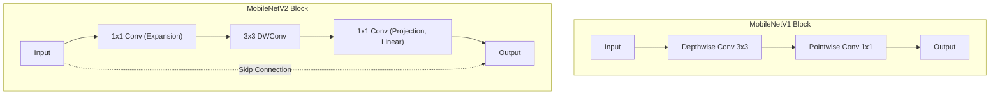

# 경량 모델: MobileNet, ShuffleNet, EfficientNet

## 1. 핵심 개념 (Core Concept)

MobileNet, ShuffleNet, EfficientNet은 스마트폰과 같은 엣지 디바이스의 제한된 연산 능력(computation power) 내에서 효율적으로 동작하도록 설계된 대표적인 경량 CNN 아키텍처들임. 이 모델들은 **Depthwise Separable Convolution**, **Channel Shuffle**, **Compound Scaling**과 같은 혁신적인 기법을 사용하여 모델의 크기와 연산량을 획기적으로 줄이면서도 준수한 정확도를 유지하는 것을 목표로 함.

______________________________________________________________________

## 2. 상세 설명 (Detailed Explanation)

### 2.1 MobileNet

MobileNet 시리즈는 Google에서 개발했으며, 모바일 환경에 최적화된 모델 구조를 제안함.

- **MobileNetV1**: 표준 컨볼루션을 **Depthwise Convolution**과 \*\*Pointwise Convolution (1x1 Conv)\*\*으로 분리하는 **Depthwise Separable Convolution**을 핵심으로 사용함. 이를 통해 연산량을 크게 줄임.
- **MobileNetV2**: 저차원 표현 공간에서 활성화 함수(ReLU)를 사용하면 정보 손실이 발생한다는 점에 착안하여, **Inverted Residual** 블록과 **Linear Bottleneck** 구조를 도입함. 채널을 확장했다가 다시 줄이는 구조로, skip connection과 함께 사용되어 정보 손실을 최소화하고 성능을 높임.
- **MobileNetV3**: \*\*Neural Architecture Search (NAS)\*\*를 사용하여 네트워크 구조를 탐색하고, `h-swish`라는 새로운 활성화 함수를 도입하여 성능과 효율을 더욱 개선함.

### 2.2 ShuffleNet

ShuffleNet은 1x1 컨볼루션(Pointwise Convolution)이 차지하는 연산량에 주목하여, 이를 **Pointwise Group Convolution**으로 대체함. 하지만 이 경우 그룹 간 정보 교환이 없어지는 문제가 발생하는데, 이를 **Channel Shuffle** 연산을 통해 해결함. 채널들을 섞어줌으로써 그룹 간 정보 흐름을 만들어내고, 적은 연산으로도 높은 성능을 유지함.

### 2.3 EfficientNet

EfficientNet은 모델의 성능을 높이기 위해 네트워크의 깊이(depth), 너비(width), 입력 이미지의 해상도(resolution)를 조절하는 기존 방식들의 한계를 지적함. 이 세 가지 요소를 개별적으로 조절하는 대신, **Compound Scaling**이라는 방법을 통해 세 가지 차원을 **균형 있게** 확장하는 것이 최적임을 보였음. 고정된 비율(compound coefficient)에 따라 깊이, 너비, 해상도를 동시에 키워 훨씬 효율적으로 성능을 향상시킴.

______________________________________________________________________

## 3. 비교 (Comparison)

| 모델             | 핵심 아이디어                  | 주요 기법                                           | 장점                                        |
| :--------------- | :----------------------------- | :-------------------------------------------------- | :------------------------------------------ |
| **MobileNet**    | 컨볼루션 연산 분리             | Depthwise Separable Convolution, Inverted Residuals | 간단한 구조로 연산량 대폭 감소              |
| **ShuffleNet**   | 그룹 컨볼루션의 정보 흐름 개선 | Pointwise Group Convolution, Channel Shuffle        | 극도로 적은 연산량(FLOPs)으로 효율성 극대화 |
| **EfficientNet** | 균형 있는 모델 스케일링        | Compound Scaling, Neural Architecture Search        | 정확도와 효율성 사이의 최적의 균형 달성     |

______________________________________________________________________

## 4. 예상 면접 질문 (Potential Interview Questions)

- **Q. MobileNet의 Depthwise Separable Convolution이 어떻게 연산량을 줄이는지 설명해주세요.**

  - **A.** 표준 컨볼루션은 공간적 특징(spatial feature)과 채널 간 특징(cross-channel feature)을 동시에 학습합니다. 반면, Depthwise Separable Convolution은 이를 두 단계로 나눕니다. 먼저 Depthwise Convolution이 각 채널별로 독립적인 공간적 특징을 추출하고, 그 다음 Pointwise Convolution(1x1 Conv)이 채널 간의 관계를 학습합니다. 이처럼 연산을 분리함으로써 파라미터 수와 계산량을 획기적으로 줄일 수 있습니다.

- **Q. MobileNetV2의 Inverted Residual 블록은 V1과 무엇이 다른가요?**

  - **A.** ResNet의 Residual 블록은 채널 수를 줄였다가 다시 늘리는 'bottleneck' 구조인 반면, MobileNetV2의 Inverted Residual 블록은 반대로 채널 수를 늘렸다가 다시 줄이는 'inverted' 구조를 가집니다. 이는 저차원 표현에서도 풍부한 특징을 추출할 수 있도록 하며, 마지막 Projection 단계에서 활성화 함수를 선형(Linear)으로 사용하여 정보 손실을 막는 것이 특징입니다.

- **Q. EfficientNet의 Compound Scaling이 왜 효과적인가요?**

  - **A.** 네트워크의 깊이, 너비, 해상도는 모델 성능에 영향을 주는 요소들이지만, 어느 한 가지만 과도하게 키우면 성능 향상이 둔화됩니다. 예를 들어, 깊이만 계속 늘리면 그래디언트 소실 문제가 발생할 수 있습니다. Compound Scaling은 이 세 가지 차원들이 서로 독립적이지 않다는 점에 착안하여, 정해진 비율에 따라 균형 있게 확장함으로써 제한된 자원 내에서 모델의 성능을 가장 효율적으로 끌어올릴 수 있습니다.

______________________________________________________________________

## 5. 더 읽어보기 (Further Reading)

- [MobileNets: Efficient Convolutional Neural Networks for Mobile Vision Applications](https://arxiv.org/abs/1704.04861)
- [MobileNetV2: Inverted Residuals and Linear Bottlenecks](https://arxiv.org/abs/1801.04381)
- [ShuffleNet: An Extremely Efficient Convolutional Neural Network for Mobile Devices](https://arxiv.org/abs/1707.01083)
- [EfficientNet: Rethinking Model Scaling for Convolutional Neural Networks](https://arxiv.org/abs/1905.11946)
