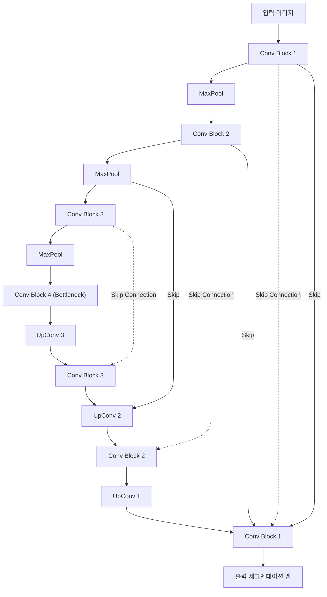

# 세그멘테이션: FCN, U-Net, DeepLab, Mask R-CNN

## 1. 핵심 개념 (Core Concept)

이미지 세그멘테이션(Image Segmentation)은 이미지의 모든 픽셀을 특정 클래스로 분류하는 기술임. **FCN**은 최초로 CNN을 종단간(end-to-end) 방식으로 학습시켜 픽셀 단위 예측을 가능하게 했고, **U-Net**은 인코더-디코더 구조와 Skip Connection을 통해 정교한 분할 맵을 생성함. **DeepLab**은 Atrous Convolution을 사용하여 다양한 스케일의 컨텍스트 정보를 효율적으로 포착하며, **Mask R-CNN**은 객체 탐지를 넘어 각 객체 인스턴스별로 마스크를 분리하는 Instance Segmentation의 표준 모델로 자리 잡았음.

---

## 2. 상세 설명 (Detailed Explanation)

### 2.1 FCN (Fully Convolutional Network)

FCN은 이미지 분류를 위해 설계된 CNN(예: VGG)의 마지막 Fully Connected Layer를 Convolutional Layer로 대체하여, 입력 이미지의 크기에 제약 없이 픽셀 단위의 예측이 가능한 최초의 종단간 세그멘테이션 모델임.

*   **Fully Convolutional**: FC Layer를 1x1 컨볼루션으로 대체하여 위치 정보를 유지한 채 클래스 점수 맵(score map)을 출력함.
*   **Upsampling & Deconvolution**: 다운샘플링으로 인해 작아진 특징 맵을 원래 이미지 크기로 복원하기 위해 업샘플링(Upsampling) 또는 역컨볼루션(Deconvolution)을 사용함.
*   **Skip Architecture**: 깊은 층의 거친(coarse) 의미 정보와 얕은 층의 세밀한(fine) 외형 정보를 결합하여 예측의 정확도를 높임.

### 2.2 U-Net

U-Net은 의료 이미지(biomedical image) 분할을 위해 개발되었으며, 대칭적인 U자 형태의 인코더-디코더 구조가 특징임.

*   **인코더-디코더 구조**: 인코더(Contracting Path)에서 컨볼루션을 통해 컨텍스트 정보를 압축하고, 디코더(Expansive Path)에서 업샘플링을 통해 위치 정보를 복원함.
*   **Skip Connection**: U-Net의 핵심. 인코더의 특징 맵을 디코더의 해당 레벨 특징 맵과 **연결(Concatenate)**하여, 다운샘플링 과정에서 손실된 세밀한 정보를 복원함. 이는 매우 정교한 경계선 예측을 가능하게 함.

*(위 다이어그램은 U-Net의 Skip Connection 개념을 간략히 표현한 것임)*

### 2.3 DeepLab

DeepLab 시리즈는 Atrous Convolution(Dilated Convolution)을 사용하여 세그멘테이션 성능을 크게 향상시킨 모델임.

*   **Atrous (Dilated) Convolution**: 커널 내부에 빈 공간(hole)을 두어 파라미터 수를 늘리지 않으면서도 더 넓은 영역의 정보(receptive field)를 볼 수 있게 하는 컨볼루션. 이를 통해 다운샘플링 없이도 특징 맵의 해상도를 유지하며 컨텍스트 정보를 효과적으로 포착함.
*   **Atrous Spatial Pyramid Pooling (ASPP)**: 동일한 특징 맵에 대해 서로 다른 rate를 가진 여러 개의 Atrous Convolution을 병렬로 적용하여 다양한 스케일의 객체 정보를 동시에 추출하고 결합함.
*   **CRF (Conditional Random Fields)**: 초기 버전에서는 모델 출력의 경계선을 다듬기 위해 후처리 과정으로 CRF를 사용했으나, 최신 버전(DeepLabv3+)에서는 디코더 구조를 도입하여 종단간 학습을 구현함.

### 2.4 Mask R-CNN

Mask R-CNN은 Faster R-CNN을 확장하여 객체 탐지와 동시에 인스턴스 세그멘테이션(Instance Segmentation)을 수행하는 모델임.

*   **Instance Segmentation**: 단순히 픽셀을 클래스로 분류하는 것을 넘어, '사람1', '사람2'와 같이 동일 클래스의 다른 객체 인스턴스까지 구별하여 마스크를 생성함.
*   **RoIAlign**: Faster R-CNN의 RoIPooling은 좌표를 양자화(quantization)하는 과정에서 원본과 특징 맵 사이의 정렬이 틀어지는 문제가 있었음. Mask R-CNN은 이를 보간법(interpolation)을 통해 해결하는 RoIAlign을 제안하여, 픽셀 레벨의 마스크 예측 정확도를 크게 높였음.
*   **Multi-task Loss**: 최종적으로 Classification Loss, Bounding Box Regression Loss, 그리고 Mask Loss를 모두 합친 Multi-task Loss를 사용하여 학습함.

---

## 3. 비교 (Comparison)

| 모델 | 주요 과제 | 핵심 아이디어 | 주요 구조 |
| :--- | :--- | :--- | :--- |
| **FCN** | Semantic | FC Layer를 Conv Layer로 대체 | Encoder + Upsampling |
| **U-Net** | Semantic | Encoder-Decoder, Skip Connection | 대칭적 Encoder-Decoder |
| **DeepLab** | Semantic | 해상도 손실 없는 컨텍스트 확장 | Atrous Convolution, ASPP |
| **Mask R-CNN** | Instance | 객체 탐지 + 마스크 예측 | Faster R-CNN + Mask Head |

---

## 4. 예상 면접 질문 (Potential Interview Questions)

*   **Q. Semantic Segmentation과 Instance Segmentation의 차이점은 무엇인가요?**
    *   **A.** Semantic Segmentation은 이미지의 모든 픽셀을 '사람', '자동차', '배경'과 같은 클래스로 분류합니다. 반면, Instance Segmentation은 같은 클래스에 속하더라도 '1번 사람', '2번 사람'처럼 각 객체(인스턴스)를 개별적으로 구별하여 분할합니다.
*   **Q. U-Net의 Skip Connection이 ResNet의 Skip Connection과 다른 점은 무엇인가요?**
    *   **A.** ResNet의 Skip Connection은 입력과 출력을 **더하는(element-wise addition)** 방식입니다. 이는 그래디언트 흐름을 원활하게 하여 깊은 네트워크 학습을 돕습니다. 반면, U-Net의 Skip Connection은 인코더의 특징 맵을 디코더의 특징 맵에 **채널 방향으로 연결(concatenation)**합니다. 이는 다운샘플링 과정에서 손실된 공간 정보를 복원하는 데 목적이 있습니다.
*   **Q. DeepLab에서 Atrous Convolution을 사용하는 이유는 무엇인가요?**
    *   **A.** Atrous Convolution은 파라미터 수나 계산량을 늘리지 않으면서 Receptive Field(수용 영역)를 확장할 수 있습니다. 이를 통해 모델이 다운샘플링으로 인한 해상도 손실 없이 더 넓은 영역의 컨텍스트 정보를 파악할 수 있어, 크기가 다양한 객체를 더 잘 탐지하고 분할할 수 있습니다.
*   **Q. Mask R-CNN의 RoIAlign이 RoIPooling에 비해 갖는 장점은 무엇인가요?**
    *   **A.** RoIPooling은 후보 영역(RoI)의 좌표를 정수 단위로 반올림(양자화)하기 때문에, 원본 이미지의 RoI와 추출된 특징 맵 사이에 미세한 오정렬(misalignment)이 발생합니다. RoIAlign은 이러한 양자화를 수행하지 않고, 이중 선형 보간법(bilinear interpolation)을 사용하여 정확한 위치의 픽셀 값을 계산합니다. 이 덕분에 픽셀 단위의 정확성이 중요한 마스크 예측에서 훨씬 더 좋은 성능을 보입니다.

---

## 5. 더 읽어보기 (Further Reading)

*   [Fully Convolutional Networks for Semantic Segmentation (FCN)](https://arxiv.org/abs/1411.4038)
*   [U-Net: Convolutional Networks for Biomedical Image Segmentation](https://arxiv.org/abs/1505.04597)
*   [DeepLab: Semantic Image Segmentation with Deep Convolutional Nets, Atrous Convolution, and Fully Connected CRFs](https://arxiv.org/abs/1606.00915)
*   [Mask R-CNN](https://arxiv.org/abs/1703.06870)