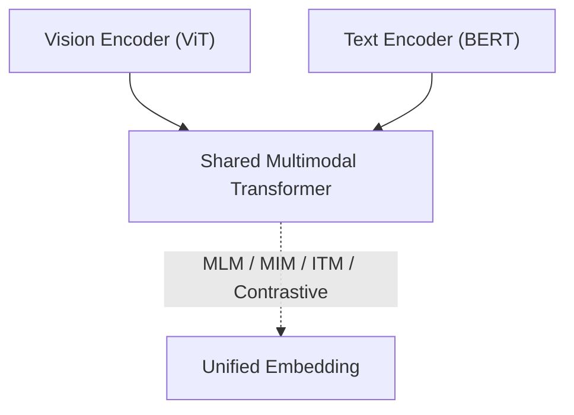

# 멀티모달 모델 (CLIP, FLAVA, Flamingo)

## 1. 핵심 개념 (Core Concept)

멀티모달 모델은 **이미지·텍스트 등 복수 모달 데이터를 동시에 이해·생성하기 위해** 하나의 표현 공간 혹은 토큰 시퀀스로 정렬(alignment)하여 학습함. 대표적인 예로, **CLIP**은 거대한 이미지‑문장 쌍을 대조 학습해 **제로샷 분류**를 가능하게 했고([arxiv.org](https://arxiv.org/abs/2103.00020), [openai.com](https://openai.com/index/clip/)), **FLAVA**는 단일 아키텍처에서 **시각·언어·교차모달 모든 과제**를 처리하도록 설계되었으며([arxiv.org](https://arxiv.org/abs/2112.04482), [huggingface.co](https://huggingface.co/docs/transformers/en/model_doc/flava)), **Flamingo**는 고성능 비전·언어 백본을 **Cross‑Attention Gating**으로 연결해 **인‑컨텍스트(few‑shot) 학습** 능력을 갖춤([arxiv.org](https://arxiv.org/abs/2204.14198), [deepmind.com](https://www.deepmind.com/blog/tackling-multiple-tasks-with-a-single-visual-language-model)).

---

## 2. 상세 설명 (Detailed Explanation)

### 2.1 CLIP: 대조적 이미지‑텍스트 사전학습

- **학습 목표**: 이미지 임베딩 $v$와 문장 임베딩 $t$를 같은 배치 내 양의 쌍 $(v_i, t_i)$ 간 코사인 유사도를 극대화하고, 다른 쌍은 최소화하는 **InfoNCE** 손실을 사용함([arxiv.org](https://arxiv.org/abs/2103.00020)).
    
- **데이터**: 약 4억 쌍의 웹 이미지-텍스트(예: LAION‑400M)로 학습하여 범주 제약이 없음([laion.ai](https://laion.ai/laion-400-open-dataset/), [arxiv.org](https://arxiv.org/abs/2111.02114)).
    
- **아키텍처**: (1) **비전 인코더**–ResNet/ViT, (2) **텍스트 인코더**–Transformer, (3) 정규화 임베딩 후 **스케일 파라미터**가 있는 내적으로 로짓 계산([huggingface.co](https://huggingface.co/docs/transformers/en/model_doc/clip), [github.com](https://github.com/openai/CLIP)).
    
- **장점**: 제로샷 분류·검색·크로스모달 retrieval 등에서 뛰어난 전이 성능을 보임([pinecone.io](https://www.pinecone.io/learn/series/image-search/zero-shot-image-classification-clip/)).
    
- **한계**: 어드버서리얼 공격 및 세부 위치(localization) 민감도가 낮다는 연구가 보고됨([arxiv.org](https://arxiv.org/abs/2402.07410), [arxiv.org](https://arxiv.org/html/2410.02746v1)).
    
### 2.2 FLAVA: 파운데이션 비전‑언어 모델



- **모듈**: (i) 개별 비전·언어 인코더, (ii) 초기 융합을 수행하는 Multimodal Transformer, (iii) 다중 손실(MLM, MIM, ITM, CLIP‑style)로 학습([arxiv.org](https://arxiv.org/abs/2112.04482), [huggingface.co](https://huggingface.co/docs/transformers/en/model_doc/flava)).
    
- **강점**: 단일 체크포인트로 **35개** 시각·언어·교차모달 벤치마크에서 고른 성능을 달성함([arxiv.org](https://arxiv.org/abs/2112.04482)).
    
- **의의**: Contrastive(후기 융합)·Fusion(조기 융합)을 모두 사용해 양쪽 특성을 결합한 **혼합 학습 전략**을 제안함.
    

### 2.3 Flamingo: Few‑shot 비전‑언어 모델

|구성 요소|설명|
|:--|:--|
|**Frozen Vision Backbone**|CLIP ViT‑G 같은 고해상도 비전 인코더 고정([arxiv.org](https://arxiv.org/abs/2204.14198))|
|**Perceiver Resampler**|수천 개 패치에서 수십 개 토큰으로 축약하여 언어 모델에 맞춤|
|**Gated Cross‑Attention Layers (GxAttn)**|텍스트 흐름에 비전 정보를 주입, 학습 가능한 게이트로 상호작용 제어([deepmind.com](https://www.deepmind.com/blog/tackling-multiple-tasks-with-a-single-visual-language-model))|
|**Causal Language Model**|80B 매개변수 Chinchilla 기반 LLM → in‑context 학습 지원|

Flamingo는 **이미지·텍스트가 임의로 섞인 시퀀스**를 입력받아, 단 몇 개 예시만으로 VQA·캡셔닝·비디오 이해 등에서 SOTA를 달성함([arxiv.org](https://arxiv.org/abs/2204.14198), [deepmind.com](https://deepmind.com/blog/deepminds-latest-research-at-neurips-2022)).

### 2.4 모델 비교 및 트렌드

|모델|사전학습 데이터|목표 손실|강점|한계|
|:--|:--|:--|:--|:--|
|**CLIP**|4억+ 이미지‑텍스트(웹, LAION)|대조 손실|제로샷 인식 · 검색|세밀 위치 예민도 부족, 편향([arxiv.org](https://arxiv.org/abs/2402.07410))|
|**FLAVA**|ImageNet + BookCorpus/CC 뉴스 등|MLM + MIM + Contrastive + ITM|모달리티 전천후|모델 크기↑, 학습 복잡|
|**Flamingo**|43M 이미지·텍스트 내재된 webdocs|Cross‑Attn + LM Loss|Few‑shot 적응|고비용 인프라 필요([deepmind.com](https://www.deepmind.com/blog/tackling-multiple-tasks-with-a-single-visual-language-model))|

---

## 3. 예시 (Example)

### 코드 예시 (Python)

```python
from transformers import CLIPProcessor, CLIPModel
from PIL import Image
import torch

# 1) 모델·프로세서 로딩 (HuggingFace)
device = "cuda" if torch.cuda.is_available() else "cpu"
model = CLIPModel.from_pretrained("openai/clip-vit-base-patch32").to(device)
processor = CLIPProcessor.from_pretrained("openai/clip-vit-base-patch32")

# 2) 이미지·텍스트 준비
a = Image.open("cat.jpg")
texts = ["a photo of a cute cat", "a photo of a dog"]

# 3) 전처리 + 추론
inputs = processor(images=a, text=texts, return_tensors="pt", padding=True).to(device)
with torch.no_grad():
    logits_per_image = model(**inputs).logits_per_image
probs = logits_per_image.softmax(dim=-1)
print(f"Zero‑shot 결과: {texts[probs.argmax()]}")
```

### 사용 사례 (Use Case)

> **콘텐츠 모더레이션** – CLIP 임베딩으로 SNS 이미지에서 폭력·혐오 표현 가능성을 텍스트 프롬프트만으로 탐지, 추가 라벨링 비용을 절감함([github.com](https://github.com/openai/CLIP), [pinecone.io](https://www.pinecone.io/learn/series/image-search/zero-shot-image-classification-clip/)).

---

## 4. 예상 면접 질문 (Potential Interview Questions)

- **Q. CLIP이 전통적인 supervised 이미지 분류 대비 갖는 이점은?**
    
    - **A.** 범주 레이블 없이 자연어 설명만으로 학습돼, 새 클래스에 대해 프롬프트만 작성하면 제로샷 분류가 가능함([arxiv.org](https://arxiv.org/abs/2103.00020), [openai.com](https://openai.com/index/clip/)).
        
- **Q. FLAVA의 "혼합 학습" 전략은 무엇이며, 왜 필요한가?**
    
    - **A.** Contrastive(후기 융합)로 표현 정렬을, MLM·MIM(조기 융합)으로 모달 간 상호작용을 학습하여 단일 모델이 시각·언어·교차모달 작업을 모두 수행하도록 함([arxiv.org](https://arxiv.org/abs/2112.04482)).
        
- **Q. Flamingo에서 Gated Cross‑Attention의 역할은?**
    
    - **A.** 언어 모델 토큰마다 Vision 토큰을 선택적으로 주입해 **모달리티 혼선** 없이 정보 통합을 제어, few‑shot 적응력을 높임([arxiv.org](https://arxiv.org/abs/2204.14198)).
        
- **Q. LAION‑400M이 CLIP 학습에 기여한 바는?**
    
    - **A.** 공개 대규모 이미지‑텍스트 쌍을 제공해 연구자들이 CLIP류 모델을 재현·확장 가능하게 하였으며, 데이터 필터링 역시 CLIP 임베딩을 활용함([arxiv.org](https://arxiv.org/abs/2111.02114), [tensorflow.org](https://www.tensorflow.org/datasets/catalog/laion400m)).
        
- **Q. CLIP의 취약점(robustness)을 개선하기 위한 최근 연구 방향은?**
    
    - **A.** Region‑level 대조 학습(CLOC) 및 어드버서리얼 훈련으로 세밀 위치 감지와 공격 저항성을 높이고자 함([arxiv.org](https://arxiv.org/html/2410.02746v1), [arxiv.org](https://arxiv.org/abs/2402.07410)).
        

---

## 5. 더 읽어보기 (Further Reading)

- OpenAI Blog – “CLIP: Connecting Text and Images”([openai.com](https://openai.com/index/clip/))
- Radford et al., “Learning Transferable Visual Models From Natural Language Supervision,” ICML 2021([arxiv.org](https://arxiv.org/abs/2103.00020))
- Singh et al., “FLAVA: A Foundational Language And Vision Alignment Model,” CVPR 2022([arxiv.org](https://arxiv.org/abs/2112.04482))
- Alayrac et al., “Flamingo: A Visual Language Model for Few‑Shot Learning,” arXiv 2022([arxiv.org](https://arxiv.org/abs/2204.14198))
- LAION‑400M Dataset Homepage & Paper([laion.ai](https://laion.ai/laion-400-open-dataset/), [arxiv.org](https://arxiv.org/abs/2111.02114))
- HuggingFace Docs – CLIP & FLAVA usage guides([huggingface.co](https://huggingface.co/docs/transformers/en/model_doc/clip), [huggingface.co](https://huggingface.co/docs/transformers/en/model_doc/flava))