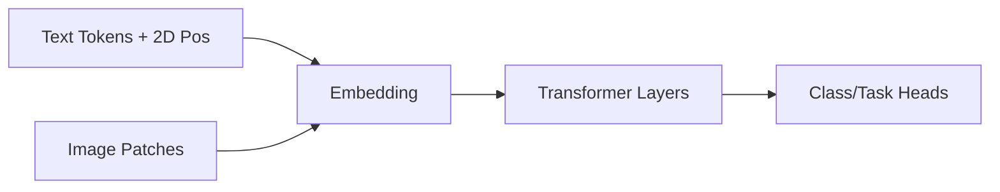

# OCR·Document AI (LayoutLM, Donut)

## 1. 핵심 개념 (Core Concept)

문서 AI(Document AI)는 **문서 이미지·PDF에서 텍스트·레이아웃·시각 단서를 공동 이해**하여 분류, 정보 추출, 질의응답 등 고차원 작업을 자동화함. LayoutLM 계열은 **텍스트 스트림에 2D 위치·시각 특징을 주입해 학습하는 멀티모달 Transformer**이고 Donut(Document Understanding Transformer)은 **OCR 단계를 생략하고 이미지에서 바로 JSON/텍스트를 생성**하는 엔드투엔드 모델임.([arxiv.org](https://arxiv.org/abs/1912.13318), [arxiv.org](https://arxiv.org/abs/2111.15664))

______________________________________________________________________

## 2. 상세 설명 (Detailed Explanation)

### 2.1 LayoutLM 패밀리

- **LayoutLM v1** – 입력 토큰마다 $(x,y,w,h)$ 박스 좌표 임베딩을 더해 BERT MLM을 수행, 텍스트와 레이아웃 상호작용을 처음으로 통합함. FUNSD·RVL‑CDIP 등에서 SOTA를 달성.([arxiv.org](https://arxiv.org/abs/1912.13318), [arxiv.org](https://arxiv.org/abs/1905.13538), [adamharley.com](https://adamharley.com/rvl-cdip/))

- **LayoutLMv2** – 이미지 CNN(ResNet/Faster R‑CNN) 특징을 추가하고 \*\*통합 대조 손실(Image‑Text Matching, MLM, MIM)\*\*으로 다중 모달 정렬을 강화함.([aclanthology.org](https://aclanthology.org/2021.acl-long.201/))

- **LayoutLMv3** – 텍스트·이미지를 **동시에 마스킹**해 예측하는 통일된 self‑supervised 목표와 **word‑patch alignment**로 교차 모달 정렬을 직접 학습, DocVQA·XFun 등 광범위 벤치마크를 갱신함.([arxiv.org](https://arxiv.org/abs/2204.08387), [microsoft.com](https://www.microsoft.com/en-us/research/publication/layoutlmv3-pre-training-for-document-ai-with-unified-text-and-image-masking/))



- **파인튜닝**: 문서 분류(RVL‑CDIP), 폼 필드 추출(FUNSD), 문서 VQA(DocVQA) 등 태스크별 linear head만 교체해 미세조정.([adamharley.com](https://adamharley.com/rvl-cdip/), [arxiv.org](https://arxiv.org/abs/2007.00398))

### 2.2 Donut: OCR‑Free End‑to‑End 모델

| 구성 요소          | 설명                                                                                                                                                                                          |
| :----------------- | :-------------------------------------------------------------------------------------------------------------------------------------------------------------------------------------------- |
| **Vision Encoder** | Swin‑Transformer가 768 × 14×14 토큰으로 압축.([huggingface.co](https://huggingface.co/naver-clova-ix/donut-base))                                                                             |
| **Text Decoder**   | BART 구조, \<s_task> 프롬프트 뒤에 JSON 혹은 캡션을 자가회귀 생성.([arxiv.org](https://arxiv.org/abs/2111.15664), [huggingface.co](https://huggingface.co/docs/transformers/model_doc/donut)) |
| **학습 목표**      | 단순 Cross‑Entropy (STR) – ground‑truth 문자열 복사; 별도 OCR 라벨 불필요.([arxiv.org](https://arxiv.org/abs/2111.15664))                                                                     |

Donut은 **OCR 오류 누적·언어 한계·추가 레이지 비용을 해소**하며 CORD 영수증·DocVQA·CLEVR‑Form 등에서 LayoutLM 계열과 유사 또는 상회하는 정확도를 보인다.([github.com](https://github.com/clovaai/donut), [huggingface.co](https://huggingface.co/naver-clova-ix/donut-base-finetuned-docvqa))

### 2.3 주요 데이터셋 & 벤치마크

| 데이터셋     | 용도                | 크기                 | 특징                                                                           |
| :----------- | :------------------ | :------------------- | :----------------------------------------------------------------------------- |
| **RVL‑CDIP** | 문서 분류           | 400 K 페이지         | 16개 장르, 흑백 스캔 중심.([adamharley.com](https://adamharley.com/rvl-cdip/)) |
| **FUNSD**    | 폼 필드 엔티티 추출 | 199 양식             | 키–값 페어 라벨 포함.([arxiv.org](https://arxiv.org/abs/1905.13538))           |
| **DocVQA**   | 문서 VQA            | 12 K 문서, 50 K 질문 | 구조 이해가 필수.([arxiv.org](https://arxiv.org/abs/2007.00398))               |
| **CORD**     | 영수증 정보 추출    | 1 K 영수증           | 한국어 혼합, Donut 공개.([github.com](https://github.com/clovaai/donut))       |

### 2.4 모델 비교 & 트렌드

| 모델           | 아키텍처                          | 장점                           | 한계                                                                                                                                                                                              |
| :------------- | :-------------------------------- | :----------------------------- | :------------------------------------------------------------------------------------------------------------------------------------------------------------------------------------------------ |
| **LayoutLMv3** | 텍스트+2D+이미지 공동 Transformer | 다목적, 성능 SOTA              | OCR 의존·길이 512 제한.([arxiv.org](https://arxiv.org/abs/2204.08387))                                                                                                                            |
| **Donut**      | Swin Encoder + BART Decoder       | OCR‑Free, 멀티언어 유연        | 긴 시퀀스 생성 > 메모리·속도 부담.([arxiv.org](https://arxiv.org/abs/2111.15664), [huggingface.co](https://huggingface.co/docs/transformers/model_doc/donut))                                     |
| **DiT**        | Vision‑only Transformer 사전학습  | 문서 전용 ViT로 분류·감지 강점 | 텍스트 이해 위해 OCR 추가 필요.([microsoft.com](https://www.microsoft.com/en-us/research/lab/microsoft-research-asia/articles/dit-self-supervised-pre-training-for-document-image-transformers/)) |

______________________________________________________________________

## 3. 예시 (Example)

### 코드 예시 (Python)

```python
from transformers import DonutProcessor, VisionEncoderDecoderModel
from PIL import Image
import torch

device = "cuda" if torch.cuda.is_available() else "cpu"
model = VisionEncoderDecoderModel.from_pretrained("naver-clova-ix/donut-base-finetuned-docvqa").to(device)
processor = DonutProcessor.from_pretrained("naver-clova-ix/donut-base-finetuned-docvqa")

image = Image.open("invoice.jpg").convert("RGB")
inputs = processor(images=image, return_tensors="pt").to(device)

generated = model.generate(**inputs, max_length=512)
print(processor.batch_decode(generated, skip_special_tokens=True)[0])
```

_위 스니펫은 OCR 없는 Donut으로 PDF/이미지 인보이스를 JSON 스키마로 추출하는 예시_([huggingface.co](https://huggingface.co/docs/transformers/model_doc/donut), [huggingface.co](https://huggingface.co/naver-clova-ix/donut-base-finetuned-docvqa))

### 사용 사례 (Use Case)

> **자동 인보이스 처리** – LayoutLM 혹은 Donut을 파인튜닝해 Supplier, Amount, Due Date 등을 추출하면 수작업 대비 최대 90 % 이상 시간 절감 및 적시 결제율을 향상시킨 사례가 보고됨.([datasaur.ai](https://datasaur.ai/blog-posts/layoutlm-invoice-extraction))

______________________________________________________________________

## 4. 예상 면접 질문 (Potential Interview Questions)

- **Q. LayoutLM이 BERT와 다른 점은?**

  - **A.** Token Embedding 외에 2D 좌표 임베딩과 (v2+) 이미지 패치 특징을 함께 입력해 문서 레이아웃 정보를 학습한다.([arxiv.org](https://arxiv.org/abs/1912.13318), [aclanthology.org](https://aclanthology.org/2021.acl-long.201/))

- **Q. LayoutLMv3의 "Unified Masking"이 중요한 이유는?**

  - **A.** 텍스트·이미지를 동일 비율로 마스킹해 예측함으로써 모달 불균형 문제를 줄이고 교차 모달 정렬을 자연스럽게 학습한다.([arxiv.org](https://arxiv.org/abs/2204.08387))

- **Q. Donut이 OCR 기반 파이프라인보다 우수한 시나리오는?**

  - **A.** 다국어·손글씨·저해상도 스캔처럼 OCR 정확도가 낮은 환경에서 직접 JSON을 생성해 오류 전파를 차단한다.([arxiv.org](https://arxiv.org/abs/2111.15664), [parsio.io](https://parsio.io/blog/extracting-data-from-pdfs-using-ai-claude-3-donut-and-nougat/))

- **Q. RVL‑CDIP과 FUNSD의 차이는?**

  - **A.** RVL‑CDIP은 페이지 분류 목적의 대규모 이미지‑레이블 데이터이고, FUNSD는 폼 내 키‑값 엔티티 위치를 포함해 정보 추출에 초점을 맞춘 소규모 데이터다.([adamharley.com](https://adamharley.com/rvl-cdip/), [arxiv.org](https://arxiv.org/abs/1905.13538))

- **Q. 모델이 긴 계약서(수백 페이지)를 처리할 때의 제약은?**

  - **A.** Transformer 입력 길이(512) 초과, GPU 메모리, 페이지 간 레이아웃 상호작용 부재가 문제이며, Sliding‑Window Inference나 MP‑DocVQA용 Hierarchical 모델이 연구되고 있다.([arxiv.org](https://arxiv.org/pdf/2404.19024))

______________________________________________________________________

## 5. 더 읽어보기 (Further Reading)

- Xu et al., “LayoutLM: Pre‑training of Text and Layout for Document Image Understanding,” ACL 2020.([arxiv.org](https://arxiv.org/abs/1912.13318))
- Xu et al., “LayoutLMv2: Multi‑modal Pre‑training for Visually‑rich Document Understanding,” ACL 2021.([aclanthology.org](https://aclanthology.org/2021.acl-long.201/))
- Huang et al., “LayoutLMv3: Pre‑training for Document AI with Unified Text and Image Masking,” ACM MM 2022.([arxiv.org](https://arxiv.org/abs/2204.08387))
- Kim et al., “Donut: Document Understanding Transformer without OCR,” CVPR 2022.([arxiv.org](https://arxiv.org/abs/2111.15664))
- DocVQA Dataset & Challenge Portal.([arxiv.org](https://arxiv.org/abs/2007.00398))
- CORD Receipt Dataset (Donut).([github.com](https://github.com/clovaai/donut))
- Microsoft Research – Document AI Project Page.([microsoft.com](https://www.microsoft.com/en-us/research/project/document-ai/))
