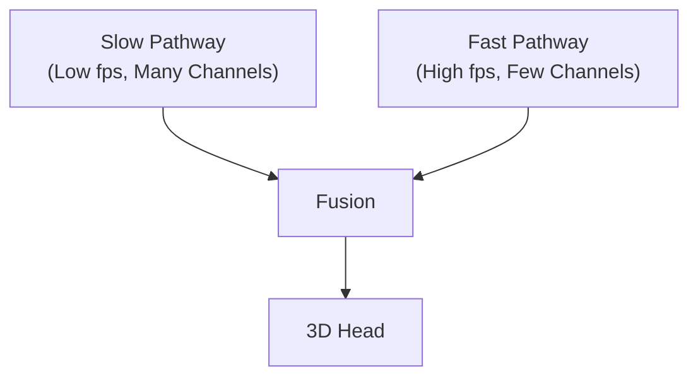

# 비디오 인식 (SlowFast, I3D, VideoMAE)

## 1. 핵심 개념 (Core Concept)

비디오 인식은 **시간 축을 따라 변화하는 시각 정보를 학습하여 동작(Action)·사건(Event)을 분류·탐지**하는 분야임. I3D는 2D ConvNet을 3D로 ‘팽창(Inflate)’해 **공간·시간 특징을 동시에 인코딩**하며([github.com](https://github.com/google-deepmind/kinetics-i3d?utm_source=chatgpt.com)), SlowFast는 **느린(저주파)·빠른(고주파) 두 경로**로 시간 해상도를 분리해 정확도·효율을 높임([arxiv.org](https://arxiv.org/abs/1812.03982?utm_source=chatgpt.com), [openaccess.thecvf.com](https://openaccess.thecvf.com/content_ICCV_2019/papers/Feichtenhofer_SlowFast_Networks_for_Video_Recognition_ICCV_2019_paper.pdf?utm_source=chatgpt.com)), VideoMAE는 **마스킹 자기표현 학습**으로 **대규모 사전학습 후 적은 레이블**로도 고성능을 달성하는 비디오 Transformer다([proceedings.neurips.cc](https://proceedings.neurips.cc/paper_files/paper/2022/hash/416f9cb3276121c42eebb86352a4354a-Abstract-Conference.html?utm_source=chatgpt.com), [github.com](https://github.com/MCG-NJU/VideoMAE?utm_source=chatgpt.com)).

---

## 2. 상세 설명 (Detailed Explanation)

### 2.1 I3D – Inflated 3D ConvNet

- **아이디어**: 2D Inception-v1 필터를 동일 커널 크기의 3D Conv로 팽창하여 pretrained ImageNet 가중치를 영상 차원에 재사용함([github.com](https://github.com/google-deepmind/kinetics-i3d?utm_source=chatgpt.com)).
    
- **장점**: 사전학습 가중치 전이 덕분에 Kinetics‑400에서 단일 모델 78.0% Top-1을 기록하며 동시대 SOTA를 달성([tensorflow.org](https://www.tensorflow.org/hub/tutorials/action_recognition_with_tf_hub?utm_source=chatgpt.com)).
    
- **한계**: 모든 레이어가 3D Conv → 파라미터·FLOPs 급증, 64‑frame 입력에서 실시간 추론이 어려움.
    

### 2.2 SlowFast – 이중 시간 해상도 경로



- **Slow Path**: 8–32 fps 입력으로 정적 형태(appearance) 학습.
    
- **Fast Path**: 8× 빠른 64–256 fps 입력, 채널 수 1/8로 경량화해 모션 세부 묘사([arxiv.org](https://arxiv.org/abs/1812.03982?utm_source=chatgpt.com)).
    
- **결과**: Kinetics‑700에서 82.1 % Top‑1, AVA 행동 탐지 mAP 28.2를 달성하며 I3D 대비 4~6 %p 향상([openaccess.thecvf.com](https://openaccess.thecvf.com/content_ICCV_2019/papers/Feichtenhofer_SlowFast_Networks_for_Video_Recognition_ICCV_2019_paper.pdf?utm_source=chatgpt.com)).
    
- **오픈소스**: PySlowFast 코드베이스로 학습·추론 파이프라인 제공([github.com](https://github.com/facebookresearch/SlowFast?utm_source=chatgpt.com)).
    

### 2.3 VideoMAE – 마스킹 기반 Video Transformer

- **Customization**: Tube‑masking으로 전체 영상의 90–95 % 패치를 가려 복원하도록 하여 정보 밀도를 압축([proceedings.neurips.cc](https://proceedings.neurips.cc/paper_files/paper/2022/hash/416f9cb3276121c42eebb86352a4354a-Abstract-Conference.html?utm_source=chatgpt.com)).
    
- **Self‑Supervised Pre‑training**: 50 epoch 사전학습으로도 Kinetics‑400 fine‑tune 시 79.3 % Top‑1 달성(레이블 절반 대비 +5 %p)([github.com](https://github.com/MCG-NJU/VideoMAE?utm_source=chatgpt.com)).
    
- **Scaling (V2)**: 듀얼 마스킹·1 B 파라미터 비디오 Transformer로 Something‑Something V2 84.9 %까지 SOTA를 갱신([openaccess.thecvf.com](https://openaccess.thecvf.com/content/CVPR2023/papers/Wang_VideoMAE_V2_Scaling_Video_Masked_Autoencoders_With_Dual_Masking_CVPR_2023_paper.pdf?utm_source=chatgpt.com), [paperswithcode.com](https://paperswithcode.com/sota/action-recognition-in-videos-on-something?p=videomae-masked-autoencoders-are-data-1&utm_source=chatgpt.com)).
    
- **API**: HuggingFace Transformers에 VideoMAE 모델·Processor 통합([github.com](https://github.com/huggingface/transformers/blob/main/docs/source/en/model_doc/videomae.md?utm_source=chatgpt.com)).
    

### 2.4 학습 데이터·벤치마크

|데이터셋|클립 수|클래스|특징|
|:--|:--|:--|:--|
|**Kinetics‑700**|650 K|700|10 s YouTube 클립, 인간 행동 중심([paperswithcode.com](https://paperswithcode.com/dataset/kinetics-700?utm_source=chatgpt.com), [github.com](https://github.com/cvdfoundation/kinetics-dataset?utm_source=chatgpt.com))|
|**Something‑Something V2**|220 K|174|물체 상호작용, Fine‑grained 모션 필요([paperswithcode.com](https://paperswithcode.com/sota/action-recognition-in-videos-on-something?p=videomae-masked-autoencoders-are-data-1&utm_source=chatgpt.com))|
|**AVA v2.2**|430 15 fps|80|바운딩 박스 행동 탐지, 장면 내 여러 인물([paperswithcode.com](https://paperswithcode.com/sota/action-recognition-on-ava-v2-2?p=videomae-masked-autoencoders-are-data-1&utm_source=chatgpt.com))|

---

## 3. 예시 (Example)

### 코드 예시 (Python)

```python
# HuggingFace VideoMAE inference on a mp4 clip (16×224×224)
from transformers import VideoMAEForVideoClassification, VideoMAEFeatureExtractor
import torch, torchvision

model = VideoMAEForVideoClassification.from_pretrained(
    "MCG-NJU/videomae-base-finetuned-kinetics400-16f")
fe = VideoMAEFeatureExtractor(
    size=224, mean=[0.485,0.456,0.406], std=[0.229,0.224,0.225])

clip, _, _ = torchvision.io.read_video("jumping.mp4", pts_unit="sec")
inputs = fe(list(clip[:16]), return_tensors="pt")
with torch.no_grad():
    logits = model(**inputs).logits
print(model.config.label2id_inv[logits.argmax(-1).item()])
```

### 사용 사례 (Use Case)

> **스포츠 분석** – SlowFast를 파인튜닝해 라이브 경기에서 선수 동작(슛, 패스)을 실시간 감지, 통계·하이라이트 자동 생성에 활용됨([paperswithcode.com](https://paperswithcode.com/task/action-recognition-in-videos-2?utm_source=chatgpt.com)).

---

## 4. 예상 면접 질문 (Potential Interview Questions)

- **Q. 3D Conv(Inflation) 접근과 Dual‑Path(SlowFast)의 설계 차이는?**
    
    - **A.** I3D는 모든 계층을 등속 3D Conv로 확장해 공간·시간 특징을 동등 처리한다면, SlowFast는 두 시간해상도 분기로 모션·정적 정보를 분업화해 계산 효율과 표현력을 모두 잡는다([github.com](https://github.com/google-deepmind/kinetics-i3d?utm_source=chatgpt.com), [arxiv.org](https://arxiv.org/abs/1812.03982?utm_source=chatgpt.com)).
        
- **Q. VideoMAE에서 매우 높은 마스킹 비율이 가능한 이유는?**
    
    - **A.** 시간·공간 중복성이 커 정보가 반복되기에 90 % 이상 가려도 남은 5–10 % 샘플로 원본 복원이 가능하며, 이를 통해 모델이 장면 동역학을 깊이 학습한다([proceedings.neurips.cc](https://proceedings.neurips.cc/paper_files/paper/2022/hash/416f9cb3276121c42eebb86352a4354a-Abstract-Conference.html?utm_source=chatgpt.com), [github.com](https://github.com/MCG-NJU/VideoMAE?utm_source=chatgpt.com)).
        
- **Q. Kinetics‑700과 Something‑Something V2의 근본적 차이는?**
    
    - **A.** 전자는 ‘고양이가 점프한다’처럼 고수준 행동 클래스가 중심이고, 후자는 ‘컵을 왼쪽에서 오른쪽으로 옮김’ 같은 세밀 모션 분류를 요구해 시간적 정밀도가 테스트된다([paperswithcode.com](https://paperswithcode.com/dataset/kinetics-700?utm_source=chatgpt.com), [paperswithcode.com](https://paperswithcode.com/sota/action-recognition-in-videos-on-something?p=videomae-masked-autoencoders-are-data-1&utm_source=chatgpt.com)).
        
- **Q. 실무 시스템에서 3D Conv 기반 모델의 계산량을 줄이는 일반 기법은?**
    
    - **A.** 프레임 간 샘플링 간격 증가, 채널 축 축소(Depthwise), 또는 2+1D 분해 Conv(공간×시간 분리)로 FLOPs를 절반 이하로 줄인다.
        
- **Q. VideoMAE가 모션‑중심 데이터셋 외에도 효과적인가?**
    
    - **A.** V2는 AVA 탐지·Epic‑Kitchen 등에서도 SOTA를 기록해, 정적·동적 요소가 섞인 장면 모두에 강인함을 보였다([openaccess.thecvf.com](https://openaccess.thecvf.com/content/CVPR2023/papers/Wang_VideoMAE_V2_Scaling_Video_Masked_Autoencoders_With_Dual_Masking_CVPR_2023_paper.pdf?utm_source=chatgpt.com)).
        

---

## 5. 더 읽어보기 (Further Reading)

- Feichtenhofer et al., “SlowFast Networks for Video Recognition,” ICCV 2019([openaccess.thecvf.com](https://openaccess.thecvf.com/content_ICCV_2019/papers/Feichtenhofer_SlowFast_Networks_for_Video_Recognition_ICCV_2019_paper.pdf?utm_source=chatgpt.com)).
    
- Carreira & Zisserman, “Quo Vadis, Action Recognition? A New Model and the Kinetics Dataset,” CVPR 2017([github.com](https://github.com/google-deepmind/kinetics-i3d?utm_source=chatgpt.com)).
    
- Tong et al., “VideoMAE: Masked Autoencoders Are Data‑Efficient Learners,” NeurIPS 2022([proceedings.neurips.cc](https://proceedings.neurips.cc/paper_files/paper/2022/file/416f9cb3276121c42eebb86352a4354a-Paper-Conference.pdf?utm_source=chatgpt.com)).
    
- Wang et al., “VideoMAE V2: Scaling Video Masked Autoencoders,” CVPR 2023([openaccess.thecvf.com](https://openaccess.thecvf.com/content/CVPR2023/papers/Wang_VideoMAE_V2_Scaling_Video_Masked_Autoencoders_With_Dual_Masking_CVPR_2023_paper.pdf?utm_source=chatgpt.com)).
    
- PySlowFast Github Repository([github.com](https://github.com/facebookresearch/SlowFast?utm_source=chatgpt.com)).
    
- Kinetics‑700 Dataset Overview([paperswithcode.com](https://paperswithcode.com/dataset/kinetics-700?utm_source=chatgpt.com)).
    
- HuggingFace VideoMAE Documentation([github.com](https://github.com/huggingface/transformers/blob/main/docs/source/en/model_doc/videomae.md?utm_source=chatgpt.com)).