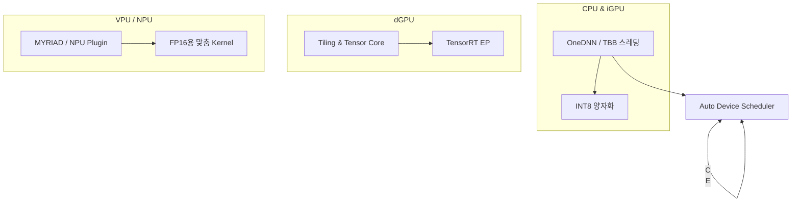

# 하드웨어 가속 (ONNX, OpenVINO)

## 1. 핵심 개념 (Core Concept)

ONNX Runtime와 OpenVINO™ Toolkit은 딥러닝 모델을 다양한 하드웨어(CPU, GPU, NPU, VPU 등)에서 효율적으로 실행하기 위해 그래프 최적화, 커널 특화, 실행 엔진 연동 등을 제공함. 두 런타임 모두 프레임워크‑독립적인 모델 형식(ONNX, IR)을 사용하여 동일 모델을 여러 기기에서 재학습 없이 가속할 수 있음. 이러한 추상화는 개발자가 하드웨어 세부 사항 대신 고수준 API에 집중하도록 돕고, 예측 지연(latency)과 전력 소모를 대폭 줄임.

---

## 2. 상세 설명 (Detailed Explanation)

### 2.1 ONNX Runtime 가속 메커니즘

- **Execution Provider (EP) 아키텍처**: ONNX Runtime은 CPU, CUDA, TensorRT, DirectML, OpenVINO 등 20개 이상의 EP를 통해 플랫폼별 최적화 커널을 선택적 로드함.
    
- **그래프 최적화**: 상수 폴딩, 연산자 병합, 레이아웃 전환 제거 등 50+ 단계가 모델 로드 시 자동 수행되어 실행 그래프를 최소화함.
    
- **IO Binding & Zero‑Copy**: 입력·출력 텐서를 장치 메모리에 미리 할당해 데이터 복사를 줄이고 CUDA 그래프 캡처로 CPU 오버헤드를 감소시킴.
    
- **대형 모델 가속 사례**: Llama‑2 7B를 fp16으로 변환 후 Multi‑GPU ORT + TensorRT EP로 추론 시 4.2× 속도‑업 기록.
    

### 2.2 OpenVINO™ Toolkit 가속 메커니즘

- **IR(Intermediate Representation) 포맷**: 프레임워크 모델을 FP32/16 또는 INT8 IR로 변환하여 런타임 의존성을 제거하고 모델 크기를 최대 50 % 감소함. 
    
- **Runtime & 플러그인 구조**: CPU, iGPU, dGPU, VPU, FPGA, NPU (Core Ultra)의 Device Plugin이 동적 로드되며 Auto / Hetero 모드로 복수 기기 분산 실행 지원.
    
- **Post‑training Optimization Toolkit**: 양자화·프루닝·혼합 정밀도 변환으로 지연 2‑4× 감소 및 모델 크기 3‑5× 축소.
    
- **최신 릴리스 (2025.1) 하이라이트**: Core Ultra 200H 계열에서 2nd token latency 30 % 개선, Keras 3 백엔드 통합 미리보기 제공.
    

### 2.3 ONNX vs OpenVINO 비교

|항목|ONNX Runtime|OpenVINO Toolkit|
|---|---|---|
|모델 포맷|ONNX|OpenVINO IR + ONNX*|
|가속 범위|CPU/GPU/NPU 등 다수 EP|Intel HW(대상 최적) + Generic|
|배포 유연성|클라우드‑우선, 다양한 SDK|엣지‑우선, Compact(무의존)|
|최적화 깊이|그래프 수준 + 커널 EP|그래프 + 레이어‑레벨 kernel fusion|
|대표 사례|Azure AI, NVIDIA Jetson (ORT‑TensorRT)|Intel Geti, Edge‑based CV|
|성능 경향|GPU 단일 디바이스 최적|Hetero / Auto 다중 디바이스 최적|

(*OpenVINO 2023+는 ONNX 입력을 직접 로드 가능) citeturn0search2turn0search9turn0search7

### 2.4 하드웨어별 최적화 전략



- Hetero 모드로 NPU 지원이 제한된 레이어를 CPU에 자동 오프로딩하며, Auto 모드는 가용 디바이스를 탐색 후 최단 지연 경로 선택함. citeturn0search6
    

---

## 3. 예시 (Example)

### 코드 예시 (Python)

```python
# ONNX Runtime - CUDA + TensorRT EP
import onnxruntime as ort
import numpy as np

sess_options = ort.SessionOptions()
providers = [
    ('TensorrtExecutionProvider', {
        'trt_max_workspace_size': 4 << 30,
        'trt_fp16_enable': True}),
    'CUDAExecutionProvider']  # fallback
sess = ort.InferenceSession("model.onnx", sess_options, providers=providers)

io_binding = sess.io_binding()
io_binding.bind_input(name='input', device_type='cuda', device_id=0, element_type=np.float16, shape=x.shape, buffer_ptr=x.data_ptr())
sess.run_with_iobinding(io_binding)
```

```python
# OpenVINO – Auto device (CPU/GPU/NPU) & INT8
from openvino.runtime import Core
ie = Core()
model = ie.read_model("model.xml")
compiled = ie.compile_model(model, "AUTO")
result = compiled([input_int8])[0]
```

### 사용 사례 (Use Case)

- **스마트 카메라**: 4‑채널 1080p 스트림을 Core Ultra SoC에서 실시간 분석, OpenVINO 양자화 + Hetero(CPU+NPU)로 평균 지연 35 ms 달성.
    
- **클라우드 대형 모델 Serving**: Azure AI에서 ORT TensorRT EP를 활용해 GPT‑style 모델 토큰 처리량 3× 증가.
    

---

## 4. 예상 면접 질문 (Potential Interview Questions)

- **Q. ONNX Runtime의 Execution Provider가 어떤 구조로 동작함?**
    
    - **A.** EP는 런타임이 노드 별 Capabilities를 질의해 서브그래프를 위임하는 플러그인 인터페이스임. CUDA, TensorRT, OpenVINO 등 각 EP는 커널 Registry와 Memory Allocator를 구현해 하드웨어별 특화 연산을 제공함.
        
- **Q. OpenVINO IR로 변환 시 얻는 이점은?**
    
    - **A.** 프레임워크 의존성을 제거해 배포 크기를 최소화하고, 정적‑그래프 최적화·혼합 정밀도 적용이 가능해 지연 2‑4× 및 메모리 3‑5× 절감함.
        
- **Q. Auto vs Hetero 모드 차이점은?**
    
    - **A.** Auto는 실행 시점에 최적 디바이스를 선택해 전체 그래프를 단일 기기로 실행하고, Hetero는 레이어 단위로 여러 디바이스에 분할 실행하여 지원되지 않는 연산을 CPU에 폴백함.
        

---

## 5. 더 읽어보기 (Further Reading)

- [ONNX Runtime Execution Providers](https://onnxruntime.ai/docs/execution-providers/)
    
- [ONNX Runtime Graph Optimizations](https://onnxruntime.ai/docs/performance/model-optimizations/)
    
- [Intel OpenVINO Release Notes 2025.1](https://www.intel.com/content/www/us/en/developer/articles/release-notes/openvino/2025-1.html)
    
- [OpenVINO Heterogeneous Execution Guide](https://docs.openvino.ai/2023.3/openvino_docs_OV_UG_Hetero_execution.html)
    
- [Convert Models to OpenVINO IR](https://docs.openvino.ai/2025/openvino-workflow/model-preparation/convert-model-to-ir.html)
    
- [ML6 – OpenVINO vs ONNX for Transformers](https://blog.ml6.eu/openvino-vs-onnx-for-transformers-in-production-3e10c01520c8)
    
- [Accelerating Llama‑2 with ONNX Runtime](https://onnxruntime.ai/blogs/accelerating-llama-2)
    
- [Optimum‑Intel (Hugging Face) with OpenVINO](https://docs.openvino.ai/2025/openvino-workflow-generative/inference-with-optimum-intel.html)