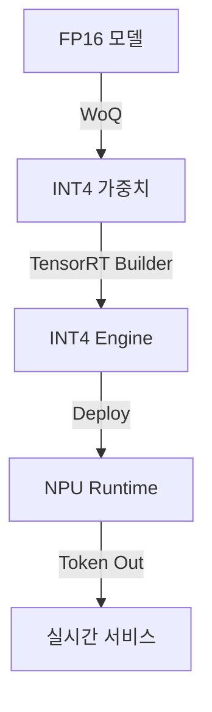

# 실시간·경량 추론 (TensorRT INT4, NPU)

## 1. 핵심 개념 (Core Concept)

TensorRT INT4 양자화와 스마트폰·PC SoC에 내장된 NPU(Neural Processing Unit)는 **메모리 대역폭과 연산량을 최대 4‑8× 줄이면서도 밀리초급 지연으로 딥러닝 추론을 수행**하도록 설계됨. INT4는 가중치를 4‑비트로 압축해 모델 크기를 75 % 이상 감소시키고, NPU는 행렬‑벡터 연산에 최적화된 저전력 MAC array를 제공해 배터리 소모 없이 실시간 애플리케이션을 가능케 함. ([developer.nvidia.com](https://developer.nvidia.com/blog/nvidia-tensorrt-10-0-upgrades-usability-performance-and-ai-model-support/), [arxiv.org](https://arxiv.org/pdf/2301.12017))

______________________________________________________________________

## 2. 상세 설명 (Detailed Explanation)

### 2.1 TensorRT INT4 파이프라인

- **Weight‑Only Quantization(WoQ)**: TensorRT 10에서 INT4 WoQ와 블록 양자화가 공식 지원돼 메모리 병목이 큰 GEMM 레이어의 메모리 트래픽을 최대 2× 절감함. ([developer.nvidia.com](https://developer.nvidia.com/blog/nvidia-tensorrt-10-0-upgrades-usability-performance-and-ai-model-support/))

- **지원 타입**: TensorRT는 INT4, FP8, FP4를 포함한 저정밀 포맷을 명시적(Explicit) 그래프에 매핑해 연산 정확도를 유지한다. ([docs.nvidia.com](https://docs.nvidia.com/deeplearning/tensorrt/latest/inference-library/work-quantized-types.html))

- **INT4 AWQ + FP8 실행**: TensorRT‑LLM은 Activation‑aware Weight Quantization으로 Llama‑2 70B·Falcon‑180B를 단일 H200 GPU에서 구동, 최대 6.7× 토큰 처리량을 달성함. ([developer.nvidia.com](https://developer.nvidia.com/blog/nvidia-tensorrt-llm-enhancements-deliver-massive-large-language-model-speedups-on-nvidia-h200/))

- **PTQ & QAT 워크플로**: TensorRT Model Optimizer와 NeMo 툴체인은 INT4 AWQ·SmoothQuant PTQ, 그리고 4‑bit QAT를 지원해 학습 재비용 없이 정확도 손실 \< 1 % 수준을 유지한다. ([developer.nvidia.com](https://developer.nvidia.com/blog/post-training-quantization-of-llms-with-nvidia-nemo-and-nvidia-tensorrt-model-optimizer/))

### 2.2 NPU 아키텍처 및 성능 지표

| SoC                           | NPU TOPS\* | 특이점                       | 대표 지연                      | 비고                                                                                                                                                                                                                                           |
| ----------------------------- | ---------- | ---------------------------- | ------------------------------ | ---------------------------------------------------------------------------------------------------------------------------------------------------------------------------------------------------------------------------------------------- |
| **Snapdragon X Elite**        | 45 TOPS    | Hexagon VX ‑ INT4/INT8 ISA   | 이미지 20장 \< 20 초 생성 데모 | Copilot+ 요구 사양 충족 ([anandtech.com](https://www.anandtech.com/show/21445/qualcomm-snapdragon-x-architecture-deep-dive))                                                                                                                   |
| **Intel Core Ultra Series 2** | 48 TOPS    | Xe‑Link NPU, OpenVINO 런타임 | Dynamo AI 가드레일 \< 10 ms    | 5.18× Ryzen 대비 추론 가속 ([intel.com](https://www.intel.com/content/www/us/en/ai-pc/business-showcase.html), [edc.intel.com](https://edc.intel.com/content/www/us/en/products/performance/benchmarks/intel-core-ultra-processors-series-2/)) |
| **Apple M1 Max ANE**          | 18 TOPS    | 16‑core ANE, Unified Memory  | Llama‑3.1‑8B 33 tokens/s       | Core ML 최적화 가이드 ([machinelearning.apple.com](https://machinelearning.apple.com/research/core-ml-on-device-llama))                                                                                                                        |
| **Samsung Exynos 2400**       | 45 TOPS    | 5‑core NPU v3                | 실시간 비전 \< 30 ms           | 4 nm LP node ([semiconductor.samsung.com](https://semiconductor.samsung.com/processor/mobile-processor/exynos-2400/))                                                                                                                          |

\*TOPS(Trillions Of Operations Per Second)는 INT8 기준 지표이며, INT4 실행 시 연산량이 절반이므로 실효 TOPS는 2× 올라감.

### 2.3 INT4 + NPU 시너지

- **지연·전력 대비 효율**: Edge AI 벤치마크 연구에서 CPU/GPU 대비 NPU가 행렬‑벡터 연산에서 **58.6 % 낮은 지연**과 **3.2× 빠른 비디오 분류**를 달성, 배터리 소모를 크게 절감함. ([arxiv.org](https://arxiv.org/abs/2409.14803))

- **온‑디바이스 GenAI 확장성**: Intel 백서에 따르면 로컬 LLM 토큰화‑디코딩을 NPU로 오프로드해 프라이버시·오프라인 동작을 보장하면서 클라우드 비용을 절감할 수 있음. ([intel.com](https://www.intel.com/content/dam/www/central-libraries/us/en/documents/2025-03/decentralizing-generative-ai-inference-on-device-white-paper.pdf))

- **실제 한계**: Jetson AGX Orin 포럼 사례에서 INT4 Bits‑and‑Bytes 로드 시 GPU Util 99 %를 달성하지 못해 토큰/s가 감소, **하드웨어·커널 최적화가 필수**임을 보여줌. ([forums.developer.nvidia.com](https://forums.developer.nvidia.com/t/int8-and-int4-performance-on-orin-agx/321900))



______________________________________________________________________

## 3. 예시 (Example)

### 코드 예시 (Python)

```python
# TensorRT INT4 Weight‑Only Quantization
import tensorrt as trt
from polygraphy.backend.onnx import parse

builder = trt.Builder(trt.Logger.INFO)
config = builder.create_builder_config()
config.set_flag(trt.BuilderFlag.INT8)  # INT4 WoQ is enabled under INT8 flag
config.set_memory_pool_limit(trt.MemoryPoolType.WORKSPACE, 2 << 30)
config.set_quantization_flag(trt.QuantizationFlag.WEIGHT_ONLY_QUANTIZATION)
config.set_quantization_precision(trt.DataType.INT4)

network = builder.create_network(1 << int(trt.NetworkDefinitionCreationFlag.EXPLICIT_BATCH))
parser = trt.OnnxParser(network, trt.Logger.INFO)
with open("model.onnx", "rb") as f:
    parser.parse(f.read())
engine = builder.build_engine(network, config)
```

```python
# OpenVINO + Intel NPU (AUTO‑NPU 우선)
from openvino.runtime import Core
ie = Core()
model = ie.read_model("model.xml")
compiled = ie.compile_model(model, "AUTO:NPU,CPU")  # NPU 우선, CPU 폴백
res = compiled([input_int4])[0]
```

### 사용 사례 (Use Case)

- **Copilot+ PC 이미지 생성 데모**: Snapdragon X Elite 노트북이 45 TOPS NPU만으로 20 종 이미지를 20 초 이내 생성, 팬리스 상태에서도 실시간 UX 제공. ([x.com](https://x.com/Snapdragon/status/1803472926726918176?lang=en&utm_source=chatgpt.com))

- **Dynamo AI 실시간 가드레일**: Core Ultra‑2 NPU에서 \< 10 ms 내 민감 정보 필터링, 클라우드 호출 없는 개인정보 보호 시나리오. ([intel.com](https://www.intel.com/content/www/us/en/ai-pc/business-showcase.html))

______________________________________________________________________

## 4. 예상 면접 질문 (Potential Interview Questions)

- **Q. INT4 WoQ가 INT8 PTQ 대비 유리한 상황은?**

  - **A.** 메모리 대역폭이 모델 병목인 LLM GEMM 레이어에서 INT4 WoQ가 50 % 더 낮은 DRAM 트래픽을 제공, H200 GPU 기준 6.7× 토큰 처리량을 달성한다. ([developer.nvidia.com](https://developer.nvidia.com/blog/nvidia-tensorrt-llm-enhancements-deliver-massive-large-language-model-speedups-on-nvidia-h200/))

- **Q. NPU가 GPU보다 지연을 줄이는 이유는?**

  - **A.** NPU는 행렬‑벡터 MAC array와 온칩 SRAM 캐시로 인스트럭션 fetch·메모리 이동을 최소화해, Edge AI 벤치마크에서 GPU 대비 58 % 지연을 줄였다. ([arxiv.org](https://arxiv.org/abs/2409.14803))

- **Q. TOPS 수치만으로 NPU 성능을 판단할 수 없는 이유는?**

  - **A.** TOPS는 최적 조건의 정수 행렬 곱 기준 이론치로, 실제 워크로드는 메모리·연산 혼합도에 따라 활용도(U%)가 달라 실측 토큰/s와 비례하지 않는다. Jetson Orin 사례처럼 INT4라도 커널이 최적화되지 않으면 속도가 떨어질 수 있다. ([forums.developer.nvidia.com](https://forums.developer.nvidia.com/t/int8-and-int4-performance-on-orin-agx/321900))

______________________________________________________________________

## 5. 더 읽어보기 (Further Reading)

- NVIDIA, _TensorRT 10.0 Release Highlights_ ([developer.nvidia.com](https://developer.nvidia.com/blog/nvidia-tensorrt-10-0-upgrades-usability-performance-and-ai-model-support/))

- NVIDIA, _Working with Quantized Types_ docs ([docs.nvidia.com](https://docs.nvidia.com/deeplearning/tensorrt/latest/inference-library/work-quantized-types.html))

- Xiaoxia Wu et al., _Understanding INT4 Quantization for Language Models_ (2023) ([arxiv.org](https://arxiv.org/pdf/2301.12017))

- Intel, _Decentralizing GenAI Inference On‑Device_ White Paper (2025) ([intel.com](https://www.intel.com/content/dam/www/central-libraries/us/en/documents/2025-03/decentralizing-generative-ai-inference-on-device-white-paper.pdf))

- Rakshith Jayanth et al., _Benchmarking Edge AI Platforms_ (2024) ([arxiv.org](https://arxiv.org/abs/2409.14803))

- Apple, _On‑Device Llama with Core ML_ (2024) ([machinelearning.apple.com](https://machinelearning.apple.com/research/core-ml-on-device-llama))

- AnandTech, _Snapdragon X Architecture Deep Dive_ (2024) ([anandtech.com](https://www.anandtech.com/show/21445/qualcomm-snapdragon-x-architecture-deep-dive))
