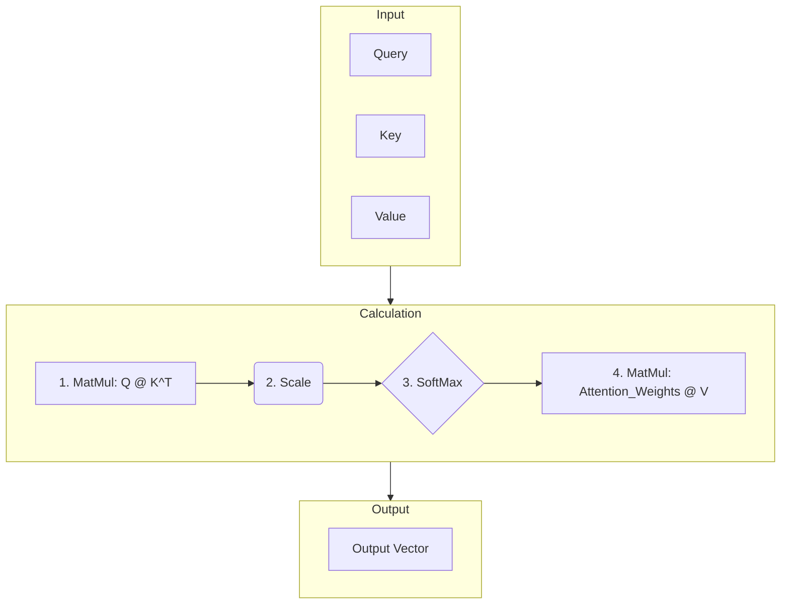
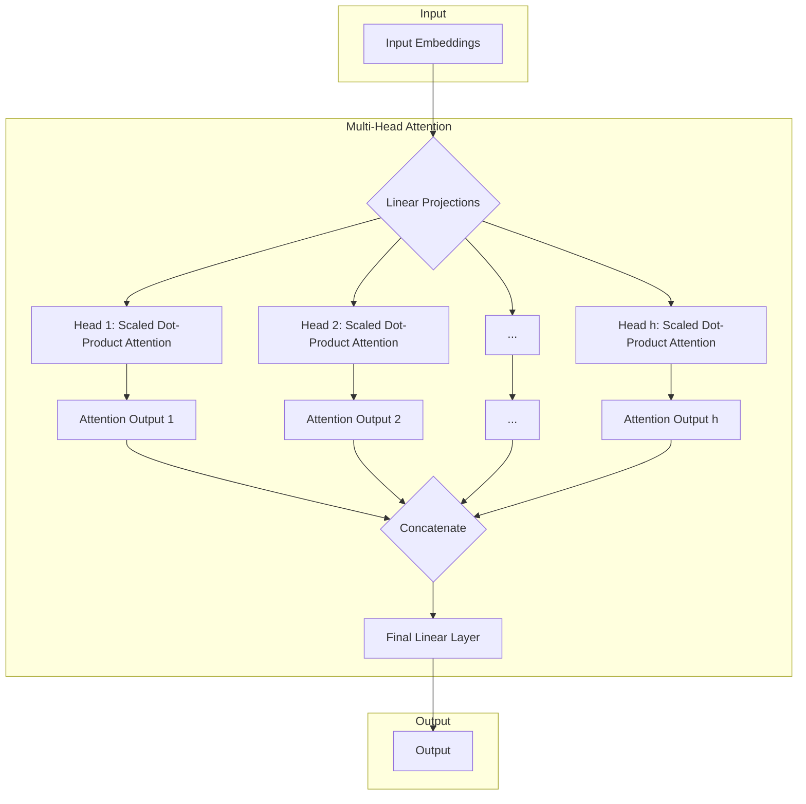

# 어텐션 메커니즘 심층 분석 (Attention Mechanism Deep Dive)

## 1. 핵심 개념 (Core Concept)

어텐션 메커니즘은 모델이 시퀀스 데이터 내의 특정 요소에 집중하여 나머지 부분을 처리하도록 하는 신경망 기술입니다. 트랜스포머 모델의 핵심 구성 요소로서, 각 단어의 표현을 계산할 때 문장 내 모든 단어와의 관계를 동적으로 고려하여 문맥을 효과적으로 파악합니다. 이를 통해 RNN의 순차적 처리 한계를 극복하고 병렬 처리를 가능하게 하여 긴 의존성 문제를 해결했습니다.

---

## 2. 상세 설명 (Detailed Explanation)

### 2.1 Scaled Dot-Product Attention

트랜스포머에서 사용되는 가장 기본적인 어텐션 형태로, **Query(Q)**, **Key(K)**, **Value(V)** 세 가지 벡터를 사용합니다.

1.  **Query**: 현재 처리 중인 단어의 벡터. 다른 단어들과의 관련성을 측정하는 주체.
2.  **Key**: 문장 내 모든 단어의 벡터. Query와의 유사도를 계산하기 위한 "라벨" 역할.
3.  **Value**: 문장 내 모든 단어의 벡터. 최종 결과에 반영될 "실제 내용" 역할.

계산 과정은 다음과 같습니다.



**수식:**
$$ \text{Attention}(Q, K, V) = \text{softmax}\left(\frac{QK^T}{\sqrt{d_k}}\right)V $$

*   **$QK^T$**: Query와 Key의 내적(dot product)을 통해 유사도 점수(Attention Score)를 계산합니다.
*   **$\sqrt{d_k}$**: Key 벡터의 차원($d_k$)의 제곱근으로 나누어 스케일링합니다. 이는 내적 값이 너무 커져 소프트맥스 함수의 기울기가 0에 가까워지는 것을 방지하여 학습 안정성을 높입니다. (Vanishing Gradient 방지)
*   **Softmax**: 계산된 점수에 소프트맥스 함수를 적용하여 합이 1인 확률 분포, 즉 **어텐션 가중치(Attention Weights)**를 얻습니다.
*   **$V$**: 이 가중치를 Value 벡터에 곱하여 가중합을 구하고, 문맥 정보가 풍부하게 반영된 최종 출력 벡터를 생성합니다.

### 2.2 Multi-Head Attention

Scaled Dot-Product Attention을 한 번만 수행하는 대신, 여러 개의 "헤드"로 나누어 병렬적으로 수행하는 방식입니다.

1.  **분할 (Split)**: $d_{model}$ 차원의 Q, K, V 벡터를 $h$개의 헤드로 나눕니다. 각 헤드는 $d_k = d_v = d_{model}/h$ 차원을 갖는 Q', K', V'를 가집니다.
2.  **병렬 어텐션 (Parallel Attention)**: 각 헤드에서 독립적으로 Scaled Dot-Product Attention을 수행합니다.
3.  **결합 (Concatenate)**: 각 헤드에서 나온 출력 벡터들을 모두 연결합니다.
4.  **선형 변환 (Linear Projection)**: 연결된 벡터에 추가적인 가중치 행렬($W^O$)을 곱하여 최종 출력 벡터를 얻습니다.

이를 통해 모델은 각 헤드마다 다른 종류의 관계(예: 구문적 관계, 의미적 관계 등)를 학습하고, 다양한 관점에서 정보의 상호작용을 포착할 수 있습니다.



---

## 3. 예시 (Example)

### 코드 예시 (Python with PyTorch)

```python
import torch
import torch.nn as nn
import torch.nn.functional as F
import math

class ScaledDotProductAttention(nn.Module):
    def forward(self, query, key, value, mask=None):
        d_k = key.size(-1)
        scores = torch.matmul(query, key.transpose(-2, -1)) / math.sqrt(d_k)

        if mask is not None:
            scores = scores.masked_fill(mask == 0, -1e9)

        attention_weights = F.softmax(scores, dim=-1)
        output = torch.matmul(attention_weights, value)
        return output, attention_weights

class MultiHeadAttention(nn.Module):
    def __init__(self, d_model, h):
        super().__init__()
        self.d_model = d_model
        self.h = h
        self.d_k = d_model // h

        self.W_q = nn.Linear(d_model, d_model)
        self.W_k = nn.Linear(d_model, d_model)
        self.W_v = nn.Linear(d_model, d_model)
        self.W_o = nn.Linear(d_model, d_model)

        self.attention = ScaledDotProductAttention()

    def forward(self, query, key, value, mask=None):
        batch_size = query.size(0)

        # 1. Linear projections & split into h heads
        q_s = self.W_q(query).view(batch_size, -1, self.h, self.d_k).transpose(1, 2)
        k_s = self.W_k(key).view(batch_size, -1, self.h, self.d_k).transpose(1, 2)
        v_s = self.W_v(value).view(batch_size, -1, self.h, self.d_k).transpose(1, 2)

        # 2. Apply attention on all the projected vectors in batch.
        x, attn = self.attention(q_s, k_s, v_s, mask=mask)

        # 3. Concatenate & apply final linear layer
        x = x.transpose(1, 2).contiguous().view(batch_size, -1, self.d_model)
        return self.W_o(x)

# Example Usage
d_model = 512
h = 8
batch_size = 64
seq_length = 10

mha = MultiHeadAttention(d_model, h)
q = torch.randn(batch_size, seq_length, d_model) # (batch, seq_len, d_model)
k = torch.randn(batch_size, seq_length, d_model)
v = torch.randn(batch_size, seq_length, d_model)

output = mha(q, k, v)
print(output.shape) # torch.Size([64, 10, 512])
```

---

## 4. 예상 면접 질문 (Potential Interview Questions)

*   **Q. 어텐션 수식에서 $\sqrt{d_k}$로 나누어주는 이유는 무엇인가요?**
    *   **A.** $d_k$ (Key 벡터의 차원)가 커질수록 $QK^T$ 내적 값의 분산이 커지게 됩니다. 이로 인해 소프트맥스 함수의 입력값이 극단적인 값(0 또는 1에 가까운)을 갖게 되어 기울기가 거의 0이 되는 'Vanishing Gradient' 문제가 발생할 수 있습니다. $\sqrt{d_k}$로 나누어 줌으로써 입력값의 분산을 1로 유지하여 안정적인 학습을 가능하게 합니다.

*   **Q. Multi-Head Attention을 사용하는 이유는 무엇인가요?**
    *   **A.** 단일 어텐션만 사용하면 모델이 한 가지 종류의 관계에만 집중하게 될 수 있습니다. Multi-Head Attention은 여러 개의 독립적인 어텐션 '헤드'를 병렬로 사용하여, 각 헤드가 서로 다른 관점(예: 단기 의존성, 장기 의존성, 특정 구문/의미 관계 등)에서 정보의 관계를 학습하도록 합니다. 이를 통해 더 풍부하고 다각적인 문맥 표현을 학습할 수 있습니다.

*   **Q. Self-Attention과 기존 RNN/LSTM의 차이점은 무엇인가요?**
    *   **A.** 가장 큰 차이점은 데이터 처리 방식입니다. RNN/LSTM은 단어를 순차적으로 하나씩 처리하여 이전 시점의 정보(Hidden State)를 다음 시점으로 넘겨주는 방식이라 긴 시퀀스에서 정보 손실이 발생하고 병렬화가 어렵습니다. 반면, Self-Attention은 시퀀스 내 모든 단어를 한 번에 고려하여 단어 간의 관계를 직접 계산하므로 병렬 처리가 가능하고, 거리에 상관없이 단어 간의 의존성을 효과적으로 포착할 수 있습니다.

---

## 5. 더 읽어보기 (Further Reading)

*   [Attention Is All You Need (원 논문)](https://arxiv.org/abs/1706.03762)
*   [The Illustrated Transformer (Jay Alammar)](http://jalammar.github.io/illustrated-transformer/)
*   [The Annotated Transformer (Harvard NLP)](https://nlp.seas.harvard.edu/2018/04/03/attention.html)