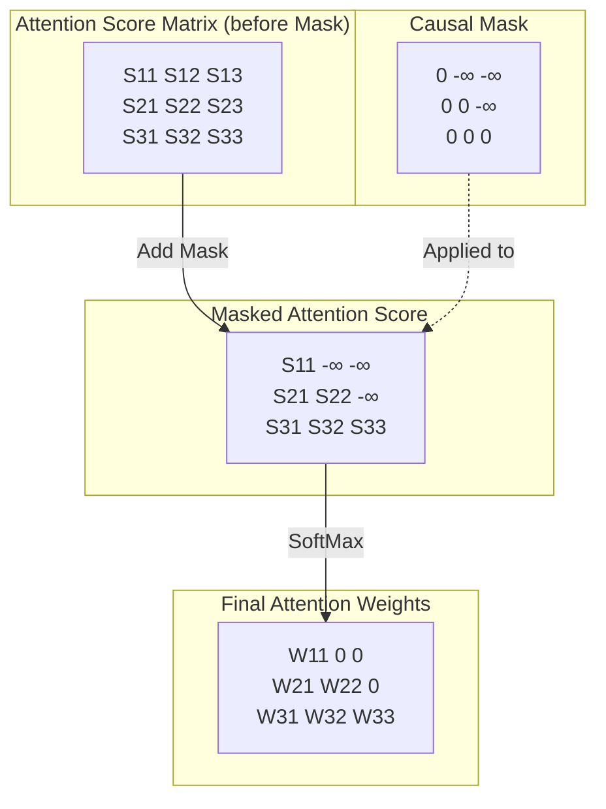

# Causal Masking & 위치 인코딩 재조명

## 1. 핵심 개념 (Core Concept)

트랜스포머는 단어의 순서를 처리하기 위해 **위치 인코딩(Positional Encoding)**을 사용하여 토큰의 순서 정보를 주입하고, 디코더가 미래의 토큰을 미리 볼 수 없도록 **Causal Masking**을 사용하여 자기회귀(auto-regressive)적인 생성을 가능하게 합니다. 이 두 가지는 트랜스포머가 순차적 데이터를 효과적으로 처리하기 위한 필수적인 장치입니다.

---

## 2. 상세 설명 (Detailed Explanation)

### 2.1 위치 인코딩 (Positional Encoding)

**문제점**: 트랜스포머의 Self-Attention 메커니즘은 입력 시퀀스 내 모든 토큰을 한 번에 병렬로 처리합니다. 이 구조는 계산 효율성을 높이지만, "나는 고양이이고 너는 사람이다"와 "나는 사람이고 너는 고양이다"를 구분하지 못하는, 즉 **단어의 순서 정보를 파악하지 못하는** 근본적인 한계를 가집니다.

**해결책**: 입력 임베딩에 각 토큰의 위치 정보를 담은 **위치 인코딩 벡터**를 더해줍니다. 이를 통해 모델은 단어의 의미뿐만 아니라 시퀀스 내에서의 상대적 또는 절대적 위치 정보까지 함께 학습할 수 있습니다.

**방법 (Sinusoidal Positional Encoding)**:
"Attention Is All You Need" 논문에서 제안된 방식은 사인(sine)과 코사인(cosine) 함수를 사용합니다.

$$ PE_{(pos, 2i)} = \sin(pos / 10000^{2i/d_{\text{model}}}) $$
$$ PE_{(pos, 2i+1)} = \cos(pos / 10000^{2i/d_{\text{model}}}) $$

*   `pos`: 시퀀스 내 토큰의 위치 (0, 1, 2, ...)
*   `i`: 임베딩 벡터 내의 차원 인덱스 (0, 1, ..., $d_{\text{model}}/2$)
*   $d_{\text{model}}$: 모델의 임베딩 차원

이 방식은 각 위치마다 고유한 인코딩을 생성하며, 모델이 학습 데이터보다 긴 시퀀스에 대해서도 위치 정보를 추론할 수 있게 하고, 상대적 위치 정보를 쉽게 학습할 수 있다는 장점이 있습니다.

### 2.2 Causal Masking (Look-ahead Mask)

**목적**: 디코더에서 다음 단어를 예측할 때, **현재 예측하려는 위치 이후의 단어들을 참고할 수 없도록** 정보를 가리는 역할을 합니다.

**작동 방식**: 자기회귀적인(auto-regressive) 언어 모델은 이전 단어들을 기반으로 다음 단어를 순차적으로 생성합니다. 학습 과정에서 디코더는 전체 목표 시퀀스를 입력으로 받지만, `t` 시점의 단어를 예측할 때는 `t` 시점 이전의 단어들만 사용해야 합니다. 만약 미래의 정답을 미리 보게 되면, 모델은 의미 있는 언어 패턴을 학습하는 대신 단순히 다음 단어를 복사하는 방식으로 "치팅(cheating)"하게 됩니다.

Causal Mask는 어텐션 스코어 행렬에 적용되는 상삼각행렬(upper triangular matrix) 형태의 마스크입니다. 대각선 위쪽, 즉 미래 시점의 위치에 해당하는 값들을 매우 작은 값(-infinity)으로 만들어 소프트맥스 함수를 통과했을 때 해당 위치의 어텐션 가중치가 0에 가깝게 되도록 만듭니다.



이 마스크 덕분에 각 위치의 출력은 오직 이전 위치들의 정보에만 의존하게 되어, 모델이 올바르게 자기회귀적으로 학습하고 생성할 수 있습니다.

---

## 3. 예시 (Example)

### 코드 예시 (PyTorch)

```python
import torch
import torch.nn as nn
import math

# Positional Encoding
class PositionalEncoding(nn.Module):
    def __init__(self, d_model, max_len=5000):
        super(PositionalEncoding, self).__init__()
        pe = torch.zeros(max_len, d_model)
        position = torch.arange(0, max_len, dtype=torch.float).unsqueeze(1)
        div_term = torch.exp(torch.arange(0, d_model, 2).float() * (-math.log(10000.0) / d_model))
        pe[:, 0::2] = torch.sin(position * div_term)
        pe[:, 1::2] = torch.cos(position * div_term)
        pe = pe.unsqueeze(0).transpose(0, 1)
        self.register_buffer('pe', pe)

    def forward(self, x):
        # x: [seq_len, batch_size, d_model]
        x = x + self.pe[:x.size(0), :]
        return x

# Causal Masking Example within Attention
def subsequent_mask(size):
    """Mask out subsequent positions."""
    attn_shape = (1, size, size)
    mask = torch.triu(torch.ones(attn_shape), diagonal=1).type(torch.uint8)
    return mask == 0

# Example Usage
seq_len = 5
mask = subsequent_mask(seq_len)
print("Causal Mask (size=5):")
print(mask)
# tensor([[[ True, False, False, False, False],
#          [ True,  True, False, False, False],
#          [ True,  True,  True, False, False],
#          [ True,  True,  True,  True, False],
#          [ True,  True,  True,  True,  True]]])

# In an attention calculation, you would apply this mask:
scores = torch.randn(1, seq_len, seq_len)
print("\nOriginal Scores:\n", scores)
scores = scores.masked_fill(mask == 0, -1e9)
print("\nMasked Scores:\n", scores)
```

---

## 4. 예상 면접 질문 (Potential Interview Questions)

*   **Q. 트랜스포머에서 위치 인코딩이 왜 필요한가요? 다른 방법은 없나요?**
    *   **A.** 트랜스포머의 Self-Attention은 입력 토큰을 집합(set)으로 처리하기 때문에 순서 정보가 없습니다. 위치 인코딩은 각 토큰의 위치 정보를 모델에 알려주어 순서를 학습할 수 있도록 합니다. 사인/코사인 함수 방식 외에도, 각 위치에 대한 임베딩을 학습시키는 **학습 가능한 위치 임베딩(Learned Positional Embeddings)** 방식도 널리 사용됩니다. (e.g., BERT, GPT-2)

*   **Q. Causal Masking은 트랜스포머의 인코더와 디코더 중 어디에 사용되며, 그 이유는 무엇인가요?**
    *   **A.** Causal Masking은 주로 **디코더**의 Self-Attention 레이어에서 사용됩니다. 인코더는 입력 문장 전체의 문맥을 양방향으로 이해하는 것이 목표이므로 모든 단어를 참고할 수 있어야 합니다. 반면, 디코더는 다음 단어를 예측하는 자기회귀적인 작업을 수행하므로, 예측 시점 이후의 정답을 미리 보지 못하도록 Causal Masking이 필수적입니다.

*   **Q. 위치 인코딩을 입력 임베딩에 더해주는(add) 이유는 무엇인가요?**
    *   **A.** 더하기 연산은 정보의 결합을 유연하게 만듭니다. Self-Attention 메커니즘 내에서 선형 변환(Linear Projections)이 수행될 때, 모델은 필요에 따라 위치 정보와 토큰 의미 정보를 선형적으로 조합하여 사용할 수 있습니다. 만약 연결(concatenation)을 사용한다면 모델의 파라미터 수가 증가하고, 특정 방식으로만 정보를 결합하도록 강제될 수 있습니다. 더하기는 모델이 두 정보 소스를 효과적으로 통합하여 학습할 수 있는 간단하면서도 강력한 방법입니다.

---

## 5. 더 읽어보기 (Further Reading)

*   [Transformer: A Novel Neural Network Architecture for Language Understanding (Google AI Blog)](https://ai.googleblog.com/2017/08/transformer-novel-neural-network.html)
*   [The Illustrated Transformer (Jay Alammar)](http://jalammar.github.io/illustrated-transformer/)
*   [Positional Encoding in Transformers (by Amirhossein Kazemnejad)](https://kazemnejad.com/blog/transformer_architecture_positional_encoding/)