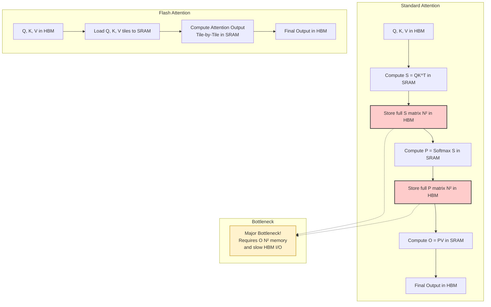

# 메모리·속도 최적화 (KV-Cache, Flash-Attention)

## 1. 핵심 개념 (Core Concept)

트랜스포머 모델의 추론(inference) 과정은 상당한 계산량과 메모리를 요구합니다. **KV-Cache**는 이전 계산 결과를 재사용하여 추론 속도를 높이는 기법이며, **Flash-Attention**은 어텐션 계산 자체의 메모리 사용량과 속도를 최적화하는 알고리즘입니다. 이 두 기술은 LLM 서빙의 핵심 최적화 기법으로, 더 빠르고 긴 컨텍스트를 처리할 수 있게 만듭니다.

---

## 2. 상세 설명 (Detailed Explanation)

### 2.1 KV-Cache: 중복 계산을 제거하는 영리한 캐싱

**문제점**: 트랜스포머의 자기회귀적(auto-regressive) 텍스트 생성 과정에서는 매번 새로운 토큰을 생성할 때마다, **전체 시퀀스**에 대한 Key(K)와 Value(V) 벡터를 다시 계산해야 합니다. 예를 들어, 100번째 토큰을 생성하기 위해 이전 99개의 토큰에 대한 K, V를 계산하고, 101번째 토큰을 생성할 때 또다시 이전 100개 토큰에 대한 K, V를 계산하는 것은 엄청난 낭비입니다.

**해결책**: **KV-Cache**는 이전에 계산된 각 트랜스포머 레이어의 Key와 Value 벡터들을 GPU 메모리(SRAM)에 저장(caching)해 둡니다. 다음 토큰을 생성할 때는, 새로 입력된 토큰에 대한 K, V 벡터만 계산하여 기존 캐시에 추가(append)하기만 하면 됩니다. 이를 통해 중복 계산을 완전히 제거하여 추론 속도를 획기적으로 개선합니다.

**과정:**
1.  **Prefill 단계**: 사용자가 입력한 프롬프트(초기 시퀀스)에 대한 K, V 벡터를 모두 계산하여 KV-Cache에 저장합니다.
2.  **Decoding 단계**: 새로운 토큰이 하나씩 생성될 때마다, 해당 토큰에 대한 K, V만 계산하여 캐시에 추가하고, 전체 캐시를 사용하여 어텐션을 계산합니다.

**트레이드오프**: 추론 속도는 매우 빨라지지만, 시퀀스 길이가 길어질수록 캐시를 저장하기 위한 메모리 사용량이 선형적으로 증가($O(L \cdot d)$)하는 단점이 있습니다.

### 2.2 Flash-Attention: I/O를 최적화한 어텐션 알고리즘

**문제점**: 표준 어텐션 메커니즘은 계산 과정에서 시퀀스 길이(N)에 제곱($N^2$)으로 비례하는 거대한 **어텐션 스코어 행렬**($N \times N$)을 GPU의 주 메모리(HBM, High Bandwidth Memory)에 저장해야 합니다. HBM은 용량이 크지만 SRAM보다 훨씬 느립니다. 이로 인해 실제 계산(FLOPs)보다 GPU 메모리(HBM)와 연산 유닛(SRAM) 간의 데이터 이동(I/O)에서 병목이 발생하며, 긴 시퀀스에서는 메모리 부족(Out of Memory) 문제를 야기합니다.

**해결책**: **Flash-Attention**은 어텐션 행렬 전체를 HBM에 저장하지 않고, 입력 Q, K, V를 작은 블록(tile)으로 나누어 GPU의 매우 빠른 **SRAM**으로 가져와 계산을 수행합니다. 전체 행렬을 만들지 않고도 최종 결과를 계산할 수 있도록 **Tiling**과 **Recomputation** 기법을 사용합니다.

1.  **Tiling**: Q, K, V 행렬을 작은 블록으로 나눕니다.
2.  **SRAM 계산**: K, V 블록을 SRAM으로 로드하고, Q 블록을 순회하며 SRAM 내에서 어텐션 계산을 수행합니다. 중간 결과물은 HBM에 저장하지 않습니다.
3.  **Recomputation**: 역전파(backward pass) 시에는 순전파(forward pass)에서 저장하지 않았던 어텐션 행렬을 SRAM에서 다시 계산하여 그래디언트를 계산합니다. 이는 HBM I/O보다 훨씬 빠릅니다.

**효과**: 메모리 I/O를 최소화하여 **계산 속도를 크게 향상**시키고, 메모리 사용량을 시퀀스 길이에 대해 $O(N^2)$에서 $O(N)$으로 줄여 **더 긴 컨텍스트를 처리**할 수 있게 합니다. 중요한 점은, 근사(approximation)가 아닌 **정확한(exact) 어텐션** 계산을 수행한다는 것입니다.

---

## 3. 예시 (Example)

### 사용 사례 (Use Case)

*   **긴 문서 요약/질의응답**: 수만 토큰에 달하는 긴 문서를 입력으로 받아 처리해야 할 때, Flash-Attention은 OOM(Out of Memory) 오류 없이 긴 컨텍스트를 처리할 수 있게 해줍니다.
*   **실시간 챗봇 서비스**: 사용자의 입력에 빠르게 응답해야 하는 챗봇 서비스에서, KV-Cache는 새로운 토큰 생성 속도를 극대화하여 지연 시간(latency)을 줄여줍니다.
*   **코드 생성**: 수천 줄의 코드 컨텍스트를 이해하고 다음 코드를 생성해야 할 때, 두 기술의 조합은 필수적입니다.

---

## 4. 예상 면접 질문 (Potential Interview Questions)

*   **Q. KV-Cache의 장점과 단점은 무엇인가요?**
    *   **A.** **장점**은 자기회귀적 추론 시 중복 계산을 제거하여 다음 토큰 생성 속도를 크게 향상시킨다는 것입니다. **단점**은 시퀀스 길이가 길어질수록 캐시를 저장하기 위한 메모리 사용량이 선형적으로 증가하여 긴 컨텍스트 처리 시 메모리 병목이 될 수 있다는 점입니다.

*   **Q. Flash-Attention이 표준 어텐션보다 빠른 이유는 무엇인가요? 메모리 I/O 관점에서 설명해주세요.**
    *   **A.** 표준 어텐션은 $N \times N$ 크기의 거대한 어텐션 행렬을 느린 HBM에 쓰고 읽는 과정에서 심각한 I/O 병목이 발생합니다. Flash-Attention은 Tiling 기법을 사용해 작은 데이터 블록들을 빠른 SRAM으로 가져와 계산을 수행하고, 전체 중간 행렬을 HBM에 저장하지 않습니다. 즉, 느린 메모리(HBM)와의 데이터 교환을 최소화하고, 빠른 메모리(SRAM) 내에서 계산을 집중적으로 수행하여 I/O 병목을 해결하고 GPU의 연산 유닛을 최대한 활용하기 때문에 더 빠릅니다.

*   **Q. Flash-Attention은 근사(approximation) 기법인가요?**
    *   **A.** 아닙니다. Flash-Attention은 계산 순서와 메모리 접근 방식을 최적화했을 뿐, 수학적으로는 표준 어텐션과 동일한 결과를 내는 **정확한(exact) 어텐션** 알고리즘입니다. 이는 모델의 성능 저하 없이 속도와 메모리 효율을 얻을 수 있다는 점에서 매우 중요한 장점입니다.

*   **Q. KV-Cache와 Flash-Attention은 함께 사용될 수 있나요? 그렇다면 어떤 시너지 효과가 있나요?**
    *   **A.** 네, 함께 사용되며 시너지 효과가 매우 큽니다. KV-Cache는 추론 과정에서 **전체 계산량 자체를 줄여주고**, Flash-Attention은 남아있는 **어텐션 계산 단계를 더 빠르고 메모리 효율적으로** 만들어줍니다. 즉, KV-Cache가 불필요한 연산을 제거하면, Flash-Attention은 그 나머지 필수적인 연산을 최적화하여 처리하는 방식으로 상호 보완적으로 작동하여 LLM 서빙 효율을 극대화합니다.

---

## 5. 더 읽어보기 (Further Reading)

*   [FlashAttention: Fast and Memory-Efficient Exact Attention with IO-Awareness (원 논문)](https://arxiv.org/abs/2205.14135)
*   [FlashAttention-2: Faster Attention with Better Parallelism and Work Partitioning (원 논문)](https://arxiv.org/abs/2307.08691)
*   [LLM Inference Explained - Ch. 2.3 KV Cache (Blog Post)](https://medium.com/@joaolages/llm-inference-explained-kv-cache-aab6417b3f25)