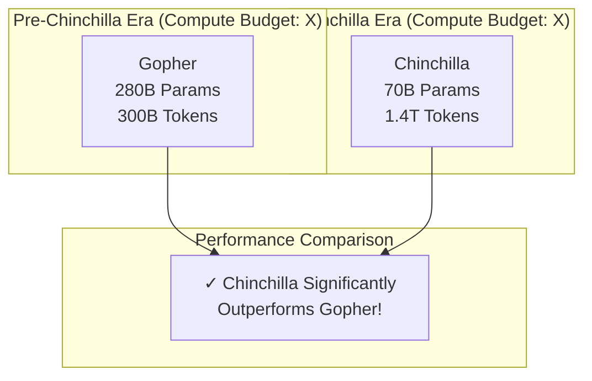

# 스케일링 법칙 & 친칠라의 교훈

## 1. 핵심 개념 (Core Concept)

스케일링 법칙(Scaling Laws)은 모델의 성능이 모델 크기(파라미터 수), 데이터셋 크기, 계산량(compute)과 어떻게 관련되는지를 설명하는 경험적 법칙입니다. 특히 DeepMind의 **친칠라(Chinchilla)** 연구는 기존의 통념을 뒤집고, 제한된 계산 예산 내에서 최적의 성능을 얻기 위해서는 모델 크기와 데이터셋 크기를 **균형 있게** 확장해야 한다는 새로운 패러다임을 제시했습니다.

---

## 2. 상세 설명 (Detailed Explanation)

### 2.1 기존의 스케일링 법칙 (Kaplan et al., 2020)

OpenAI의 Jared Kaplan 등이 2020년에 발표한 연구는 LLM 경쟁의 서막을 열었습니다. 이들의 연구 결과는 다음과 같이 요약됩니다.

*   모델 성능(Loss)은 모델 파라미터 수(N), 데이터셋 크기(D), 계산량(C)에 대해 부드러운 **멱함수(power-law)** 관계를 따른다.
*   성능 향상에 **모델 크기(N)가 데이터셋 크기(D)보다 훨씬 더 중요**하다.

이 연구의 영향으로, 당시 연구 트렌드는 데이터셋 크기는 약 3000억(300B) 토큰 정도로 고정한 채, 모델의 파라미터 수를 공격적으로 늘리는(e.g., GPT-3 175B) 방향으로 흘러갔습니다.

### 2.2 친칠라의 등장과 패러다임 전환 (Hoffmann et al., 2022)

DeepMind 연구팀은 기존 스케일링 법칙에 의문을 품고, 70M부터 16B까지 다양한 크기의 모델 400개 이상을 5B에서 500B 토큰에 이르는 다양한 데이터셋으로 학습시키는 대규모 실험을 진행했습니다. 그 결과, 기존의 거대 모델들이 사실 **심각하게 언더트레이닝(undertrained)** 되었다는 결론을 내렸습니다.

**친칠라의 핵심 발견:**

> **최적의 성능을 위해서는, 모델 크기(N)와 데이터셋 크기(D)를 거의 동일한 비율로 함께 늘려야 한다.**

즉, 모델 파라미터를 2배 늘리면, 학습 데이터 토큰 수도 2배 늘리는 것이 가장 효율적이라는 것입니다. 이는 "모델 크기 만능주의"에 대한 정면 반박이었습니다.

**친칠라 모델 증명:**
이를 증명하기 위해, DeepMind는 기존의 Gopher(280B) 모델과 동일한 계산 예산을 사용하여 **Chinchilla(70B)** 모델을 학습시켰습니다. 친칠라는 Gopher보다 파라미터는 1/4 크기이지만, 학습 데이터는 4배 많은 1.4조(1.4T) 토큰을 사용했습니다.

**결과**: 모든 다운스트림 태스크에서 70B 친칠라가 280B Gopher, 175B GPT-3 등 훨씬 큰 모델들을 압도했습니다.

### 2.3 파라미터와 연산량(FLOPs)의 관계

LLM의 학습에 필요한 총 연산량(FLOPs)은 대략적으로 다음과 같이 추정할 수 있습니다.

$$ C \approx 6 \times N \times D $$

*   **C**: 총 계산량 (FLOPs)
*   **N**: 모델의 파라미터 수
*   **D**: 학습 데이터셋의 토큰 수

여기서 숫자 6은 순전파(forward pass)와 역전파(backward pass)를 포함한 대략적인 계수입니다. (순전파: $2N$, 역전파: $4N$)

친칠라의 법칙은 주어진 계산 예산 C에 대해, $N$과 $D$를 어떻게 배분해야 손실(Loss)을 최소화할 수 있는지에 대한 가이드를 제공합니다. 결론적으로 $N$과 $D$가 거의 비례해야 한다는 것입니다.

---

## 3. 예상 면접 질문 (Potential Interview Questions)

*   **Q. 친칠라(Chinchilla) 논문의 핵심 기여는 무엇인가요?**
    *   **A.** 친칠라 논문의 핵심 기여는 제한된 컴퓨팅 예산 하에서 최적의 LLM 성능을 달성하기 위해서는 모델 파라미터 수와 학습 데이터셋의 토큰 수를 **거의 1:1 비율로 함께 확장**해야 한다는 것을 실험적으로 밝혀낸 것입니다. 이는 기존의 모델 크기 확장에만 치중했던 패러다임을 바꾸고, 데이터의 양과 질의 중요성을 다시 한번 강조하는 계기가 되었습니다.

*   **Q. 같은 계산 예산이 주어졌을 때, 200B 파라미터 모델을 200B 토큰으로 학습시키는 것과 100B 파라미터 모델을 400B 토큰으로 학습시키는 것 중 어느 것이 더 나은 선택이며, 그 이유는 무엇인가요?**
    *   **A.** 친칠라의 스케일링 법칙에 따르면 **100B 파라미터 모델을 400B 토큰으로 학습시키는 것**이 더 나은 선택입니다. 친칠라 법칙은 파라미터와 토큰 수가 거의 비례해야 최적이라고 말합니다. 전자의 경우 토큰 수가 파라미터 수에 비해 부족하여 모델이 언더트레이닝될 가능성이 높습니다. 후자는 더 작은 모델을 더 많은 데이터로 충분히 학습시켜 더 나은 일반화 성능을 기대할 수 있습니다.

*   **Q. "Compute-optimal" 하다는 것은 무슨 의미인가요?**
    *   **A.** "Compute-optimal" 하다는 것은 주어진 총 계산량(FLOPs)을 사용하여 학습했을 때, 가장 낮은 손실(loss) 값을 달성하는 모델의 파라미터 수와 데이터셋 크기의 조합을 의미합니다. 즉, 가장 효율적으로 계산 자원을 사용하여 최고의 모델 성능을 이끌어내는 최적점을 뜻합니다.

*   **Q. 친칠라 이후 LLM 연구/개발 트렌드는 어떻게 바뀌었나요?**
    *   **A.** 친칠라 이후, 무작정 모델 크기만 키우는 경쟁에서 벗어나, 고품질의 대규모 학습 데이터를 확보하고 정제하는 것의 중요성이 크게 부각되었습니다. 또한, 주어진 모델 크기에 대해 "친칠라-최적(Chinchilla-optimal)" 수준의 충분한 데이터로 학습시키는 것이 표준적인 접근법으로 자리 잡았습니다. Llama, Mistral 같은 최신 고성능 모델들도 이러한 스케일링 법칙을 충실히 따르고 있습니다.

---

## 5. 더 읽어보기 (Further Reading)

*   [Training Compute-Optimal Large Language Models (Chinchilla Paper)](https://arxiv.org/abs/2203.15556)
*   [Scaling Laws for Neural Language Models (Kaplan et al.)](https://arxiv.org/abs/2001.08361)
*   [Chinchilla's wild implications (Blog Post)](https://www.lesswrong.com/posts/6Fpvch8RR29qSBYbN/chinchilla-s-wild-implications)