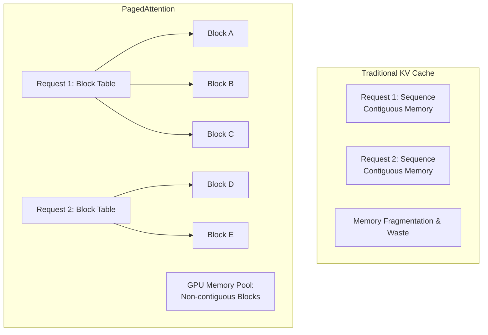

# KV 캐시 공유와 메모리 재사용 (KV-Cache Sharing & Memory Reuse)

## 1. 핵심 개념 (Core Concept)

KV 캐시 공유 및 메모리 재사용은 LLM 추론(Inference) 속도를 높이고 처리량(Throughput)을 극대화하기 위한 핵심적인 메모리 최적화 기술임. LLM의 다음 토큰 생성 과정에서, 이전에 계산된 Key(K)와 Value(V) 벡터를 **KV 캐시**에 저장하여 중복 계산을 피함. **PagedAttention**과 같은 기술을 통해 여러 요청 간에 이 KV 캐시를 효율적으로 공유하고 관리함으로써, GPU 메모리 사용량을 크게 줄이고 시스템 전체의 성능을 향상시킬 수 있음.

______________________________________________________________________

## 2. 상세 설명 (Detailed Explanation)

### 2.1 KV 캐시의 역할과 문제점

LLM이 텍스트를 생성하는 자기회귀(Autoregressive) 과정에서, 각 토큰을 생성할 때마다 이전의 모든 토큰에 대한 어텐션 계산이 필요함. 이때, 이전 토큰들의 Key와 Value 벡터는 변하지 않으므로, 이를 GPU 메모리(KV 캐시)에 저장해두고 재사용하면 다음 토큰을 예측하는 데 필요한 계산량을 크게 줄일 수 있음.

하지만 KV 캐시는 다음과 같은 심각한 메모리 비효율 문제를 야기함:

- **큰 메모리 사용량**: 시퀀스 길이가 길어질수록 KV 캐시의 크기는 선형적으로 증가함. (예: LLaMA-13B 모델에서 1개의 시퀀스를 처리하는 데 최대 1.7GB의 메모리가 필요)
- **메모리 파편화 (Fragmentation)**: 다양한 길이의 시퀀스를 처리할 때, 메모리 공간이 잘게 쪼개져 사용 가능한 메모리가 충분함에도 불구하고 새로운 요청을 받지 못하는 문제가 발생함.
- **중복 저장**: 여러 사용자가 동일한 프롬프트로 요청을 시작할 경우, 해당 프롬프트에 대한 KV 캐시가 모든 요청에 대해 중복으로 생성되어 메모리를 낭비함.

### 2.2 PagedAttention: 가상 메모리 기법의 도입

vLLM 프로젝트에서 제안된 PagedAttention은 운영체제의 가상 메모리(Virtual Memory)와 페이징(Paging) 개념에서 영감을 얻어 KV 캐시 문제를 해결함.

- **블록 단위 관리**: 연속적인 메모리 공간을 할당하는 대신, KV 캐시를 '블록(Block)'이라는 작은 단위로 나누어 비연속적인 메모리 공간에 저장함.
- **블록 테이블**: 각 시퀀스마다 '블록 테이블'을 두어, 논리적인 KV 캐시 블록이 물리적인 GPU 메모리의 어느 위치에 저장되어 있는지를 매핑함. 어텐션 계산 시, 이 테이블을 참조하여 필요한 블록을 가져옴.

### 2.3 KV 캐시 공유 (Cache Sharing)

PagedAttention을 사용하면 여러 요청 간에 KV 캐시를 효율적으로 공유할 수 있음. 특히 프롬프트 부분이 동일한 여러 요청이 들어올 때 효과적임.

1. **공유 감지**: 여러 요청이 동일한 프롬프트로 시작하면, 해당 프롬프트에 대한 KV 캐시 블록은 한 번만 계산됨.
1. **블록 테이블 매핑**: 각 요청의 블록 테이블이 물리적으로 동일한 KV 캐시 블록을 가리키도록 매핑함.
1. **Copy-on-Write**: 각 요청이 새로운 토큰을 생성하기 시작하면, 그때부터는 새로운 블록을 할당하여 독립적인 KV 캐시를 관리함. (운영체제의 Copy-on-Write 메커니즘과 유사)

이러한 공유 메커니즘을 통해 메모리 사용량을 최대 55%까지 절약하고, 처리량을 수십 배 향상시킬 수 있음.

______________________________________________________________________

## 3. 예시 (Example)

### 사용 사례: 다중 사용자 챗봇 서비스

수천 명의 사용자가 동시에 접속하는 챗봇 서비스를 운영하는 상황. 대부분의 사용자는 시스템이 미리 정해놓은 동일한 시작 프롬프트(예: "안녕하세요! 무엇을 도와드릴까요?")로 대화를 시작함.

- **기존 방식**: 1000개의 요청이 들어오면, 동일한 시작 프롬프트에 대한 KV 캐시가 1000번 중복 계산되고 저장되어 막대한 메모리를 낭비함.
- **PagedAttention 적용**: 시작 프롬프트에 대한 KV 캐시 블록은 단 한 번만 계산됨. 1000개의 요청은 모두 이 공유된 블록을 참조하여 첫 응답을 생성함. 이후 각 사용자의 대화가 갈라지면서부터 개별적인 블록이 할당됨. 이를 통해 동일한 하드웨어에서 훨씬 더 많은 동시 사용자를 처리할 수 있게 됨.

______________________________________________________________________

## 4. 예상 면접 질문 (Potential Interview Questions)

- **Q. LLM 추론에서 KV 캐시는 왜 사용되며, 어떤 문제점을 가지고 있나요?**

  - **A.** KV 캐시는 자기회귀적으로 토큰을 생성할 때, 이전 토큰들의 Key/Value 벡터를 저장하여 중복 계산을 피하고 추론 속도를 높이기 위해 사용됩니다. 하지만 시퀀스 길이에 따라 메모리 사용량이 선형적으로 증가하여 메모리 병목 현상을 일으키고, 메모리 파편화 및 중복 저장으로 인한 비효율 문제가 발생합니다.

- **Q. PagedAttention은 기존의 KV 캐시 관리 방식과 어떻게 다르며, 어떤 이점을 제공하나요?**

  - **A.** 기존 방식이 KV 캐시를 연속된 메모리에 할당하는 것과 달리, PagedAttention은 운영체제의 페이징 기법처럼 캐시를 작은 블록 단위로 나누어 비연속적인 메모리에 저장하고 블록 테이블로 관리합니다. 이를 통해 메모리 파편화를 해결하고, 여러 요청 간에 KV 캐시 블록을 공유(Copy-on-Write 방식)할 수 있게 하여 메모리 사용량을 크게 줄이고 시스템 처리량을 극대화하는 이점을 제공합니다.

- **Q. 여러 요청이 동일한 프롬프트로 시작될 때, KV 캐시 공유는 어떻게 동작하나요?**

  - **A.** PagedAttention과 같은 기술을 사용하면, 동일한 프롬프트에 해당하는 KV 캐시 블록은 한 번만 계산되어 물리 메모리에 저장됩니다. 이후 들어오는 동일한 프롬프트의 요청들은 각자의 블록 테이블에 해당 물리 블록의 주소를 매핑하여 공유합니다. 각 요청이 고유한 토큰을 생성하기 시작하면, 그 때부터 새로운 블록을 할당받아 독립적으로 캐시를 확장해 나갑니다. 이를 통해 상당한 메모리와 계산 비용을 절약할 수 있습니다.

______________________________________________________________________

## 5. 더 읽어보기 (Further Reading)

- [Efficient Memory Management for Large Language Model Serving with PagedAttention (vLLM Paper)](https://arxiv.org/abs/2309.06180)
- [PagedAttention: vLLM Blog](https://vllm.ai/blog/2023-06-20-vllm.html)
