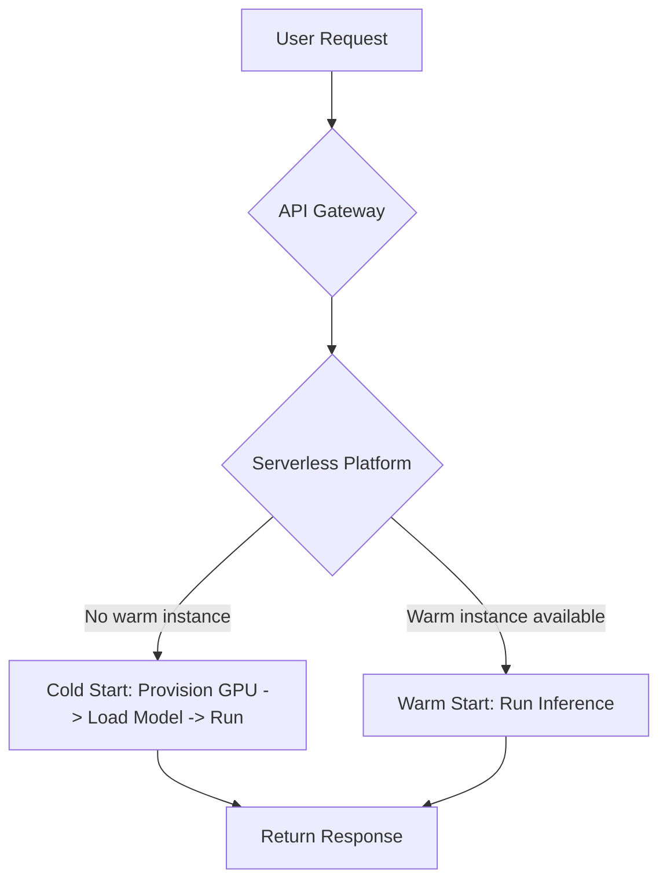

# 서버리스 GPU 인프라 (Serverless GPU Infrastructure)

## 1. 핵심 개념 (Core Concept)

서버리스 GPU 인프라는 개발자가 서버를 직접 프로비저닝하거나 관리할 필요 없이 GPU 가속이 필요한 애플리케이션(주로 LLM 추론)을 실행할 수 있게 하는 클라우드 컴퓨팅 모델임. 사용량에 따라 자동으로 자원이 할당 및 확장되고, 유휴 시간에는 자원이 0으로 축소(Scale-to-zero)되어 요청 처리 시간에 대해서만 비용을 지불함. 이를 통해 간헐적이거나 예측 불가능한 트래픽을 가진 LLM 서비스를 매우 비용 효율적으로 운영할 수 있음.

______________________________________________________________________

## 2. 상세 설명 (Detailed Explanation)

### 2.1 기존 방식 vs 서버리스 GPU

| 구분                | 기존 방식 (Dedicated GPU Server)                                 | 서버리스 GPU                                            |
| :------------------ | :--------------------------------------------------------------- | :------------------------------------------------------ |
| **자원 관리**       | 사용자가 직접 VM/컨테이너 프로비저닝, 스케일링, OS/드라이버 관리 | 플랫폼이 모든 인프라 관리 자동화                        |
| **비용 모델**       | 24/7 서버 가동 비용 발생 (유휴 시간에도 과금)                    | 실제 코드 실행 시간/요청 건수에 따라 과금 (Pay-per-use) |
| **확장성**          | 오토스케일링 그룹을 수동으로 설정, 느린 확장                     | 요청량에 따라 즉시, 자동으로 0에서 N까지 확장           |
| **적합한 워크로드** | 트래픽이 일정하고 예측 가능한 고성능 서비스                      | 트래픽이 간헐적이거나 예측 불가능한 서비스, 비동기 작업 |

### 2.2 서버리스 GPU의 핵심 과제: 콜드 스타트 (Cold Start)

서버리스의 가장 큰 단점은 **콜드 스타트**임. 요청이 없을 때 자원이 0으로 축소되었다가 첫 요청이 들어오면, 컨테이너를 시작하고, 수십 GB에 달하는 LLM 모델 가중치를 다운로드하여 GPU 메모리에 로드하는 데 수십 초에서 수 분이 걸릴 수 있음. 이는 실시간 응답이 중요한 대화형 서비스에 치명적일 수 있음.

**콜드 스타트 완화 전략:**

- **프로비저닝된 동시성 (Provisioned Concurrency)**: 일정 수의 인스턴스를 항상 준비된 상태(Warm)로 유지하여 콜드 스타트를 방지함. (서버리스의 비용 효율성과 상충될 수 있음)
- **최적화된 컨테이너 이미지**: 모델 가중치와 코드를 포함한 컨테이너 이미지를 경량화하고, 필요한 파일을 빠르게 로드할 수 있도록 최적화함.
- **모델 캐싱 및 스트리밍**: 자주 사용되는 모델을 노드에 캐싱하거나, 모델 로딩과 추론을 병렬로 처리하는 스트리밍 기법을 사용함.

### 2.3 주요 플랫폼 및 도구

- **클라우드 제공업체**: AWS Lambda, Google Cloud Functions, Azure Functions 등에서 제한적으로 GPU를 지원하거나 컨테이너 기반 서버리스(AWS Fargate, Google Cloud Run)와 결합하여 사용.
- **전문 서버리스 GPU 플랫폼**: Banana.dev, RunPod, Modal, Replicate 등 LLM 추론에 특화된 플랫폼. 콜드 스타트 최적화, 쉬운 배포 등 다양한 기능을 제공함.
- **Kubernetes 기반**: KServe, OpenFaaS와 같은 오픈소스를 활용하여 자체적인 서버리스 GPU 환경을 구축할 수 있음. 더 많은 제어권을 제공하지만 관리 복잡성이 높음.

______________________________________________________________________

## 3. 예시 (Example)

### 사용 사례: AI 아바타 생성 서비스

사용자가 자신의 사진을 업로드하면, LLM과 이미지 생성 모델(Diffusion Model)을 결합하여 독특한 스타일의 아바타를 만들어주는 서비스를 개발하는 시나리오. 이 서비스는 소셜 미디어에서 입소문을 탈 때 트래픽이 폭증했다가, 평소에는 사용량이 거의 없음.

- **기존 방식**: 트래픽 폭증에 대비해 고사양 GPU 서버(A100, H100)를 여러 대 24시간 운영해야 함. 평소에는 서버가 유휴 상태이므로 막대한 비용 낭비가 발생.
- **서버리스 GPU 적용**: 사용자가 이미지를 업로드할 때만 서버리스 함수가 트리거됨. 플랫폼이 자동으로 GPU 인스턴스를 할당하여 모델을 실행하고 결과를 반환함. 작업이 끝나면 자원은 다시 0으로 축소됨. 따라서 트래픽이 없을 때는 비용이 거의 발생하지 않으며, 갑작스러운 트래픽 증가에도 유연하게 대처할 수 있음.

______________________________________________________________________

## 4. 예상 면접 질문 (Potential Interview Questions)

- **Q. LLM 추론 서비스를 배포할 때, 어떤 경우에 서버리스 아키텍처를 고려하겠습니까?**

  - **A.** 트래픽이 간헐적이거나 예측 불가능한 경우에 가장 적합합니다. 예를 들어, 특정 시간에만 사용량이 몰리는 내부 데모용 앱, 비동기적으로 대량의 문서를 처리하는 배치 작업, 또는 아직 사용자 기반이 작아 트래픽이 적은 초기 스타트업 서비스의 경우, 유휴 시간에 비용이 발생하지 않는 서버리스가 매우 비용 효율적입니다.

- **Q. 서버리스 GPU 환경에서 '콜드 스타트'란 무엇이며, 이를 완화하기 위한 방법에는 어떤 것들이 있나요?**

  - **A.** 콜드 스타트는 요청이 없는 상태에서 첫 요청을 처리하기 위해 GPU 컨테이너를 프로비저닝하고, 모델을 메모리에 로드하는 데 걸리는 지연 시간을 의미합니다. 이를 완화하기 위해, 일정 수의 인스턴스를 항상 준비 상태로 유지하는 '프로비저닝된 동시성', 컨테이너 이미지를 최적화하고 모델 로딩을 가속화하는 기법, 또는 LLM 추론에 특화된 전문 서버리스 플랫폼을 사용하는 방법이 있습니다.

- **Q. 서버리스 GPU 플랫폼을 선택할 때 고려해야 할 기술적 요소는 무엇인가요?**

  - **A.** 콜드 스타트 시간, 지원하는 GPU 종류와 지역, 분당/초당 과금 같은 비용 모델, 오토스케일링의 속도와 정책, 로깅 및 모니터링 지원 여부, 그리고 Python 라이브러리나 Docker 환경과의 호환성 등을 종합적으로 고려해야 합니다.

______________________________________________________________________

## 5. 더 읽어보기 (Further Reading)

- [Serverless GPU: The next frontier of computing (Modal Blog)](https://modal.com/blog/serverless-gpus)
- [AWS Lambda now supports container images up to 10 GB](https://aws.amazon.com/about-aws/whats-new/2020/12/aws-lambda-now-supports-container-images-up-to-10-gb/)
- [RunPod - Serverless GPU](https://www.runpod.io/serverless-gpu)
