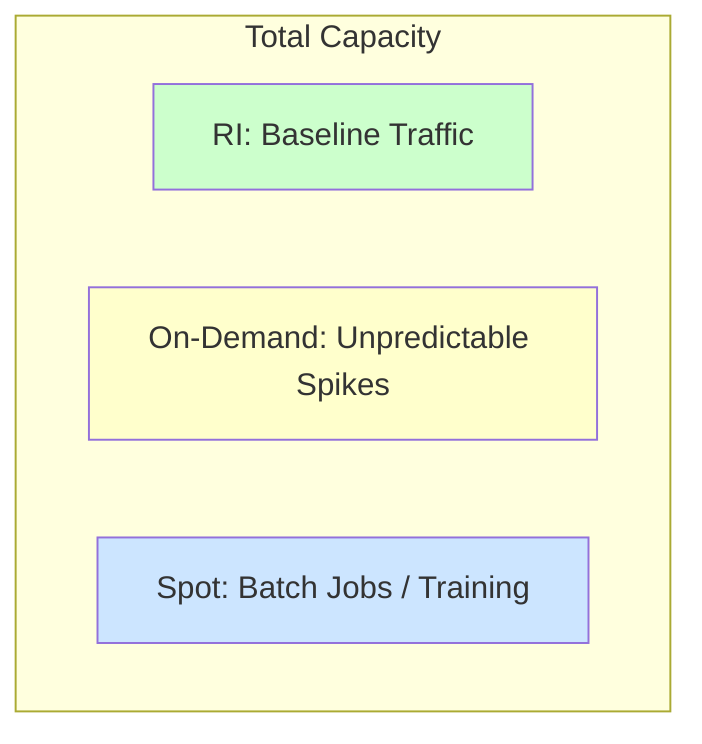

# 스팟 인스턴스와 예약 인스턴스 (Spot & Reserved Instances)

## 1. 핵심 개념 (Core Concept)

스팟 인스턴스와 예약 인스턴스는 클라우드 컴퓨팅 비용, 특히 고가의 GPU 자원 비용을 최적화하기 위한 두 가지 핵심적인 구매 옵션임. **스팟 인스턴스(Spot Instances)**는 클라우드 제공업체의 유휴 컴퓨팅 자원을 매우 저렴하게(최대 90% 할인) 제공하지만, 언제든지 중단될 수 있는 위험이 있음. 반면, **예약 인스턴스(Reserved Instances, RI)**는 1년 또는 3년의 장기 사용을 약정하는 대가로 On-Demand 요금보다 훨씬 저렴한 가격(최대 72% 할인)으로 자원을 안정적으로 확보하는 방식임.

---

## 2. 상세 설명 (Detailed Explanation)

### 2.1 구매 옵션 비교

| 구분 | On-Demand | 예약 인스턴스 (Reserved Instances) | 스팟 인스턴스 (Spot Instances) |
| :--- | :--- | :--- | :--- |
| **비용** | 기준 가격 (가장 비쌈) | 대폭 할인 (약정 기간에 따라) | 최대 할인 (유휴 자원 경매) |
| **안정성** | 높음 (중단 없음) | 매우 높음 (용량 예약) | 낮음 (2분 전 통보 후 중단 가능) |
| **유연성** | 매우 높음 (언제든 시작/종료) | 낮음 (장기 약정 필요) | 중간 (중단 위험 감수) |
| **주요 사용 사례** | 단기적, 예측 불가능한 워크로드 | 안정적, 예측 가능한 프로덕션 워크로드 | 내결함성이 있는 배치 작업, 학습, 개발/테스트 |

### 2.2 스팟 인스턴스 활용 전략

스팟 인스턴스는 중단될 수 있다는 특성 때문에, 중단되더라도 처음부터 다시 시작할 필요가 없는 **내결함성(Fault-tolerant)**을 갖춘 워크로드에 적합함.

*   **LLM 사전 학습(Pre-training)**: 학습 과정 중에 주기적으로 **체크포인트(Checkpoint)**를 저장하도록 파이프라인을 설계함. 스팟 인스턴스가 중단되면, 다른 스팟 인스턴스를 새로 할당받아 마지막 체크포인트부터 학습을 재개함.
*   **배치 추론(Batch Inference)**: 대량의 데이터를 비동기적으로 처리하는 경우, 각 데이터 처리 작업이 독립적이므로 일부 인스턴스가 중단되어도 다른 인스턴스에서 작업을 이어갈 수 있음.
*   **CI/CD 및 테스트**: 모델 빌드, 테스트, 평가 등 실패해도 재시작하면 되는 파이프라인에 활용하여 비용을 절감함.

### 2.3 예약 인스턴스 활용 전략

예약 인스턴스는 안정적인 운영이 필수적인 프로덕션 환경에 적합함.

*   **LLM 서빙(Serving)**: 사용자에게 실시간으로 응답해야 하는 LLM API 서비스의 경우, 항상 가용한 GPU 용량을 확보해야 함. 1년 또는 3년 단위의 트래픽을 예측하여 최소 필요 용량을 예약 인스턴스로 구매하면, On-Demand 대비 큰 비용 절감 효과를 볼 수 있음.
*   **안정적인 개발 환경**: 여러 팀이 공유하는 영구적인 개발 및 스테이징 환경을 위해 예약 인스턴스를 사용하여 비용을 예측 가능하게 관리할 수 있음.

### 2.4 하이브리드 전략

가장 효과적인 비용 최적화는 두 옵션을 혼합하는 것임.

*   **Baseline (RI)**: 서비스의 최소 요구 트래픽을 예측하여 예약 인스턴스로 커버함.
*   **Spikes (On-Demand)**: 예측하기 어려운 트래픽 급증은 On-Demand 인스턴스로 대응함.
*   **Batch (Spot)**: 학습이나 배치 처리 같은 비긴급성 작업은 스팟 인스턴스로 실행함.

---

## 3. 예시 (Example)

### 사용 사례: LLM 기반 핀테크 기업의 인프라 운영

한 핀테크 기업이 LLM을 활용하여 금융 보고서를 분석하고, 고객 문의에 답변하는 챗봇 서비스를 운영함.

*   **챗봇 서빙 인프라**: 고객 서비스는 24/7 안정적으로 운영되어야 하므로, 연간 평균 트래픽을 분석하여 필요한 GPU 서버의 70%를 **3년 약정 예약 인스턴스**로 구매하여 비용을 절감함. 나머지 30%의 변동성은 On-Demand로 대응.
*   **금융 보고서 분석 모델 학습**: 매 분기 대량의 보고서 데이터로 모델을 재학습함. 이 학습 과정은 몇 주가 걸리지만 긴급하지 않음. 따라서, 학습 클러스터 전체를 **스팟 인스턴스**로 구성하고, 2시간마다 체크포인트를 저장하도록 설정함. 이를 통해 학습 비용을 On-Demand 대비 80% 이상 절감함.

---

## 4. 예상 면접 질문 (Potential Interview Questions)

*   **Q. LLM 모델을 학습시키는 데 스팟 인스턴스를 사용하고 싶습니다. 어떤 기술적 준비가 필요한가요?**
    *   **A.** 가장 중요한 것은 내결함성 확보입니다. 학습 스크립트가 주기적으로 모델의 가중치와 옵티마이저 상태를 포함한 체크포인트를 안정적인 스토리지(예: S3)에 저장하도록 구현해야 합니다. 또한, 스팟 인스턴스가 중단되었을 때 이를 감지하고, 자동으로 새로운 인스턴스를 프로비저닝하여 마지막 체크포인트부터 학습을 재개하는 자동화된 워크플로우(예: AWS Step Functions, Kubeflow)를 구축해야 합니다.

*   **Q. 안정적인 LLM API 서비스를 운영해야 할 때, 예약 인스턴스와 On-Demand 인스턴스를 어떻게 조합하여 비용을 최적화할 수 있을까요?**
    *   **A.** 먼저 서비스의 시간별/일별 트래픽 패턴을 분석하여 항상 필요한 최소한의 용량, 즉 기준선(Baseline) 트래픽을 파악합니다. 이 기준선 용량은 1년 또는 3년 약정의 예약 인스턴스로 구매하여 안정적으로 확보하고 비용을 크게 절감합니다. 그리고 예측하기 어려운 트래픽 피크나 갑작스러운 사용량 증가는 유연성이 높은 On-Demand 인스턴스를 통해 동적으로 확장(Scale-out)하여 대응하는 하이브리드 전략을 사용하는 것이 가장 효율적입니다.

*   **Q. 스팟 인스턴스의 가장 큰 단점은 무엇이며, 어떤 종류의 워크로드에 절대로 사용하면 안 되나요?**
    *   **A.** 가장 큰 단점은 클라우드 제공업체의 사정에 따라 언제든지 중단될 수 있다는 불안정성입니다. 따라서, 중단되었을 때 즉각적인 서비스 장애로 이어지거나, 데이터 유실의 위험이 있으며, 짧은 시간 안에 반드시 완료되어야 하는 미션 크리티컬한 작업에는 절대로 사용하면 안 됩니다. 예를 들어, 실시간 데이터베이스, 사용자의 직접적인 요청을 처리하는 프로덕션 API 서버 등이 해당됩니다.

---

## 5. 더 읽어보기 (Further Reading)

*   [Amazon EC2 Spot Instances](https://aws.amazon.com/ec2/spot/)
*   [Azure Spot Virtual Machines](https://azure.microsoft.com/en-us/products/virtual-machines/spot/)
*   [Google Cloud Spot VMs](https://cloud.google.com/spot-vms)
*   [AWS Reserved Instances](https://aws.amazon.com/ec2/pricing/reserved-instances/)