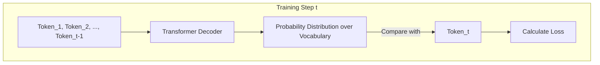

# Causal LM (GPT 계열)

## 1. 핵심 개념 (Core Concept)

인과 언어 모델링(Causal Language Modeling, CLM)은 이전 단어들(context)이 주어졌을 때, 바로 다음에 오는 단어를 예측하도록 모델을 학습시키는 자기회귀(auto-regressive) 방식의 사전학습 목표입니다. 이는 GPT 계열 모델의 근간을 이루며, 모델이 인간처럼 자연스러운 텍스트를 생성하는 능력의 핵심입니다.

______________________________________________________________________

## 2. 상세 설명 (Detailed Explanation)

### 2.1 학습 방식: 다음에 올 단어 맞추기

CLM의 학습 과정은 매우 직관적입니다. 모델은 대규모 텍스트 코퍼스에서 문장을 순차적으로 읽으며, 각 시점(time step)에서 다음에 등장할 단어를 예측하는 문제를 반복적으로 풉니다.

- **입력**: "The quick brown fox jumps over the lazy"
- **예측 대상**: "dog"

이 과정에서 모델은 단어의 순서, 문법 구조, 단어 간의 의미적 관계 등 언어의 복잡한 패턴을 내재적으로 학습하게 됩니다. 중요한 점은 예측 시 오직 **이전 단어들만 볼 수 있다**는 것입니다. 미래의 단어는 Causal Mask(또는 Look-ahead Mask)에 의해 가려져, 정보가 한쪽 방향(과거->미래)으로만 흐르게 됩니다. 이 때문에 "Causal"(인과적)이라는 이름이 붙었습니다.

### 2.2 아키텍처: Transformer Decoder-Only

CLM은 주로 **트랜스포머의 디코더(Decoder) 블록**만을 쌓아서 만듭니다. 디코더에 포함된 Causal Self-Attention은 각 토큰이 자신과 이전 토큰들하고만 상호작용하도록 하여 CLM의 단방향(unidirectional) 정보 흐름을 자연스럽게 구현합니다. GPT, Llama, Mistral 등 대부분의 최신 생성 모델들이 이 구조를 따릅니다.

______________________________________________________________________

## 3. 예시 (Example)

### 텍스트 생성 (Text Generation)

CLM의 가장 대표적인 사용 사례는 텍스트 생성입니다.

1. **초기 프롬프트**: "Once upon a time, in a land far, far away,"
1. **1단계**: 모델이 프롬프트를 입력받아 다음 단어 "there"를 예측(생성)합니다.
1. **2단계**: 생성된 단어 "there"를 포함한 "Once upon a time, ... away, there"를 새로운 입력으로 하여 다음 단어 "lived"를 예측합니다.
1. **반복**: 이 과정을 계속 반복하여 "... there lived a brave knight."와 같이 완전한 문장이나 이야기를 만들어냅니다.

이처럼 이전에 생성한 출력을 다시 다음 시점의 입력으로 사용하는 방식을 \*\*자기회귀(Auto-Regressive)\*\*라고 합니다.

______________________________________________________________________

## 4. 예상 면접 질문 (Potential Interview Questions)

- **Q. Causal LM과 Masked LM (BERT 계열)의 가장 큰 차이점은 무엇인가요?**

  - **A.** 정보의 방향성입니다. Causal LM은 과거의 문맥만 보고 다음 단어를 예측하는 **단방향(Unidirectional)** 모델로, 텍스트 생성에 특화되어 있습니다. 반면, Masked LM은 문장 중간의 \[MASK\] 토큰을 예측하기 위해 앞뒤 문맥을 모두 참고하는 **양방향(Bidirectional)** 모델이며, 문장의 의미를 깊게 이해하는 NLU(자연어 이해) 태스크에 더 강점을 보입니다.

- **Q. GPT와 같은 Causal LM이 어떻게 제로샷(Zero-shot) 학습을 수행할 수 있나요?**

  - **A.** Causal LM은 방대한 텍스트 데이터로 "다음 단어 맞추기"를 학습하면서, 특정 작업에 대한 명시적인 학습 없이도 다양한 언어 패턴과 사실적 지식을 습득합니다. 이 과정에서 모델은 특정 패턴의 입력을 특정 패턴의 출력으로 변환하는 능력을 내재화합니다. 예를 들어, 학습 데이터에 "Translate English to French: sea otter -> loutre de mer"와 같은 예시가 많았다면, 파인튜닝 없이도 "Translate English to French: cheese ->" 라는 프롬프트에 "fromage"라고 답할 수 있게 됩니다. 즉, 사전학습 목표 자체가 일종의 태스크 수행 방식(입력->출력)을 학습하도록 유도하기 때문입니다.

- **Q. Causal LM의 장점과 단점을 아키텍처와 연관지어 설명해주세요.**

  - **A.**
    - **장점**: 디코더 구조와 자기회귀적 특성 덕분에, 프롬프트만 주어지면 자연스럽게 뒷 내용을 이어가는 텍스트 생성에 매우 효과적입니다. 구조가 비교적 단순하고 학습이 안정적입니다.
    - **단점**: 단방향 문맥만 보기 때문에, 문장 전체의 양방향 정보를 모두 활용해야 하는 문맥 파악이나 분류 같은 NLU 태스크에서는 BERT와 같은 양방향 인코더 모델보다 성능이 떨어질 수 있습니다.

______________________________________________________________________

## 5. 더 읽어보기 (Further Reading)

- [Improving Language Understanding by Generative Pre-Training (GPT-1 Paper)](https://s3-us-west-2.amazonaws.com/openai-assets/research-covers/language-unsupervised/language_understanding_paper.pdf)
- [The Illustrated GPT-2 (Jay Alammar)](http://jalammar.github.io/illustrated-gpt2/)
- [Hugging Face Docs: Causal Language Modeling](https://huggingface.co/docs/transformers/tasks/language_modeling)
