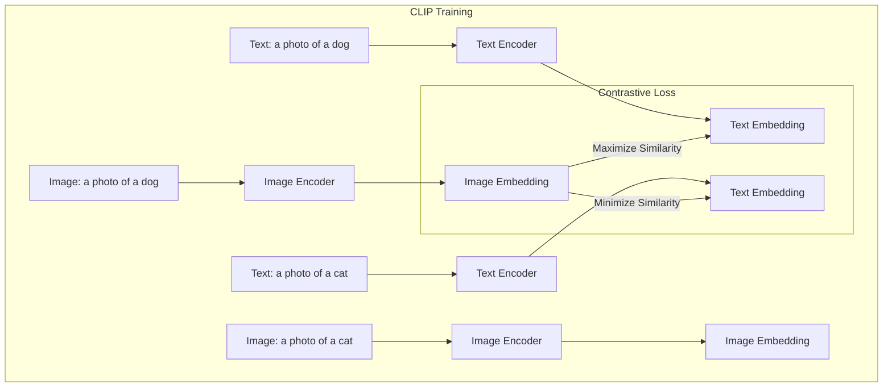

# 멀티모달 사전학습 (CLIP, Flamingo, Gemini)

## 1. 핵심 개념 (Core Concept)

멀티모달 사전학습은 텍스트, 이미지, 음성 등 여러 종류의 데이터를 함께 학습하여, 모델이 서로 다른 데이터 양식(modality) 간의 관계를 이해하고 통합적으로 추론하는 능력을 갖추게 하는 과정입니다. 이는 단순히 각 데이터를 따로 처리하는 것을 넘어, "사과"라는 텍스트와 사과 이미지, "사과"라는 음성을 하나의 개념으로 연결하는 것과 같습니다.

---

## 2. 상세 설명 (Detailed Explanation)

### 2.1 CLIP: 이미지와 텍스트의 연결 (Contrastive Learning)

CLIP (Contrastive Language-Image Pre-training)은 **이미지와 텍스트를 같은 의미 공간(embedding space)에 매핑**하는 것을 목표로 합니다.

*   **학습 방식**: 웹에서 수집한 4억 개의 (이미지, 텍스트 캡션) 쌍 데이터를 사용합니다. 이미지 인코더와 텍스트 인코더를 각각 학습시키며, 매칭되는 (이미지, 텍스트) 쌍의 임베딩 벡터는 서로 거리가 가까워지도록, 매칭되지 않는 쌍은 멀어지도록 학습합니다. 이를 **대조 학습(Contrastive Learning)**이라고 합니다.
*   **핵심 능력**: 이 덕분에 CLIP은 특정 클래스에 대한 학습(fine-tuning) 없이도, 주어진 이미지가 여러 텍스트 설명 중 어떤 것과 가장 유사한지 비교하여 분류하는 **제로샷 이미지 분류(Zero-shot Image Classification)**에 뛰어난 성능을 보입니다.

### 2.2 Flamingo: Few-shot 비주얼 질의응답

Flamingo는 사전학습된 거대 언어 모델(LLM)을 크게 변경하지 않으면서, 여기에 **이미지 이해 능력을 효율적으로 이식**하는 데 초점을 맞춘 비전-언어 모델(Vision-Language Model)입니다.

*   **아키텍처**: 강력한 사전학습/고정(frozen)된 LLM을 기반으로, 중간중간에 새로운 **Gated Cross-Attention** 레이어를 삽입합니다. 이 레이어들은 LLM의 텍스트 처리 흐름에 시각 정보(Perceiver Resampler로 처리된)를 주입하는 역할을 합니다.
*   **핵심 능력**: 이 구조 덕분에 Flamingo는 여러 개의 이미지와 텍스트가 섞인 복잡한 입력을 처리하고, 몇 개의 예시(few-shot)만으로도 이미지에 대한 질문에 답하거나 설명을 생성하는 등 유연한 비주얼 질의응답(VQA)이 가능합니다.

### 2.3 Gemini: 태생부터 멀티모달 (Natively Multimodal)

Gemini는 이전 모델들처럼 각각 학습된 단일 모달 모델을 "결합"하는 방식이 아닌, 처음부터 **네이티브 멀티모달(Natively Multimodal)**로 설계되었습니다.

*   **학습 방식**: 텍스트, 이미지, 오디오, 비디오 등 다양한 종류의 데이터를 처음부터 함께 사용하여 사전학습합니다. 이를 통해 모델은 서로 다른 모달리티 간의 관계를 훨씬 더 근본적이고 깊이 있게 학습합니다.
*   **핵심 능력**: 태생부터 멀티모달이기 때문에, 여러 모달리티가 섞인 입력을 매끄럽게 이해하고 복잡한 추론을 수행하는 데 매우 뛰어납니다. 예를 들어, 동영상을 보여주며 특정 장면에 대해 질문하거나, 그림을 그리고 이에 대한 코드를 생성해달라는 등의 복합적인 요구사항을 처리할 수 있습니다.

---

## 3. 비교 (Comparison)

| 모델 | 핵심 아이디어 | 주요 아키텍처 | 강점 | 한계점 |
| :--- | :--- | :--- | :--- | :--- |
| **CLIP** | 대조 학습을 통한 이미지-텍스트 연결 | Dual-Encoder | 제로샷 이미지 분류 | 텍스트 생성 불가, 복잡한 추론 미흡 |
| **Flamingo** | 고정된 LLM에 시각 능력 주입 | Gated Cross-Attention | Few-shot 비주얼 질의응답 | LLM 자체의 성능에 크게 의존 |
| **Gemini** | 태생부터 멀티모달 | 통합된 Transformer | 복합적인 멀티모달 추론 및 생성 | 매우 큰 모델과 방대한 학습 데이터 필요 |

---

## 4. 예상 면접 질문 (Potential Interview Questions)

*   **Q. CLIP의 대조 학습(Contrastive Learning) 방식에 대해 설명해주세요. Positive pair와 Negative pair는 각각 무엇을 의미하나요?**
    *   **A.** 대조 학습은 "비슷한 것은 가깝게, 다른 것은 멀게" 만드는 방식입니다. **Positive pair**는 실제로 매칭되는 (이미지, 텍스트) 쌍을 의미하며, 모델은 이 둘의 임베딩 벡터 간의 코사인 유사도를 최대화하도록 학습합니다. 반면, **Negative pair**는 배치 내에서 매칭되지 않는 모든 (이미지, 텍스트) 조합을 의미하며, 이들의 유사도는 최소화하도록 학습합니다. 이 과정을 통해 모델은 의미적으로 유사한 이미지와 텍스트를 같은 공간에 배치하는 방법을 배웁니다.

*   **Q. Flamingo가 고정된(frozen) LLM을 사용하는 것의 장점은 무엇인가요?**
    *   **A.** 가장 큰 장점은 **효율성**입니다. 이미 수많은 텍스트 데이터로 잘 학습된 LLM의 강력한 언어 능력을 그대로 활용하면서, 시각 정보를 처리하는 부분만 추가로 학습시키면 됩니다. 이는 전체 모델을 처음부터 학습시키는 것보다 훨씬 적은 계산 비용과 데이터로도 높은 성능을 달성할 수 있게 해줍니다.

*   **Q. Gemini가 "네이티브 멀티모달"이라는 것은 무슨 의미이며, 이전 방식들과 어떤 차이가 있나요?**
    *   **A.** "네이티브 멀티모달"은 모델이 설계 단계부터 여러 데이터 양식을 동시에 처리하도록 만들어졌다는 의미입니다. 이전 방식들은 주로 잘 만들어진 텍스트 LLM에 이미지 인코더를 나중에 "연결"하거나 "접붙이는" 방식이었습니다. 반면 Gemini는 아키텍처 자체가 텍스트, 이미지, 오디오 등을 동등하게 입력받아 통합된 표현(unified representation)으로 처리하도록 구성되어 있습니다. 이로 인해 서로 다른 모달리티 간의 상호작용을 훨씬 더 근본적이고 유기적으로 학습할 수 있습니다.

---

## 5. 더 읽어보기 (Further Reading)

*   [Learning Transferable Visual Models From Natural Language Supervision (CLIP Paper)](https://arxiv.org/abs/2103.00020)
*   [Flamingo: a Visual Language Model for Few-Shot Learning (Paper)](https://arxiv.org/abs/2204.14198)
*   [Gemini: A Family of Highly Capable Multimodal Models (Google AI)](https://ai.google/discover/gemini/)