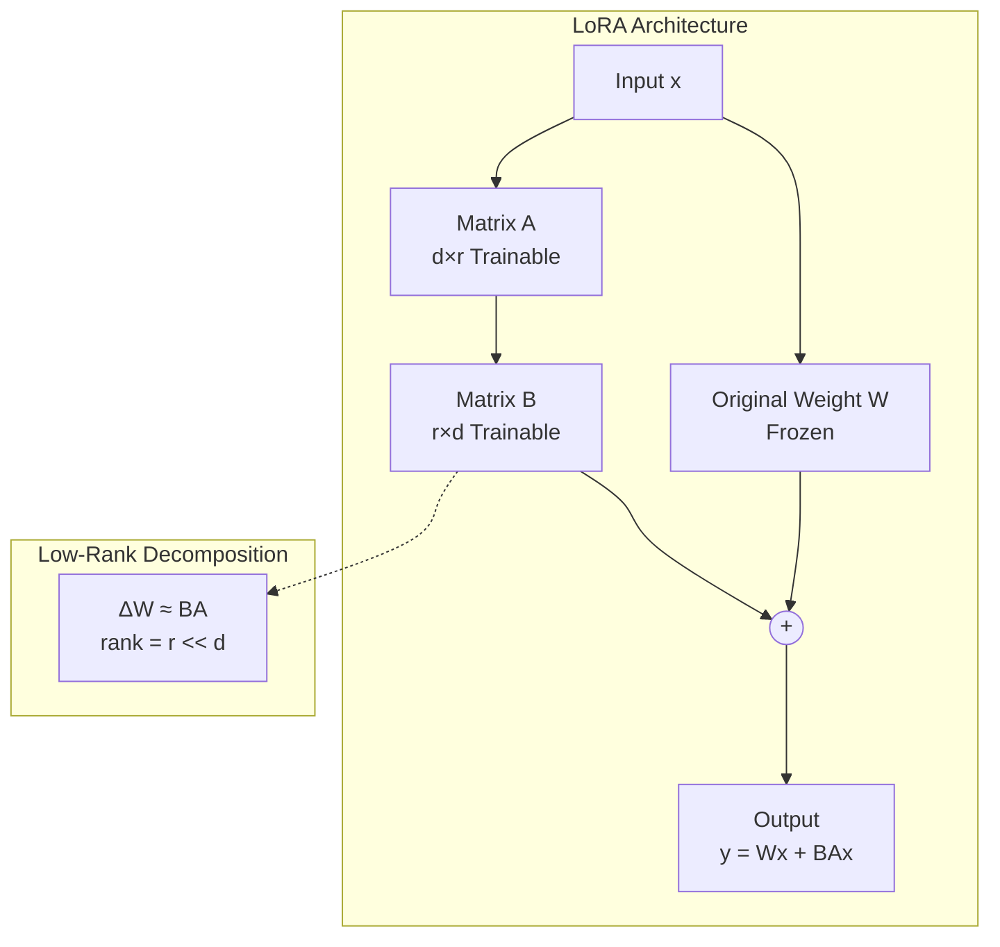

# 파라미터 효율적 튜닝 (PEFT)

## 1. 핵심 개념 (Core Concept)

파라미터 효율적 파인튜닝(Parameter-Efficient Fine-Tuning, PEFT)은 수십억 개의 파라미터를 가진 대규모 언어 모델(LLM)의 **대부분의 가중치는 고정(freeze)**시킨 채, **아주 일부의 파라미터만 학습**하여 모델을 특정 작업에 맞게 조정하는 기법들의 총칭입니다. 이를 통해 막대한 계산 자원과 시간, 저장 공간을 절약하면서도 전체 파인튜닝(full fine-tuning)에 준하는 성능을 달성할 수 있습니다.

---

## 2. 상세 설명 (Detailed Explanation)

### 2.1 왜 PEFT가 필요한가?

*   **계산 비용**: 100B(1000억) 파라미터 모델을 전체 파인튜닝하려면 수백 GB의 GPU 메모리가 필요하며, 이는 대부분의 연구자나 기업에게 큰 부담입니다.
*   **저장 공간**: 태스크마다 거대한 모델 전체를 복사하여 저장하는 것은 매우 비효율적입니다.
*   **치명적 망각 (Catastrophic Forgetting)**: 전체 파라미터를 업데이트하면, 모델이 새로운 작업에 과적합되어 기존에 학습했던 범용적인 언어 능력을 잃어버릴 수 있습니다.

PEFT는 이러한 문제들을 해결하기 위해 등장했습니다.

### 2.2 주요 PEFT 기법

#### 1. LoRA (Low-Rank Adaptation)

가장 널리 사용되는 PEFT 기법입니다. 기존 가중치 행렬($W$)은 그대로 두고, 그 옆에 **두 개의 작은 저차원(low-rank) 행렬 ($A$와 $B$)**을 추가하여 이 둘의 곱($BA$)으로 가중치의 변화량($\Delta W$)을 근사합니다. 학습 시에는 원본 $W$는 고정된 채, 오직 $A$와 $B$ 행렬만 업데이트합니다.

*   **핵심 아이디어**: 사전학습된 LLM의 가중치 업데이트는 본질적으로 낮은 내재적 차원(low intrinsic dimension)을 가질 것이라는 가정에서 출발합니다.
*   **장점**: 구조가 간단하고 성능이 우수합니다. 학습 후에는 $W' = W + BA$ 와 같이 두 행렬을 기존 가중치에 **병합(merge)**할 수 있어, 추론 시 추가적인 계산 비용(latency)이 전혀 없습니다.

#### 2. Adapter Tuning

트랜스포머의 각 레이어 내부에 **작은 신경망 모듈(Adapter)**을 삽입하고, 원본 모델 파라미터는 고정한 채 이 어댑터 모듈만 학습시키는 방식입니다.

*   **구조**: 보통 어텐션(attention)과 피드포워드(FFN) 블록 뒤에 병목(bottleneck) 구조의 어댑터가 순차적으로 추가됩니다.
*   **장점**: 태스크별로 어댑터를 독립적으로 학습하고 필요에 따라 교체할 수 있어 모듈성이 높습니다.
*   **단점**: 추론 시 추가된 어댑터 레이어를 거쳐야 하므로 약간의 지연 시간이 발생할 수 있습니다.

#### 3. Prefix-Tuning & Prompt-Tuning

모델의 가중치를 직접 수정하는 대신, **입력 시퀀스 앞에 학습 가능한 연속적인 벡터(prefix 또는 soft prompt)를 추가**하는 방식입니다. 모델 파라미터는 모두 고정한 채, 이 추가된 벡터만을 최적화하여 모델의 동작을 유도합니다.

*   **Prefix-Tuning**: 트랜스포머의 모든 레이어에 프리픽스를 추가하여 모델의 내부 상태를 직접 조절합니다.
*   **Prompt-Tuning**: Prefix-Tuning을 단순화하여 입력 임베딩 레이어에만 soft prompt를 추가합니다.
*   **장점**: 학습할 파라미터가 극히 적어(0.1% 미만) 파라미터 효율성이 가장 높습니다.
*   **단점**: 복잡한 태스크에서는 다른 기법에 비해 성능이 다소 떨어질 수 있으며, 안정적인 학습이 더 어렵습니다.

---

## 3. 비교 요약

| 기법 | 핵심 아이디어 | 훈련 대상 | 추론 시 지연 | 장점 | 단점 |
| :--- | :--- | :--- | :--- | :--- | :--- |
| **LoRA** | 가중치 업데이트를 저차원 행렬로 근사 | 추가된 저차원 행렬 | **없음 (병합 가능)** | **성능/효율 밸런스 우수, 높은 범용성** | - |
| **Adapter** | 레이어에 작은 모듈 삽입 | 삽입된 어댑터 모듈 | 약간 발생 | 높은 모듈성, 유연한 작업 전환 | 추론 지연, 모델 구조 변경 필요 |
| **Prefix/Prompt** | 입력에 학습 가능한 프롬프트 추가 | 프롬프트 벡터 | 약간 발생 | **최고의 파라미터 효율성** | 복잡한 태스크 성능 저하 가능성 |

---

## 4. 예상 면접 질문 (Potential Interview Questions)

*   **Q. PEFT가 Full Fine-tuning에 비해 갖는 세 가지 주요 장점은 무엇인가요?**
    *   **A.** 첫째, **계산 및 메모리 효율성**입니다. 훨씬 적은 수의 파라미터만 학습하므로 적은 GPU 자원으로도 파인튜닝이 가능합니다. 둘째, **저장 공간 효율성**입니다. 태스크마다 전체 모델이 아닌, 작게 추가된 파라미터(checkpoint)만 저장하면 되므로 관리가 용이합니다. 셋째, **치명적 망각(Catastrophic Forgetting) 완화**입니다. 원본 모델의 지식을 대부분 보존하기 때문에 새로운 작업 학습 시 기존 능력을 잃어버릴 위험이 적습니다.

*   **Q. LoRA가 다른 PEFT 기법, 특히 Adapter에 비해 갖는 가장 큰 실용적인 장점은 무엇인가요?**
    *   **A.** **추론 시 지연 시간(inference latency)이 없다는 점**입니다. LoRA는 학습이 끝난 후 추가된 작은 행렬들을 원래의 가중치 행렬에 병합(merge)하여 하나의 행렬로 만들 수 있습니다. 따라서 추론 시에는 파인튜닝 이전의 원본 모델과 동일한 구조와 속도를 가집니다. 반면, Adapter나 Prefix-Tuning은 추론 시에도 추가된 모듈이나 벡터를 계속 계산해야 하므로 약간의 속도 저하가 발생합니다.

*   **Q. LoRA의 하이퍼파라미터인 `r` (rank)과 `alpha`는 각각 어떤 역할을 하나요?**
    *   **A.** `r`은 분해된 행렬의 랭크(rank), 즉 내부 차원의 크기를 결정합니다. `r`이 클수록 더 많은 파라미터를 사용하여 더 복잡한 변화를 표현할 수 있지만, 파라미터 효율성은 떨어집니다. `alpha`는 LoRA로 학습된 가중치의 스케일링 팩터입니다. 보통 `alpha`를 `r`의 두 배 정도로 설정하는 것이 경험적으로 좋은 성능을 보인다고 알려져 있습니다. 최종적으로 가중치 변화량은 $(\alpha/r) \times BA$ 로 계산되어, 학습률(learning rate)과 유사하게 업데이트 강도를 조절하는 역할을 합니다.

---

## 5. 더 읽어보기 (Further Reading)

*   [LoRA: Low-Rank Adaptation of Large Language Models (Paper)](https://arxiv.org/abs/2106.09685)
*   [Hugging Face PEFT 라이브러리](https://huggingface.co/docs/peft)
*   [A Comprehensive Overview of PEFT (Blog Post)](https://www.pytorch.org/blog/a-comprehensive-overview-of-peft/)