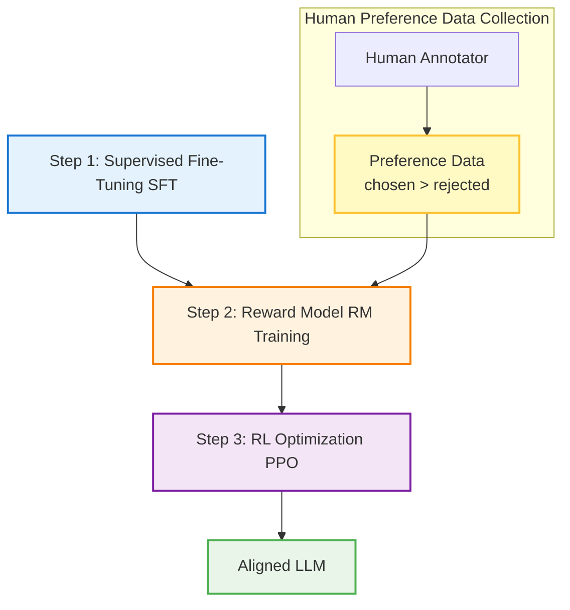

# RLHF & DPO

## 1. 핵심 개념 (Core Concept)

**RLHF(Reinforcement Learning from Human Feedback)**와 **DPO(Direct Preference Optimization)**는 SFT를 마친 언어 모델이 인간의 복잡한 가치나 선호도에 맞게 행동하도록 **정렬(Alignment)**하는 대표적인 기법입니다. RLHF는 "인간의 선호도를 학습한 보상 모델"을 기준으로 강화학습을 사용하는 복잡하지만 강력한 방식인 반면, DPO는 보상 모델 없이 인간의 선호도 데이터를 사용해 모델을 직접 최적화하는 더 단순하고 안정적인 방식입니다.

---

## 2. 상세 설명 (Detailed Explanation)

### 2.1 RLHF: 인간 피드백을 보상으로 활용하는 강화학습

RLHF는 챗봇이 더 유용하고, 무해하며, 진실된 답변을 하도록 만드는 데 결정적인 역할을 한 기술로, 3단계로 구성됩니다.

1.  **SFT 모델 준비 (SFT Model)**: 먼저 SFT를 통해 지시를 잘 따르는 기본 모델을 준비합니다.
2.  **보상 모델 학습 (Reward Model Training)**: 동일한 프롬프트에 대해 SFT 모델이 여러 답변을 생성하면, 사람이 어떤 답변이 더 나은지 순위를 매깁니다. 이 **선호도 데이터(Preference Data)**를 사용하여, "좋은 답변"에 높은 점수를, "나쁜 답변"에 낮은 점수를 주는 **보상 모델(Reward Model, RM)**을 학습시킵니다.
3.  **강화학습을 통한 최적화 (RL Optimization)**: SFT 모델을 강화학습의 **정책(Policy)**으로, 보상 모델을 **환경(Environment)**으로 사용합니다. SFT 모델이 생성한 답변을 보상 모델이 채점하고, 더 높은 보상을 받는 방향으로 SFT 모델의 파라미터를 업데이트합니다. (주로 PPO 알고리즘 사용)

### 2.2 DPO: 보상 모델을 제거한 직접 최적화

DPO는 RLHF의 복잡한 다단계 파이프라인(특히 강화학습)이 불안정하고 구현하기 어렵다는 문제의식에서 출발했습니다.

*   **핵심 아이디어**: 언어 모델의 정책과 최적의 보상 모델 사이에는 분석적인 관계(analytical relationship)가 존재한다는 것을 수학적으로 증명했습니다. 이를 통해, **보상 모델을 명시적으로 학습시킬 필요 없이**, 인간의 선호도 데이터를 가지고 언어 모델을 **직접 최적화**할 수 있습니다.
*   **학습 방식**: DPO는 (프롬프트, 선택된 답변 $y_w$, 거절된 답변 $y_l$) 쌍으로 이루어진 데이터셋을 사용합니다. 손실 함수는 모델이 선택된 답변($y_w$)에 부여하는 확률은 높이고, 거절된 답변($y_l$)에 부여하는 확률은 낮추도록 직접적으로 정책을 업데이트합니다.

**결론적으로, DPO는 RLHF의 "보상 모델링 + 강화학습" 두 단계를 하나의 간단한 분류(classification) 문제와 유사한 형태로 통합한 것입니다.**

---

## 3. 비교: RLHF vs DPO

| 구분 | RLHF (Reinforcement Learning from Human Feedback) | DPO (Direct Preference Optimization) |
| :--- | :--- | :--- |
| **프로세스** | 3단계 (SFT -> RM 학습 -> RL 최적화) | 2단계 (SFT -> 직접 최적화) |
| **복잡성** | **높음**. 여러 모델 학습, 불안정한 RL 과정 | **낮음**. 간단한 손실 함수로 직접 학습 |
| **자원 효율성** | **낮음**. 계산 비용과 시간이 많이 소요됨 | **높음**. 더 빠르고 효율적인 학습 가능 |
| **안정성** | **낮음**. 하이퍼파라미터에 민감하고 학습이 불안정 | **높음**. 구현이 간단하고 학습이 안정적 |

---

## 4. 예상 면접 질문 (Potential Interview Questions)

*   **Q. RLHF의 3단계 프로세스를 설명해주세요.**
    *   **A.** 첫째, SFT 단계에서는 레이블된 데이터로 모델이 지시를 따르도록 기본 학습을 시킵니다. 둘째, 보상 모델링 단계에서는 사람이 선호하는 답변과 그렇지 않은 답변 데이터를 이용해, 좋은 답변에 높은 점수를 주는 보상 모델을 학습시킵니다. 마지막으로, 강화학습 최적화 단계에서는 SFT 모델이 생성한 답변을 보상 모델로 채점하고, 더 높은 보상을 받도록 PPO와 같은 강화학습 알고리즘으로 모델의 정책을 업데이트합니다.

*   **Q. DPO가 RLHF에 비해 갖는 가장 큰 장점은 무엇인가요?**
    *   **A.** **단순성과 안정성**입니다. DPO는 별도의 보상 모델을 학습시키거나 복잡한 강화학습 파이프라인을 구축할 필요가 없습니다. 인간의 선호도 데이터를 사용하여 간단한 손실 함수로 언어 모델을 직접 최적화하므로, 구현이 훨씬 쉽고 학습 과정이 안정적이며 계산적으로도 효율적입니다.

*   **Q. DPO가 항상 RLHF보다 좋은 성능을 보이나요?**
    *   **A.** 꼭 그렇지는 않습니다. 많은 연구에서 DPO가 RLHF와 비슷하거나 더 나은 성능을 보이는 것으로 나타났지만, 태스크의 종류나 데이터의 특성에 따라 결과는 달라질 수 있습니다. RLHF는 보상 모델을 통해 더 복잡하고 미묘한 인간의 피드백을 모델링할 수 있는 잠재적 유연성을 가지고 있습니다. 반면, DPO는 구현의 용이성과 안정성 덕분에 많은 경우에 더 실용적인 선택지가 될 수 있습니다.

*   **Q. DPO의 손실 함수는 모델이 무엇을 학습하도록 유도하나요?**
    *   **A.** DPO의 손실 함수는 본질적으로 모델이 **선호되는 답변(chosen response)과 선호되지 않는 답변(rejected response)의 상대적인 확률 차이를 최대화**하도록 유도합니다. 즉, SFT를 거친 참조 모델(reference model) 대비, 선호되는 답변이 나타날 로그 확률(log probability)은 높이고, 선호되지 않는 답변이 나타날 로그 확률은 낮추는 방향으로 모델의 정책을 직접 업데이트합니다.

---

## 5. 더 읽어보기 (Further Reading)

*   [Direct Preference Optimization: Your Language Model is Secretly a Reward Model (DPO Paper)](https://arxiv.org/abs/2305.18290)
*   [Hugging Face Blog: DPO - A new way to align LLMs with human preferences](https://huggingface.co/blog/dpo-trl)
*   [The Rise of DPO and the Fall of RLHF (AI Explained - YouTube)](https://www.youtube.com/watch?v=35hG5fG_d3E)