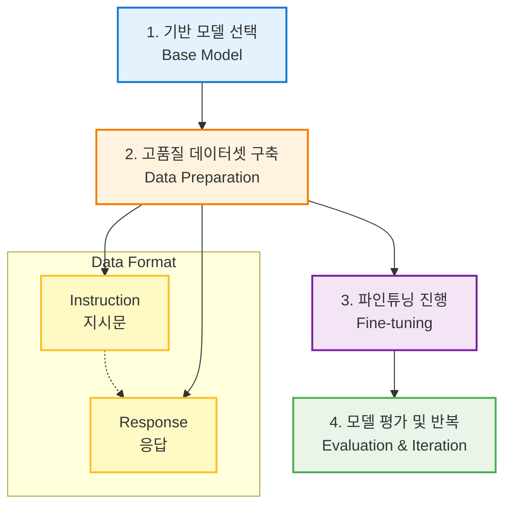

# 감독식 파인튜닝 (Supervised Fine-Tuning, SFT)

## 1. 핵심 개념 (Core Concept)

감독식 파인튜닝(SFT)은 사전학습된(pre-trained) LLM을 **레이블된 예제 데이터(labeled examples)**를 사용하여 특정 작업이나 스타일에 맞게 추가로 학습시키는 과정입니다. 즉, "이런 지시(instruction)에는 이렇게 답변해야 해"라고 정답지를 보여주며 모델을 가르치는 것과 같습니다. SFT는 범용적인 능력을 가진 LLM을 특정 목적에 맞게 행동하도록 길들이는(alignment) 첫 번째 핵심 단계입니다.

---

## 2. 상세 설명 (Detailed Explanation)

### 2.1 SFT의 목표: 지시를 따르는 능력 학습

사전학습만 마친 LLM은 문장의 다음 단어를 예측하는 능력은 뛰어나지만, 사용자의 지시를 명확하게 따르는 능력은 부족합니다. 예를 들어 "프랑스 혁명의 원인을 요약해줘"라고 했을 때, 관련 없어 보이는 웹페이지 글을 생성할 수도 있습니다. 

SFT는 **(지시, 응답)** 쌍으로 구성된 고품질 데이터셋을 통해 모델이 사용자의 의도를 파악하고, 원하는 형식과 내용으로 답변을 생성하도록 학습시킵니다. 이 과정을 통해 모델은 챗봇처럼 대화하거나, 요약, 번역, 코드 생성 등 특정 작업을 수행하는 능력을 갖추게 됩니다.

### 2.2 SFT 프로세스



1.  **기반 모델 선택**: 파인튜닝의 목적과 가용 자원에 맞는 사전학습된 LLM을 선택합니다. (e.g., Llama, Mistral, Gemma)
2.  **데이터셋 구축**: SFT의 성공을 좌우하는 가장 중요한 단계입니다. 양질의 (지시, 응답) 쌍을 수집하거나 생성합니다. 데이터의 품질, 다양성, 정확성이 모델의 최종 성능을 결정합니다.
3.  **파인튜닝**: 준비된 데이터셋을 사용하여 모델의 가중치를 업데이트합니다. 모델은 지시에 대해 정답 응답과 유사한 출력을 생성하도록 학습됩니다. (일반적으로 Cross-Entropy Loss 사용)
4.  **평가**: 별도의 테스트셋으로 모델의 성능을 평가하고, 필요에 따라 데이터셋을 보강하거나 학습 설정을 변경하여 과정을 반복합니다.

---

## 3. 예시 (Example)

### 데이터셋 예시 (JSONL format)

```json
{"instruction": "세상에서 가장 높은 산은 무엇인가요?", "response": "세상에서 가장 높은 산은 에베레스트 산입니다."}
{"instruction": "Python으로 두 숫자를 더하는 함수를 작성해줘.", "response": "def add_numbers(a, b):\n  return a + b"}
{"instruction": "'행복'을 주제로 짧은 시를 써줘.", "response": "작은 햇살 한 줌에 미소 짓고,\n따스한 차 한 잔에 온기를 느끼네.\n소박한 일상 속에 피어나는 것,\n그것이 바로 행복이라네."}
```

### 사용 사례

*   **특정 도메인 챗봇**: 법률, 의료, 금융 등 전문 분야의 질문에 정확하게 답변하는 챗봇.
*   **콘텐츠 생성**: 특정 작가의 문체나 특정 브랜드의 목소리를 모방하여 글을 작성.
*   **코드 생성**: 특정 프로그래밍 언어나 프레임워크에 대한 코드를 생성하도록 특화.

---

## 4. 예상 면접 질문 (Potential Interview Questions)

*   **Q. SFT가 LLM 정렬(Alignment) 과정에서 왜 중요한 첫 단계인가요?**
    *   **A.** 사전학습 모델은 지식을 가지고 있지만, 그 지식을 어떻게 사용해야 하는지, 즉 사용자의 지시를 어떻게 따라야 하는지 모릅니다. SFT는 "지시-응답"이라는 명확한 가이드를 통해 모델에게 바람직한 행동의 기본 틀을 가르쳐주는 첫 과정입니다. 이 단계를 거쳐야 모델이 비로소 유용한 "조수(assistant)"로서의 역할을 수행할 수 있으며, 이후 RLHF 같은 더 정교한 정렬 기법을 적용할 수 있는 기반이 마련됩니다.

*   **Q. SFT 데이터셋의 품질이 왜 중요한가요? 데이터 품질이 낮으면 어떤 문제가 발생할 수 있나요?**
    *   **A.** 모델은 데이터셋을 통해 "좋은 답변"이 무엇인지 배우기 때문에, 데이터셋의 품질이 모델의 성능을 직접적으로 결정합니다. 데이터에 사실 오류가 많으면 모델은 거짓말을 하는 법을 배우고(hallucination), 다양성이 부족하면 편향되거나 특정 패턴의 답변만 반복하게 됩니다. 또한, 지시가 불분명하거나 응답의 형식이 일관되지 않으면 모델이 사용자의 의도를 제대로 파악하지 못하는 문제가 발생합니다.

*   **Q. Full Fine-tuning과 PEFT(Parameter-Efficient Fine-Tuning)의 차이점은 무엇이며, SFT에는 주로 어떤 방식이 사용되나요?**
    *   **A.** **Full Fine-tuning**은 모델의 모든 파라미터를 업데이트하는 방식으로, 성능은 높지만 막대한 계산 자원과 메모리가 필요합니다. **PEFT**는 LoRA와 같이 원본 파라미터는 고정(freeze)하고 일부 추가된 작은 수의 파라미터만 학습하는 방식입니다. 훨씬 적은 자원으로도 준수한 성능을 낼 수 있고, 원본 모델의 지식을 잃어버리는 "치명적 망각(Catastrophic Forgetting)" 문제를 완화할 수 있습니다. 최근에는 대부분의 SFT 작업에 자원 효율성이 높은 PEFT, 특히 LoRA 방식이 널리 사용됩니다.

---

## 5. 더 읽어보기 (Further Reading)

*   [Hugging Face LLM Course: Supervised Fine-Tuning](https://huggingface.co/learn/llm-course/en/chapter/4/sft)
*   [A simple guide to SFT, RLHF, and DPO for LLMs (Blog Post)](https://medium.com/@siddharth.ananth/a-simple-guide-to-sft-rlhf-and-dpo-for-llms-2a2ff2966a37)
*   [Secrets of SFT: The Art and Science of Instruction Tuning (Blog Post)](https://www.determined.ai/blog/secrets-of-sft)