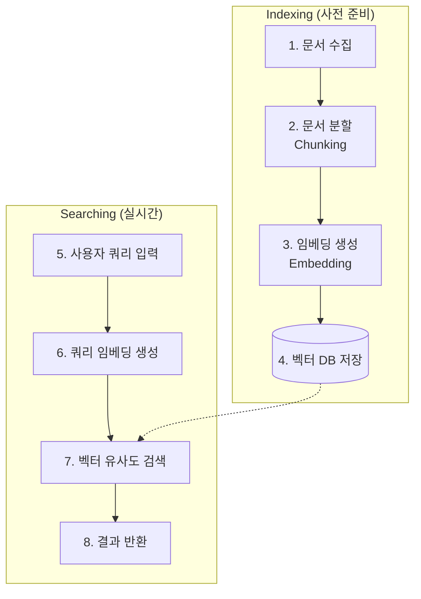

# 임베딩 및 의미론적 검색

## 1. 핵심 개념 (Core Concept)

**임베딩(Embedding)**은 텍스트, 이미지 등 비정형 데이터를 컴퓨터가 이해할 수 있는 고차원의 **숫자 벡터(vector)**로 변환하는 기술입니다. LLM을 통해 생성된 임베딩은 단어와 문장의 **의미적, 문맥적 관계**를 벡터 공간에 표현합니다. **의미론적 검색(Semantic Search)**은 이 임베딩 벡터를 사용하여, 단순 키워드 매칭을 넘어 사용자의 **의도와 의미**를 파악하여 관련된 결과를 찾아주는 검색 방식입니다.

---

## 2. 상세 설명 (Detailed Explanation)

### 2.1 텍스트 임베딩 (Text Embedding)

LLM, 특히 BERT와 같은 인코더 모델은 문장의 의미를 압축한 고품질의 임베딩을 생성하는 데 탁월한 능력을 보입니다. 문장이 모델에 입력되면, 모델은 마지막 레이어에서 해당 문 전체의 의미를 나타내는 고정된 크기의 벡터(e.g., 768차원)를 출력합니다. 이 벡터가 바로 문장 임베딩(Sentence Embedding)입니다.

*   **의미적 유사도**: 벡터 공간에서 두 문장의 임베딩 벡터 간의 거리가 가까울수록, 두 문장은 의미적으로 유사합니다. 유사도는 주로 **코사인 유사도(Cosine Similarity)**로 측정됩니다.
*   **예시**: "오늘 날씨 어때?"와 "오늘 기상 상태 알려줘"는 다른 단어를 사용했지만, 의미가 비슷하므로 임베딩 공간에서 매우 가까운 위치에 존재하게 됩니다.

### 2.2 의미론적 검색 (Semantic Search) 프로세스

의미론적 검색은 보통 다음과 같은 과정으로 이루어집니다.



1.  **인덱싱 (Indexing)**: 검색 대상이 될 문서들을 미리 임베딩하여 **벡터 데이터베이스(Vector Database)**에 저장합니다. 이 과정은 한 번만 수행하면 됩니다.
    *   **문서 분할(Chunking)**: 긴 문서를 의미 있는 작은 단위(chunk)로 나눕니다.
    *   **임베딩 생성**: 각 청크를 임베딩 모델에 넣어 벡터로 변환합니다.
    *   **벡터 DB 저장**: 변환된 벡터를 원래 텍스트와 함께 벡터 DB(e.g., Pinecone, Chroma, FAISS)에 저장합니다.

2.  **검색 (Searching)**: 사용자의 쿼리가 들어왔을 때 실시간으로 처리됩니다.
    *   **쿼리 임베딩**: 사용자 쿼리를 동일한 임베딩 모델을 사용하여 벡터로 변환합니다.
    *   **유사도 검색**: 쿼리 벡터와 벡터 DB에 저장된 모든 문서 벡터 간의 유사도를 계산하여, 가장 유사한(가장 가까운) 벡터를 가진 문서를 찾습니다. 이를 **ANN(Approximate Nearest Neighbor)** 검색이라고 합니다.
    *   **결과 반환**: 가장 관련성 높은 문서를 사용자에게 보여줍니다.

---

## 3. 예시 (Example)

### 코드 예시 (Python with `sentence-transformers`)

```python
from sentence_transformers import SentenceTransformer, util

# 1. 사전학습된 임베딩 모델 로드
model = SentenceTransformer('all-MiniLM-L6-v2')

# 2. 검색 대상 문서들 (Corpus)
docs = [
    'The sky is blue.',
    'The sun is bright today.',
    'A man is playing a guitar.',
    'We are flying to Paris next week.'
]

# 3. 문서들을 임베딩하여 벡터로 변환 (Indexing)
doc_embeddings = model.encode(docs, convert_to_tensor=True)

# 4. 사용자 쿼리
query = 'What is the weather like?'

# 5. 쿼리를 임베딩하여 벡터로 변환 (Searching)
query_embedding = model.encode(query, convert_to_tensor=True)

# 6. 코사인 유사도를 계산하여 가장 유사한 문서 찾기
cosine_scores = util.cos_sim(query_embedding, doc_embeddings)

# 7. 결과 출력
best_doc_index = cosine_scores.argmax()
print(f"Query: {query}")
print(f"Most similar document: '{docs[best_doc_index]}' (Score: {cosine_scores[0][best_doc_index]:.4f})")
# Query: What is the weather like?
# Most similar document: 'The sun is bright today.' (Score: 0.6109)
```

### 사용 사례

*   **차세대 검색 엔진**: 키워드가 아닌 의도로 검색 결과를 제공.
*   **질의응답 시스템 (Q&A)**: 질문과 가장 관련 있는 문서 구절을 찾아 답변의 근거로 활용 (RAG의 핵심 요소).
*   **상품/콘텐츠 추천**: 사용자가 본 상품/콘텐츠와 의미적으로 유사한 다른 항목들을 추천.
*   **중복 문서 탐지**: 의미적으로 동일하거나 매우 유사한 문서를 찾아 제거.

---

## 4. 예상 면접 질문 (Potential Interview Questions)

*   **Q. 키워드 기반 검색과 의미론적 검색의 가장 큰 차이점은 무엇인가요?**
    *   **A.** **키워드 기반 검색**은 텍스트에 특정 단어가 포함되어 있는지를 기준으로 결과를 반환하는 **정확한 매칭(exact match)** 방식입니다. 반면, **의미론적 검색**은 단어의 등장 여부와 상관없이, 쿼리와 문서의 **의미적 유사성**을 기준으로 결과를 반환합니다. 이 덕분에 동의어나 다른 표현을 사용하더라도 사용자의 의도를 파악하여 더 관련성 높은 결과를 찾을 수 있습니다.

*   **Q. 텍스트 임베딩에서 코사인 유사도(Cosine Similarity)가 자주 사용되는 이유는 무엇인가요?**
    *   **A.** 코사인 유사도는 두 벡터 간의 **방향**에 초점을 맞추기 때문입니다. 텍스트 임베딩에서는 벡터의 크기(magnitude)보다는 의미적 방향이 더 중요합니다. 예를 들어, "날씨"와 "오늘 날씨"는 문장의 길이가 달라 벡터의 크기는 다를 수 있지만, 의미적 방향은 매우 유사합니다. 코사인 유사도는 이러한 방향의 일치도를 -1에서 1 사이의 값으로 측정해주므로, 문장의 길이에 상관없이 의미적 유사성을 효과적으로 비교할 수 있습니다.

*   **Q. 벡터 데이터베이스(Vector Database)가 의미론적 검색 시스템에서 왜 필요한가요?**
    *   **A.** 수백만, 수십억 개의 문서 임베딩이 있을 때, 들어온 쿼리 벡터와 모든 문서 벡터 간의 유사도를 일일이 계산하는 것은 매우 비효율적이고 느립니다. 벡터 데이터베이스는 **ANN(Approximate Nearest Neighbor)**과 같은 효율적인 인덱싱 및 검색 알고리즘을 사용하여, 정확도는 약간 희생하더라도 매우 빠른 속도로 가장 유사한 벡터들을 찾아줍니다. 대규모 실시간 의미론적 검색을 구현하기 위해서는 벡터 DB가 필수적입니다.

---

## 5. 더 읽어보기 (Further Reading)

*   [Sentence-Transformers Documentation](https://www.sbert.net/)
*   [What is Semantic Search? (Pinecone)](https://www.pinecone.io/learn/semantic-search/)
*   [The Illustrated Word2vec (Jay Alammar)](https://jalammar.github.io/illustrated-word2vec/)