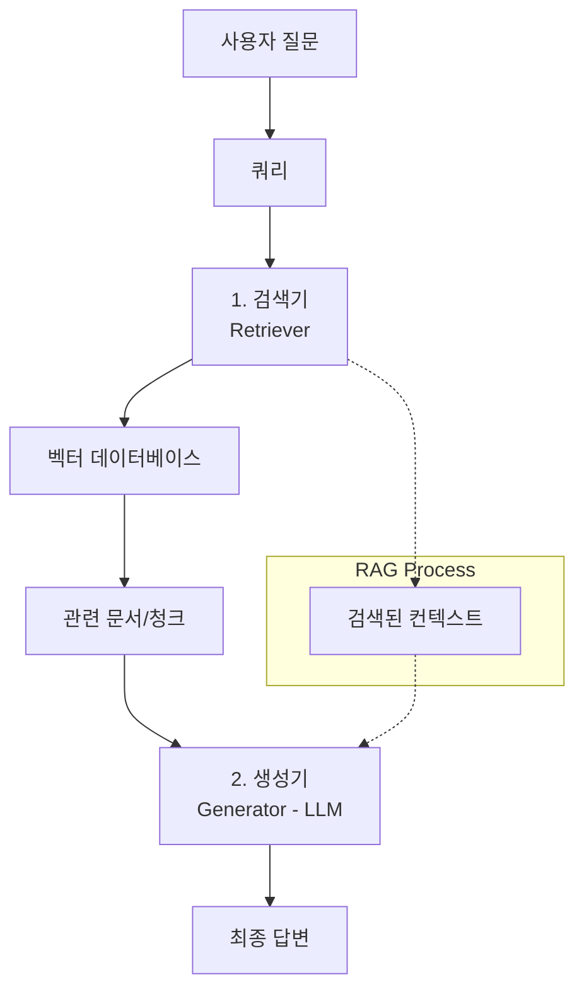

# 질문 응답 (QA) & 검색 증강 생성 (RAG)

## 1. 핵심 개념 (Core Concept)

**질문 응답(Question Answering, QA)**은 사용자의 질문에 대해 정확하고 간결한 답변을 제공하는 LLM의 핵심 응용 분야입니다. 특히 **검색 증강 생성(Retrieval-Augmented Generation, RAG)**은 LLM이 외부 지식 소스에서 관련 정보를 검색하여 답변을 생성하도록 함으로써, 모델의 **환각(hallucination)** 문제를 줄이고 최신 정보 및 특정 도메인 지식을 반영할 수 있게 하는 강력한 프레임워크입니다.

---

## 2. 상세 설명 (Detailed Explanation)

### 2.1 LLM 기반 질문 응답의 한계

사전학습된 LLM은 방대한 데이터를 통해 일반적인 지식을 습득하지만, 다음과 같은 한계가 있습니다.

*   **환각 (Hallucination)**: 모델이 사실과 다른 내용을 그럴듯하게 지어내는 현상.
*   **최신 정보 부족**: 학습 데이터셋 이후의 최신 정보를 알지 못함.
*   **도메인 특화 지식 부족**: 특정 기업의 내부 문서나 전문 분야의 지식에 대한 답변이 어려움.

### 2.2 검색 증강 생성 (RAG)의 등장

RAG는 이러한 LLM의 한계를 극복하기 위해 제안된 프레임워크입니다. RAG는 LLM이 답변을 생성하기 전에, 질문과 관련된 정보를 외부 데이터베이스(지식 베이스)에서 **검색(Retrieval)**하고, 이 검색된 정보를 바탕으로 **생성(Generation)**하도록 합니다.

**RAG의 주요 구성 요소:**

1.  **검색기 (Retriever)**: 사용자의 질문(쿼리)과 의미적으로 유사한 문서나 문서의 청크(chunk)를 외부 지식 베이스(주로 벡터 데이터베이스)에서 찾아옵니다. 이때 **임베딩 모델**과 **벡터 유사도 검색** 기술이 활용됩니다.
2.  **생성기 (Generator)**: 검색된 관련 문서(컨텍스트)와 사용자의 원래 질문을 함께 입력받아, 이를 바탕으로 최종 답변을 생성하는 LLM입니다.

### 2.3 RAG의 장점

*   **환각 감소**: 모델이 근거 없는 답변을 생성하는 대신, 실제 문서에서 찾은 정보를 기반으로 답변하므로 환각 현상이 크게 줄어듭니다.
*   **최신성 및 정확성**: 외부 지식 베이스를 주기적으로 업데이트함으로써, 모델이 항상 최신 정보를 활용할 수 있습니다.
*   **설명 가능성 (Explainability)**: 답변의 근거가 된 원본 문서를 함께 제시할 수 있어, 답변의 신뢰도를 높이고 사용자가 정보를 검증할 수 있게 합니다.
*   **도메인 특화**: 특정 도메인의 전문 지식(예: 기업 내부 문서, 의료 기록)을 LLM에 주입하는 데 매우 효과적입니다.

---

## 3. 예시 (Example)

### 사용 사례

*   **기업 내부 지식 검색**: 사내 규정, 기술 문서, 고객 지원 FAQ 등에서 질문에 대한 답변을 찾아 제공.
*   **법률/의료 정보 시스템**: 방대한 법률 문서나 의학 논문에서 특정 사례나 질병에 대한 정보를 추출하여 답변.
*   **개인화된 챗봇**: 사용자의 과거 대화 기록이나 선호도를 검색하여 더 맞춤화된 답변 제공.
*   **뉴스 요약 및 질의응답**: 실시간 뉴스 기사를 검색하여 특정 사건에 대한 질문에 답변.

---

## 4. 예상 면접 질문 (Potential Interview Questions)

*   **Q. RAG가 LLM의 환각(hallucination) 문제를 어떻게 완화하나요?**
    *   **A.** RAG는 LLM이 답변을 생성하기 전에 외부의 신뢰할 수 있는 지식 소스에서 관련 정보를 검색하여 컨텍스트로 제공합니다. 모델은 이 검색된 정보를 기반으로 답변을 생성하므로, 근거 없는 내용을 지어낼 가능성이 크게 줄어듭니다. 즉, 모델이 "상상"하는 대신 "참고"할 수 있는 명확한 근거를 제공하는 것입니다.

*   **Q. RAG 시스템에서 검색기(Retriever)의 성능이 중요한 이유는 무엇인가요?**
    *   **A.** 검색기의 성능은 RAG 시스템 전체의 성능에 직접적인 영향을 미칩니다. 만약 검색기가 질문과 관련 없는 문서를 가져오거나, 중요한 정보를 놓친다면, 아무리 강력한 LLM이라도 정확하고 유용한 답변을 생성하기 어렵습니다. "Garbage In, Garbage Out" 원칙이 여기에 적용됩니다. 따라서 질문의 의도를 정확히 파악하고 가장 관련성 높은 문서를 효율적으로 찾아내는 검색기의 역할이 매우 중요합니다.

*   **Q. RAG를 구현할 때 고려해야 할 주요 기술적 요소들은 무엇인가요?**
    *   **A.**
        1.  **문서 분할 (Chunking)**: 원본 문서를 LLM의 컨텍스트 윈도우에 맞게 의미 있는 단위로 나누는 전략.
        2.  **임베딩 모델 선택**: 질문과 문서의 의미를 잘 포착할 수 있는 고품질 임베딩 모델 선택.
        3.  **벡터 데이터베이스 (Vector DB)**: 대규모 벡터 데이터를 효율적으로 저장하고 유사도 검색을 수행할 수 있는 DB 선택 (예: Pinecone, Chroma, Weaviate).
        4.  **검색 전략**: 단순 유사도 검색 외에, 질문의 유형에 따라 검색 방식을 최적화하는 전략 (예: 하이브리드 검색, 재순위화).
        5.  **프롬프트 엔지니어링**: 검색된 컨텍스트와 질문을 LLM에 효과적으로 전달하는 프롬프트 구성.

---

## 5. 더 읽어보기 (Further Reading)

*   [Retrieval-Augmented Generation for Knowledge-Intensive NLP Tasks (RAG Paper)](https://arxiv.org/abs/2005.11401)
*   [What is Retrieval-Augmented Generation (RAG)? (NVIDIA Blog)](https://www.nvidia.com/en-us/glossary/data-science/retrieval-augmented-generation/)
*   [Building RAG from Scratch (LlamaIndex Blog)](https://www.llamaindex.ai/blog/building-rag-from-scratch-a-comprehensive-guide-to-retrieval-augmented-generation-03-12-2024)