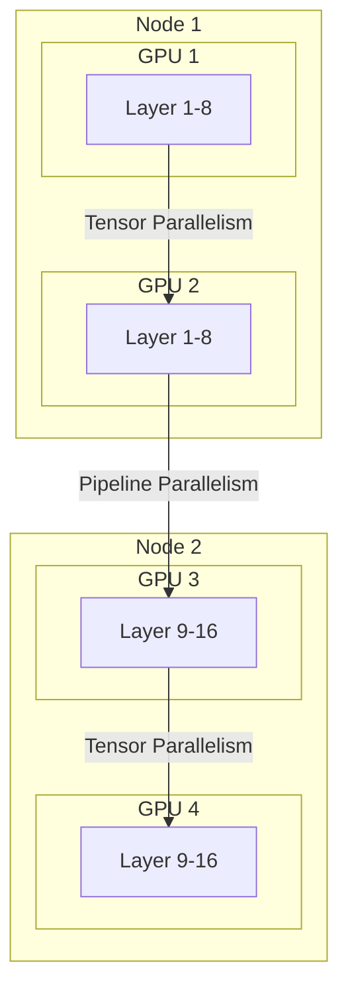

# LLM 분산 서빙 및 샤딩: Tensor, Pipeline, Data Parallelism

## 1. 핵심 개념 (Core Concept)

거대 언어 모델(LLM)은 수천억 개의 파라미터를 가져 단일 GPU의 메모리 용량을 초과하는 경우가 많습니다. 이로 인해 모델을 여러 GPU에 분산하여 학습하고 서빙하는 기술이 필수적입니다. 모델 병렬화(Model Parallelism)는 거대한 모델을 여러 조각으로 나누어(Sharding) 다수의 GPU에서 병렬로 처리하는 핵심 기술이며, 주로 **데이터 병렬주의(Data Parallelism)**, **텐서 병렬주의(Tensor Parallelism)**, **파이프라인 병렬주의(Pipeline Parallelism)** 세 가지 방식으로 나뉩니다.

---

## 2. 상세 설명 (Detailed Explanation)

### 2.1 데이터 병렬주의 (Data Parallelism)

데이터 병렬주의는 가장 기본적이고 널리 사용되는 분산 학습 방식입니다. 모델 전체를 여러 GPU에 복제한 후, 학습 데이터 배치를 나누어 각 GPU가 독립적으로 처리하도록 합니다. 각 GPU에서 계산된 그래디언트(Gradient)는 모든 GPU에 공유 및 동기화되어 모델 파라미터를 업데이트합니다.

*   **장점**: 구현이 비교적 간단하고, GPU 수에 비례하여 학습 처리량을 높일 수 있어 확장성이 좋습니다.
*   **단점**: 모든 GPU가 모델 전체의 복사본을 가져야 하므로, 모델 자체가 단일 GPU 메모리에収容 가능해야 한다는 제약이 있습니다. 또한, 그래디언트 동기화를 위한 통신 오버헤드가 발생합니다.
*   **주요 기술**: PyTorch의 `DistributedDataParallel (DDP)`가 대표적입니다. 메모리 중복 문제를 해결하기 위해 모델 파라미터, 그래디언트, 옵티마이저 상태까지 분산하는 ZeRO(Zero Redundancy Optimizer)와 같은 기술도 등장했습니다.

### 2.2 파이프라인 병렬주의 (Pipeline Parallelism)

파이프라인 병렬주의는 모델을 여러 개의 연속적인 레이어 그룹(Stage)으로 나누어 각 그룹을 다른 GPU에 할당하는 방식입니다. 마치 공장의 생산 라인처럼, 첫 번째 GPU가 특정 레이어들의 연산을 마치면 그 결과를 다음 GPU로 전달하여 순차적으로 처리합니다.

*   **장점**: 모델을 수직으로 분할하므로 단일 GPU의 메모리 한계를 넘어서는 매우 큰 모델을 학습시킬 수 있습니다.
*   **단점**: 순차적인 의존성 때문에 특정 GPU가 연산을 마칠 때까지 다음 GPU가 대기해야 하는 '버블(Bubble)' 또는 유휴 시간(Idle Time)이 발생하여 효율성이 저하될 수 있습니다.
*   **주요 기술**: GPipe, PipeDream 등은 미니 배치를 더 작은 마이크로 배치(Micro-batch)로 나누어 파이프라인의 유휴 시간을 최소화하고 효율성을 높이는 스케줄링 기법을 사용합니다.

### 2.3 텐서 병렬주의 (Tensor Parallelism)

텐서 병렬주의는 모델의 각 레이어 내부 연산(주로 거대한 행렬 곱셈)을 분할하여 여러 GPU에서 병렬로 처리하는 방식입니다. 예를 들어, `Y = XA` 라는 행렬 곱셈이 있을 때, 가중치 행렬 `A`를 열 기준으로 `[A1, A2]`로 분할하고, 각 GPU가 `XA1`과 `XA2`를 병렬로 계산한 뒤 결과를 합치는 방식입니다.

*   **장점**: 레이어 내부의 연산을 직접 분할하므로, 단일 레이어 자체가 너무 커서 GPU 하나에 들어가지 않는 경우에 효과적입니다. 파이프라인 병렬주의와 함께 사용되어 매우 큰 모델의 학습을 가능하게 합니다.
*   **단점**: 연산 결과를 합치기 위해 `all-reduce`와 같은 집합적 통신(Collective Communication)이 각 레이어마다 필요하여 통신 오버헤드가 클 수 있습니다.
*   **주요 기술**: NVIDIA의 Megatron-LM 프레임워크가 이 방식을 처음 구현하여 널리 알려졌습니다.

### 2.4 병렬주의 전략 비교

| 구분 | 분할 단위 | 장점 | 단점 | 주요 사용 사례 |
| :--- | :--- | :--- | :--- | :--- |
| **데이터 병렬주의** | 데이터 배치 | 구현 용이, 높은 확장성 | 모델이 단일 GPU에 맞아야 함, 동기화 오버헤드 | 모델이 단일 GPU에 들어갈 때 학습 속도 향상 |
| **파이프라인 병렬주의** | 모델 레이어 (수직 분할) | 초대형 모델 학습 가능 | 파이프라인 버블로 인한 GPU 유휴 시간 발생 | 모델이 단일 GPU 메모리를 초과할 때 |
| **텐서 병렬주의** | 레이어 내 연산 (수평 분할) | 단일 레이어가 매우 클 때 효과적 | 잦은 통신으로 인한 높은 오버헤드 | Transformer의 어텐션/MLP 블록 병렬화 |

---

## 3. 예시 (Example)

### 하이브리드 병렬 처리 (Hybrid Parallelism)

실제 초대형 모델 학습에서는 위 세 가지 병렬 처리 기법을 모두 조합하여 사용합니다. 예를 들어, 여러 노드(서버) 간에는 **파이프라인 병렬주의**를 적용하고, 각 노드 내의 GPU들 간에는 **텐서 병렬주의**를 사용하며, 이 전체 구성에 **데이터 병렬주의**를 추가하여 학습 처리량을 극대화합니다.

NVIDIA의 Megatron-LM이나 Microsoft의 DeepSpeed와 같은 프레임워크는 이러한 복잡한 3D 병렬화(데이터, 텐서, 파이프라인)를 효율적으로 관리하는 기능을 제공합니다.

*위 다이어그램은 2개의 노드에서 파이프라인 병렬주의와 텐서 병렬주의를 함께 사용하는 예시를 보여줍니다. 전체적으로는 데이터 병렬주의를 적용하여 여러 데이터 배치를 동시에 처리할 수 있습니다.*

---

## 4. 예상 면접 질문 (Potential Interview Questions)

*   **Q. 데이터 병렬주의의 한계는 무엇이며, 이를 해결하기 위해 어떤 병렬 처리 기법을 사용할 수 있습니까?**
    *   **A.** 데이터 병렬주의는 모델 전체가 각 GPU에 복제되어야 하므로, 모델 크기가 단일 GPU 메모리를 초과하면 사용할 수 없습니다. 이 경우, 모델 자체를 분할하는 모델 병렬화 기법인 파이프라인 병렬주의나 텐서 병렬주의를 사용해야 합니다. 파이프라인 병렬주의는 모델을 레이어 단위로 나누고, 텐서 병렬주의는 레이어 내의 행렬 연산을 나누어 처리합니다.

*   **Q. 파이프라인 병렬주의에서 발생하는 '버블(Bubble)' 문제란 무엇이며, 어떻게 완화할 수 있습니까?**
    *   **A.** '버블'은 파이프라인의 특정 스테이지가 이전 스테이지의 출력을 기다리면서 GPU가 아무 작업도 하지 않고 유휴 상태에 빠지는 현상을 의미합니다. 이는 순차적인 의존성 때문에 발생합니다. 이 문제를 완화하기 위해, 데이터 배치를 더 작은 마이크로 배치로 나누어 파이프라인을 거의 쉬지 않고 채우는 GPipe나 PipeDream과 같은 스케줄링 기법을 사용합니다.

*   **Q. 텐서 병렬주의와 파이프라인 병렬주의를 언제 각각 사용하는 것이 더 유리한가요?**
    *   **A.** 파이프라인 병렬주의는 모델의 전체 크기가 GPU 메모리를 초과할 때 주로 사용됩니다. 반면, 텐서 병렬주의는 모델의 특정 레이어, 특히 Transformer의 Self-Attention이나 MLP 블록의 가중치 행렬이 너무 커서 단일 GPU 메모리에 부담이 될 때 특히 유용합니다. 실제로는 두 기법을 조합하여 사용하는 경우가 많습니다. 예를 들어, 노드 간에는 파이프라인 병렬을, 노드 내에서는 텐서 병렬을 적용하는 식입니다.

---

## 5. 더 읽어보기 (Further Reading)

*   [Megatron-LM: Training Multi-Billion Parameter Language Models Using Model Parallelism (Paper)](https://arxiv.org/abs/1909.08053)
*   [DeepSpeed: Extreme-scale model training for everyone (Microsoft Research Blog)](https://www.microsoft.com/en-us/research/blog/deepspeed-extreme-scale-model-training-for-everyone/)
*   [Hugging Face - Parallelism methods](https://huggingface.co/docs/transformers/v4.20.1/en/parallelism)