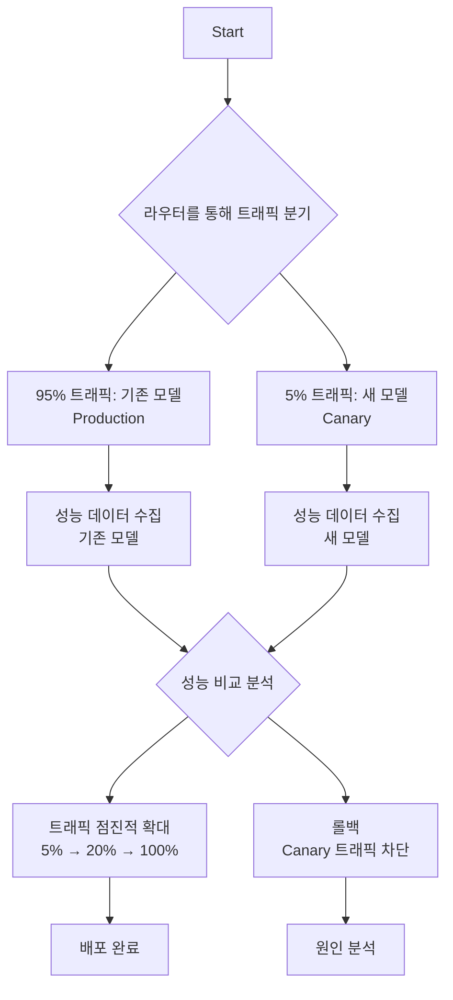

# 지속적 평가 및 카나리 배포 (Continuous Evaluation & Canary)

## 1. 핵심 개념 (Core Concept)

지속적 평가 및 카나리 배포는 새로운 LLM(거대 언어 모델) 버전을 프로덕션 환경에 배포할 때 발생할 수 있는 위험을 최소화하는 MLOps 전략임. **지속적 평가**는 배포된 모델의 성능을 실시간으로 모니터링하여 문제를 탐지하는 과정이며, **카나리 배포**는 새로운 모델을 소수의 사용자에게만 먼저 공개하여 안정성을 검증하고 점진적으로 트래픽을 확대하는 배포 방식임. 이 두 가지를 결합하여 서비스 중단 없이 안전하게 모델을 업데이트하고 성능을 최적으로 유지할 수 있음.

---

## 2. 상세 설명 (Detailed Explanation)

### 2.1 지속적 평가 (Continuous Evaluation)

오프라인 테스트 환경에서는 완벽했던 모델도 실제 프로덕션 환경에서는 다양한 이유로 성능이 저하될 수 있음. 예를 들어, 사용자 입력 데이터의 분포가 변하는 '데이터 드리프트(Data Drift)'나 시간의 흐름에 따라 정답의 관계가 변하는 '개념 드리프트(Concept Drift)'가 발생할 수 있음.

지속적 평가는 이러한 문제를 해결하기 위해 다음과 같은 항목들을 지속적으로 모니터링함.

*   **성능 지표**: 정확도, 응답 품질, RAG의 검색 정확도(Hit-Rate) 등 모델의 핵심 성능
*   **운영 지표**: 응답 지연 시간(Latency), 처리량(Throughput), 연산 비용(Cost)
*   **사용자 피드백**: 사용자의 '좋아요/싫어요' 반응, 만족도 점수(CSAT), 이탈률
*   **안전성 및 신뢰성**: 모델의 편향성(Bias), 유해성(Toxicity), 개인정보 노출 여부
*   **LLM 심사위원 (LLM-as-a-Judge)**: 더 강력한 LLM을 심사위원으로 사용하여, 현재 서비스 중인 모델의 응답 품질을 정성적으로 평가하는 자동화된 방식

### 2.2 카나리 배포 (Canary Deployment)

카나리 배포는 광산에서 유독 가스를 감지하기 위해 카나리아 새를 먼저 들여보냈던 것에서 유래한 용어임. 새로운 모델(카나리)을 전체 사용자 중 일부(예: 5~10%)에게만 먼저 노출시키고, 기존 모델(프로덕션)과 성능을 비교 분석함.

카나리 배포 과정은 다음과 같음.

이 방식을 통해 만약 새로운 모델에 문제가 있더라도, 소수의 사용자에게만 영향을 미치므로 전체 서비스의 안정성을 해치지 않고 롤백(Rollback)할 수 있음.

---

## 3. 예시 (Example)

### 시나리오: LLM 기반 고객 지원 챗봇 업데이트

한 회사에서 운영 중인 고객 지원 챗봇의 응답 품질을 개선하기 위해 새로운 버전의 LLM을 파인튜닝했음.

1.  **배포 전략**: 새로운 모델을 **카나리**로 배포하여 전체 문의 트래픽의 10%를 처리하도록 설정함.
2.  **평가 지표 설정**:
    *   **비즈니스 지표**: 상담원 연결 요청 비율 (낮을수록 좋음), 문제 해결 만족도 (높을수록 좋음)
    *   **운영 지표**: 평균 응답 시간, API 호출 비용
    *   **품질 지표**: LLM 심사위원을 통해 답변의 정확성 및 공손함 점수화
3.  **평가 및 의사결정**: 24시간 동안 두 모델의 성능 지표를 대시보드에서 비교 분석함.
    *   **결과**: 카나리 모델이 상담원 연결 요청 비율을 15% 감소시켰고, 응답 시간도 허용 범위 내에 있었음.
    *   **결정**: 카나리 모델의 성능이 우수하다고 판단하여, 트래픽을 50%로 늘린 후 최종적으로 100%로 전환하여 배포를 완료함. 만약 성능이 더 나빴다면 즉시 트래픽을 0%로 되돌려 롤백했을 것임.

---

## 4. 예상 면접 질문 (Potential Interview Questions)

*   **Q. LLM 기반 서비스를 운영할 때, 새로운 모델 버전으로 안전하게 업데이트하기 위한 전략은 무엇인가요?**
    *   **A.** 지속적 평가와 카나리 배포를 결합하는 것이 핵심입니다. 먼저 새로운 모델을 카나리로 배포하여 일부 트래픽만 처리하게 하고, 기존 모델과 핵심 성능 지표(응답 품질, 지연 시간, 비용, 사용자 피드백 등)를 실시간으로 비교 평가합니다. 카나리 모델의 성능이 목표 수준을 만족하거나 더 우수할 경우, 트래픽을 점진적으로 늘려 전체 배포를 완료하고, 문제가 발생하면 즉시 롤백하여 서비스 영향을 최소화합니다.

*   **Q. 카나리 배포 시 LLM에 특화된 평가 지표는 무엇이 있을까요? 기존 ML 모델과 다른 점은 무엇인가요?**
    *   **A.** 기존 ML 모델은 정확도, F1 점수 등 정량화된 지표로 평가하기 비교적 쉽습니다. 반면 LLM은 답변의 유용성, 창의성, 논리성, 안전성 등 정성적인 측면이 매우 중요합니다. 따라서 LLM-as-a-Judge를 활용한 자동 평가, 실제 사용자 피드백, A/B 테스팅 결과 등을 핵심 지표로 삼아야 합니다. 이처럼 LLM은 출력이 비정형 텍스트이므로 평가가 더 복잡하고 다차원적입니다.

*   **Q. 모델 성능 저하를 감지하고 롤백을 결정하는 기준은 무엇이며, 이 과정을 자동화할 수 있나요?**
    *   **A.** 핵심 비즈니스 및 성능 지표(KPI)에 대한 임계값을 미리 설정하는 것이 중요합니다. 예를 들어, '상담원 연결 요청률 5% 이상 증가', '응답 지연 시간 500ms 초과', '유해 답변 탐지율 1% 이상' 등 명확한 기준을 정의합니다. 모니터링 시스템(예: Prometheus, Datadog)을 통해 이 지표들을 실시간으로 추적하고, 임계값 위반 시 자동으로 알림을 보내거나 CI/CD 파이프라인과 연동하여 배포를 즉시 롤백하는 워크플로우를 구축하여 자동화할 수 있습니다.

---

## 5. 더 읽어보기 (Further Reading)

*   [Canary Release by Martin Fowler](https://martinfowler.com/bliki/CanaryRelease.html)
*   [Patterns for building LLM-powered systems by Eugene Yan](https://eugeneyan.com/writing/llm-patterns/)
*   [Monitoring LLM-based applications (OpenAI Cookbook)](https://cookbook.openai.com/examples/monitoring_llm_based_applications)