# Long Context 처리 기술

## 1. 핵심 개념 (Core Concept)

Long Context 처리 기술은 LLM(거대 언어 모델)이 수만에서 수백만 토큰에 달하는 긴 입력 시퀀스를 효율적으로 처리하고, 그 안의 정보를 정확하게 이해 및 활용할 수 있도록 하는 최적화 기법 모음임. 표준 트랜스포머의 어텐션 메커니즘은 시퀀스 길이에 따라 계산량이 제곱으로 증가($O(N^2)$)하여 긴 컨텍스트 처리에 병목이 됨. **FlashAttention**, **RoPE (Rotary Position Embedding)** 스케일링과 같은 기술들은 이러한 병목을 해결하여 LLM의 컨텍스트 창을 크게 확장하는 데 핵심적인 역할을 함.

---

## 2. 상세 설명 (Detailed Explanation)

### 2.1 문제점: 표준 어텐션의 한계

트랜스포머의 셀프 어텐션 메커니즘은 시퀀스 내의 모든 토큰 쌍 간의 관계를 계산함. 시퀀스 길이가 N일 때, N x N 크기의 어텐션 스코어 행렬을 계산하고 저장해야 함.

*   **계산 복잡도**: $O(N^2 \cdot d)$, 여기서 d는 헤드 차원. 시퀀스 길이가 2배가 되면 계산량은 4배가 됨.
*   **메모리 복잡도**: $O(N^2)$. 어텐션 행렬을 GPU의 SRAM에 저장해야 하므로 긴 시퀀스에서는 메모리 병목이 발생함.

이러한 문제로 인해 초기 트랜스포머 모델들은 수천 토큰 정도의 비교적 짧은 컨텍스트만 처리할 수 있었음.

### 2.2 해결책 1: FlashAttention - I/O-Aware Attention

FlashAttention은 어텐션 계산 과정을 최적화하여 GPU 메모리 사용량을 줄이고 속도를 높이는 알고리즘임. 핵심 아이디어는 GPU의 메모리 계층 구조(느린 HBM과 빠른 SRAM)를 효율적으로 활용하는 것임.

*   **Tiling (타일링)**: 전체 어텐션 행렬을 한 번에 계산하고 저장하는 대신, 입력 행렬(Q, K, V)을 작은 블록(타일)으로 나눔. 각 블록을 SRAM으로 가져와 어텐션 계산을 수행하고, 중간 결과만 HBM에 저장함.
*   **커널 퓨전 (Kernel Fusion)**: 여러 개의 GPU 연산(행렬 곱, Softmax 등)을 하나의 커널로 통합하여, GPU HBM과 SRAM 간의 데이터 전송 횟수를 최소화함.

이를 통해 $O(N^2)$의 메모리 요구량을 $O(N)$으로 줄이고, 실제 연산 속도를 수 배 향상시킴. FlashAttention-2, 3로 버전업되면서 효율성은 더욱 개선됨.

```mermaid
graph TD
    subgraph "Standard Attention"
        A[Load Q, K, V from HBM] --> B[Compute S = QK^T]
        B --> C[Store S in HBM]
        C --> D[Load S from HBM]
        D --> E[Compute P = softmax S]
        E --> F[Store P in HBM]
        F --> G[Load P, V from HBM]
        G --> H[Compute O = PV]
        H --> I[Store O in HBM]
    end

    subgraph "FlashAttention"
        J[Load Q, K, V blocks<br/>from HBM to SRAM] --> K[Fused Kernel:<br/>Compute Attention Output]
        K --> L[Write final Output<br/>block to HBM]
    end
```

### 2.3 해결책 2: RoPE 스케일링 - 위치 인코딩 확장

RoPE(Rotary Position Embedding)는 토큰의 절대 위치가 아닌 상대 위치 정보를 기반으로 위치를 인코딩하는 기법임. 사전 학습 시 사용된 컨텍스트 길이보다 더 긴 컨텍스트를 처리하려면 RoPE를 '스케일링'해야 함.

*   **Position Interpolation (PI)**: 기존 위치 인덱스의 범위를 선형적으로 압축하여 더 긴 컨텍스트에 매핑함. 예를 들어, 4096 길이로 학습된 모델을 8192 길이로 확장할 때, 위치 인덱스를 2로 나누어 0~4095 범위 내에 머물도록 조정함.
*   **YaRN (Yet another RoPE extensioN method)**: PI의 한계를 개선한 방법으로, 특정 주파수 대역은 보간하고 다른 대역은 그대로 두는 등 더 정교한 방식으로 RoPE를 스케일링하여 긴 컨텍스트에서도 성능 저하를 최소화함.

이러한 스케일링 기법들은 모델을 처음부터 다시 학습하지 않고도 컨텍스트 창을 효과적으로 확장할 수 있게 해줌.

---

## 3. 예시 (Example)

### 사용 사례: 법률 문서 분석 및 요약

수백 페이지에 달하는 법률 계약서(수십만 토큰)를 LLM에 입력하여 핵심 조항을 요약하거나 특정 조건의 유불리를 분석하는 시나리오.

*   **문제**: 표준 트랜스포머는 이 정도 길이의 문서를 한 번에 처리할 수 없음.
*   **해결**: FlashAttention과 RoPE 스케일링이 적용된 Long Context LLM(예: GPT-4, Claude 3)은 전체 문서를 한 번에 컨텍스트에 넣고 분석할 수 있음. 이를 통해 문서 전체에 걸쳐 있는 복잡한 상호 참조나 맥락을 놓치지 않고 정확한 답변을 생성할 수 있음.

---

## 4. 예상 면접 질문 (Potential Interview Questions)

*   **Q. 왜 표준 트랜스포머 아키텍처는 긴 시퀀스를 처리하기 어려운가요?**
    *   **A.** 주된 이유는 셀프 어텐션 메커니즘의 계산 및 메모리 복잡도가 시퀀스 길이(N)의 제곱에 비례($O(N^2)$)하기 때문입니다. 시퀀스가 길어지면 어텐션 스코어 행렬을 저장하기 위한 메모리 요구량이 폭발적으로 증가하고, 계산 시간도 급격히 늘어나 GPU에서 처리하기 어려워집니다.

*   **Q. FlashAttention은 어떤 원리로 어텐션의 병목을 해결하나요?**
    *   **A.** FlashAttention은 전체 어텐션 행렬을 HBM에 저장하지 않고, 입력을 작은 블록(타일)으로 나누어 GPU의 빠른 SRAM에서 계산을 수행하는 '타일링' 기법을 사용합니다. 또한, 여러 연산을 하나의 GPU 커널로 묶는 '커널 퓨전'을 통해 느린 HBM 메모리와의 데이터 전송을 최소화합니다. 이를 통해 메모리 사용량을 $O(N^2)$에서 $O(N)$으로 줄이고 계산 속도를 크게 향상시킵니다.

*   **Q. 사전 학습된 모델의 컨텍스트 길이를 파인튜닝 단계에서 확장(extend)하려면 어떤 방법을 사용할 수 있나요?**
    *   **A.** RoPE(Rotary Position Embedding) 스케일링 기법을 사용할 수 있습니다. 대표적으로 Position Interpolation(PI)은 기존 위치 인덱스를 더 긴 컨텍스트 길이에 맞게 선형적으로 압축하여 매핑하는 방식입니다. 최근에는 YaRN과 같이 성능 저하를 최소화하면서 컨텍스트를 확장하는 더 정교한 스케일링 기법들도 제안되었습니다. 이러한 방법들은 모델을 재학습할 필요 없이 컨텍스트 창을 늘릴 수 있게 해줍니다.

---

## 5. 더 읽어보기 (Further Reading)

*   [FlashAttention: Fast and Memory-Efficient Exact Attention with IO-Awareness (Paper)](https://arxiv.org/abs/2205.14135)
*   [FlashAttention-2: Faster Attention with Better Parallelism and Work Partitioning (Paper)](https://arxiv.org/abs/2307.08691)
*   [Extending Context Window of Large Language Models via Positional Interpolation (Paper)](https://arxiv.org/abs/2306.15595)
*   [YaRN: Efficient Context Window Extension of Large Language Models (Paper)](https://arxiv.org/abs/2309.00071)