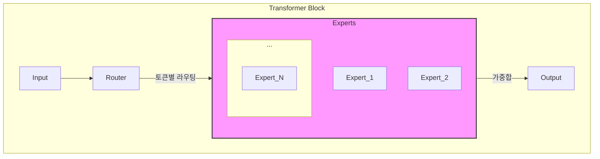

# MoE 라우터와 희소 혼합 (MoE Router & Sparse Mixture)

## 1. 핵심 개념 (Core Concept)

MoE(Mixture-of-Experts)는 모델의 전체 파라미터 수를 크게 늘리면서도, 추론 시에는 일부 파라미터만 활성화하여 계산 비용을 효율적으로 관리하는 트랜스포머 아키텍처임. **라우터(Router)** 또는 \*\*게이팅 네트워크(Gating Network)\*\*는 각 입력 토큰을 처리할 최적의 '전문가(Expert)' 하위 네트워크를 동적으로 선택하는 역할을 함. 이 과정을 통해 모델의 일부만 '희소(Sparse)'하게 활성화되므로, 모델 용량(capacity)과 계산 효율성 사이의 균형을 맞출 수 있음.

______________________________________________________________________

## 2. 상세 설명 (Detailed Explanation)

### 2.1 MoE 아키텍처의 구조

기존의 트랜스포머 모델은 모든 입력에 대해 전체 FFN(Feed-Forward Network) 레이어의 파라미터를 사용함(Dense 모델). 반면, MoE 모델은 FFN 레이어를 여러 개의 '전문가' 네트워크로 대체하고, 어떤 전문가를 사용할지를 결정하는 '라우터'를 추가함.

- **전문가 (Experts)**: 각각 독립적인 파라미터를 가진 작은 신경망(주로 FFN). 각 전문가는 특정 종류의 데이터나 패턴 처리에 특화될 수 있음.
- **라우터 (Router / Gating Network)**: 입력 토큰을 받아, 어떤 전문가에게 전달할지를 결정하는 작은 신경망. 일반적으로 Softmax 함수를 통해 각 전문가에 대한 확률 분포를 계산하고, 가장 높은 확률을 가진 상위 K개의 전문가(Top-K)를 선택함.

### 2.2 희소 활성화 (Sparse Activation)와 라우팅

MoE의 핵심은 \*\*희소성(Sparsity)\*\*임. 모든 입력에 대해 모든 전문가를 사용하는 대신, 라우터는 각 토큰에 대해 가장 관련성 높은 소수의 전문가(예: 8개 중 2개)만 활성화함.

1. **라우팅 결정**: 라우터는 입력 토큰의 임베딩을 받아 각 전문가에 대한 로짓(logit)을 계산함.
1. **Top-K 선택**: 이 로짓에 Softmax를 적용하여 확률 값을 얻고, 가장 높은 확률을 가진 K개의 전문가를 선택함. (K는 보통 1 또는 2).
1. **가중합(Weighted Sum)**: 선택된 K개 전문가의 출력은 라우터가 계산한 확률 값(가중치)과 곱해져 최종 출력을 만듦.

이러한 희소 활성화 덕분에, 모델의 총 파라미터 수가 수천억 개에 달하더라도 실제 추론에 사용되는 파라미터 수는 훨씬 작아져, 학습 및 추론 속도를 크게 향상시킬 수 있음.

### 2.3 로드 밸런싱 (Load Balancing)

MoE 학습 시 발생하는 주요 문제 중 하나는 라우터가 특정 소수의 전문가만 선호하는 '쏠림 현상'임. 이 경우 대부분의 전문가는 학습되지 않고 비효율이 발생함. 이를 해결하기 위해 \*\*로드 밸런싱 손실(Load Balancing Loss)\*\*이라는 보조 손실 함수를 전체 손실 함수에 추가함.

- **목표**: 모든 전문가가 비슷한 수의 토큰을 처리하도록 유도함.
- **방식**: 각 전문가에게 할당된 토큰의 비율과 라우터의 가중치 분산을 고려하여, 특정 전문가에게 트래픽이 몰릴 경우 페널티를 부과함.

______________________________________________________________________

## 3. 예시 (Example)

### 사용 사례: 다국어 번역 모델

거대한 다국어 번역 모델을 MoE 아키텍처로 구현하는 시나리오:

- **전문가 특화**: 각 전문가는 특정 언어 쌍(예: 영어→한국어)이나 특정 도메인(예: 법률, 의료)의 번역을 학습하도록 자연스럽게 특화될 수 있음.
- **라우팅**: 입력 문장이 "I want to go home"이라면, 라우터는 이 토큰들을 '영어'와 관련된 전문가들에게 보낼 가능성이 높음.
- **효율성**: 모델은 수십 개의 언어를 지원하는 방대한 파라미터를 가지지만, 실제 번역 시에는 입력 언어와 관련된 소수의 전문가만 활성화되므로 효율적인 추론이 가능함.

______________________________________________________________________

## 4. 예상 면접 질문 (Potential Interview Questions)

- **Q. MoE(Mixture-of-Experts) 모델이 기존의 Dense 모델에 비해 갖는 장점은 무엇인가요?**

  - **A.** MoE 모델은 파라미터 수를 크게 늘려 모델의 용량과 성능을 높이면서도, 추론 시에는 입력에 따라 일부 전문가만 희소하게 활성화하여 계산 비용을 거의 일정하게 유지할 수 있습니다. 이는 더 적은 계산량으로 더 크고 강력한 모델을 학습하고 서빙할 수 있게 해준다는 장점이 있습니다.

- **Q. MoE 모델의 라우터는 어떤 역할을 하며, 학습 시 발생할 수 있는 주요 문제는 무엇인가요?**

  - **A.** 라우터는 각 입력 토큰을 처리할 가장 적합한 전문가(Expert)를 동적으로 선택하는 게이팅 네트워크입니다. 주요 문제로는 '라우팅 쏠림' 현상이 있습니다. 즉, 라우터가 소수의 인기 있는 전문가에게만 대부분의 토큰을 보내고 나머지 전문가는 거의 사용되지 않아 학습이 비효율적으로 되는 문제입니다.

- **Q. 라우팅 쏠림 문제를 해결하기 위한 방법은 무엇인가요?**

  - **A.** 로드 밸런싱 손실(Load Balancing Loss)이라는 보조 손실 함수를 사용합니다. 이 손실 함수는 각 전문가에게 할당되는 토큰의 양을 균등하게 분배하도록 유도하여, 특정 전문가에게 트래픽이 집중될 경우 페널티를 부과합니다. 이를 통해 모든 전문가가 균형 있게 학습에 참여하도록 만듭니다.

______________________________________________________________________

## 5. 더 읽어보기 (Further Reading)

- [Outrageously Large Neural Networks: The Sparsely-Gated Mixture-of-Experts Layer (Original MoE Paper)](https://arxiv.org/abs/1701.06538)
- [Switch Transformers: Scaling to Trillion Parameter Models with Simple and Efficient Sparsity](https://arxiv.org/abs/2101.03961)
- [Mixtral of Experts (Mistral AI Blog)](https://mistral.ai/news/mixtral-of-experts/)
