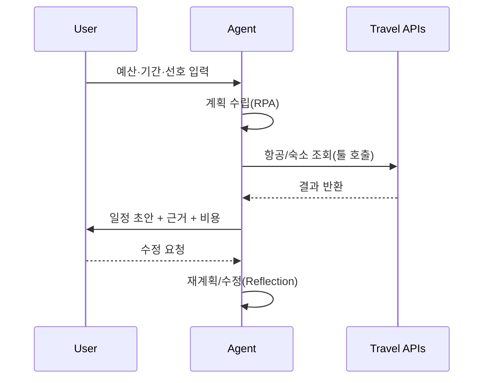

# 에이전트 기본 개념

## 1. 핵심 개념 (Core Concept)

LLM을 “사고 엔진”으로 사용하는 에이전트는 목표를 달성하기 위해 계획하고 행동하며, 환경(도구·데이터·사람)과 상호작용하는 소프트웨어 구성체입니다. 단순 질답형 챗봇을 넘어 “목표 지향(Goal-driven)”과 “도구 사용(Tool-augmented)”이 핵심입니다.

---

## 2. 상세 설명 (Detailed Explanation)

### 2.1 LLM 기반 에이전트

- LLM 추론 + 툴 호출(Function/Tool Calling)로 능력을 확장합니다.
- 예: 웹 검색, 데이터베이스 조회, 코드 실행, 문서 생성, 티켓 발행 등.

### 2.2 자율성 (Autonomy)

- 작업 분해, 재계획, 실패 복구를 스스로 수행합니다.
- 자율성 수준: 반자율(사람 승인 필요) ↔ 완전 자율(Guardrail 엄격).

### 2.3 목표 지향성 (Goal-driven)

- 명시적 목표와 평가 기준을 바탕으로 탐색/개선 루프를 반복합니다.
- 목표 정의는 자연어보다 JSON Schema 기반 구조화가 안정적입니다.

### 2.4 에이전트 vs 일반 챗봇
- 챗봇: 단발성 질답, 도구 사용 제한적, 상태 보존 약함.
- 에이전트: 목표·계획·도구 호출·메모리·평가·재계획이 결합된 폐루프 시스템.

### 2.5 핵심 용어(Glossary)
- RPA: Reasoning→Planning→Acting 순환. 결과 관찰 후 다음 스텝으로.
- Reflection/Reflexion: 자기비판·자체 피드백 기반 개선 루프.
- ReAct: 추론과 행동을 교차하며 도구를 효율적 사용.
- ToT/GoT: 트리/그래프 탐색으로 다중 경로 추론 강화.

---

## 3. 예시 (Example)

- 여행 일정 에이전트: 예산·기간·선호를 받아 일정 초안 생성 → 숙소·교통 API 조회 → 충돌/비용 검증 → 사용자 피드백 반영.

---

## 4. 예상 면접 질문 (Potential Interview Questions)

- LLM 챗봇과 Agent의 차이는 무엇인가?
- 목표를 구조화해 안정적으로 전달하는 방법은?

---

## 5. 더 읽어보기 (Further Reading)

- docs/references/openai/a-practical-guide-to-building-agents-3.pdf
- docs/references/anthropic/building-effective-agents.md

---

## 6. 참고 이미지 (Images)

- Anthropic: Building Effective Agents 개요 다이어그램
  - docs/references/anthropic/images/building-effective-agents-1.webp
  - docs/references/anthropic/images/building-effective-agents-2.webp
