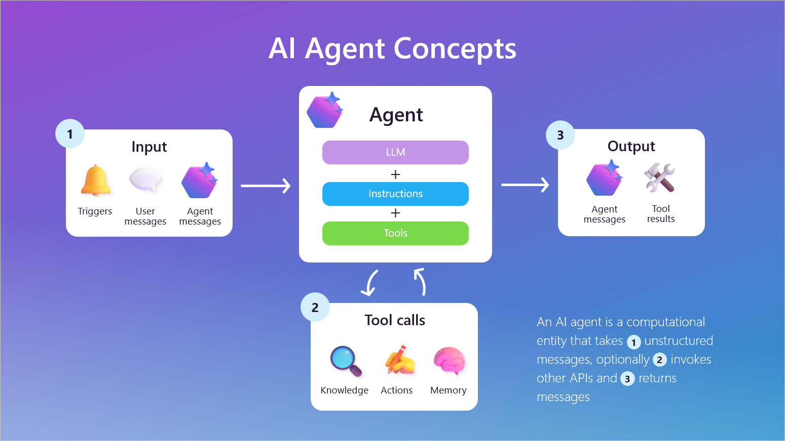
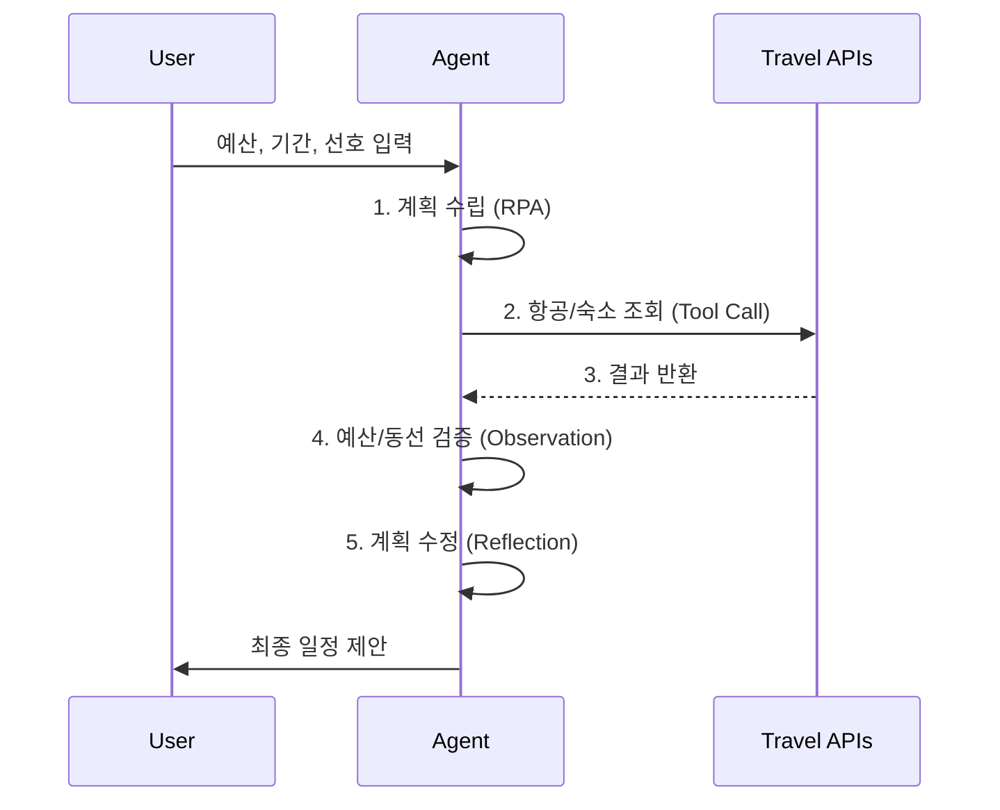

# 에이전트 기본 개념

## 1. 핵심 개념 (Core Concept)

LLM을 **사고의 엔진**으로 사용하는 AI 에이전트는, 주어진 목표를 달성하기 위해 **스스로 계획하고, 다양한 도구를 사용하며, 주변 환경과 상호작용**하는 자율적인 소프트웨어입니다. 이는 단순히 질문에 답하는 챗봇을 넘어, 명확한 **목표 지향성(Goal-driven)** 과 **도구 사용 능력(Tool-augmented)** 을 갖춘 문제 해결사(Problem-solver)에 가깝습니다.

______________________________________________________________________

## 2. 상세 설명 (Detailed Explanation)

### 2.1 에이전트의 3대 특징

1. **LLM 기반 (LLM-based)**: LLM의 뛰어난 언어 이해 및 추론 능력을 바탕으로 복잡한 지시를 이해하고, 계획을 수립하며, 결과를 해석합니다.
1. **자율성 (Autonomous)**: 사용자의 모든 단계를 지시받지 않고, 목표 달성을 위해 스스로 하위 작업을 분해하고, 도구를 선택하며, 예상치 못한 문제 발생 시 계획을 수정하여 대처합니다.
1. **목표 지향성 (Goal-driven)**: "오늘 날씨 어때?" 같은 단발성 질문이 아닌, "서울에서 부산까지 가는 가장 빠른 방법 찾아줘" 와 같이 명확한 끝점이 있는 목표를 받아 수행합니다.

### 2.2 에이전트 vs. 일반 챗봇

에이전트와 챗봇의 가장 큰 차이는 **'자율적인 행동 여부'** 입니다.

| 구분          | LLM 챗봇 (Chatbot)                            | AI 에이전트 (Agent)                                                            |
| :------------ | :-------------------------------------------- | :----------------------------------------------------------------------------- |
| **주요 목적** | 대화, 정보 요약, 질의응답                     | **목표 달성**, 문제 해결, 작업 수행                                            |
| **동작 방식** | 수동적 (Reactive): 사용자의 프롬프트에 응답   | 능동적/자율적 (Proactive/Autonomous): 목표를 향해 스스로 계획하고 행동         |
| **도구 사용** | 제한적 (예: 단순 웹 검색)                     | **핵심 기능**: API, 데이터베이스, 파일 시스템 등 다양한 도구를 적극적으로 사용 |
| **메모리**    | 단기 기억 (Short-term): 최근 대화 내용만 기억 | 장기/구조적 기억 (Long-term): 대화, 과거 행동, 사용자 선호도 등 복합적 기억    |
| **작업 흐름** | 단일 응답 (Single-turn)                       | **반복 루프 (Multi-step Loop)**: 추론-계획-행동-관찰 사이클 반복               |
| **예시**      | "AI 에이전트가 뭐야?" → 정의 설명             | "내일 제주도 여행 계획 짜줘" → 항공편 검색, 숙소 예약, 일정 생성               |

### 2.3 핵심 용어 (Glossary)

- **RPA (Reasoning-Planning-Acting)**: 에이전트의 기본 동작 사이클. **추론**하고, **계획**하고, **행동**한 뒤, 결과를 관찰하여 다음 행동을 결정합니다.
- **ReAct (Reason + Act)**: 추론(Thought)과 행동(Action)을 번갈아 수행하며, 마치 사람이 생각하고 행동하듯 외부 도구를 효율적으로 사용하는 패턴입니다.
- **Reflection/Reflexion**: 자기 비판. 행동이 실패하거나 결과가 좋지 않을 때, 그 원인을 스스로 분석하고 교훈을 얻어 다음 계획에 반영하는 자기 개선 루프입니다.
- **ToT/GoT (Tree/Graph of Thoughts)**: 단일 경로가 아닌, 트리나 그래프 형태로 여러 가능한 해결 경로를 동시에 탐색하여 더 나은 결론을 도출하는 고급 추론 방식입니다.

______________________________________________________________________

## 3. 예시 (Example)

- **여행 플래너 에이전트**
  1. **목표 수신**: 사용자가 예산, 기간, 여행 스타일 등 선호를 입력합니다.
  1. **계획 수립 (Planning)**: 입력된 정보를 바탕으로 대략적인 여행 계획의 뼈대를 세웁니다.
  1. **도구 사용 (Acting)**: 항공권 API, 숙소 예약 API를 호출하여 실제 가격과 예약 가능 여부를 확인합니다.
  1. **관찰 및 검증 (Observation)**: API 결과를 바탕으로 예산이 초과되거나 동선이 비효율적인 부분을 발견합니다.
  1. **성찰 및 재계획 (Reflection)**: "숙소 비용이 예산을 초과했으니, 더 저렴한 대안을 찾아보자" 와 같이 계획을 수정하고, 사용자에게 최종 제안을 합니다.

______________________________________________________________________

## 4. 예상 면접 질문 및 모범 답안

### Q1. LLM 챗봇과 AI 에이전트의 가장 큰 차이점은 무엇인가요?

**A.** 가장 큰 차이는 **'자율적인 행동 여부'** 입니다. 챗봇은 주로 사용자의 질문에 수동적으로 답변하는 대화형 인터페이스인 반면, 에이전트는 주어진 목표를 달성하기 위해 스스로 계획을 세우고, 외부 도구를 사용하여 능동적으로 작업을 수행하는 시스템입니다. 즉, 챗봇은 '답변'을 하지만 에이전트는 '행동'을 합니다.

**\[추가 설명\]**
챗봇과 에이전트는 목적, 행동 방식, 도구 사용, 메모리 구조에서 명확한 차이를 보입니다. 챗봇이 정보를 요약하고 질문에 답하는 '정보 전달자'에 가깝다면, 에이전트는 항공편을 예약하고, 코드를 디버깅하며, 리포트를 작성하는 등 구체적인 과업을 완수하는 '문제 해결사'에 가깝습니다. 이러한 차이는 에이전트가 도구 사용, 장기 기억, 그리고 추론-계획-행동으로 이어지는 자율적인 실행 루프를 핵심 기능으로 갖기 때문에 발생합니다.

### Q2. 에이전트에게 모호하지 않고 안정적으로 목표를 전달하는 방법은 무엇인가요?

**A.** 자연어의 모호성을 피하기 위해, **JSON Schema와 같은 구조화된 형식**으로 목표를 정의하는 것이 가장 안정적입니다. 이를 통해 최종 결과물의 형식, 필수 필드, 제약 조건(예: 글자 수 제한) 등을 기계가 명확히 이해할 수 있는 방식으로 전달할 수 있어, 에이전트가 일관성 있고 예측 가능한 결과물을 생성하도록 유도할 수 있습니다.

**\[추가 설명\]**

- **문제점**: "경쟁사 분석 보고서 써줘" 라는 자연어 목표는 '어떤 경쟁사인지', '보고서에 어떤 내용이 들어가야 하는지' 등 중요한 정보가 누락되어 에이전트가 엉뚱한 결과물을 만들 수 있습니다.
- **해결책 (구조화된 목표 정의)**:
  1. **출력 형식 정의 (Output Schema)**: 최종 결과물이 가져야 할 구조를 JSON Schema로 명시합니다. 예를 들어, `title`, `summary`, `competitors` (배열), `analysis` 등의 필드를 정의합니다.
  1. **제약 조건 명시 (Constraints)**: 각 필드의 데이터 타입(string, number), 길이 제한(`maxLength`), 필수 여부(`required`) 등을 명시하여 결과물의 형태를 강제합니다.
  1. **입력 값 제공 (Inputs)**: `{"competitors": ["회사A", "회사B"]}` 와 같이 분석 대상을 명확한 데이터로 함께 전달합니다.
- **기대 효과**: 이렇게 목표를 구조화하면, 에이전트의 작업은 '창작'이 아닌 '정해진 틀 채우기'에 가까워집니다. 이는 LLM이 훨씬 더 잘 수행하는 작업이며, 결과물의 신뢰도와 일관성을 극적으로 향상시킵니다.

______________________________________________________________________

## 5. 더 읽어보기 (Further Reading)

- [A Practical Guide to Building Agents (OpenAI)](/docs/references/openai/a-practical-guide-to-building-agents-3.pdf)
- [Building effective agents (Anthropic)](/docs/references/anthropic/building-effective-agents.md)
