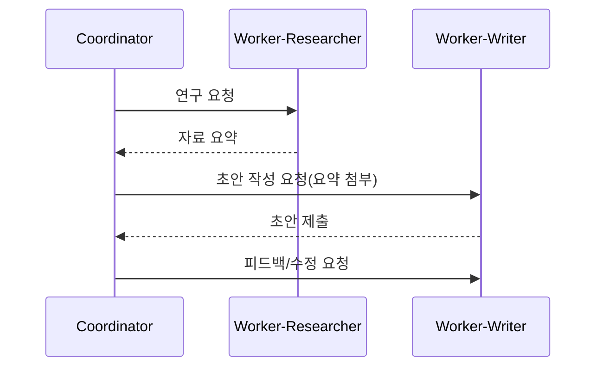

# 에이전트 간 상호작용: 패턴과 프로토콜

## 1. 핵심 개념 (Core Concept)

복잡한 문제를 해결하기 위해 여러 에이전트가 역할을 분담하고 협업하는 것을 **멀티-에이전트 시스템(Multi-Agent System)** 이라고 합니다. 이러한 시스템의 핵심은 에이전트 간의 원활한 상호작용을 보장하는 **협업 패턴(Collaboration Patterns)** 과 표준화된 **통신 규약(Communication Protocols)** 입니다. 상황에 맞는 패턴을 선택하고 명확한 프로토콜을 정의하는 것이 시스템의 성능과 확장성을 좌우합니다.

______________________________________________________________________

## 2. 상세 설명 (Detailed Explanation)

### 2.1 A2A와 ACP: 상호작용의 원리와 규칙

- **A2A (Agent-to-Agent) 상호작용**: 여러 에이전트가 정보를 교환하고 협력하는 행위 자체를 의미하는 광의의 개념입니다. 이는 마치 팀원들이 서로 대화하며 일하는 것과 같습니다.
- **ACP (Agent Communication Protocol)**: A2A 상호작용이 원활하게 이루어지도록 하는 표준화된 '언어와 규칙'입니다. ACP는 메시지 형식, 상태 공유 방법, 역할 분배 규칙 등을 정의하여, 어떤 에이전트든 이 규약만 따르면 시스템에 참여하고 협업할 수 있도록 보장합니다. 즉, **ACP는 확장 가능한 A2A를 위한 기술적 기반**입니다.

### 2.2 주요 협업 패턴 (Collaboration Patterns)

어떤 문제를 해결하느냐에 따라 다양한 협업 패턴을 적용할 수 있습니다.

*Note: 아래 다이어그램을 위한 이미지를 `docs/images/multi-agent-collaboration-patterns.png` 에 추가해주세요.*

#### 1. 코디네이터-워커 패턴 (Coordinator-Worker)

- **구조**: 중앙의 '코디네이터' 에이전트가 작업을 계획하고, 전문성을 가진 '워커' 에이전트들에게 작업을 분배하고 결과를 취합하는 계층적 구조입니다.
- **장점**: 역할과 책임이 명확하고, 전체 작업 흐름을 중앙에서 관리하기 용이합니다.
- **단점**: 코디네이터에 병목이 발생할 수 있고, 코디네이터의 성능이 전체 시스템의 성능을 좌우합니다.
- **예시**: 리서치 보고서 작성 (코디네이터가 '리서처', '작성자', '교정자'에게 순서대로 작업을 지시)

#### 2. 위원회 패턴 (Committee)

- **구조**: 여러 에이전트가 동등한 위치에서 각자의 의견을 제시하고, 토론이나 투표를 통해 합의를 도출하는 방식입니다.
- **장점**: 다양한 관점을 반영하여 편향을 줄이고, 더 창의적이거나 견고한 결론을 내릴 수 있습니다.
- **단점**: 의사결정 과정이 복잡하고, 통신 비용과 시간이 많이 소요됩니다.
- **예시**: 신제품 네이밍 ('브레인스토머' 에이전트들이 아이디어를 내고, '평가자' 에이전트들이 투표하여 최종안 선정)

#### 3. 리뷰어 패턴 (Reviewer)

- **구조**: 하나의 에이전트('작업자')가 결과물을 만들면, 다른 에이전트('리뷰어')가 이를 검토하고 피드백을 주는 방식입니다. 작업자와 리뷰어의 역할이 명확히 구분됩니다.
- **장점**: 결과물의 품질을 보증하는 데 효과적이며, 구조가 단순하여 구현이 쉽습니다.
- **단점**: 리뷰어의 성능에 품질이 크게 의존하며, 리뷰어 자체가 편향을 가질 수 있습니다.
- **예시**: 코드 리뷰 (주니어 개발자 에이전트가 작성한 코드를 시니어 개발자 에이전트가 리뷰하고 수정 제안)

### 2.3 메시지 및 상태 관리

안정적인 상호작용을 위해 메시지 구조와 상태 관리를 명확히 정의해야 합니다.

- **메시지 구조**: 메시지는 단순히 내용(payload)뿐만 아니라, 보내는 이의 역할(`role`), 의도(`intent`), 응답받고 싶은 형식(`expected_schema`), 마감 시간(`deadline`) 등을 포함해야 합니다.
- **상태 관리**: 각 작업의 고유 ID, 현재 진행 상태(예: `pending`, `in_progress`, `completed`), 부분 결과, 평가 점수, 에러 기록 등을 중앙에서 추적하여 문제 발생 시 원인을 파악하고 복구할 수 있어야 합니다.

______________________________________________________________________

## 3. 예시 (Example)

- **뉴스 분석 리포트 작성 (코디네이터-워커 + 리뷰어)**
  1. `코디네이터`가 `리서처`(워커1)에게 최신 뉴스 수집을 요청합니다.
  1. `리서처`가 뉴스 기사들을 수집하여 `코디네이터`에게 전달합니다.
  1. `코디네이터`가 `분석가`(워커2)에게 기사들을 넘겨주며 핵심 내용을 분석하고 초안을 작성하도록 요청합니다.
  1. `분석가`가 작성한 초안을 `리뷰어`에게 전달하여 사실 관계와 논리적 오류를 검토받습니다.
  1. `리뷰어`의 피드백을 반영하여 `분석가`가 최종 리포트를 완성하고, `코디네이터`가 이를 최종 승인합니다.

______________________________________________________________________

## 4. 예상 면접 질문 및 모범 답안

### Q1. A2A와 ACP의 차이와 보완 관계는 무엇인가?

**A.** A2A(Agent-to-Agent)는 에이전트 간의 **상호작용 행위 자체**를 의미하는 개념적인 용어인 반면, ACP(Agent Communication Protocol)는 그 상호작용이 어떻게 이루어져야 하는지를 정의하는 **구체적인 기술 규약**입니다. ACP는 A2A를 표준화하여, 서로 다른 개발자가 만든 에이전트들도 안정적으로 협업할 수 있는 확장 가능한 시스템을 만들도록 보완하는 관계입니다.

**\[추가 설명\]**

- **A2A (Agent-to-Agent)**: '무엇'에 해당합니다. '리서처' 에이전트가 '작성자' 에이전트에게 정보를 전달하는 것과 같은 협업의 원리 그 자체를 말합니다. 이 방식은 특정 에이전트들끼리만 통하는 비공식적이고 폐쇄적인 구조일 수 있습니다.
- **ACP (Agent Communication Protocol)**: '어떻게'에 해당합니다. 웹에서 HTTP가 브라우저와 서버 간의 통신을 표준화하듯, ACP는 에이전트 간의 메시지 형식, 상태 코드, 역할 정의 등을 표준화합니다.
- **보완 관계**: A2A는 목표, ACP는 그 목표를 달성하기 위한 수단입니다. ACP라는 표준 규약이 있어야만, 특정 에이전트에 종속되지 않는 개방적이고 유연한 멀티-에이전트 생태계(A2A)를 구축할 수 있습니다.

### Q2. 멀티-에이전트가 단일-에이전트 대비 유리한 과제는 무엇인가?

**A.** 멀티-에이전트는 **복잡한 문제를 전문화된 역할로 나눌 수 있거나, 여러 관점의 통합 및 검증이 중요할 때** 단일-에이전트보다 유리합니다. 대표적으로 복잡한 코드 생성, 심층 리서치 및 분석, 창의적인 콘텐츠 제작 파이프라인과 같은 과제가 있습니다.

**\[추가 설명\]**

1. **역할 분담을 통한 전문성 극대화**: 각기 다른 전문성을 요구하는 작업에 효과적입니다.
   - *예시 (소프트웨어 개발)*: `기획자` 에이전트가 요구사항을 정의하고, `개발자` 에이전트가 코드를 짜고, `테스터` 에이전트가 버그를 찾는 등, 한 명의 천재(단일 에이전트)보다 각 분야 전문가 팀(멀티 에이전트)이 더 나은 결과물을 만듭니다.
1. **병렬 처리를 통한 속도 향상**: 독립적으로 수행할 수 있는 하위 작업으로 나눌 수 있는 경우에 유리합니다.
   - *예시 (시장 조사)*: 10개의 경쟁사 분석을 10명의 `분석가` 에이전트에게 동시에 맡기고, `전략가` 에이전트가 그 결과를 종합하여 시간을 단축할 수 있습니다.
1. **다각도 분석 및 검증을 통한 품질 향상**: 하나의 결과물에 대해 여러 관점의 토론이나 검증이 필요할 때 효과적입니다.
   - *예시 (투자 결정)*: `긍정론자` 에이전트와 `비관론자` 에이전트가 특정 주식에 대해 토론하고, `포트폴리오 매니저` 에이전트가 이 토론을 바탕으로 최종 결정을 내려 편향을 줄입니다.

### Q3. 합의(Committee)와 단일 심사(Reviewer) 패턴의 트레이드오프는?

**A.** **합의(Committee)** 패턴은 여러 에이전트의 참여로 **결과의 품질과 견고함**을 높이지만 **비용과 시간이 많이 든다**는 단점이 있습니다. 반면, **단일 심사(Reviewer)** 패턴은 **빠르고 저렴**하지만, 리뷰어 개인의 **편향이나 실수에 취약**한 트레이드오프 관계에 있습니다.

**\[추가 설명\]**

- **합의 (Committee) 패턴**

  - **장점**: 다수의 관점을 종합하므로 한 에이전트의 편향이나 실수가 전체 결과에 미치는 영향을 줄입니다. 더 창의적이거나 균형 잡힌 결과를 도출할 가능성이 높습니다.
  - **단점**: 여러 에이전트를 호출해야 하므로 비용(토큰 사용량)과 지연 시간이 증가합니다. 또한, 토론이나 투표 결과를 취합하는 과정이 복잡합니다.
  - **적합한 경우**: 정답이 없거나 주관적인 판단이 중요한 고위험 작업 (예: 기업 전략 수립, 법률 문서 검토).

- **단일 심사 (Reviewer) 패턴**

  - **장점**: 구조가 단순하고, 추가적인 에이전트 호출이 한 번만 발생하므로 비용과 속도 면에서 효율적입니다.
  - **단점**: 리뷰어 에이전트가 실수하거나 편향되어 있으면 품질이 보장되지 않는 단일 실패점(Single Point of Failure)이 될 수 있습니다.
  - **적합한 경우**: 명확한 기준이 있고 반복적인 품질 검사가 필요한 작업 (예: 코드 스타일 가이드 준수 여부 확인, 오탈자 검사).

______________________________________________________________________

## 5. 더 읽어보기 (Further Reading)

- [Agents Companion v2 (Google)](/docs/references/google/Agents_Companion_v2.pdf)
- [Building effective agents (Anthropic)](/docs/references/anthropic/building-effective-agents.md)

______________________________________________________________________

## 6. See also

- [표준 프로토콜 및 스키마](../5-9-%EB%B3%B4%EC%95%88-and-%ED%94%84%EB%A1%9C%ED%86%A0%EC%BD%9C/standard-protocols-a2a-acp-mcp.md)
- [도구 스키마 설계](../5-9-%EB%B3%B4%EC%95%88-and-%ED%94%84%EB%A1%9C%ED%86%A0%EC%BD%9C/tool-schemas-jsonrpc-openapi.md)
