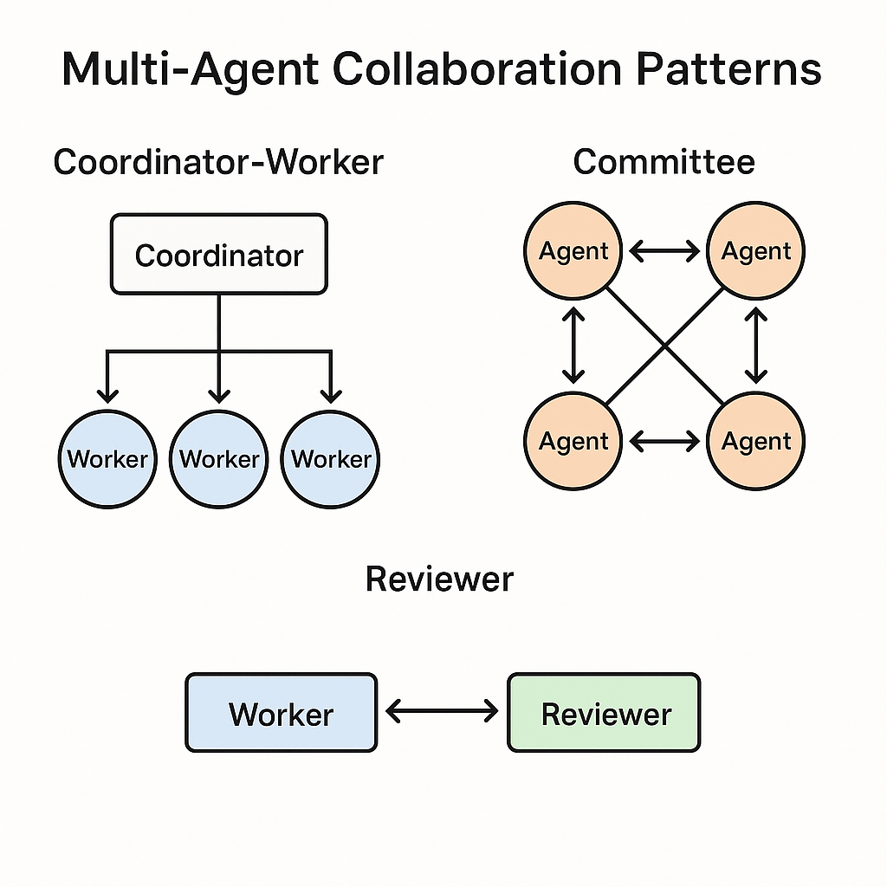
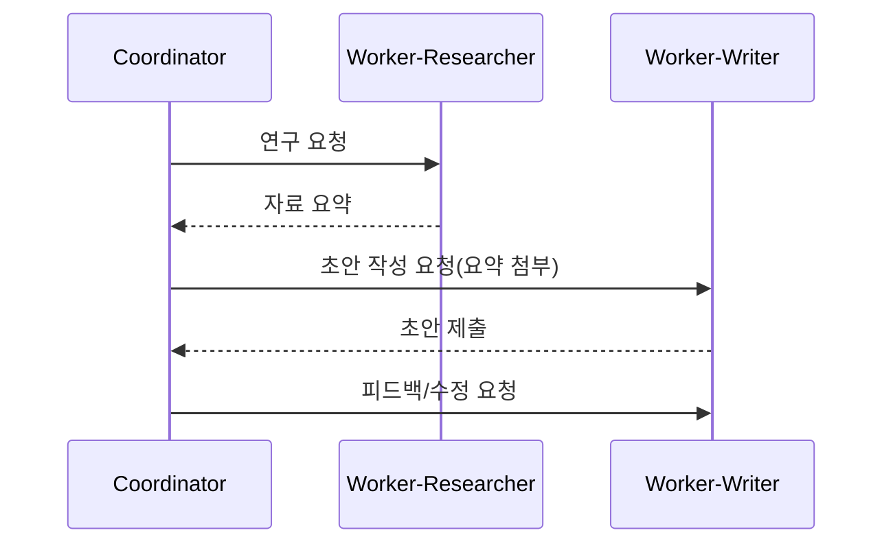

# 에이전트 간 상호작용: 패턴과 프로토콜

## 1. 핵심 개념 (Core Concept)

복잡한 문제를 해결하기 위해 여러 에이전트가 역할을 분담하고 협업하는 것을 **멀티-에이전트 시스템(Multi-Agent System)** 이라고 합니다. 이러한 시스템의 핵심은 에이전트 간의 원활한 상호작용을 보장하는 **협업 패턴(Collaboration Patterns)** 과 표준화된 **통신 규약(Communication Protocols)** 입니다. 상황에 맞는 패턴을 선택하고 명확한 프로토콜을 정의하는 것이 시스템의 성능과 확장성을 좌우합니다.

______________________________________________________________________

## 2. 상세 설명 (Detailed Explanation)

### 2.1 A2A와 ACP: 상호작용의 원리와 규칙

#### 2.1.1 **A2A (Agent-to-Agent Protocol)**

**정의 및 목적**

- A2A는 Google 등이 주도한 오픈 프로토콜로, 서로 다른 프레임워크나 벤더에서 개발된 AI 에이전트들이 **상호 운용(interoperate)** 할 수 있도록 설계되었습니다. [Google Codelabs+3구글 개발자 블로그+3solo.io+3](https://developers.googleblog.com/en/a2a-a-new-era-of-agent-interoperability/?utm_source=chatgpt.com)
- 에이전트 간의 통신, 작업 위임(task delegation), 협업(collaboration)을 가능하게 하여 복잡한 엔터프라이즈 워크플로우를 자동화하려는 목적이 있습니다. [ibm.com+2구글 개발자 블로그+2](https://www.ibm.com/think/topics/agent2agent-protocol?utm_source=chatgpt.com)

**핵심 원리 및 규칙**

1. **Agent Card 및 Capabilities 접근**

   - 각 에이전트는 자신의 정체성(identity), 기능(capabilities), 엔드포인트(endpoints), 인증(auth) 요구사항 등을 기술한 “Agent Card”라는 메타데이터를 JSON 형태로 제공함. [구글 개발자 블로그+2solo.io+2](https://developers.googleblog.com/en/a2a-a-new-era-of-agent-interoperability/?utm_source=chatgpt.com)
   - 이를 통해 다른 에이전트가 “어떤 기능을 가진 에이전트인가?”, “이 에이전트는 어떤 작업을 맡을 수 있는가?”를 발견(discovery)하고 선택할 수 있음. [Medium+1](https://medium.com/%40elisowski/what-every-ai-engineer-should-know-about-a2a-mcp-acp-8335a210a742?utm_source=chatgpt.com)

1. **작업(Task) 기반 메시징 및 라이프사이클 관리**

   - A2A에서는 상호작용을 “작업(task)” 단위로 정의하며, 각 작업은 시작(start) → 실행(execution) → 완료(completion) 또는 중단(abort) 등의 상태(state)를 가짐. [Medium+1](https://medium.com/ai-cloud-lab/building-multi-agent-ai-app-with-googles-a2a-agent2agent-protocol-adk-and-mcp-a-deep-a94de2237200?utm_source=chatgpt.com)
   - 작업의 결과물은 “아티팩트(artifact)”라고 불리며, 에이전트 간에 교환될 수 있는 데이터 또는 생성물임. [구글 개발자 블로그+1](https://developers.googleblog.com/en/a2a-a-new-era-of-agent-interoperability/?utm_source=chatgpt.com)

1. **보안·상태관리·장기 실행 지원**

   - A2A의 설계 원칙에는 “Secure by default”, “Support for long-running tasks”, “Capability discovery” 등이 포함되어 있음. [구글 개발자 블로그+1](https://developers.googleblog.com/en/a2a-a-new-era-of-agent-interoperability/?utm_source=chatgpt.com)
   - HTTP, JSON-RPC, Server-Sent Events (SSE) 같은 기존 웹/서비스 표준을 기반으로 설계되어 기존 인프라와의 통합을 용이하게 함. [구글 개발자 블로그+1](https://developers.googleblog.com/en/a2a-a-new-era-of-agent-interoperability/?utm_source=chatgpt.com)

1. **상호작용 방식**

   - 에이전트 간 메시지 교환: 작업 위임, 상태 업데이트, 아티팩트 공유
   - 에이전트 검색 및 선택: Agent Card 기반
   - 동적 라우팅: 작업을 어느 에이전트가 수행할지 선택하고 위임 가능
   - 비동기 및 장기 실행: 사용자가 개입하는 작업이나 여러 단계에 걸친 워크플로우 지원

**적합한 사용 맥락**

- 다양한 벤더, 다양한 플랫폼에서 독립적으로 개발된 에이전트들이 **협업**해야 하는 환경
- 운영 및 유지보수가 복잡한 대규모 멀티에이전트 시스템
- 에이전트 간 **경계(bounded-context)** 가 명확하고 독립적으로 설계됨

______________________________________________________________________

#### 2.1.2 **ACP (Agent Communication Protocol)**

**정의 및 목적**

- ACP는 IBM Research가 개발한 오픈 프로토콜로, 다양한 프레임워크, 기술 스택으로 개발된 인공지능 에이전트들이 **공통의 언어(shared language)** 로 커뮤니케이션할 수 있도록 설계됨. [ibm.com+1](https://www.ibm.com/think/topics/agent-communication-protocol?utm_source=chatgpt.com)
- 특히 단일 플랫폼 또는 엣지(edge) 환경, 리소스 제약이 있는 환경에서의 에이전트 간 통신에 초점을 두고 있음. [Everest Group](https://www.everestgrp.com/uncategorized/the-rise-of-agent-protocols-exploring-mcp-a2a-and-acp-blog.html?utm_source=chatgpt.com)

**핵심 원리 및 규칙**

1. **프레임워크 중립 통신 포맷**

   - ACP는 에이전트 간 메시징을 위한 공통 “wire format”을 정의하며, 이로써 서로 다른 프레임워크간 에이전트도 원활히 통신 가능함. [workos.com+1](https://workos.com/blog/ibm-agent-communication-protocol-acp?utm_source=chatgpt.com)
   - 스트리밍(streaming), 비동기(asynchronous) 실행, 상태 유지(memory) 기능 등이 중심 고려사항으로 등장함. [Niklas Heidloff](https://heidloff.net/article/mcp-acp-a2a-agent-protocols/?utm_source=chatgpt.com)

1. **에이전트 간 컨텍스트 공유 및 협업**

   - ACP는 에이전트끼리 대화(dialogue)하거나 정보를 주고받으며, 공동작업(joint task)을 수행할 수 있게 설계됨. [IBM Research](https://research.ibm.com/blog/agent-communication-protocol-ai?utm_source=chatgpt.com)
   - 공유된 컨텍스트(context)와 항상 사용자/도구 중심이 아닌 에이전트 중심의 상호작용을 강조함.

1. **발견(Discovery) 및 메타데이터 지원**

   - A2A처럼 “Agent Card” 방식이 아닌, ACP는 에이전트 메타데이터(metadata)가 직접 에이전트 데코레이터(decorator)나 레지스트리(registry)를 통해 제공되며, 에이전트 검색/결합(discovery) 방식이 약간 다름. [Medium+1](https://medium.com/%40sandibesen/an-unbiased-comparison-of-mcp-acp-and-a2a-protocols-0b45923a20f3?utm_source=chatgpt.com)

1. **적합한 사용 맥락**

   - 동일 플랫폼 내 또는 조직 내부에서 다수의 에이전트들이 협업할 때
   - 리얼타임(real-time) 또는 엣지 컴퓨팅(edge) 제약이 있는 환경
   - 프레임워크 종속성이 높으나 내부 통신 표준화가 필요한 경우

자세한 내용은 [Standard Protocols](../5-9-%EB%B3%B4%EC%95%88-and-%ED%94%84%EB%A1%9C%ED%86%A0%EC%BD%9C/standard-protocols-a2a-acp-mcp.md) 에서 이어서 계속하겠습니다.

### 2.2 주요 협업 패턴 (Collaboration Patterns)

어떤 문제를 해결하느냐에 따라 다양한 협업 패턴을 적용할 수 있습니다.

#### 1. 코디네이터-워커 패턴 (Coordinator-Worker)

- **구조**: 중앙의 '코디네이터' 에이전트가 작업을 계획하고, 전문성을 가진 '워커' 에이전트들에게 작업을 분배하고 결과를 취합하는 계층적 구조입니다.
- **장점**: 역할과 책임이 명확하고, 전체 작업 흐름을 중앙에서 관리하기 용이합니다.
- **단점**: 코디네이터에 병목이 발생할 수 있고, 코디네이터의 성능이 전체 시스템의 성능을 좌우합니다.
- **예시**: 리서치 보고서 작성 (코디네이터가 '리서처', '작성자', '교정자'에게 순서대로 작업을 지시)

#### 2. 위원회 패턴 (Committee)

- **구조**: 여러 에이전트가 동등한 위치에서 각자의 의견을 제시하고, 토론이나 투표를 통해 합의를 도출하는 방식입니다.
- **장점**: 다양한 관점을 반영하여 편향을 줄이고, 더 창의적이거나 견고한 결론을 내릴 수 있습니다.
- **단점**: 의사결정 과정이 복잡하고, 통신 비용과 시간이 많이 소요됩니다.
- **예시**: 신제품 네이밍 ('브레인스토머' 에이전트들이 아이디어를 내고, '평가자' 에이전트들이 투표하여 최종안 선정)

#### 3. 리뷰어 패턴 (Reviewer)

- **구조**: 하나의 에이전트('작업자')가 결과물을 만들면, 다른 에이전트('리뷰어')가 이를 검토하고 피드백을 주는 방식입니다. 작업자와 리뷰어의 역할이 명확히 구분됩니다.
- **장점**: 결과물의 품질을 보증하는 데 효과적이며, 구조가 단순하여 구현이 쉽습니다.
- **단점**: 리뷰어의 성능에 품질이 크게 의존하며, 리뷰어 자체가 편향을 가질 수 있습니다.
- **예시**: 코드 리뷰 (주니어 개발자 에이전트가 작성한 코드를 시니어 개발자 에이전트가 리뷰하고 수정 제안)

### 2.3 메시지 및 상태 관리

안정적인 상호작용을 위해 메시지 구조와 상태 관리를 명확히 정의해야 합니다.

- **메시지 구조**: 메시지는 단순히 내용(payload)뿐만 아니라, 보내는 이의 역할(`role`), 의도(`intent`), 응답받고 싶은 형식(`expected_schema`), 마감 시간(`deadline`) 등을 포함해야 합니다.
- **상태 관리**: 각 작업의 고유 ID, 현재 진행 상태(예: `pending`, `in_progress`, `completed`), 부분 결과, 평가 점수, 에러 기록 등을 중앙에서 추적하여 문제 발생 시 원인을 파악하고 복구할 수 있어야 합니다.

______________________________________________________________________

## 3. 예시 (Example)

- **뉴스 분석 리포트 작성 (코디네이터-워커 + 리뷰어)**
  1. `코디네이터`가 `리서처`(워커1)에게 최신 뉴스 수집을 요청합니다.
  1. `리서처`가 뉴스 기사들을 수집하여 `코디네이터`에게 전달합니다.
  1. `코디네이터`가 `분석가`(워커2)에게 기사들을 넘겨주며 핵심 내용을 분석하고 초안을 작성하도록 요청합니다.
  1. `분석가`가 작성한 초안을 `리뷰어`에게 전달하여 사실 관계와 논리적 오류를 검토받습니다.
  1. `리뷰어`의 피드백을 반영하여 `분석가`가 최종 리포트를 완성하고, `코디네이터`가 이를 최종 승인합니다.

______________________________________________________________________

## 4. 예상 면접 질문 및 모범 답안

### Q1. A2A와 ACP의 차이와 보완 관계는 무엇인가?

A. **A2A (Agent-to-Agent Protocol)** 는 다양한 벤더 및 프레임워크에서 개발된 AI 에이전트들이 **상호 운용(interoperate)** 할 수 있도록 설계된 개방형 오픈 프로토콜입니다. [구글 개발자 블로그+2solo.io+2](https://developers.googleblog.com/en/a2a-a-new-era-of-agent-interoperability/?utm_source=chatgpt.com)\
주요 특징으로는 에이전트 간 기능 발견(capability discovery), 작업(task) 위임(delegate), 장기 실행(long-running tasks) 지원 등이 있습니다. [solo.io+1](https://www.solo.io/topics/ai-infrastructure/what-is-a2a?utm_source=chatgpt.com)

**ACP (Agent Communication Protocol)** 는 다양한 프레임워크나 기술 스택에 걸쳐 개발된 에이전트들이 **공통의 통신 메커니즘(shared messaging interface)** 을 통해 상호작용할 수 있게 설계된 오픈 프로토콜입니다. [agentcommunicationprotocol.dev+2IBM Research+2](https://agentcommunicationprotocol.dev/?utm_source=chatgpt.com)\
특징으로는 동기 및 비동기 통신, 스트리밍, 상태 유지(stateful)/무상태(stateless) 지원, 다양한 콘텐츠 유형(텍스트, 파일, 미디어 등) 교환 등이 있습니다. [IBM Research+1](https://research.ibm.com/blog/agent-communication-protocol-ai?utm_source=chatgpt.com)

**차이점 및 보완관계**

- **차이점**: A2A는 에이전트 간 협업(collaboration)과 상호 운용(inter-agent across vendors/frameworks)에 초점을 맞춘 반면, ACP는 에이전트 간 통신(communication) 및 메시징 수준에 초점을 둔 프로토콜입니다.

- **보완관계**: 두 프로토콜은 경쟁 관계가 아니라 상호보완적(complementary)입니다. 예컨대, A2A가 다양한 에이전트들이 협업하도록 연결하면, 내부적으로 ACP 같은 통신 표준을 활용해 메시지를 주고받을 수 있습니다. [Niklas Heidloff+1](https://heidloff.net/article/mcp-acp/?utm_source=chatgpt.com)

따라서, 멀티에이전트 시스템을 설계할 때 “에이전트 간 연결과 협업”을 위해 A2A를 사용하고, “에이전트 간 메시징과 통신 인터페이스”를 위해 ACP를 고려하는 것이 바람직합니다.

**\[추가 설명\]**

- A2A 문서에서는 “agents do not need to share tools, memory or internal state”라는 원칙을 제시하고 있으며, 이는 각 에이전트가 독립적인 내부 설계를 유지하면서도 외부적으로는 표준화된 인터페이스로 협업할 수 있음을 의미합니다. [구글 개발자 블로그+1](https://developers.googleblog.com/en/a2a-a-new-era-of-agent-interoperability/?utm_source=chatgpt.com)
- ACP 문서에서는 “ACP is now part of A2A under the Linux Foundation”라는 업데이트가 발표되어 있어, 두 프로토콜이 향후 생태계 차원에서 통합되거나 더욱 밀접하게 연계될 가능성도 있음을 시사합니다. [agentcommunicationprotocol.dev+1](https://agentcommunicationprotocol.dev/?utm_source=chatgpt.com)
- 실제 시스템에서는 다음과 같은 순서로 프로토콜을 적용하는 모델이 제안됩니다:
  1. 에이전트가 도구(tool)나 외부 리소스와 상호작용할 때 MCP( Model Context Protocol )를 사용합니다. [Auth0+1](https://auth0.com/blog/mcp-vs-a2a/?utm_source=chatgpt.com)
  1. 에이전트 간 메시징/통신이 필요할 때 ACP를 적용합니다.
  1. 에이전트 간 협업 및 업무 위임이 필요할 때 A2A를 활용합니다.

이처럼 A2A와 ACP의 차이 및 보완 관계를 이해하면, 멀티에이전트 아키텍처 설계 시 어느 계층에서 어떤 프로토콜을 적용해야 할지 명확해집니다.

### Q2. 멀티-에이전트가 단일-에이전트 대비 유리한 과제는 무엇인가?

**A.** 멀티-에이전트는 **복잡한 문제를 전문화된 역할로 나눌 수 있거나, 여러 관점의 통합 및 검증이 중요할 때** 단일-에이전트보다 유리합니다. 대표적으로 복잡한 코드 생성, 심층 리서치 및 분석, 창의적인 콘텐츠 제작 파이프라인과 같은 과제가 있습니다.

**\[추가 설명\]**

1. **역할 분담을 통한 전문성 극대화**: 각기 다른 전문성을 요구하는 작업에 효과적입니다.
   - *예시 (소프트웨어 개발)*: `기획자` 에이전트가 요구사항을 정의하고, `개발자` 에이전트가 코드를 짜고, `테스터` 에이전트가 버그를 찾는 등, 한 명의 천재(단일 에이전트)보다 각 분야 전문가 팀(멀티 에이전트)이 더 나은 결과물을 만듭니다.
1. **병렬 처리를 통한 속도 향상**: 독립적으로 수행할 수 있는 하위 작업으로 나눌 수 있는 경우에 유리합니다.
   - *예시 (시장 조사)*: 10개의 경쟁사 분석을 10명의 `분석가` 에이전트에게 동시에 맡기고, `전략가` 에이전트가 그 결과를 종합하여 시간을 단축할 수 있습니다.
1. **다각도 분석 및 검증을 통한 품질 향상**: 하나의 결과물에 대해 여러 관점의 토론이나 검증이 필요할 때 효과적입니다.
   - *예시 (투자 결정)*: `긍정론자` 에이전트와 `비관론자` 에이전트가 특정 주식에 대해 토론하고, `포트폴리오 매니저` 에이전트가 이 토론을 바탕으로 최종 결정을 내려 편향을 줄입니다.

### Q3. 합의(Committee)와 단일 심사(Reviewer) 패턴의 트레이드오프는?

**A.** **합의(Committee)** 패턴은 여러 에이전트의 참여로 **결과의 품질과 견고함**을 높이지만 **비용과 시간이 많이 든다**는 단점이 있습니다. 반면, **단일 심사(Reviewer)** 패턴은 **빠르고 저렴**하지만, 리뷰어 개인의 **편향이나 실수에 취약**한 트레이드오프 관계에 있습니다.

**\[추가 설명\]**

- **합의 (Committee) 패턴**

  - **장점**: 다수의 관점을 종합하므로 한 에이전트의 편향이나 실수가 전체 결과에 미치는 영향을 줄입니다. 더 창의적이거나 균형 잡힌 결과를 도출할 가능성이 높습니다.
  - **단점**: 여러 에이전트를 호출해야 하므로 비용(토큰 사용량)과 지연 시간이 증가합니다. 또한, 토론이나 투표 결과를 취합하는 과정이 복잡합니다.
  - **적합한 경우**: 정답이 없거나 주관적인 판단이 중요한 고위험 작업 (예: 기업 전략 수립, 법률 문서 검토).

- **단일 심사 (Reviewer) 패턴**

  - **장점**: 구조가 단순하고, 추가적인 에이전트 호출이 한 번만 발생하므로 비용과 속도 면에서 효율적입니다.
  - **단점**: 리뷰어 에이전트가 실수하거나 편향되어 있으면 품질이 보장되지 않는 단일 실패점(Single Point of Failure)이 될 수 있습니다.
  - **적합한 경우**: 명확한 기준이 있고 반복적인 품질 검사가 필요한 작업 (예: 코드 스타일 가이드 준수 여부 확인, 오탈자 검사).

______________________________________________________________________

## 5. 더 읽어보기 (Further Reading)

- [Agents Companion v2 (Google)](/docs/references/google/Agents_Companion_v2.pdf)
- [Building effective agents (Anthropic)](/docs/references/anthropic/building-effective-agents.md)

______________________________________________________________________

## 6. See also

- [표준 프로토콜 및 스키마](../5-9-%EB%B3%B4%EC%95%88-and-%ED%94%84%EB%A1%9C%ED%86%A0%EC%BD%9C/standard-protocols-a2a-acp-mcp.md)
- [도구 스키마 설계](../5-9-%EB%B3%B4%EC%95%88-and-%ED%94%84%EB%A1%9C%ED%86%A0%EC%BD%9C/tool-schemas-jsonrpc-openapi.md)
