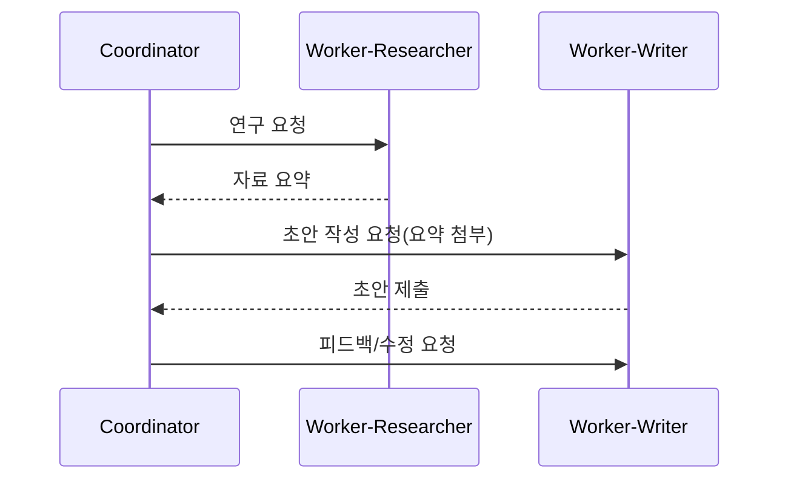

# 에이전트 간 상호작용 (A2A & ACP)

## 1. 핵심 개념 (Core Concept)

에이전트 간 메시지 교환·역할 분담·상태 공유를 위한 통신 규약과 상호작용 패턴을 정의합니다. Coordinator-Worker, Committee(합의/토론), Reviewer(심사) 같은 패턴을 상황에 맞게 조합합니다.

---

## 2. 상세 설명 (Detailed Explanation)

### 2.1 메시지 모델과 상태 관리
- 메시지: `role`, `intent`, `payload`, `context_ref`, `expected_schema`, `deadline`
- 상태: 작업 ID, 진행 상태, 부분 결과, 평가 점수, 에러 이력
- 계약: 스키마 검증(JSON Schema), 아이템포턴시 키, 타임아웃/리트라이

### 2.2 역할 기반 협업(코디네이터/워커)
- Coordinator: 목표 분해, 라우팅·조율, 품질·속도 균형
- Worker: 특화 역할(Research/Write/Code/Review)
- Reviewer: LLM-as-a-Judge/룰 기반으로 산출물 검증·수정 제안

### 2.3 실패/재시도/평가 루프
- 실패 유형: 정보 부족, 형식 불일치, 툴 실패, 충돌하는 지시
- 회복: 추가 컨텍스트 요청(Re-asking), 대체 도구, 역할 교체, 롤백
- 평가: 샘플 중재, 다수결, 메타평가로 바이어스 완화

---

## 3. 예시 (Example)

- 뉴스 요약→분석→리포트 작성의 단계 협업.
- 코드 리뷰: Dev-Agent가 PR 생성 → Reviewer-Agent가 스타일/테스트/보안 체크 → Coordinator가 병합 결정.

---

## 4. 예상 면접 질문 (Potential Interview Questions)

- A2A와 MCP의 차이와 보완 관계는?
- 멀티-에이전트가 단일-에이전트 대비 유리한 과제는 무엇인가?
- 합의(Committee)와 단일 심사(Reviewer)의 트레이드오프는?

---

## 5. 더 읽어보기 (Further Reading)

- docs/references/google/Agents_Companion_v2.pdf
- docs/references/anthropic/building-effective-agents.md

---

## 6. See also

- 표준 프로토콜/스키마: 5-9 → [standard-protocols-a2a-acp-mcp](../5-9-보안-and-프로토콜/standard-protocols-a2a-acp-mcp.md), [tool-schemas-jsonrpc-openapi](../5-9-보안-and-프로토콜/tool-schemas-jsonrpc-openapi.md)
