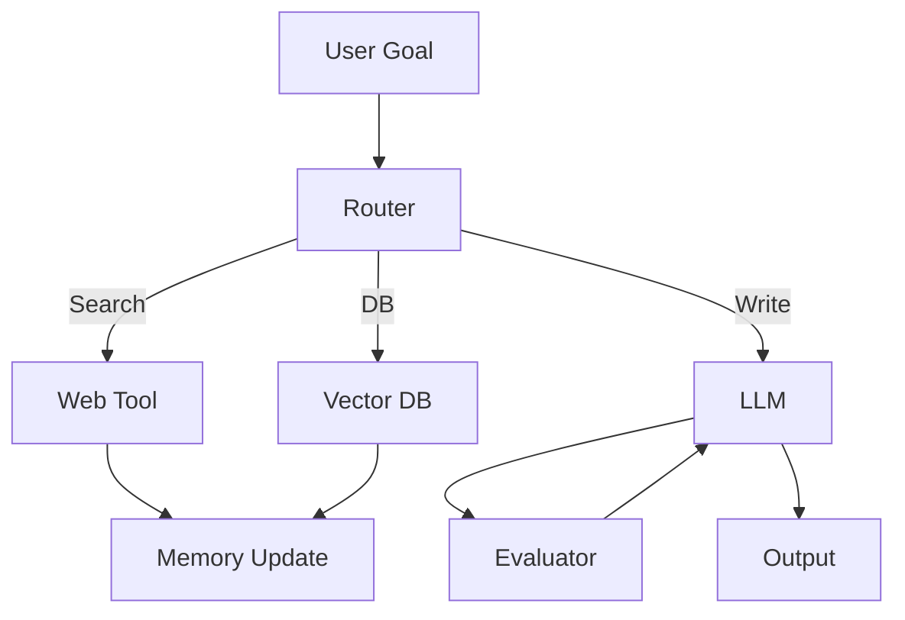

# 주요 구성 요소

## 1. 핵심 개념 (Core Concept)

에이전트는 LLM(두뇌), Tools(손), Orchestration(조정), Memory/Context(기억), Evaluator(심판)로 구성됩니다. 각 컴포넌트의 “입출력 계약(Contract)”과 “실패 처리”를 명확히 하는 것이 실무 품질을 좌우합니다.

---

## 2. 상세 설명 (Detailed Explanation)

### 2.1 Model(LLM) & Tools(Function/API/DB)
- 책임: 추론/계획/요약/평가(LLM) + 외부 세계 상호작용(Tools)
- 계약: 프롬프트 스키마, 함수 호출 스키마(JSON Schema), 응답 스키마
- 실패: 환각, 형식 불일치, API 타임아웃/레이트 리밋 → 재시도/대체 경로

### 2.2 Orchestration Layer(라우팅/워크플로우/스케줄링)
- 책임: Intent/Tool 라우팅, 멀티-스텝 워크플로우, 리트라이/백오프, 로깅/트레이싱
- 계약: 상태 전이(State Machine), 스텝 인터페이스, 아이템포턴시 키
- 실패: 부분 성공/부분 실패, 일시 장애 → 서킷 브레이커·데드레터 큐

### 2.3 Memory & Context Manager(단기/장기/일화, 컨텍스트 압축)
- 책임: 단기(대화), 장기(프로젝트/유저), 일화(실행 궤적) 메모리 관리
- 계약: 저장 포맷(키-값/문서/벡터), 삽입·검색 API, 요약/압축 정책
- 실패: 컨텍스트 초과, 관련성 저하 → 요약·클러스터링·재순위(리랭킹)

### 2.4 Evaluator/Judge(품질·일관성·안전성 평가)
- 책임: 룰 기반 검사 + LLM-as-a-Judge 혼합, 회귀 테스트, SLO 추적
- 계약: 평가 항목(정확성·일관성·근거성·안전성), 스코어 스키마
- 실패: 평가 바이어스·드리프트 → 샘플 중재·다수결·메타평가

---

## 3. 예시 (Example)

- LangGraph 기반 오케스트레이션 + ReAct 툴 호출 패턴.

---

## 4. 예상 면접 질문 (Potential Interview Questions)

- Evaluator/Judge를 어디에 어떻게 삽입하는가?
- Memory와 RAG를 언제/어떻게 결합하는가?
- 라우팅 실패 시 안전 정지와 대체 경로는?

---

## 5. 더 읽어보기 (Further Reading)

- docs/references/openai/a-practical-guide-to-building-agents-3.pdf
- docs/references/anthropic/building-effective-agents.md

---

## 6. See also

- 컨텍스트 관리/압축: 5-2 → [context-compression-management](../5-2-메모리-and-컨텍스트-관리/context-compression-management.md)
- RAG 구성: 5-4 → [basic-rag-pipeline](../5-4-retrieval-augmented-generation-rag/basic-rag-pipeline.md)
- 툴 스키마: 5-9 → [tool-schemas-jsonrpc-openapi](../5-9-보안-and-프로토콜/tool-schemas-jsonrpc-openapi.md)
