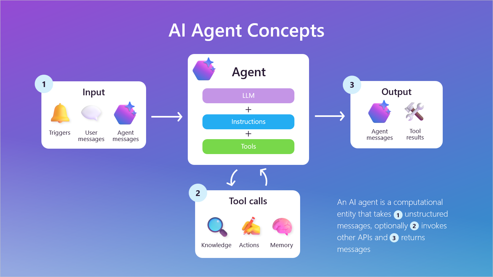

# Agentic AI 주요 구성 요소

## 1. 핵심 개념 (Core Concept)

Agentic AI 시스템은 LLM(두뇌), Tools(손과 발), Orchestration(중추신경), Memory/Context(기억), Evaluator(비판적 사고)라는 5가지 핵심 요소로 구성됩니다. 각 컴포넌트의 역할과 상호작용을 명확히 정의하고, 실패 시나리오를 대비하는 것이 안정적인 에이전트 시스템을 구축하는 핵심입니다.



______________________________________________________________________

## 2. 상세 설명 (Detailed Explanation)

### 2.1 Model (LLM): 추론의 엔진

- **책임**: 사용자의 목표를 이해하고, 계획을 수립하며, 도구 사용법을 결정하고, 결과를 해석하는 '두뇌' 역할을 합니다. 추론, 계획, 요약, 평가 등 지능적인 판단이 필요한 모든 과정의 중심에 있습니다.
- **계약 (Interface)**: 정해진 형식의 프롬프트(예: 시스템 프롬프트, 사용자 입력, 도구 목록)를 입력받아, 함수 호출(JSON Schema 형식)이나 사용자에게 전달할 텍스트를 출력합니다.
- **주요 실패 및 해결책**:
  - **환각 (Hallucination)**: 사실이 아닌 내용을 생성합니다. → RAG를 통해 최신 정보나 사실 기반 데이터를 제공하여 보완합니다.
  - **형식 불일치 (Format Mismatch)**: JSON이나 함수 호출 형식을 잘못 생성합니다. → 프롬프트에 예시(Few-shot examples)를 제공하거나, 출력 파싱 및 재시도 로직을 구현합니다.

### 2.2 Tools (Functions/APIs/DB): 외부 세계와의 상호작용

- **책임**: LLM이 할 수 없는 일, 즉 외부 세계와 상호작용하는 모든 작업을 수행합니다. 웹 검색, 데이터베이스 조회, 파일 읽기/쓰기, 다른 서비스의 API 호출 등이 여기에 해당합니다.
- **계약 (Interface)**: 각 도구는 명확한 입력 스키마(예: 검색어)와 출력 스키마(예: 검색 결과)를 가져야 합니다. OpenAPI Specification, JSON Schema 등을 사용해 정의합니다.
- **주요 실패 및 해결책**:
  - **API 타임아웃/오류**: 외부 서비스가 응답하지 않거나 에러를 반환합니다. → 재시도(Retry) 로직과 지수 백오프(Exponential Backoff)를 구현합니다.
  - **권한 부족/잘못된 입력**: 도구 사용에 필요한 권한이 없거나 입력값이 잘못되었습니다. → 명확한 에러 메시지를 LLM에게 반환하여 다른 계획을 세우도록 유도합니다.

### 2.3 Orchestration Layer: 전체 흐름의 지휘자

- **책임**: 전체 작업 흐름을 관리하고 조율하는 '중추신경'입니다. 사용자의 의도(Intent)에 따라 적절한 도구나 에이전트를 선택(Routing)하고, 여러 단계의 작업을 순차적 또는 병렬적으로 실행하며, 에러를 처리합니다.
- **계약 (Interface)**: 상태 머신(State Machine)이나 그래프(Graph) 형태로 작업 흐름을 정의합니다. 각 단계(Step)는 명확한 입력과 출력을 가지며, 멱등성(Idempotency)을 보장하는 것이 중요합니다.
- **주요 실패 및 해결책**:
  - **부분 실패 (Partial Failure)**: 여러 단계의 작업 중 일부만 성공합니다. → 실패한 부분만 재시도하거나, 보상 트랜잭션(Compensating Transaction)을 통해 이전 상태로 롤백합니다.
  - **무한 루프**: 에이전트가 동일한 작업을 계속 반복합니다. → 최대 시도 횟수를 제한하고, 특정 횟수 이상 실패 시 작업을 중단하고 알림을 보냅니다. (서킷 브레이커, 데드레터 큐)

### 2.4 Memory & Context Manager: 기억과 학습

- **책임**: 에이전트가 대화의 흐름을 기억하고(단기 기억), 사용자 정보를 저장하며(장기 기억), 과거의 성공/실패 경험으로부터 배우도록(일화적 기억) 돕습니다.
- **계약 (Interface)**: 메모리 유형(키-값, 문서, 벡터)에 따른 저장, 검색, 요약 API를 제공합니다. 컨텍스트가 너무 길어지면 압축하거나 오래된 정보를 제거하는 정책이 필요합니다.
- **주요 실패 및 해결책**:
  - **컨텍스트 길이 초과**: LLM이 처리할 수 있는 토큰 한도를 넘어섭니다. → 슬라이딩 윈도우, 요약, 임베딩 기반 검색 등 컨텍스트 압축 기법을 사용합니다.
  - **정보 관련성 저하**: 메모리에 너무 많은 정보가 쌓여 중요한 정보를 찾지 못합니다. → 시간 기반 감쇠(Time-based decay), 관련성 기반 재순위(Re-ranking) 등의 전략을 사용합니다.

### 2.5 Evaluator/Judge: 품질과 안전성의 심판

- **책임**: 에이전트의 행동과 결과물이 정해진 기준(품질, 일관성, 안전성)을 충족하는지 평가합니다. 규칙 기반 검사와 LLM을 활용한 평가를 혼합하여 사용합니다.
- **계약 (Interface)**: 평가 항목(예: 정확성, 근거 제시, 유해성)과 점수 체계(예: 1~5점 척도, JSON 스키마)를 정의합니다.
- **주요 실패 및 해결책**:
  - **평가 편향 (Evaluation Bias)**: 평가용 LLM이 특정 응답을 선호하여 평가가 한쪽으로 치우칩니다. → 여러 평가 모델을 사용해 다수결로 결정하거나, 평가 결과에 대한 메타-평가를 도입합니다.
  - **일관성 부족**: 동일한 결과물에 대해 평가가 계속 바뀝니다. → 구체적인 평가 기준(Rubric)을 프롬프트에 명시하여 평가의 일관성을 높입니다.

______________________________________________________________________

## 3. 예시 (Example)

- **시나리오**: LangGraph와 ReAct 패턴을 결합한 리서치 에이전트
- **흐름**: 사용자가 "최신 AI 트렌드를 요약해줘"라고 요청하면, 오케스트레이터는 먼저 라우터(LLM)를 호출하여 '웹 검색' 도구가 필요하다고 판단합니다. 웹 검색 도구로 최신 정보를 가져온 뒤, 그 결과를 다시 LLM에게 전달하여 자연스러운 문장으로 요약하게 합니다. 최종 결과물은 사용자에게 전달하기 전에 Evaluator가 사실 여부와 유해성을 검증합니다. 이 모든 과정과 결과는 Memory에 기록됩니다.

```mermaid
flowchart TD
    A[User: "최신 AI 트렌드 요약해줘"] --> B{Orchestrator};
    B --> C[Router(LLM): '웹 검색' 필요];
    C --> D[Tool: WebSearch("최신 AI 트렌드")];
    D -- "검색 결과" --> B;
    B --> E[Model(LLM): 결과 요약];
    E -- "요약 초안" --> F{Evaluator};
    F -- "검증 통과" --> G[Final Output];
    B -- 모든 과정 기록 --> H[(Memory)];
```

______________________________________________________________________

## 4. 예상 면접 질문 및 모범 답안

### Q1. Evaluator/Judge를 시스템의 어디에, 어떻게 삽입하는 것이 효과적인가?

**A.** Evaluator는 에이전트가 **중요한 행동을 수행한 직후**나 **최종 결과를 사용자에게 전달하기 직전**에 삽입하는 것이 가장 효과적입니다. 구현 시에는 규칙 기반 검사와 LLM-as-a-Judge를 혼합하여, 객관적 기준과 주관적 품질을 모두 평가하도록 설계합니다.

**\[추가 설명\]**

- **삽입 위치**:
  1. **도구 사용 후 (Post-Tool Execution)**: 도구(API)가 반환한 결과가 유효한지, 예상된 형식인지 검증합니다. 예를 들어, 웹 검색 결과가 비어있거나 에러 코드를 반환하면, Evaluator가 이를 감지하고 다른 도구를 사용하도록 유도할 수 있습니다.
  1. **최종 응답 전 (Pre-Final Response)**: 사용자에게 응답을 전달하기 직전에, 내용의 정확성, 문체의 일관성, 유해성 여부 등을 종합적으로 평가합니다. 이는 에이전트의 신뢰도와 직결되는 중요한 단계입니다.
  1. **계획 수정 시 (During Reflection)**: 에이전트가 실패를 경험했을 때, Evaluator가 "왜 실패했는가?"를 분석하고 평가하여, Reflection 과정에서 더 나은 계획을 세우는 데 활용될 수 있습니다.
- **구현 방법**:
  - **규칙 기반 (Rule-based)**: JSON 스키마 검증, 키워드 필터링, 정규표현식을 이용한 개인정보(PII) 탐지 등 명확하고 객관적인 기준을 검사합니다.
  - **LLM-as-a-Judge**: 더 강력한 상위 모델(예: GPT-4)을 평가자로 사용하여, "이 응답이 사용자의 원래 의도에 부합하는가?"와 같이 미묘하고 주관적인 품질을 채점 기준(Rubric)에 따라 평가합니다.

### Q2. 에이전트의 Memory와 RAG는 어떤 관계이며, 언제 어떻게 결합하는가?

**A.** Memory는 **대화의 맥락**을 기억하고, RAG는 **외부 지식**을 참조한다는 점에서 상호 보완적입니다. 이 둘은 사용자의 질문이 대화의 이전 내용을 참조하면서 동시에 외부 정보가 필요할 때 결합됩니다. 대표적으로, **대화 기록(Memory)으로 사용자의 질문을 명확하게 만든 뒤, 이를 RAG의 검색어(Query)로 사용**하는 방식으로 결합합니다.

**\[추가 설명\]**

- **관계**:
  - **Memory**: "방금 내가 말한 '그것'에 대해 더 알려줘"와 같이 대화의 흐름 속에서 발생하는 모호성을 해결합니다. (대화의 연속성)
  - **RAG (Retrieval-Augmented Generation)**: "Agentic AI의 최신 연구 동향은 무엇인가?"와 같이 LLM이 학습하지 않은 최신 정보나 내부 문서에 대한 질문에 답합니다. (외부 지식 접근)
- **결합 시점**: 사용자의 질문이 대화 맥락에 의존적일 때 (예: "그럼 두 번째 방법의 단점은 뭐야?") RAG만 사용하면 '두 번째 방법'이 무엇인지 몰라 정확한 검색을 할 수 없습니다. 이때 Memory가 필요합니다.
- **결합 방법 (Memory-Augmented RAG)**:
  1. **질문 확장 (Query Expansion)**: 사용자의 현재 질문("두 번째 방법의 단점은?")과 대화 기록(Memory)에서 "두 번째 방법은 'ReAct 패턴'이다"라는 정보를 결합하여 "ReAct 패턴의 단점은 무엇인가?"라는 명확한 검색어를 만듭니다.
  1. **검색 (Retrieval)**: 이렇게 확장된 검색어를 사용하여 벡터 DB에서 관련 문서를 검색합니다.
  1. **생성 (Generation)**: 검색된 문서와 원본 질문을 함께 LLM에 전달하여, 맥락을 이해하고 사실에 기반한 정확한 답변을 생성합니다.

### Q3. 라우팅 실패 시 안전 장치(Safe Stop)와 대체 경로는 어떻게 설계하는가?

**A.** 라우팅 실패에 대비해 **신뢰도 점수(Confidence Score) 기반의 임계값**을 설정하고, 그 이하일 경우 \*\*미리 정의된 대체 경로(Fallback Path)\*\*를 타도록 설계합니다. 가장 기본적인 대체 경로는 "질문을 명확히 해달라"고 사용자에게 되묻거나, 최종 수단으로 "담당자에게 문의하세요"와 같은 안전한 응답을 반환하는 것입니다.

**\[추가 설명\]**

- **라우팅 실패 원인**: 사용자의 의도가 모호하거나, 여러 도구의 기능이 겹쳐 라우터(LLM)가 어떤 도구를 선택할지 확신하지 못하는 경우에 발생합니다.
- **설계 방안**:
  1. **신뢰도 임계값 (Confidence Threshold)**: 라우터가 각 경로(도구)에 대한 확률 또는 신뢰도 점수를 반환하도록 합니다. 가장 높은 점수가 설정된 임계값(예: 80%) 미만이면, 불확실한 선택을 강행하는 대신 대체 경로로 전환합니다.
  1. **대체 경로 (Fallback Path)**:
     - **1순위: 사용자에게 되묻기 (Clarification)**: "말씀하신 내용이 A와 B 중 어느 것에 더 가깝나요?" 와 같이 사용자에게 명확한 선택지를 제공하여 의도를 구체화하도록 유도합니다.
     - **2순위: 일반 검색 (General Search)**: 특정 도구를 찾지 못했다면, 일반적인 웹 검색 도구를 호출하여 관련된 정보를 찾아주는 것을 시도할 수 있습니다.
     - **최후 수단: 안전한 종료 (Safe Stop)**: 위 방법들이 모두 실패하면, "죄송하지만 해당 요청을 처리할 수 없습니다. 다른 방식으로 질문해주시겠어요?" 와 같이 솔직하게 한계를 인정하고 작업을 안전하게 종료합니다.
  1. **구현**: 이러한 로직은 주로 **Orchestration Layer**에서 관리됩니다. 오케스트레이터가 라우터의 출력을 받은 뒤, 신뢰도를 체크하고 조건에 따라 다음 단계를 분기(Branching)시킵니다.

______________________________________________________________________

## 5. 더 읽어보기 (Further Reading)

- [A Practical Guide to Building Agents (OpenAI)](/docs/references/openai/a-practical-guide-to-building-agents-3.pdf)
- [Building effective agents (Anthropic)](/docs/references/anthropic/building-effective-agents.md)
- [Agent Components (Microsoft)](https://learn.microsoft.com/ko-kr/copilot/security/developer/agent-components)

______________________________________________________________________

## 6. See also

- [컨텍스트 관리 및 압축 (Context Compression)](../5-2-%EB%A9%94%EB%AA%A8%EB%A6%AC-and-%EC%BB%A8%ED%85%8D%EC%8A%A4%ED%8A%B8-%EA%B4%80%EB%A6%AC/context-compression-management.md)
- [기본 RAG 파이프라인 (Basic RAG)](../5-4-retrieval-augmented-generation-rag/basic-rag-pipeline.md)
- [도구 스키마 설계 (Tool Schemas)](../5-9-%EB%B3%B4%EC%95%88-and-%ED%94%84%EB%A1%9C%ED%86%A0%EC%BD%9C/tool-schemas-jsonrpc-openapi.md)
