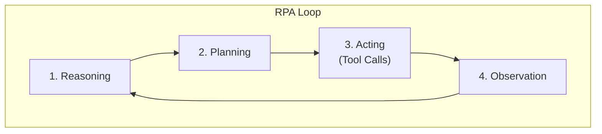

# 핵심 동작 루프 (RPA & Reflection)

## 1. 핵심 개념 (Core Concept)

에이전트는 **추론(Reasoning) → 계획(Planning) → 행동(Acting)** 의 순환(RPA 루프)을 통해 작업을 수행하고, 그 결과를 **관찰(Observation)** 합니다. 여기서 더 나아가, 실패하거나 예상치 못한 결과를 관찰했을 때 **성찰(Reflection)** 이라는 자기 교정 메커니즘을 통해 계획을 수정하고 다음 행동을 개선합니다. 이 루프에 명확한 **중단 정책**과 **안전 장치(Guardrail)** 를 추가하는 것이 안정적인 에이전트의 핵심입니다.

______________________________________________________________________

## 2. 상세 설명 (Detailed Explanation)

### 2.1 RPA: 기본 동작의 4단계

Agentic AI의 가장 기본적인 작업 흐름은 다음과 같은 4단계로 구성됩니다.

1. **Reasoning (추론)**: 현재 목표와 주어진 컨텍스트(메모리)를 바탕으로 상황을 이해하고, 목표 달성을 위한 큰 그림을 그립니다.
1. **Planning (계획)**: 추론 결과를 바탕으로, 목표를 달성하기 위한 구체적인 하위 작업(sub-tasks)들의 순서나 의존성을 정의합니다.
1. **Acting (행동)**: 계획의 첫 번째 단계를 실행합니다. 이는 보통 외부 도구(Tool)를 호출하는 형태로 나타납니다. (예: `search("AI Agent")`)
1. **Observation (관찰)**: 행동의 결과를 받아보고, 목표 달성에 어떤 영향을 미치는지 확인합니다. 이 관찰 결과는 다음 추론 단계의 중요한 입력이 됩니다.



### 2.2 Reflection: 실패로부터 배우는 자기 교정

단순한 RPA 루프는 예상치 못한 문제에 부딪히면 같은 실수를 반복할 수 있습니다. **Reflection(또는 Reflexion)** 은 에이전트가 실패 경험을 통해 스스로 학습하고 계획을 수정하는 과정으로, 시스템에 메타인지(Metacognition) 능력을 부여합니다.

- **트리거**: 도구 실행 실패, 평가 점수 저조, 결과물 없음 등 부정적인 관찰 결과가 나왔을 때 활성화됩니다.
- **프로세스**:
  1. **자기 비판 (Self-Critique)**: "왜 실패했는가?"에 대해 스스로 분석합니다. (예: "검색 결과가 없는 이유는 검색어가 너무 구체적이었기 때문이다.")
  1. **교훈 저장 (Memory Update)**: 실패 원인과 해결책에 대한 교훈을 일화적 메모리(Episodic Memory)에 저장합니다.
  1. **계획 수정 (Plan Revision)**: 저장된 교훈을 바탕으로 기존 계획을 수정하여 다음 시도에서는 다른 접근법을 사용합니다. (예: "더 일반적인 검색어로 다시 시도하자.")

*Note: 아래 다이어그램을 위한 이미지를 `docs/images/agent-rpa-reflection-loop.png` 에 추가해주세요.*


### 2.3 안정적인 루프를 위한 Pseudocode

아래 코드는 RPA 루프에 Reflection과 예산 관리, 평가가 결합된 안정적인 에이전트 루프의 예시입니다.

```python
def stable_agent_loop(task, budget):
    memory = []
    # 1. 초기 계획 수립
    plan = llm.plan(task, memory)
    cost = 0

    # 2. 예산 내에서 계획이 완료될 때까지 반복
    while not plan.is_done() and cost < budget:
        # 3. 행동: 계획에 따라 도구 선택 및 호출
        tool, args = route(plan)
        result = call_tool(tool, args)

        # 4. 관찰: 결과 요약 및 메모리 업데이트
        observation = summarize(result)
        memory.add(observation)

        # 5. 평가: 행동 결과의 품질 평가
        quality_score = evaluate(plan, observation) # 규칙 + LLM Judge

        # 6. 성찰 및 계획 수정 (품질이 낮을 경우)
        if quality_score < THRESHOLD:
            critique = llm.reflect(plan, observation) # 실패 원인 분석
            memory.add_reflection(critique) # 교훈 저장
            plan = llm.revise_plan(plan, critique) # 교훈 기반 계획 수정
        else:
            plan = llm.next_step(plan, observation) # 다음 단계로 진행

        cost += estimate_cost(tool, result)

    return finalize(plan, memory)
```

### 2.4 중단(Stop), 안전(Guardrail), 비용(Spend) 정책

에이전트가 무한 루프에 빠지거나 예산을 초과하지 않도록 제어하는 정책은 필수적입니다.

- **Stop**: 성공 기준 달성, 최대 반복 횟수 도달, 진행 상황 없다고 판단될 때 루프를 중단합니다.
- **Guardrail**: 허용되지 않은 도메인 접근 차단, 개인정보(PII) 필터링, API 호출 속도 제한 등 안전 장치를 마련합니다.
- **Spend**: 최대 토큰 수, 최대 도구 호출 횟수, 총 소요 시간 등 예산 한도를 설정하고 초과 시 즉시 중단합니다.

______________________________________________________________________

## 3. 예시 (Example)

- **시나리오**: "오늘 날씨 어때?" 라는 질문에 에이전트가 `get_weather("오늘")` 이라는 잘못된 함수를 호출하여 실패.
- **RPA**: `get_weather` 함수가 `city` 파라미터를 필요로 한다는 에러 메시지를 **관찰(Observation)**.
- **Reflection**: "`city` 정보 없이는 날씨를 알 수 없구나. 사용자에게 도시를 물어봐야겠다" 라고 **성찰(Reflection)**.
- **Revised Plan**: 사용자에게 "어느 도시의 날씨가 궁금하신가요?" 라고 되묻는 것으로 계획을 수정.

______________________________________________________________________

## 4. 예상 면접 질문 및 모범 답안

### Q1. RPA 루프와 ReAct의 차이를 설명하라.

**A.** `RPA 루프`는 에이전트가 **계획→행동→관찰**을 순차적으로 수행하는 기본적인 동작 구조를 의미합니다. 반면, `ReAct`는 추론(Reasoning)과 행동(Acting)을 명시적으로 교차하여 외부 도구를 사용하는 동적인 패턴이며, `Reflection`은 한 단계 더 나아가 에이전트가 자신의 실패 경험을 평가하고 스스로 학습하여 다음 행동을 수정하는 자기 성찰 패턴입니다.

**\[추가 설명\]**

- **RPA (Reasoning-Planning-Acting) 루프**: 에이전트의 가장 기본적인 동작 흐름입니다. 먼저 목표를 달성하기 위한 계획을 세우고(Plan), 계획에 따라 행동(Act)한 뒤, 그 결과를 관찰(Observe)하여 다음 계획에 반영합니다. 정해진 절차를 따르는 데 중점을 둡니다.
- **ReAct (Reason + Act)**: '생각하고 행동하기'를 반복하는 인간의 문제 해결 방식과 유사합니다. LLM이 "어떤 도구를 사용해야겠다"고 추론(Thought)하면, 실제로 도구를 사용(Action)하고, 그 결과를 관찰(Observation)하여 다음 생각을 이어갑니다. 외부 정보가 필요할 때 매우 효과적입니다.
- **Reflection**: ReAct의 확장판으로, 에이전트에게 '메타인지(Metacognition)' 능력을 부여합니다. 행동이 실패했을 때, "왜 실패했는가?"를 스스로 평가(Reflect)하고, 그 교훈을 메모리에 저장하여 다음 시도에서는 다른 접근법을 사용하도록 합니다. 시행착오가 필요한 복잡한 문제 해결에 강점을 가집니다.

### Q2. Reflection은 언제/어떻게 삽입하며, 과도한 루프는 어떻게 억제하는가?

**A.** Reflection은 **도구 실행 실패, 평가 점수 저조, 진행 상황 정체** 등 부정적인 결과가 관찰되었을 때 삽입합니다. 이는 현재 계획을 비판하고 수정하기 위한 '메타 루프'입니다. 과도한 루프는 **최대 성찰 횟수 제한, 예산(비용/시간) 제한, 상태 반복 감지**와 같은 엄격한 중단 조건을 통해 억제합니다.

**\[추가 설명\]**

- **Reflection 삽입 시점 (Triggers)**:

  1. **명시적 실패**: 도구가 에러를 반환하거나(예: API 500 에러), 코드가 컴파일되지 않을 때.
  1. **품질 저하**: Evaluator가 결과물의 품질 점수를 기준치 미만으로 평가했을 때.
  1. **진행 정체**: 여러 번의 시도에도 불구하고 목표에 더 가까워지지 않는다고 판단될 때.
  1. **모순 발견**: 새로운 관찰 결과가 메모리에 있는 이전 정보와 충돌할 때.

- **Reflection 구현 방법**:

  1. **비판 생성 (Generate Critique)**: LLM에게 "이전 행동은 이러했고 결과는 이러했다. 실패의 근본 원인은 무엇인가?" 와 같은 프롬프트를 통해 자기 비판을 유도합니다.
  1. **메모리 업데이트 (Update Memory)**: 분석된 실패 원인과 교훈을 별도의 성찰 메모리(Reflection Store)에 저장하여 같은 실수를 반복하지 않도록 합니다.
  1. **계획 수정 (Revise Plan)**: 생성된 비판과 교훈을 바탕으로 "이 실패를 극복하기 위한 새로운 계획을 세워라" 라고 요청하여 계획을 수정합니다.

- **과도한 루프 억제 방법**:

  1. **최대 시도 횟수 (Max Attempts)**: 특정 작업에 대해 성찰의 최대 횟수를 2~3회로 제한하고, 이를 초과하면 작업을 실패로 처리합니다.
  1. **예산 제한 (Budgeting)**: 총 소요 시간, LLM 호출 횟수, 비용 등의 예산을 설정하고, 한도에 도달하면 즉시 루프를 중단시킵니다.
  1. **상태 반복 감지 (Cycle Detection)**: 최근의 (계획, 행동) 상태를 해시하여 저장하고, 동일한 상태가 반복되면 시스템이 루프에 빠졌다고 판단하여 강제로 다른 행동을 유도하거나 종료합니다.

______________________________________________________________________

## 5. 더 읽어보기 (Further Reading)

- [Building effective agents (Anthropic)](/docs/references/anthropic/building-effective-agents.md)
- [Agents Companion (Google)](/docs/references/google/Agents_Companion_v2.pdf)

______________________________________________________________________

## 6. See also

- [프롬프트 평가 및 벤치마크](../5-5-%ED%94%84%EB%A1%AC%ED%94%84%ED%8A%B8-%EC%97%94%EC%A7%80%EB%8B%88%EC%96%B4%EB%A7%81-and-%ED%8F%89%EA%B0%80/prompt-evaluation-and-benchmarks.md)
- [운영 평가 및 모니터링](../5-6-agentops-%EC%9A%B4%EC%98%81-and-%EC%9E%90%EB%8F%99%ED%99%94/evaluation-monitoring-ops.md)
