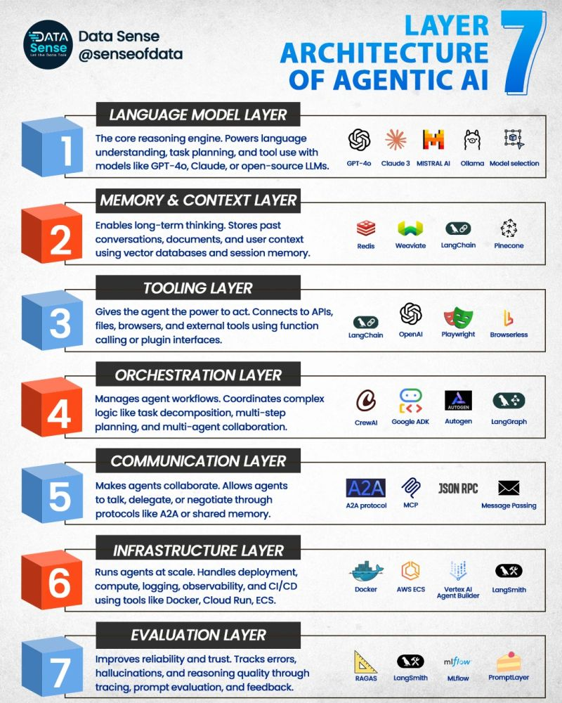

# 에이전트 생태계 개요

## 1. 핵심 개념 (Core Concept)

AI 에이전트 개발을 돕는 다양한 오픈소스 프레임워크와 도구들이 빠르게 발전하고 있습니다. 이들을 **오케스트레이션, 데이터 증강(RAG), 전문 에이전트** 등 기능별로 분류하고, 각 도구의 핵심 철학과 장단점을 이해하면 프로젝트에 가장 적합한 기술 스택을 선택할 수 있습니다. 특정 프레임워크에 종속되지 않도록, **프롬프트, 도구 스키마, 평가 기준과 같은 핵심 로직은 분리하여 관리**하는 것이 중요합니다.

______________________________________________________________________

## 2. 상세 설명 (Detailed Explanation)

### 2.1 오케스트레이션/워크플로우 프레임워크

에이전트의 작업 흐름, 상태 관리, 도구 연결 등 전체 로직을 제어합니다. 에이전트의 '두뇌'와 '신경계'를 만드는 도구입니다.

| 프레임워크    | 핵심 추상화                              | 주요 사용 사례                                      | 이런 경우에 사용하세요                                                               |
| ------------- | ---------------------------------------- | --------------------------------------------------- | ------------------------------------------------------------------------------------ |
| **LangGraph** | **상태 머신 / 그래프**                   | 복잡하고 순환적인 에이전트 워크플로우 제어          | 명시적인 루프, 분기, 상태 공유가 필요한 안정적인 장기 실행 프로세스를 만들 때        |
| **CrewAI**    | **역할(Role)과 임무(Task)**              | 역할 기반 멀티-에이전트 팀의 협업                   | ‘리서처’, ‘작성자’ 등 역할 놀이 에이전트 팀을 빠르고 쉽게 구성하고 싶을 때           |
| **AutoGen**   | **대화형 에이전트**                      | 유연하고 동적인 멀티-에이전트 대화 시뮬레이션       | 에이전트 간의 복잡한 대화 패턴 자체를 연구하거나 구현하고 싶을 때                    |
| **ADK**       | **에이전트 + 툴 + 멀티-에이전시 시스템** | 일관된 에이전트 행동 제어 + 툴·배포·평가 워크플로우 | 에이전트 행동을 세밀하게 제어하고, 여러 에이전트를 조합하며, 배포/운용까지 고려할 때 |

### 2.2 데이터 증강(RAG) 및 메모리 프레임워크

에이전트가 외부 지식(문서, DB)을 참조하고, 장기 기억을 갖도록 돕습니다. 에이전트의 '기억력'과 '학습 능력'을 담당합니다.

- **RAG 계열**:\
  → 외부 데이터나 문서를 검색(Retrieve)해 LLM의 응답 생성(Generate)에 결합하는 구조로, 지식 확장을 중심으로 한 프레임워크입니다.

- **에이전트 메모리 계열**:\
  → 에이전트가 과거 대화, 상태, 행동 기록을 기억하고 재활용해 맥락적 추론과 개인화된 응답을 가능하게 하는 구조입니다.

- **RAG + 메모리 결합 시나리오**:\
  → 외부 지식(RAG)과 내부 기억(메모리)을 통합해, 장기적 맥락 이해와 최신 정보 활용을 동시에 수행하는 하이브리드 구조입니다.

| 구분                           | 프레임워크 예시                                                                                                                                                                                                | 주요 집중 역량                                                                                                                                                                                          | 장점                                                                                                 | 유의사항 / 약점                                                                                   |
| ------------------------------ | -------------------------------------------------------------------------------------------------------------------------------------------------------------------------------------------------------------- | ------------------------------------------------------------------------------------------------------------------------------------------------------------------------------------------------------- | ---------------------------------------------------------------------------------------------------- | ------------------------------------------------------------------------------------------------- |
| **RAG 계열**                   | LangChain, LlamaIndex, Haystack                                                                                                                                                                                | 문서/데이터베이스 등 외부 지식 리트리벌 + LLM 생성의 결합. ([DataCamp](https://www.datacamp.com/blog/rag-framework?utm_source=chatgpt.com "RAG Frameworks You Should Know: Open-Source Tools for ...")) | • LLM만으로 처리하기 어려운 ‘외부 지식’ 활용 가능• 도메인·사내 문서 등에 맞춘 맞춤형 응답이 가능     | • 리트리벌 품질이 전체 성능에 크게 영향• 색인·벡터DB 설계·운영 복잡성 존재                        |
| **에이전트 메모리 계열**       | 메모리 중심 플랫폼 (예: MemGPT 유사 솔루션), Zep (Temporal Knowledge Graph) ([arXiv](https://arxiv.org/abs/2501.13956?utm_source=chatgpt.com "Zep: A Temporal Knowledge Graph Architecture for Agent Memory")) | 에이전트의 대화·상태·역사 정보를 저장·관리해서 컨텍스트 유지, 재활용 가능하게 함                                                                                                                        | • 사용자별 히스토리, 장기 대화·세션 기반 흐름 유지 가능• 에이전트가 기억을 ‘활용’해서 점점 적응 가능 | • 메모리 저장·검색 구조가 잘못되면 “지나치게 많은 기억 → 느려짐/잡음 증가” 문제• 설계 복잡성 있음 |
| **RAG + 메모리 결합 시나리오** | RAG 프레임워크 위에 메모리 계층을 얹은 아키텍처                                                                                                                                                                | 외부 지식 + 내부·대화 기억을 모두 활용하여 복합 워크플로우 대응                                                                                                                                         | • 장기 상태 + 최신 지식 + 다양한 입력을 통합 가능• 더 복잡한 에이전트·챗봇·추천 시스템 구축 가능     | • 설계·운영 복잡성이 가장 큼• 리트리벌·메모리 두 축 모두 최적화 필요                              |

### 2.3 전문 분야 특화 에이전트: Domain-specific Agents

특정 도메인(예: 소프트웨어 개발)의 문제를 해결하기 위해 사전 정의된 역할과 프로세스를 갖춘 고수준 프레임워크입니다.

| 이름 / 출처                                                                                                                                                                                                                                   | 특징                                                                                                     | 장점                                                                                               | 활용하기 좋은 경우                                                                  |
| --------------------------------------------------------------------------------------------------------------------------------------------------------------------------------------------------------------------------------------------- | -------------------------------------------------------------------------------------------------------- | -------------------------------------------------------------------------------------------------- | ----------------------------------------------------------------------------------- |
| SOP‑Agent (Standard Operational Procedure-guided) ([arXiv](https://arxiv.org/abs/2501.09316?utm_source=chatgpt.com "SOP-Agent: Empower General Purpose AI Agent with Domain-Specific SOPs"))                                                  | 도메인별 SOP(표준 운용 절차)를 그래프 형태로 표현하고, 그 절차에 따라 에이전트가 로직을 따르도록 설계됨  | 도메인 절차화된 업무(예: 고객 서비스, 코드 클리닝 등)에 대해 일반 에이전트보다 더 정확한 수행 가능 | 특정 업무절차가 명확하고 반복되며, 일반계열 에이전트로는 만족할 품질이 안 나올 때   |
| ThinkTank 프레임워크 ([arXiv](https://arxiv.org/abs/2506.02931?utm_source=chatgpt.com "ThinkTank: A Framework for Generalizing Domain-Specific AI Agent Systems into Universal Collaborative Intelligence Platforms"))                        | “도메인 특화 에이전트 시스템을 범용 협업 지능 플랫폼으로 일반화”하는 구조; 역할·지식 통합·도구 연계 포함 | 도메인별 전문성 + 협업 에이전트 설계 가능 → 복합 문제에 대응 가능                                  | 여러 도메인(예: 과학연구, 기업 내부)에서 다양한 특화 에이전트를 구성하고 싶을 때    |
| 기업용 도메인-특화 에이전트 개념 (예: IT/HR/금융 등) ([Aisera: Best Agentic AI For Enterprise](https://aisera.com/blog/domain-specific-ai-agents/?utm_source=chatgpt.com "Domain-specific AI Agents for the Enterprise"))                     | 특정 산업·부서(IT서비스데스크, 금융 등)에 맞춘 에이전트 구성: 용어, 규제, 워크플로우 등이 미리 반영됨    | 전문용어 이해, 규제준수, 특정 산업에 맞춤 응답 가능                                                | 기업이 산업별·부서별 자동화/에이전트 도입을 단계적으로 진행하고자 할 때             |
| 일반 에이전트 framework에서의 전문화 패턴 ([Microsoft Learn](https://learn.microsoft.com/en-us/azure/architecture/ai-ml/guide/ai-agent-design-patterns?utm_source=chatgpt.com "AI Agent Orchestration Patterns - Azure Architecture Center")) | “다수의 특화 에이전트를 역할별로 나눠서 각자 맡은 도메인을 처리”하는 설계 패턴                           | 코드·프롬프트가 단순화되고 유지보수가 쉬워짐; 각 에이전트에 최적화 가능                            | 복잡한 워크플로우나 다기능 시스템을 구성할 때, 단일 에이전트로는 감당하기 어려울 때 |

### 2.4 선택을 위한 가이드

1. **문제 정의**: 만들고 싶은 것이 '단일 에이전트의 복잡한 워크플로우'인가, '여러 에이전트의 협업'인가, 아니면 '방대한 문서에 대한 Q&A'인가? 문제의 종류가 프레임워크 선택의 첫 기준이 됩니다.
1. **추상화 수준**: 로우레벨(Low-level) 제어를 원한다면 LangGraph, 역할 기반의 빠른 프로토타이핑을 원한다면 CrewAI, 특정 문제(RAG)에 집중하고 싶다면 LlamaIndex를 고려할 수 있습니다.
1. **교체 가능성**: 어떤 프레임워크를 선택하든, 도구의 명세(Tool Schema)와 프롬프트는 별도의 파일로 관리하여, 나중에 다른 프레임워크로 쉽게 이전할 수 있도록 설계하는 것이 현명합니다.

______________________________________________________________________

## 3. 예상 면접 질문 및 모범 답안

### Q1. LangChain(LangGraph)과 LlamaIndex의 핵심적인 강점 차이는 무엇인가요?

**A.** LangChain(LangGraph)은 에이전트의 **'로직과 오케스트레이션'** 에 강점이 있고, LlamaIndex는 **'데이터 인덱싱과 검색(RAG)'** 에 강점이 있습니다. 즉, LangChain이 에이전트의 '뇌'를 만들어 무엇을 할지 결정하게 한다면, LlamaIndex는 '기억 장치'를 만들어 무엇을 알게 할지를 담당합니다.

**\[추가 설명\]**

- **LangChain (LangGraph)**

  - **초점**: 애플리케이션 로직, 즉 **"에이전트가 무엇을 하는가(doing)"** 에 집중합니다.
  - **핵심**: LLM 호출, 도구 사용, 상태 관리 등 에이전트의 동작 흐름을 제어하는 '체인'과 '그래프'를 만듭니다.
  - **비유**: 에이전트의 **CPU와 메인보드**. 모든 부품을 연결하고 작업 흐름을 지휘합니다.
  - **사용 사례**: 고객 요청에 따라 데이터베이스를 검색할지, API를 호출할지, 사람에게 넘길지를 결정하는 의사결정 흐름을 만들 때 사용합니다.

- **LlamaIndex**

  - **초점**: 데이터 처리, 즉 **"에이전트가 무엇을 아는가(knowing)"** 에 집중합니다.
  - **핵심**: 외부 문서/데이터를 LLM이 이해하기 쉬운 형태로 '인덱싱'하고, 질문과 가장 관련 높은 정보를 효율적으로 '검색'합니다.
  - **비유**: 에이전트의 **RAM과 SSD**. 방대한 지식에 빠르게 접근할 수 있게 합니다.
  - **사용 사례**: 수천 페이지 분량의 기술 매뉴얼에 대해 질문하면, 가장 관련 있는 단락을 찾아 답변의 근거로 제공하는 Q&A 봇을 만들 때 사용합니다.

이 둘은 경쟁 관계가 아니라, LangChain으로 만든 에이전트가 LlamaIndex를 '도구'로 호출하는 **상호 보완적인 관계**입니다.

### Q2. 오케스트레이션 프레임워크를 교체할 때, 어떤 '계약'을 고정하여 리스크를 줄일 수 있나요?

**A.** 프레임워크 교체 리스크를 줄이려면, 프레임워크의 내부 로직이 아닌 **컴포넌트 간의 인터페이스, 즉 '계약(Contract)'** 을 고정해야 합니다. 가장 중요한 세 가지 계약은 **1) 도구 스키마 (Tool Schema), 2) 프롬프트 템플릿 (Prompt Template), 3) 평가 스키마 (Evaluator Schema)** 입니다.

**\[추가 설명\]**

- **원칙**: "'어떻게'와 '무엇'을 분리하라." 오케스트레이션 프레임워크는 '어떻게(How)'에 해당하고, 에이전트의 핵심 능력과 비즈니스 로직은 '무엇(What)'에 해당합니다. '무엇'을 프레임워크와 무관하게 정의하면, '어떻게'는 비교적 쉽게 교체할 수 있습니다.

- **고정해야 할 계약 3가지**:

  1. **도구 스키마 (JSON Schema / OpenAPI)**: `get_weather(city: str)` 와 같은 도구의 명세는 가장 중요한 계약입니다. 이 스키마를 표준 형식으로 정의해두면, 어떤 프레임워크든 이 명세를 읽어 동일한 도구를 호출할 수 있습니다.
  1. **프롬프트 템플릿**: 에이전트의 역할, 지시사항, 제약조건 등을 담은 프롬프트는 별도의 설정 파일(YAML, JSON 등)로 분리하여 관리합니다. 새 프레임워크는 이 파일을 읽어 프롬프트를 주입받기만 하면 되므로, 에이전트의 '성격'과 '지시'가 그대로 유지됩니다.
  1. **평가 스키마**: 에이전트의 성능을 평가하는 기준과 입출력 형식 또한 독립적으로 정의해야 합니다. 평가기는 항상 동일한 형식의 입력을 받아, 동일한 형식의 점수(예: `{ "score": 0.9, "reason": "..." }`)를 반환하도록 설계합니다. 새 프레임워크는 이 평가기를 적절한 시점에 호출하는 역할만 합니다.

- **기대 효과**: 이처럼 외부 계약을 중심으로 설계하면, 프레임워크 교체는 전체 시스템을 재개발하는 것이 아니라, 안정적인 부품들 사이의 '연결선(glue code)'을 다시 연결하는 작업이 되어 리스크가 크게 줄어듭니다.

______________________________________________________________________

## 5. 더 읽어보기 (Further Reading)

- [Google Agents Companion v2](/docs/references/google/Agents_Companion_v2.pdf)
- [OpenAI A Practical Guide to Building Agents](/docs/references/openai/a-practical-guide-to-building-agents-3.pdf)
- [7-Layer Architecture of Agentic AI](https://www.linkedin.com/posts/data-sense-lms_agenticai-ailayers-aiarchitecture-activity-7361748176967454722-mSnD?utm_source=share&utm_medium=member_desktop&rcm=ACoAACpSzx8BIYXePCBem1YFssBShdsGKnADBdg)

______________________________________________________________________

## 6. See also

- [시스템 설계 개요](./overview.md)
- [주요 구성 요소](./components.md)
