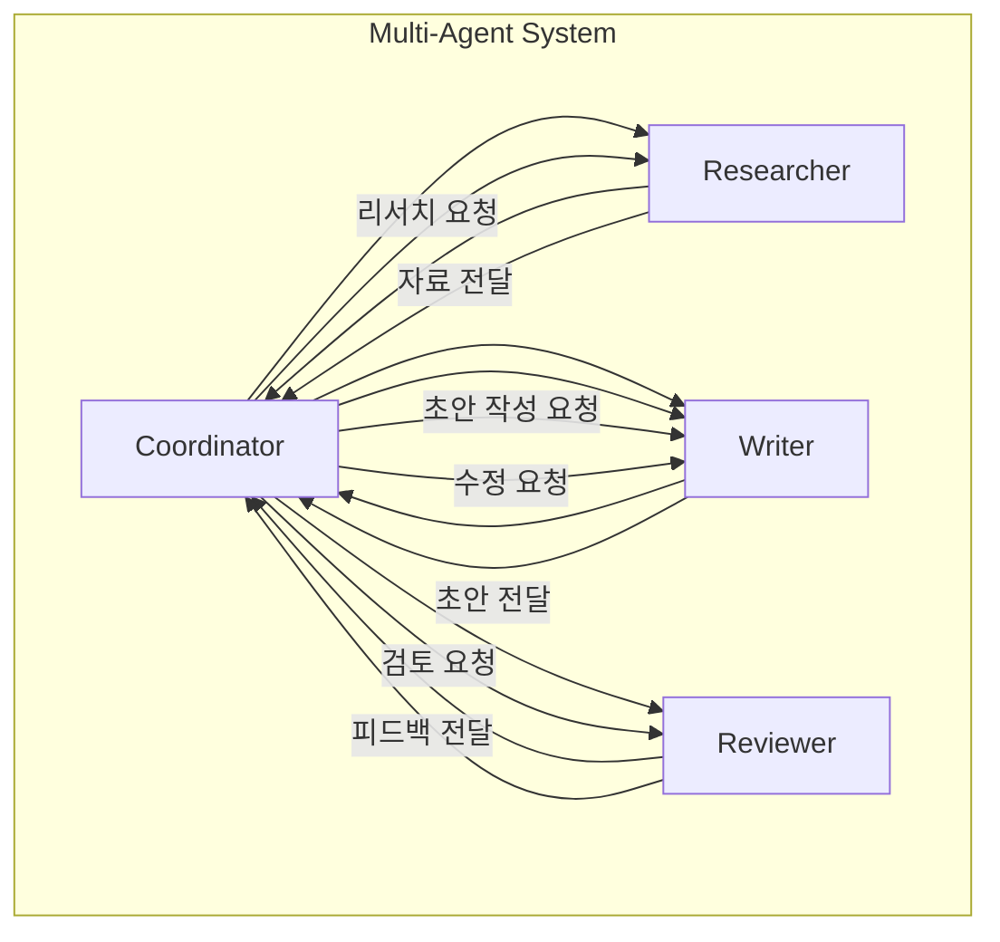

# Agentic AI 시스템 설계 개요

## 1. 핵심 개념 (Core Concept)

Agentic AI는 “목표를 입력하면 스스로 계획하고(Plan) 도구를 이용해 행동(Act)하며, 결과를 관찰해 개선(Reflect)하는” 소프트웨어 시스템입니다. 본 문서는 전체 설계 철학과 구성 요소, 상호작용 방식을 한눈에 정리합니다. 초보자도 이해할 수 있도록 핵심 개념→아키텍처→예시 순서로 설명합니다.

______________________________________________________________________

## 2. 상세 설명 (Detailed Explanation)

### 2.1 시스템 관점의 에이전트

- 입력(Goal/Task)을 받아 하위 목표로 분해하고(Decomposition), 계획을 세운 뒤 적절한 도구를 호출해 실행합니다.
- 실행 결과(Observation)를 기록·요약하여 컨텍스트를 최신 상태로 유지하고, 필요 시 계획을 수정합니다.
- 내부적으로 LLM 추론 엔진, 외부 Tool/Function, 메모리/컨텍스트 관리자, 오케스트레이션 레이어로 구성됩니다.

### 2.2 구성 요소와 경계

- Model(LLM): 추론·계획 수립·결과 해석의 핵심 엔진
- Tools(APIs/DB/Functions): 외부 세계와 상호작용(검색, DB, 파일, SaaS)
- Orchestration: 라우팅·워크플로우·에러 복구·리트라이·로깅
- Memory/Context: 단기/장기/일화(Episodic) 메모리, 컨텍스트 압축·검색
- Evaluator/Judge: LLM-as-a-Judge, 규칙 기반 검사, 안전성/일관성 평가
- 각 컴포넌트의 입력/출력 계약(Contract)을 명시하면 결합도를 낮추고 테스트가 쉬워집니다.

### 2.3 에이전트 간 상호작용 (Multi-Agent Collaboration)

단일 에이전트로 해결하기 어려운 복잡한 문제는 여러 에이전트가 역할을 분담하여 협업하는 **멀티-에이전트 시스템(Multi-Agent System)** 으로 더 효과적으로 해결할 수 있습니다. 이러한 협업의 핵심은 정해진 통신 규약입니다.

- **A2A (Agent-to-Agent) 통신**: '리서처', '작성자', '리뷰어' 등 각기 다른 역할을 맡은 에이전트들이 서로 메시지를 주고받으며 공동의 목표를 달성하는 상호작용 자체를 의미합니다.
- **ACP (Agent Communication Protocol)**: 에이전트 간의 원활한 통신을 위한 표준 규약, 즉 '공통 언어'입니다. ACP는 메시지의 형식, 상태 공유 방법, 역할 분배 규칙 등을 정의하여, 마치 회사에서 팀원들이 정해진 프로세스에 따라 협업하는 것과 같은 효과를 냅니다.

이러한 구조는 보통 '코디네이터' 에이전트가 전체 작업을 조율하고 '워커' 에이전트들에게 작업을 분배하는 **코디네이터-워커 패턴**으로 구현됩니다.

______________________________________________________________________

## 3. 예시 (Example)

### 사용 사례

- 리서치 → 정리 → 초안 작성 → 리뷰의 단계로 협업하는 멀티-에이전트 문서 작성 파이프라인.

### 설계 체크리스트(초보자용)

- 목표와 성공 기준을 문장 대신 “구조화된 스펙(JSON Schema)”로 정의했는가?
- 허용 도구 목록(화이트리스트), 타임아웃, 리트라이 정책이 있는가?
- 메모리(요약/키-밸류/벡터)와 컨텍스트 압축 전략이 정의되어 있는가?
- 품질 평가(LLM-as-a-Judge + 규칙 기반)와 회귀 테스트가 있는가?
- 비용/지연 메트릭을 모니터링하고, 한도 초과 시 안전 정지를 하는가?

______________________________________________________________________

## 4. 예상 면접 질문 및 모범 답안

### Q1. RPA 루프와 ReAct/Reflection의 차이를 설명하라.

**A.** `RPA 루프`는 에이전트가 **계획→행동→관찰**을 순차적으로 수행하는 기본적인 동작 구조를 의미합니다. 반면, `ReAct`는 추론(Reasoning)과 행동(Acting)을 명시적으로 교차하여 외부 도구를 사용하는 동적인 패턴이며, `Reflection`은 한 단계 더 나아가 에이전트가 자신의 실패 경험을 평가하고 스스로 학습하여 다음 행동을 수정하는 자기 성찰 패턴입니다.

**\[추가 설명\]**

- **RPA (Reasoning-Planning-Acting) 루프**: 에이전트의 가장 기본적인 동작 흐름입니다. 먼저 목표를 달성하기 위한 계획을 세우고(Plan), 계획에 따라 행동(Act)한 뒤, 그 결과를 관찰(Observe)하여 다음 계획에 반영합니다. 정해진 절차를 따르는 데 중점을 둡니다.
- **ReAct (Reason + Act)**: '생각하고 행동하기'를 반복하는 인간의 문제 해결 방식과 유사합니다. LLM이 "어떤 도구를 사용해야겠다"고 추론(Thought)하면, 실제로 도구를 사용(Action)하고, 그 결과를 관찰(Observation)하여 다음 생각을 이어갑니다. 외부 정보가 필요할 때 매우 효과적입니다.
- **Reflection**: ReAct의 확장판으로, 에이전트에게 '메타인지(Metacognition)' 능력을 부여합니다. 행동이 실패했을 때, "왜 실패했는가?"를 스스로 평가하고(Reflect), 그 교훈을 메모리에 저장하여 다음 시도에서는 다른 접근법을 사용하도록 합니다. 시행착오가 필요한 복잡한 문제 해결에 강점을 가집니다.

### Q2. Orchestration Layer가 필요한 이유와 핵심 책임은 무엇인가?

**A.** 단일 에이전트나 간단한 워크플로우를 넘어, 여러 에이전트와 다수의 도구가 복잡하게 상호작용하는 시스템을 안정적으로 관리하고 제어하기 위해 Orchestration Layer가 필요합니다. 오케스트라의 '지휘자'처럼 전체 흐름을 조율하는 역할을 합니다.

**\[추가 설명\]**

- **필요성**: 에이전트의 수가 늘어나고 작업이 복잡해지면, 어떤 에이전트에게 어떤 작업을 언제 할당할지, 에이전트 간의 데이터는 어떻게 주고받을지, 특정 에이전트가 실패하면 어떻게 처리할지 등을 관리하는 중앙 통제 시스템이 필수적입니다. 이것이 바로 Orchestration Layer입니다.
- **핵심 책임**:
  1. **작업 분해 및 할당 (Task Decomposition & Assignment)**: 큰 목표를 작은 하위 작업으로 나누고, 각 작업에 가장 적합한 에이전트나 도구에 할당합니다.
  1. **워크플로우 관리 (Workflow Management)**: 작업들의 순서와 분기(Branching)를 제어하고, 에이전트 간의 상태를 관리합니다.
  1. **에러 핸들링 및 재시도 (Error Handling & Retry)**: 특정 에이전트나 도구 호출이 실패했을 때, 재시도를 하거나 대체 경로를 찾는 등 오류를 우아하게 처리합니다.
  1. **데이터 흐름 관리 (Data Flow Management)**: 에이전트들이 서로 필요한 정보를 원활하게 주고받을 수 있도록 데이터 파이프라인 역할을 합니다.
- **대표 프레임워크**: LangGraph, CrewAI 등이 이러한 Orchestration Layer를 구현하는 데 사용되는 대표적인 도구입니다.

### Q3. 단일-에이전트와 멀티-에이전트의 트레이드오프는 무엇인가?

**A.** 단일 에이전트는 **단순성, 속도, 저비용**의 이점을 가지지만 복잡한 문제 해결 능력에 한계가 있습니다. 반면, 멀티 에이전트는 역할 분담을 통해 **전문성, 높은 품질, 안정성**을 확보할 수 있지만, 시스템의 **복잡도, 통신 오버헤드, 비용**이 증가하는 트레이드오프가 있습니다.

**\[추가 설명\]**

- **단일 에이전트 (Single-Agent)**

  - **장점**: 구조가 단순하여 개발 및 디버깅이 쉽습니다. 통신 오버헤드가 없어 간단한 작업은 더 빠르고 저렴하게 처리할 수 있습니다.
  - **단점**: 한 에이전트가 모든 것을 처리해야 하므로 다양한 전문성을 갖기 어렵습니다. 복잡한 문제에서는 성능이 저하되거나 잘못된 결정을 내릴 수 있으며, 실패 시 전체 작업이 중단됩니다.
  - **비유**: 혼자서 모든 업무를 처리하는 '1인 프리랜서'.

- **멀티 에이전트 (Multi-Agent)**

  - **장점**: 각 에이전트가 '리서처', '코더', '테스터' 등 특정 역할을 맡아 전문성을 높일 수 있습니다. 여러 에이전트가 작업을 병렬로 처리하거나, 서로의 결과물을 검토하며 더 높은 품질과 안정성을 보장할 수 있습니다.
  - **단점**: 에이전트 간의 통신 및 작업 조율을 위한 Orchestration Layer가 필수적이므로 시스템 복잡도가 크게 증가합니다. 에이전트 간의 통신 과정에서 지연 시간이 발생하며, 여러 에이전트를 동시에 실행하는 데 더 많은 비용이 듭니다.
  - **비유**: 각자 전문 분야를 가진 '전문가 팀'.

______________________________________________________________________

## 5. 더 읽어보기 (Further Reading)

- docs/references/anthropic/building-effective-agents.md
- docs/references/anthropic/effective-context-engineering-for-ai-agents.md
- docs/references/google/Agents_Companion_v2.pdf
- docs/references/openai/a-practical-guide-to-building-agents-3.pdf
- https://learn.microsoft.com/ko-kr/copilot/security/developer/agent-components

______________________________________________________________________

## 6. See also

- 구성 요소 상세: 5-1 → [components](./components.md)
- RPA 루프: 5-1 → [core-loop-rpa](./core-loop-rpa.md)
- 에이전트 상호작용/프로토콜: 5-1 → [agent-interaction-and-protocols](./agent-interaction-and-protocols.md)
- 프롬프트/평가: 5-5 → [prompt-evaluation-and-benchmarks](../5-5-%ED%94%84%EB%A1%AC%ED%94%84%ED%8A%B8-%EC%97%94%EC%A7%80%EB%8B%88%EC%96%B4%EB%A7%81-and-%ED%8F%89%EA%B0%80/prompt-evaluation-and-benchmarks.md)
