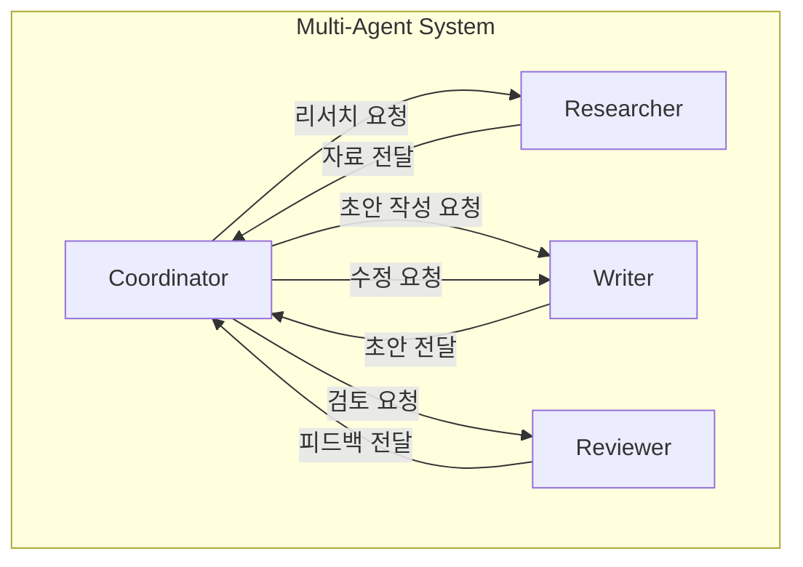

# Agentic AI 시스템 설계 개요

## 1. 핵심 개념 (Core Concept)

Agentic AI는 “목표를 입력하면 스스로 계획하고(Plan) 도구를 이용해 행동(Act)하며, 결과를 관찰해 개선(Reflect)하는” 소프트웨어 시스템입니다. 본 문서는 전체 설계 철학과 구성 요소, 상호작용 방식을 한눈에 정리합니다. 초보자도 이해할 수 있도록 핵심 개념→아키텍처→예시 순서로 설명합니다.

---

## 2. 상세 설명 (Detailed Explanation)

### 2.1 시스템 관점의 에이전트

- 입력(Goal/Task)을 받아 하위 목표로 분해하고(Decomposition), 계획을 세운 뒤 적절한 도구를 호출해 실행합니다.
- 실행 결과(Observation)를 기록·요약하여 컨텍스트를 최신 상태로 유지하고, 필요 시 계획을 수정합니다.
- 내부적으로 LLM 추론 엔진, 외부 Tool/Function, 메모리/컨텍스트 관리자, 오케스트레이션 레이어로 구성됩니다.

### 2.2 구성 요소와 경계

- Model(LLM): 추론·계획 수립·결과 해석의 핵심 엔진
- Tools(APIs/DB/Functions): 외부 세계와 상호작용(검색, DB, 파일, SaaS)
- Orchestration: 라우팅·워크플로우·에러 복구·리트라이·로깅
- Memory/Context: 단기/장기/일화(Episodic) 메모리, 컨텍스트 압축·검색
- Evaluator/Judge: LLM-as-a-Judge, 규칙 기반 검사, 안전성/일관성 평가
- 각 컴포넌트의 입력/출력 계약(Contract)을 명시하면 결합도를 낮추고 테스트가 쉬워집니다.

### 2.3 에이전트 간 상호작용 (Multi-Agent Collaboration)

단일 에이전트로 해결하기 어려운 복잡한 문제는 여러 에이전트가 역할을 분담하여 협업하는 **멀티-에이전트 시스템(Multi-Agent System)** 으로 더 효과적으로 해결할 수 있습니다. 이러한 협업의 핵심은 정해진 통신 규약입니다.

- **A2A (Agent-to-Agent) 통신**: '리서처', '작성자', '리뷰어' 등 각기 다른 역할을 맡은 에이전트들이 서로 메시지를 주고받으며 공동의 목표를 달성하는 상호작용 자체를 의미합니다.
- **ACP (Agent Communication Protocol)**: 에이전트 간의 원활한 통신을 위한 표준 규약, 즉 '공통 언어'입니다. ACP는 메시지의 형식, 상태 공유 방법, 역할 분배 규칙 등을 정의하여, 마치 회사에서 팀원들이 정해진 프로세스에 따라 협업하는 것과 같은 효과를 냅니다.

이러한 구조는 보통 '코디네이터' 에이전트가 전체 작업을 조율하고 '워커' 에이전트들에게 작업을 분배하는 **코디네이터-워커 패턴**으로 구현됩니다.

---

## 3. 예시 (Example)

### 사용 사례

- 리서치 → 정리 → 초안 작성 → 리뷰의 단계로 협업하는 멀티-에이전트 문서 작성 파이프라인.

### 설계 체크리스트(초보자용)
- 목표와 성공 기준을 문장 대신 “구조화된 스펙(JSON Schema)”로 정의했는가?
- 허용 도구 목록(화이트리스트), 타임아웃, 리트라이 정책이 있는가?
- 메모리(요약/키-밸류/벡터)와 컨텍스트 압축 전략이 정의되어 있는가?
- 품질 평가(LLM-as-a-Judge + 규칙 기반)와 회귀 테스트가 있는가?
- 비용/지연 메트릭을 모니터링하고, 한도 초과 시 안전 정지를 하는가?

---

## 4. 예상 면접 질문 (Potential Interview Questions)

- RPA 루프와 ReAct/Reflection의 차이를 설명하라.
- Orchestration Layer가 필요한 이유와 핵심 책임은 무엇인가?
- 단일-에이전트와 멀티-에이전트의 트레이드오프는 무엇인가?

---

## 5. 더 읽어보기 (Further Reading)

- docs/references/anthropic/building-effective-agents.md
- docs/references/anthropic/effective-context-engineering-for-ai-agents.md
- docs/references/google/Agents_Companion_v2.pdf
- docs/references/openai/a-practical-guide-to-building-agents-3.pdf
- https://learn.microsoft.com/ko-kr/copilot/security/developer/agent-components

---

## 6. See also

- 구성 요소 상세: 5-1 → [components](./components.md)
- RPA 루프: 5-1 → [core-loop-rpa](./core-loop-rpa.md)
- 에이전트 상호작용/프로토콜: 5-1 → [agent-interaction-and-protocols](./agent-interaction-and-protocols.md)
- 프롬프트/평가: 5-5 → [prompt-evaluation-and-benchmarks](../5-5-프롬프트-엔지니어링-and-평가/prompt-evaluation-and-benchmarks.md)
