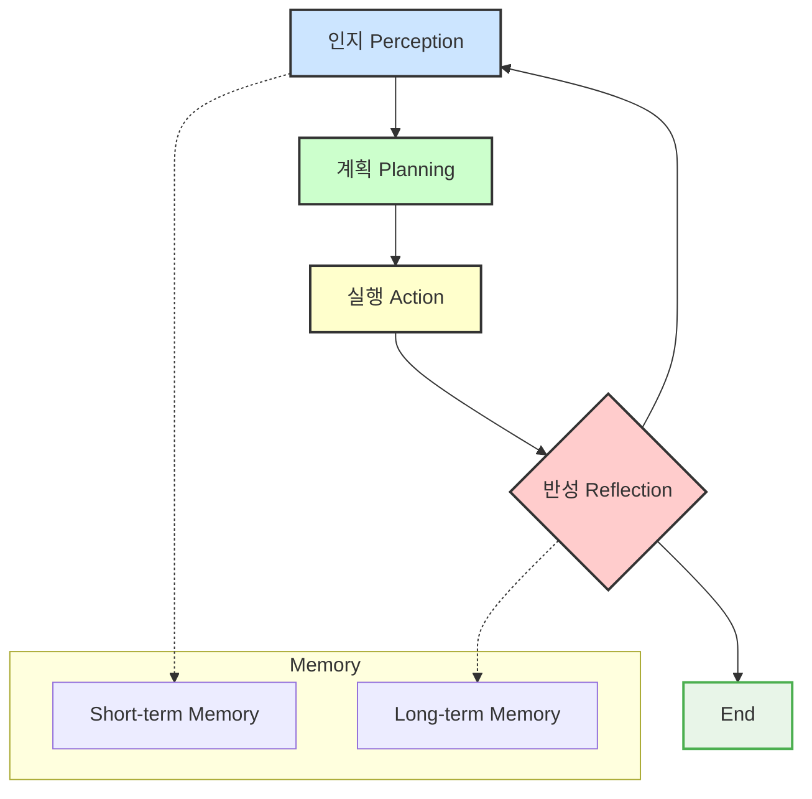

# 에이전트 라이프사이클 (인지 → 계획 → 실행 → 반성)

## 1. 핵심 개념 (Core Concept)

AI 에이전트는 목표를 달성하기 위해 지속적으로 반복되는 라이프사이클을 따름. 이 사이클은 크게 **인지(Perception)**, **계획(Planning)**, **실행(Action)**, **반성(Reflection)**의 네 단계로 구성됨. 에이전트는 이 순환적인 과정을 통해 환경을 이해하고, 최적의 행동을 결정하며, 실수를 통해 배우고, 궁극적으로 복잡한 문제를 해결해 나감. 이 모든 과정은 **메모리(Memory)**를 통해 연결되고 학습이 누적됨.

---

## 2. 상세 설명 (Detailed Explanation)

에이전트의 모든 행동은 아래의 라이프사이클 루프(Loop)를 기반으로 이루어짐. 이는 ReAct (Reason + Act)와 같은 유명한 프레임워크의 근간이 되는 개념임.

### 2.1 1단계: 인지 (Perception / Observation)

에이전트가 자신을 둘러싼 환경과 현재 상태를 파악하는 단계.
*   **입력**: 사용자의 초기 목표, 이전 행동의 결과(성공, 실패, 오류 메시지), 툴로부터 반환된 데이터, 메모리에서 가져온 관련 과거 경험 등.
*   **역할**: 목표 달성을 위해 필요한 모든 정보를 수집하고 종합하여 현재 상황을 명확하게 이해함.

### 2.2 2단계: 계획 (Planning / Thought)

수집된 정보를 바탕으로 최종 목표를 달성하기 위한 전략을 수립하는 단계. 에이전트의 '생각' 과정에 해당함.
*   **과정**: 최종 목표를 여러 개의 하위 작업(sub-task)으로 분해하고, 각 작업을 해결하기 위한 최적의 툴과 행동 순서를 결정함.
*   **출력**: 다음에 수행할 구체적인 행동(Action) 계획. (예: "`search_api`를 `query='AI Agent'` 파라미터로 호출해야겠다.")

### 2.3 3단계: 실행 (Action)

계획 단계에서 결정된 구체적인 행동을 수행하는 단계.
*   **활동**: 외부 툴(API, 코드 실행기 등)을 호출하거나, 사용자에게 질문하거나, 파일 시스템에 접근하는 등 환경과 직접적으로 상호작용함.
*   **목표**: 계획을 현실 세계에서 실행하여 결과를 얻어내는 것.

### 2.4 4단계: 반성 (Reflection / Self-Correction)

실행의 결과를 평가하고, 그로부터 배우는 가장 중요한 단계. 이 단계는 에이전트의 지능을 결정하는 핵심적인 부분임.
*   **자기 수정 (Self-Correction)**: 행동의 결과가 예상과 일치하는지, 목표 달성에 더 가까워졌는지, 오류가 발생했다면 그 원인은 무엇인지 분석함. 이 분석 결과를 다음 **인지** 단계의 입력으로 사용하여, 더 나은 계획을 세우도록 유도함.
*   **평가자-최적화 (Evaluator-Optimizer) 패턴**: 더 나아가, 별도의 '평가자' LLM을 두어 현재까지의 결과물을 비판하고 개선점을 제안하게 할 수 있음. '최적화' LLM은 이 피드백을 바탕으로 결과물을 수정하며, 마치 인간이 초고를 쓰고 퇴고하는 것처럼 작업의 질을 점진적으로 높임.
*   **메모리 업데이트**: 이번 사이클에서 얻은 중요한 교훈이나 정보를 장기 기억(Long-term Memory)에 저장함. (예: "X API는 자주 실패하므로, Y API를 우선적으로 사용해야 한다.")

이 라이프사이클은 목표가 완전히 달성되거나, 더 이상 진행이 불가능하다고 판단될 때까지 계속해서 반복됨.

---

## 3. 예시 (Example)

### 사용 사례: 위키피디아 기반 질의응답 에이전트

*   **목표**: "인공지능의 역사에 대해 설명해줘."

1.  **인지**: 사용자의 질문("인공지능의 역사")을 입력으로 받음. 현재 가진 정보가 없음을 인지.
2.  **계획**: "먼저 '인공지능'이 무엇인지 위키피디아에서 검색해야겠다. 그 다음, 검색된 페이지에서 '역사' 섹션을 찾아야겠다."
3.  **실행**: `wikipedia_search(query="Artificial intelligence")` 툴을 호출함.
4.  **반성**: 검색 결과로 AI에 대한 개요 페이지가 반환됨. 성공적인 실행이었지만, 아직 '역사'에 대한 구체적인 내용은 얻지 못했음을 인지함. 목표를 달성하지 못했으므로 루프를 계속함.

*   **두 번째 루프**

1.  **인지**: 위키피디아 검색 결과(AI 개요 페이지 내용)와 원래 목표("역사 설명")를 함께 인지함.
2.  **계획**: "검색된 페이지 내용 중에 'History'라는 단어를 찾아 그 부분을 요약해야겠다."
3.  **실행**: `find_section(text=..., section_name="History")` 툴을 호출함.
4.  **반성**: 'History' 섹션의 내용을 성공적으로 추출함. 이 정보를 요약하여 사용자에게 전달하면 목표가 달성될 것이라고 판단함. 최종 답변을 생성하고 루프를 종료함.

---

## 4. 예상 면접 질문 (Potential Interview Questions)

*   **Q. ReAct (Reason + Act) 프레임워크는 에이전트 라이프사이클과 어떤 관계가 있나요?**
    *   **A.** ReAct는 에이전트 라이프사이클을 구체적으로 구현한 프레임워크입니다. ReAct의 'Reason(추론)' 단계는 라이프사이클의 '계획'과 '반성'에 해당하며, 에이전트가 다음에 무엇을 할지 생각하고(Thought) 관찰 결과를 분석하는 과정입니다. 'Act(행동)' 단계는 라이프사이클의 '실행'에 해당하며, 결정된 행동을 실제로 수행하는 과정입니다. 이처럼 ReAct는 생각과 행동을 번갈아 수행하며 라이프사이클을 반복합니다.

*   **Q. 에이전트 라이프사이클에서 '반성(Reflection)' 단계가 없다면 어떤 문제가 발생할까요?**
    *   **A.** 반성 단계가 없다면 에이전트는 실수를 바로잡을 수 없는 매우 취약한 시스템이 됩니다. 예를 들어, 툴 사용에 실패하거나 예상치 못한 결과를 얻었을 때, 그 원인을 분석하고 다른 방법을 시도하는 대신 같은 실수를 반복하거나 그대로 멈춰버릴 것입니다. 반성 단계는 에이전트가 동적인 환경 변화에 적응하고, 스스로의 한계를 극복하여 더 복잡하고 어려운 문제를 해결할 수 있게 만드는 핵심적인 지능의 원천입니다.

*   **Q. 에이전트의 '메모리'는 라이프사이클의 각 단계에서 어떻게 활용되나요?**
    *   **A.** 메모리는 라이프사이클 전반에 걸쳐 핵심적인 역할을 합니다. **인지** 단계에서는 단기 기억(Short-term memory)에 저장된 이전 행동의 결과를 참조합니다. **계획** 단계에서는 장기 기억(Long-term memory)에 저장된 과거의 성공/실패 경험을 바탕으로 더 나은 전략을 수립할 수 있습니다. **반성** 단계에서는 현재의 실행 결과를 메모리에 기록하여 미래의 의사결정에 활용합니다. 이처럼 메모리는 각 사이클을 연결하고 학습을 가능하게 하는 매개체입니다.

---

## 5. 더 읽어보기 (Further Reading)

*   [ReAct: Synergizing Reasoning and Acting in Language Models (Paper)](https://arxiv.org/abs/2210.03629)
*   [Self-Correction and Self-Critique for Large Language Models (Blog)](https://txt.cohere.com/self-correction-and-self-critique-for-llms/)
*   [Agentic Design Patterns (Blog)](https://www.intercom.com/blog/videos/agentic-design-patterns/)
*   [Google Agent Document](/docs/assets/files/agentic-ai/google_agent.md)
*   [Anthropic Agent Document](/docs/assets/files/agentic-ai/anthropic_building_effective_ai_agents.md)