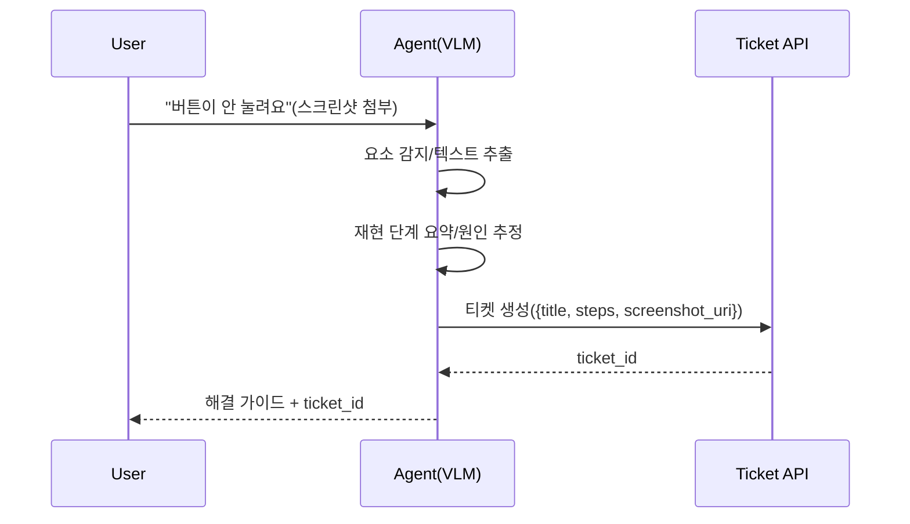

# 멀티모달 에이전트

## 1. 핵심 개념 (Core Concept)

텍스트·이미지·오디오 등 다양한 모달리티를 통합해 인식→추론→행동 루프를 확장하고, 도구 호출과 RAG를 멀티모달 컨텍스트에 접목합니다. VLM(비전·언어), ASR/TTS(오디오)와 툴·프로토콜(MCP)을 결합하면 실제 업무 자동화의 범위가 크게 넓어집니다.

---

## 2. 상세 설명 (Detailed Explanation)

### 2.1 비전-언어 모델(VLM)과 캡셔닝/그라운딩
- 캡셔닝: UI/도면/차트에서 개체·관계·텍스트(광학문자인식 포함) 추출
- 그라운딩: 바운딩 박스/영역·좌표와 텍스트를 연결해 조작·참조 가능
- 문서 이해: 표/양식/청구서 등 문서 레이아웃 인식 + 구조화 추출

### 2.2 오디오 이해/합성(TTS/ASR)과 대화형 멀티모달
- ASR: 실시간 음성 명령 인식, 도메인 용어 보정(커스텀 언어 모델)
- TTS: 합성 음성으로 피드백/안내, 멀티턴 대화에서 끊김 최소화
- 통합: 전화·회의·콜센터 자동화 에이전트(에스컬레이션·인증 연계)

### 2.3 멀티모달 RAG(이미지/도메인 문서 인덱싱)
- 임베딩: 이미지/문서/텍스트 멀티모달 임베딩, 크로스 모달 검색
- 인덱싱: 문서 페이지/영역 단위로 청킹, 메타데이터(페이지/좌표/타입)
- 컨텍스트: 텍스트+이미지 근거를 함께 주입, 인용은 [문서ID §페이지:영역]

### 2.4 도구/프로토콜 연계(MCP·JSON-RPC/OpenAPI)
- UI 조작/스크린샷 캡처/시각 리포트 생성 툴 스키마화
- MCP 리소스로 이미지/문서 URI 제공, 접근권한·로그 감사를 일관화

### 2.5 평가(정확도·일관성·시각 이해·지연/비용)
- 정량: OCR 정확도, 표/도형 인식 F1, 캡션 CIDEr(단어의 TF-IDF 가중치를 이용해 문장 유사도 측정)/SPICE(이미지의 객체, 속성, 관계를 그래프로 표현하여 캡션과 비교)(참조 기반 과제)
- 루브릭: 시각 근거성(영역 일치), 업무 완수율, 대화 일관성
- 효율: p95 지연, 토큰/프레임·초(비용), 모델 전환 오버헤드

---

## 3. 예시 (Example)

### 3.1 UI 자동화 에이전트(개요)


### 3.2 데이터 인덱싱(문서+이미지)
```mermaid
flowchart LR
  PDF[문서(PDF)] --> CH[페이지/영역 청킹]
  IMG[이미지] --> CH
  CH --> EMB[멀티모달 임베딩]
  EMB --> VDB[Vector DB]
```

---

## 4. 예상 면접 질문 (Potential Interview Questions)

- 멀티모달에서 컨텍스트 윈도우와 비용 트레이드오프는?
- 멀티모달 RAG에서 인용·근거성을 어떻게 강제하는가?
- UI 자동화/콜센터 등에서 실패 시 폴백 경로는?

---

## 5. See also

- 5-4 RAG: [에이전틱 RAG](../5-4-retrieval-augmented-generation-rag/advanced-agentic-rag.md)
- 5-9 프로토콜/스키마: [툴 스키마(JSON-RPC/OpenAPI)](../5-9-보안-and-프로토콜/tool-schemas-jsonrpc-openapi.md)
- 5-6 운영/모니터링: [평가 & 모니터링](../5-6-agentops-운영-and-자동화/evaluation-monitoring-ops.md)

---

## 6. 더 읽어보기 (Further Reading)

- docs/references/google/Agents_Companion_v2.pdf
- docs/references/anthropic/building-effective-agents.md
