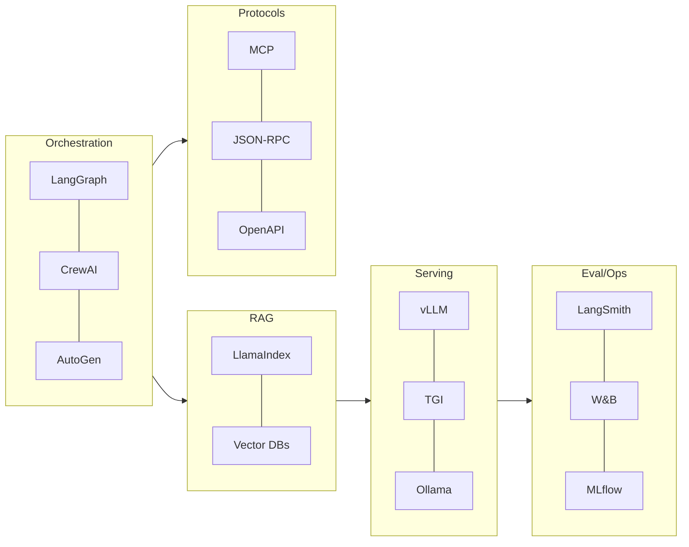

# 트렌드 & 생태계

## 1. 핵심 개념 (Core Concept)

최근 연구·프레임워크·운영 키워드를 한눈에 정리해 학습 로드맵과 선택 기준을 제공합니다. 현업에서는 “Agentic RAG → AgentOps → 프로토콜(MCP) → 보안·평가” 순으로 성숙해가는 경향이 뚜렷합니다.

______________________________________________________________________

## 2. 상세 설명 (Detailed Explanation)

### 2.1 2024–2025 스냅샷(핵심 테마)

- Agentic RAG: 단순 RAG를 넘어 쿼리 분해/다중 스텝/툴 결합(예: SQL+웹), 증거 누적으로 정확도↑
- MCP & 표준화: 모델 컨텍스트 프로토콜로 “리소스/툴/프롬프트”를 표준 스키마로 노출 → 상호운용성↑
- 평가 자동화: LLM-as-a-Judge + 규칙 혼합, 회귀 테스트로 안정 개선, 비용/지연 게이팅 포함
- AgentOps: Shadow/Canary/Ramp 배포, 리플레이/골든 트레이스, 텔레메트리 기반 운영. AgentOps는 GenAIOps(GenAI 전반의 운영)와 PromptOps(프롬프트 라이프사이클 관리)의 개념을 포괄하며, 특히 자율적으로 행동하는 '에이전트'의 운영에 집중하는 분야입니다.
- 보안/가드레일: 프롬프트 인젝션 방어, 툴 권한·쿼터, 샌드박스, 네트워크 화이트리스트
- 멀티모달: UI/도면/차트 이해 + 도구 호출 결합, 멀티모달 RAG 평가가 중요해짐

### 2.2 프레임워크·에코시스템 맵(요점)

- 오케스트레이션: LangGraph, CrewAI, AutoGen
- 문서·RAG: LlamaIndex, Haystack, pgvector/Milvus/FAISS
- 개발자 에이전트: OpenDevin
- 메모리/컨텍스트: MemGPT, LlamaIndex Memory
- 서빙: vLLM, TGI, Ollama, TensorRT-LLM
- 평가/관찰: MLflow, Weights & Biases, LangSmith
- 프로토콜/스키마: MCP, JSON-RPC, OpenAPI

### 2.3 벤치마크 & 평가(변화 포인트)

- Arena/AgentBench/AlpacaEval: 모델/프롬프트 비교에 활용, 다만 데이터 누설/편향 주의
- LLM-as-a-Judge: 포인트/페어와이즈/랭킹 평가, 중재·다수결로 바이어스 완화
- 운영 지표: 품질(EM/F1/ROUGE/Judge), 효율(토큰/비용/지연), 신뢰성(스키마 위반/오류율)

### 2.4 도입 패턴(플레이북)

- 1단계: 단일 에이전트 + RAG(청킹·리랭커·인용 강제), 회귀 테스트 도입
- 2단계: 멀티-스텝/툴 결합(ReAct), 메모리·토큰 예산·압축 전략 수립
- 3단계: AgentOps(텔레메트리, Shadow/Canary, 리플레이), 비용/지연 게이팅
- 4단계: 프로토콜(MCP)·보안/권한·표준 스키마 레지스트리로 확장

______________________________________________________________________

## 3. 예시 (Example)

### 3.1 학습 로드맵(제안)

- 기본기(프롬프트/CoT/ReAct) → RAG(하이브리드·리랭커·인용) → AgentOps(평가/게이팅/배포) → 보안/프로토콜(MCP/툴 스키마)

______________________________________________________________________

## 4. 예상 면접 질문 (Potential Interview Questions)

- 최근 동향 중 실무 임팩트가 큰 요소는 무엇인가?
- 장문 컨텍스트와 RAG의 트레이드오프는?
- MCP 같은 표준을 도입할 때 조직적 이점과 비용은?

______________________________________________________________________

## 5. 더 읽어보기 (Further Reading)

- docs/references/google/Agents_Companion_v2.pdf
- docs/references/openai/a-practical-guide-to-building-agents-3.pdf
- docs/references/anthropic/building-effective-agents.md

______________________________________________________________________

## 6. See also

- 에코시스템 기반 설계: 5-1 → [ecosystem](../5-1-%EC%8B%9C%EC%8A%A4%ED%85%9C-%EC%84%A4%EA%B3%84/ecosystem.md)
- Agentic RAG: 5-4 → [advanced-agentic-rag](../5-4-retrieval-augmented-generation-rag/advanced-agentic-rag.md)
- 평가/운영: 5-5/5-6 → [prompt-evaluation-and-benchmarks](../5-5-%ED%94%84%EB%A1%AC%ED%94%84%ED%8A%B8-%EC%97%94%EC%A7%80%EB%8B%88%EC%96%B4%EB%A7%81-and-%ED%8F%89%EA%B0%80/prompt-evaluation-and-benchmarks.md), [evaluation-monitoring-ops](../5-6-agentops-%EC%9A%B4%EC%98%81-and-%EC%9E%90%EB%8F%99%ED%99%94/evaluation-monitoring-ops.md)
