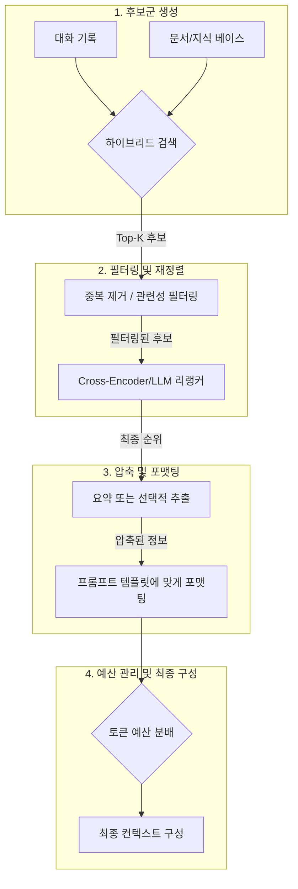

# 컨텍스트 압축 및 관리

## 1. 핵심 개념 (Core Concept)

LLM의 컨텍스트 창(Context Window)은 한정된 작업 공간입니다. 아무리 컨텍스트 창이 큰 모델이라도, 비용, 지연 시간, 성능 저하 문제 때문에 검색된 모든 정보를 그대로 넣을 수는 없습니다. **컨텍스트 압축 및 관리**는 방대한 후보 정보(대화 기록, 문서 등) 속에서 **가장 중요하고 관련성 높은 정보만 선별하고 요약하여, 한정된 컨텍스트 창을 가장 효율적으로 사용하는 기술**입니다. 이는 RAG 시스템의 성능과 직결되는 핵심 요소입니다.

- **핵심 비유(Analogy)**: LLM의 컨텍스트 창을 '시험 볼 때의 책상'에 비유할 수 있습니다. 책상 크기는 한정되어 있는데, 도서관(DB/지식 베이스)의 모든 책을 올려둘 수는 없습니다. 따라서 가장 핵심적인 내용만 요약한 '요약 노트'(Summarization)를 만들고, 관련성이 높은 페이지만 '포스트잇'(Retrieval)으로 표시하며, 그중에서도 가장 중요한 순서대로(Re-ranking) 책상 위에 배치하여 문제를 푸는 것과 같습니다.

*Note: 아래 다이어그램을 위한 이미지를 `docs/images/context-engineering-pipeline.png` 에 추가해주세요.*

______________________________________________________________________

## 2. 컨텍스트 관리 파이프라인

효율적인 컨텍스트 관리는 보통 아래와 같은 깔때기(Funnel) 구조의 파이프라인을 따릅니다.

______________________________________________________________________

## 3. 주요 기술 상세 설명

### 3.1 하이브리드 검색 (Hybrid Search)

- **목적**: 키워드 검색과 벡터 검색의 장점을 결합하여 검색 성능(Recall)을 극대화합니다.
- **방법**: BM25와 같은 키워드 기반 검색으로 특정 용어(예: 제품 ID, 인물 이름)를 정확히 찾아내고, 벡터 검색으로 의미적/개념적으로 유사한 문서를 찾아냅니다. 두 검색 결과를 합친 후, Reciprocal Rank Fusion (RRF)과 같은 알고리즘으로 순위를 재조합하여 초기 후보군을 생성합니다.

### 3.2 리랭킹 (Re-ranking)

- **목적**: 광범위하게 수집된 후보군 내에서 실제 질문과 가장 관련성이 높은 순서대로 정밀하게 재정렬합니다.
- **방법**: 초기 검색(1단계)보다 훨씬 정교하지만 비용이 비싼 모델을 사용합니다. 대표적으로 Cross-Encoder 모델은 (질문, 문서) 쌍을 함께 입력받아 관련성을 0~1 사이의 점수로 계산해주어, 단순 벡터 유사도보다 훨씬 정확한 순위를 매길 수 있습니다.

### 3.3 요약 및 압축 (Summarization & Compression)

- **목적**: 긴 문서나 대화 기록에서 핵심 정보만 추출하여 토큰 사용량을 줄입니다.
- **방법**:
  - **추출적 요약 (Extractive)**: 원문에서 가장 중요한 문장이나 구절을 그대로 가져옵니다.
  - **생성적 요약 (Abstractive)**: LLM을 사용하여 원문의 내용을 바탕으로 새로운 요약문을 생성합니다. (예: "이 문서는 ...에 대해 설명하고 있으며, 핵심 주장은 ...입니다.")
  - **구조화 (Structuring)**: 대화 기록에서 결정된 사항, 질문, 답변 등 주요 내용을 JSON 형식으로 구조화하여 저장합니다.

### 3.4 토큰 예산 관리 (Token Budgeting)

- **목적**: 최종적으로 LLM에 전달될 컨텍스트가 최대 토큰 제한을 넘지 않도록 관리합니다.
- **방법**: 전체 컨텍스트 예산을 시스템 프롬프트, 사용자 질문, 검색된 문서, 대화 기록 등 각 슬롯에 가중치를 두어 분배합니다. 예산 초과 시, 가장 우선순위가 낮은 정보(예: 가장 오래된 대화)부터 제거하거나 요약의 길이를 줄이는 정책을 사용합니다.

### 3.5 롱-컨텍스트 모델 활용

- **선택지**: GPT-4(128k), Gemini(1M) 등 컨텍스트 창이 매우 큰 모델을 사용하면 더 많은 정보를 한 번에 처리할 수 있습니다.
- **주의점**: 롱-컨텍스트 모델을 사용하더라도 **비용, 지연 시간, 그리고 모델이 긴 문맥 속 정보를 놓치는 "Lost in the Middle" 문제**는 여전히 존재합니다. 따라서 롱-컨텍스트 모델을 사용하더라도, 위에서 설명한 압축 및 관리 기법을 병행하여 가장 중요한 정보를 컨텍스트의 앞이나 뒤에 배치하는 것이 여전히 효과적입니다.

______________________________________________________________________

## 4. 예상 면접 질문 및 모범 답안

### Q1. 하이브리드 검색이 왜 필요하며, 검색 결과의 임계값(threshold)은 어떻게 설정하는 것이 좋은가?

**A.** 하이브리드 검색은 \*\*키워드 검색의 '정확성'\*\*과 \*\*벡터 검색의 '의미적 확장성'\*\*을 결합하여, 어느 한쪽만 사용했을 때 발생하는 검색 실패를 보완하기 위해 필요합니다. 임계값은 고정 값보다는, **1단계에서는 후보군을 넓게 수집(높은 Recall)하고 2단계에서 정밀하게 순위를 매기는(높은 Precision) 2단계 전략**을 사용하는 것이 효과적입니다.

**\[추가 설명\]**

- **필요성**:
  - **키워드 검색 (BM25)**: "G-34-2"와 같은 특정 제품 코드나 고유명사 검색에 강하지만, "자동차"를 "차량"으로 검색하지 못하는 등 유의어를 처리하지 못합니다.
  - **벡터 검색**: 의미적으로 유사한 문서를 잘 찾지만, 임베딩 모델이 학습하지 않은 신조어나 특정 키워드를 놓칠 수 있습니다.
  - **하이브리드**: 두 방식을 결합하여 "정확히 일치하는 것"과 "의미적으로 유사한 것"을 모두 잡아 검색의 사각지대를 최소화합니다.
- **임계값 설정 전략**:
  - **1단계 (후보 수집)**: 두 검색 방식에서 각각 유사도 점수 기준 없이 Top-K (예: 50개)의 후보를 수집합니다. 이 단계의 목표는 관련 문서를 놓치지 않고 최대한 많이 후보군에 포함하는 것입니다.
  - **2단계 (재정렬 및 선택)**: 수집된 후보군(최대 100개)을 대상으로, 더 정교하지만 비용이 비싼 Cross-Encoder나 LLM 리랭커를 사용하여 실제 질문과의 관련도 점수를 다시 계산합니다. 그 후, 가장 점수가 높은 Top-R (예: 5개)의 문서만 최종적으로 선택합니다. 이 방식은 비용과 품질 사이의 균형을 맞추는 가장 실용적인 접근법입니다.

### Q2. 롱-컨텍스트 모델을 사용할 때도 컨텍스트 압축이 필요한가? 필요하다면 언제인가?

**A.** 네, 반드시 필요합니다. 롱-컨텍스트 모델을 사용하더라도 **1) 비용, 2) 지연 시간, 3) "Lost in the Middle" 성능 저하**라는 세 가지 핵심 문제 때문에 컨텍스트 압축은 여전히 중요합니다. 특히, 비용과 응답 속도가 중요한 프로덕션 환경이나, 매우 많은 문서를 다루는 복잡한 RAG 작업에서는 압축이 필수적입니다.

**\[추가 설명\]**

1. **비용 (Cost)**: 컨텍스트 길이는 API 비용과 정비례합니다. 100만 토큰 컨텍스트를 매번 호출하는 것은 대부분의 서비스에서 감당하기 어려운 비용입니다. 관련성 높은 1만 토큰으로 압축하면 비용을 1/100로 줄일 수 있습니다.
1. **지연 시간 (Latency)**: 처리하는 토큰이 많을수록 응답 시간이 길어집니다. 실시간 상호작용이 중요한 챗봇과 같은 애플리케이션에서는 긴 지연 시간이 사용자 경험을 심각하게 저해합니다.
1. **성능 저하 ("Lost in the Middle")**: 많은 LLM들이 컨텍스트의 시작과 끝 부분에 있는 정보는 잘 기억하지만, 중간에 있는 정보는 놓치는 경향을 보입니다. 중요한 정보를 압축하여 컨텍스트의 앞부분에 배치하면, 모델이 해당 정보를 활용할 확률이 높아집니다.

- **결론**: 롱-컨텍스트 창은 '더 큰 쓰레기통'이 아니라 '더 넓은 작업대'로 생각해야 합니다. 넓은 작업대 위에서도 가장 중요한 도구와 자료만 가까이 두어야 효율적으로 일할 수 있듯, 롱-컨텍스트 모델에서도 핵심 정보를 선별하고 압축하는 과정은 여전히 중요합니다.

### Q3. 리랭커(Re-ranker)나 요약기(Summarizer)의 품질은 어떻게 평가하고 개선하는가?

**A.** **오프라인 평가**로 모델의 성능을 정량적으로 측정하고, **온라인 A/B 테스트**로 실제 서비스에서의 효과를 검증하는 두 단계로 평가합니다. 오프라인 평가에서는 리랭커의 경우 **NDCG**, 요약기의 경우 **ROUGE**나 **LLM-as-a-Judge**를 사용하며, 개선은 주로 **도메인 특화 데이터로 모델을 파인튜닝**하거나 **프롬프트를 정교화**하는 방식으로 이루어집니다.

**\[추가 설명\]**

- **리랭커 평가 및 개선**:

  - **평가**: (질문, 문서, 관련도 점수)로 구성된 평가 데이터셋을 구축한 뒤, 리랭커가 관련도 높은 문서를 얼마나 상위에 배치하는지를 **NDCG(Normalized Discounted Cumulative Gain)** 지표로 측정합니다.
  - **개선**: 평가 데이터셋을 학습 데이터로 사용하여 Cross-Encoder와 같은 리랭커 모델을 직접 파인튜닝하면, 도메인 특화적인 관련성을 더 잘 판단하게 됩니다.

- **요약기 평가 및 개선**:

  - **평가**: 사람이 직접 작성한 '참조 요약본'과 모델이 생성한 요약문을 비교합니다. 단어 중복률 기반의 **ROUGE** 점수를 사용하거나, GPT-4와 같은 상위 모델을 '심판'으로 사용하여 내용의 **충실성(Faithfulness)**, **간결성(Conciseness)** 등을 정성적으로 평가(LLM-as-a-Judge)합니다.
  - **개선**: 요약 모델을 직접 파인튜닝하거나, "3개의 불렛 포인트로, 각 불렛 포인트는 20단어 이내로 요약해줘" 와 같이 구체적인 지시사항과 예시를 담아 프롬프트를 엔지니어링하는 것이 효과적입니다.

- **공통**: 오프라인 평가에서 가장 성능이 좋은 모델이나 프롬프트를 선정한 뒤, 실제 사용자 트래픽의 일부를 대상으로 A/B 테스트를 진행하여 최종적으로 사용자 만족도나 다운스트림 태스크 성공률이 더 높은 쪽을 선택합니다.

______________________________________________________________________

## 5. 더 읽어보기 (Further Reading)

- [Effective Context Engineering for AI Agents (Anthropic)](/docs/references/anthropic/effective-context-engineering-for-ai-agents.md)
