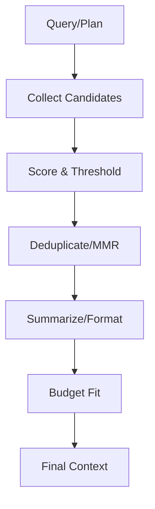

# 컨텍스트 압축 및 관리

## 1. 핵심 개념 (Core Concept)

긴 문맥을 효율적으로 다루기 위해 “토큰 예산 관리 → 후보 수집·스코어링 → 요약/압축 → 컨텍스트 구성” 단계를 체계화합니다. 요약, 임베딩 클러스터링, 하이브리드 검색, 리랭킹, 롱-컨텍스트 모델 옵션을 적절히 조합합니다.

- **핵심 비유(Analogy)**: LLM의 컨텍스트 창을 '작업 책상'에 비유할 수 있습니다. 책상의 크기는 한정되어 있으므로, 도서관(DB)에서 가져온 방대한 자료(검색 결과)를 모두 올려둘 수 없습니다. 따라서 가장 중요한 내용만 '요약 노트'로 만들거나(Summarization), 관련 있는 부분만 '포스트잇'처럼 붙여두고(Clustering/Retrieval), 책상을 효율적으로 사용하는 것과 같습니다.

---

## 2. 상세 설명 (Detailed Explanation)

### 2.1 토큰 예산 관리(Token Budgeting)
- 총 예산: `LLM.max_context - reserved_output_tokens`
- 분배: 시스템/지시문, 질의, 최근 대화, 검색 결과, 근거/인용 블록에 예산을 나눔
- 정책: 초과 시 오래된 대화 요약, 검색 후보 k 감소, 결과 요약 길이 축소

```python
def allocate_budget(total, slots):
    # slots: {name: weight}
    unit = total / sum(slots.values())
    return {k: int(unit*v) for k, v in slots.items()}
```

### 2.2 Sliding window & Summarization
- Sliding Window: 최근 n 턴 유지, 이전 턴은 요약으로 치환
- 요약: 작업-관련 힌트, 결정, 미해결 사항을 Bullets/JSON으로 구조화
- 계층 요약: 세션 중간·종료 타이밍에 스냅샷(중간/최종 요약) 생성

### 2.3 Embedding clustering & representative selection
- 청크 임베딩 후 클러스터링(K-means 등)→대표 선택(centroid 근접, 중요도 가중)
- 중복 제거: MMR(Maximal Marginal Relevance), 다양성 확보로 정보량↑

### 2.4 하이브리드 검색(BM25+Vector)·리랭킹
- 1단계: BM25/키워드 후보 + 벡터 후보 결합 → 상위 K
- 2단계: Cross-Encoder/LLM 기반 리랭커로 상위 R 재정렬
- 임계값: 유사도 스레시홀드 조정으로 정밀(Precision)·재현(Recall) 균형

### 2.5 롱 컨텍스트 모델·어텐션 최적화
- 선택지: 롱-컨텍스트 지원 LLM, 슬라이딩/윈도우 어텐션, 다중쿼리 어텐션 등
- 주의: 길이 증가로 비용·지연 급증 → 요약/하이브리드 검색 병행이 바람직

---

## 3. 예시 (Example)

- FAQ/문서 집합에서 하이브리드 검색으로 관련 청크만 컨텍스트에 주입.
- 채팅 기록 100+턴: 최근 10턴 + 중간/최종 요약 2개 + 관련 장기 메모리 3개 삽입.



---

## 4. 예상 면접 질문 (Potential Interview Questions)

- 하이브리드 검색이 필요한 이유와 임계값 설정 전략은?
- 롱-컨텍스트 모델을 쓸 때도 압축이 필요한가? 언제 필요한가?
- 리랭커/요약기 품질은 어떻게 평가·개선하는가?

---

## 5. 더 읽어보기 (Further Reading)

- docs/references/anthropic/effective-context-engineering-for-ai-agents.md

---

## 6. 품질·비용 지표 & 운영 팁

- 지표: Recall@k, Rerank NDCG, Self-Consistency, Token/Turn, Latency/Turn
- 튜닝: k, R, 임계값, 요약 길이, 슬롯 가중치, 리랭커 모델
- 운영: 템플릿 테스트셋으로 회귀 검증, 과도 주입 방지(최대 삽입 수), 출처 인용 필수화

---

## 7. See also

- 메모리 아키텍처: 5-2 → [memory-architecture](./memory-architecture.md)
- 에이전틱 RAG: 5-4 → [advanced-agentic-rag](../5-4-retrieval-augmented-generation-rag/advanced-agentic-rag.md)
- 평가/모니터링: 5-5/5-6 → [prompt-evaluation-and-benchmarks](../5-5-프롬프트-엔지니어링-and-평가/prompt-evaluation-and-benchmarks.md), [evaluation-monitoring-ops](../5-6-agentops-운영-and-자동화/evaluation-monitoring-ops.md)
