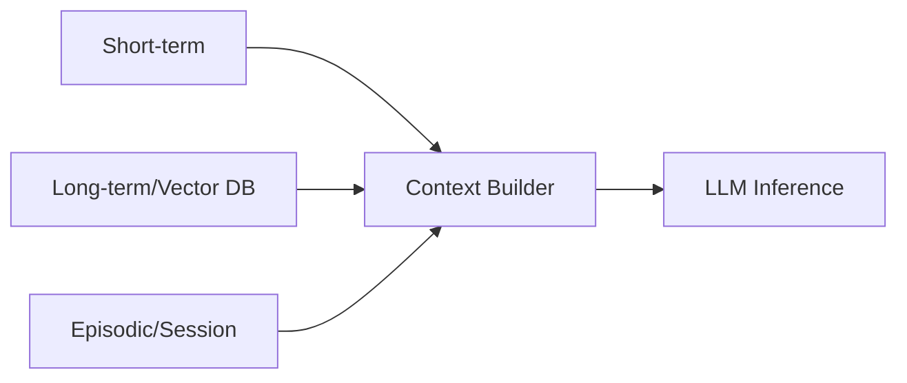

# 메모리 아키텍처

## 1. 핵심 개념 (Core Concept)

에이전트는 단기(작업 메모리), 장기(지식), 일화(세션) 메모리를 조합하고, RAG를 통해 외부 지식을 주입함.

---

## 2. 상세 설명 (Detailed Explanation)

### 2.1 단기 vs 장기 vs 일화 메모리
### 2.2 Retrieval-Augmented Memory 구조
### 2.3 메모리-컨텍스트 상호작용

---

## 3. 예시 (Example)

- 세션 요약 → 장기 저장 → 다음 세션 컨텍스트 재구성.

---

## 4. 예상 면접 질문 (Potential Interview Questions)

- 일화 메모리와 장기 메모리의 차이는?

---

## 5. 더 읽어보기 (Further Reading)

- docs/references/anthropic/effective-context-engineering-for-ai-agents.md
- docs/references/anthropic/building-effective-agents.md

