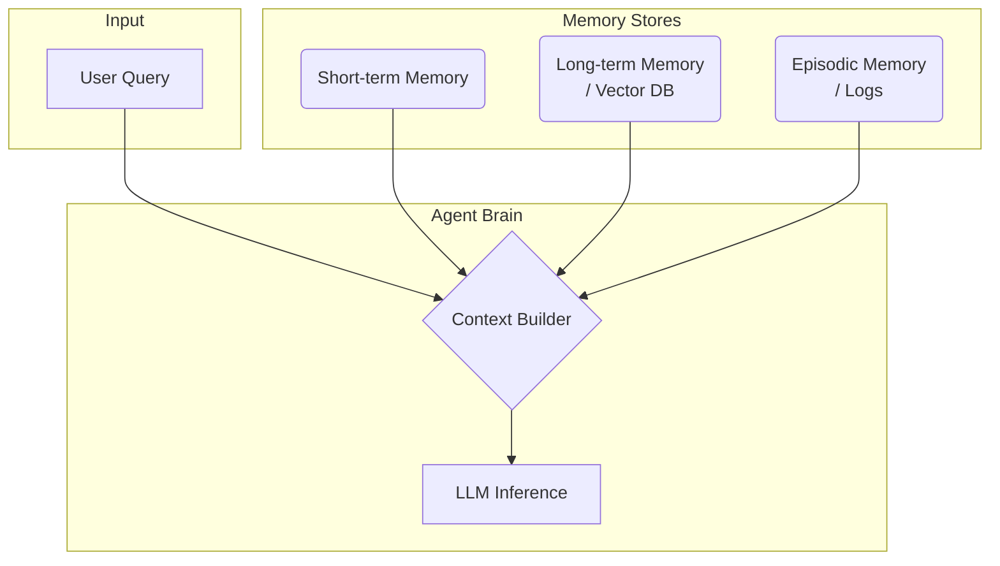

# 메모리 아키텍처

## 1. 핵심 개념 (Core Concept)

에이전트의 메모리 아키텍처는 인간의 기억 방식을 모방하여, **단기 기억(Short-term), 장기 기억(Long-term), 일화 기억(Episodic Memory)** 이라는 세 가지 유형의 메모리를 유기적으로 조합합니다. 각 메모리는 서로 다른 목적과 저장 방식을 가지며, 에이전트가 대화의 맥락을 이해하고, 지식을 활용하며, 경험으로부터 학습하게 하는 핵심 요소입니다. 결국 메모리 아키텍처의 목표는 **"무엇을, 언제, 어떻게 기억하고 잊을 것인가"** 를 설계하는 것입니다.

*Note: 아래 다이어그램을 위한 이미지를 `docs/images/agent-memory-architecture.png` 에 추가해주세요.*

______________________________________________________________________

## 2. 메모리 유형별 비교

| 메모리 유형   | 비유                | 목적                                           | 저장 방식                                              | 대표 사용 사례                                                  |
| :------------ | :------------------ | :--------------------------------------------- | :----------------------------------------------------- | :-------------------------------------------------------------- |
| **단기 기억** | **작업 기억 / RAM** | 현재 대화의 맥락을 유지                        | 인메모리(In-memory) 리스트, 슬라이딩 윈도우, 대화 요약 | "방금 한 말 다시 해줘", "그것에 대해 더 자세히 설명해줘"에 답변 |
| **장기 기억** | **지식 / 도서관**   | 영구적인 사실, 사용자 정보, 외부 지식 저장     | 벡터 DB, 문서 저장소, 관계형 DB                        | 사용자 이름 기억, 기술 문서 참조, 과거 구매 내역 기반 추천      |
| **일화 기억** | **일기 / 로그북**   | 특정 작업을 수행한 과정(행동, 관찰, 결과) 기록 | 로그 파일, 시계열 DB, 에이전트 궤적(Trajectory) 저장소 | 작업 실패 원인 디버깅, 성공/실패 경험 기반의 에이전트 파인튜닝  |

______________________________________________________________________

## 3. Retrieval-Augmented Memory 아키텍처

현대의 에이전트는 위 메모리들을 RAG(Retrieval-Augmented Generation) 기술과 결합하여 활용합니다.

1. **저장 (Storage)**: 대화가 끝나거나 중요한 정보가 발생하면, 해당 정보의 종류(사실, 대화록, 경험)에 따라 적절한 메모리(장기/일화)에 저장합니다. 이때 정보의 출처, 시간, 중요도 등 **메타데이터**를 함께 저장하고, 벡터 임베딩을 생성하여 벡터 DB에 인덱싱합니다.
1. **검색 (Retrieval)**: 사용자의 새로운 질문이 들어오면, 질문 자체와 단기 기억(최근 대화)을 분석하여 검색 쿼리를 생성합니다. 이 쿼리를 사용해 장기/일화 메모리(벡터 DB)에서 관련성이 높은 정보 조각(chunks)들을 검색합니다.
1. **컨텍스트 구성 (Context Construction)**: 검색된 정보 조각들을 그대로 사용하는 것이 아니라, 리랭킹, 요약, 필터링 등 **컨텍스트 압축** 과정을 거쳐 최종적으로 LLM에 전달할 컨텍스트를 동적으로 구성합니다. 이 과정에서 단기 기억(최근 대화)도 함께 조합됩니다.

______________________________________________________________________

## 4. 예상 면접 질문 및 모범 답안

### Q1. 일화 메모리(Episodic)와 장기 메모리(Long-term)의 근본적인 차이는 무엇인가?

**A.** 장기 메모리는 **'사실과 지식(What)'** 을 저장하는 정적인 데이터베이스인 반면, 일화 메모리는 특정 목표를 달성하기 위한 **'과정과 경험(How, When)'** 을 저장하는 동적인 로그입니다. 장기 메모리가 '무엇을 아는가'의 문제라면, 일화 메모리는 '무엇을 했고 그 결과 어땠는가'의 문제입니다.

**\[추가 설명\]**

- **장기 메모리 (Long-term Memory)**:
  - **내용**: 컨텍스트에 독립적인 정보 (예: "파리의 수도는 프랑스", "사용자의 이름은 김철수").
  - **구조**: 키-값, 테이블, 또는 벡터 DB에 저장된 의미적 정보 조각. '지식의 데이터베이스'입니다.
  - **목적**: 에이전트의 답변에 사실적 근거를 제공하고, 개인화된 상호작용을 가능하게 합니다.
- **일화 메모리 (Episodic Memory)**:
  - **내용**: 시간 순서에 따라 기록된 (행동, 관찰, 결과)의 궤적 (예: "1. `search('AI')` 호출 → 2. 결과 없음 관찰 → 3. '검색어가 너무 넓다'고 성찰 → 4. `search('AI Agent')` 호출").
  - **구조**: 로그, 트레이스, 또는 궤적(Trajectory). '행동의 역사'입니다.
  - **목적**: 에이전트의 학습과 자기 개선을 가능하게 합니다. 실패한 '일화'를 분석하여 디버깅하거나, 성공한 '일화'를 모아 파인튜닝 데이터로 사용합니다.
- **비유**: 요리를 배울 때, **장기 메모리**는 레시피 북(사실)이고, **일화 메모리**는 지난번에 양파를 태웠던 경험(경험)입니다. 레시피만으로는 요리를 잘하기 어렵고, 실제 경험을 통해 배워야 실력이 느는 것과 같습니다.

### Q2. 어떤 정보를 장기 메모리에 저장하고, 어떤 정보를 폐기(또는 요약)해야 하는가?

**A.** **미래에 재사용될 가치가 있고, 사용자의 선호나 사실과 같이 영속적인 정보**는 장기 메모리에 저장해야 합니다. 반면, **인사말처럼 사소하거나, 일회성이고, 민감한 정보**는 폐기해야 합니다. 내용이 길지만 일부 중요한 정보가 포함된 경우, 전체를 저장하는 대신 **핵심만 요약**하여 저장하는 것이 효율적입니다. 이 결정은 LLM을 '메모리 큐레이터'로 사용하여 자동화할 수 있습니다.

**\[추가 설명\]**

- **저장 대상**:
  - **사용자 정보**: 이름, 역할, 선호하는 언어 등 개인화에 필요한 정보.
  - **핵심 사실**: 대화 중에 확인된 중요한 사실이나 결정 사항 (예: "프로젝트 마감일은 12월 1일이다").
  - **성공적인 해결책**: 특정 문제에 대한 성공적인 해결 과정.
- **폐기 대상**:
  - **대화적 필러**: "안녕하세요", "감사합니다" 등 의미 없는 인사말.
  - **일회성 정보**: 이메일 인증 코드, 현재 시간 질문 등 재사용 가치가 없는 정보.
  - **민감 정보 (PII)**: 명시적인 동의 및 보안 조치 없이는 처리가 끝나는 즉시 폐기해야 합니다.
- **요약 후 저장 대상**:
  - **긴 대화 기록**: 문제 해결 과정 전체가 아닌, 최종 진단 결과와 해결책만 요약하여 저장.
  - **긴 문서**: 전체 문서가 아닌, 문서의 전반적인 주제와 핵심 주장을 담은 요약본을 저장.
- **자동화 전략**: 대화 세션이 끝난 후, LLM에게 "이 대화에서 앞으로의 상호작용을 위해 기억해야 할 중요한 사실이나 사용자 선호가 있다면 목록으로 만들어줘. 없다면 비워둬." 와 같은 프롬프트를 보내, 저장할 가치가 있는 정보만 추출하여 장기 메모리에 저장할 수 있습니다.

### Q3. 검색된 정보의 '근거성(Grounding)'을 어떻게 보장하는가?

**A.** **'출처 명시(Citation)'** 정책을 강제하여 근거성을 보장합니다. 즉, LLM에 컨텍스트를 주입할 때, 정보의 내용뿐만 아니라 **고유한 출처 ID를 함께 제공**하고, LLM이 답변을 생성할 때 반드시 이 ID를 인용하도록 요구합니다. 최종 답변은 이 인용이 올바른지 검증하는 단계를 거칩니다.

**\[추가 설명\]**

1. **컨텍스트에 메타데이터 주입**: 벡터 DB에서 정보 조각을 검색할 때, 텍스트 내용과 함께 `source_id` (예: `doc_id_123, chunk_7`)와 같은 메타데이터를 함께 가져옵니다. LLM에 전달되는 컨텍스트는 `[출처: doc_123, chunk_7] 하늘이 파란 이유는 레일리 산란 때문이다.` 와 같은 형태가 됩니다.
1. **프롬프트로 인용 강제**: 시스템 프롬프트에 "제공된 출처에 기반하여 답변해야 하며, 각 문장의 끝에는 근거가 된 `[출처: ...]`를 반드시 포함해야 한다" 와 같이 명시적인 규칙을 부여합니다.
1. **출력 파싱 및 검증 (Evaluator)**: 에이전트가 생성한 답변은 후처리 단계에서 파서(Parser)와 평가자(Evaluator)를 거칩니다.
   - **인용 존재 여부 확인**: 답변에 `[출처: ...]` 형식이 포함되어 있는지 기계적으로 확인합니다. 없으면 답변을 기각하고 재생성을 요청합니다.
   - **충실성 검증 (Faithfulness Check)**: (선택적, 고도화) 답변의 특정 주장과 해당 주장이 인용한 출처의 원문을 함께 LLM(평가자)에게 보내, "이 주장이 출처의 내용과 일치하는가?"를 검증합니다. 주장이 출처 내용과 다르다면 '환각 인용(Hallucinated Citation)'으로 판단하고 답변을 기각합니다.

- **기대 효과**: 이 프로세스는 에이전트 답변의 투명성과 신뢰도를 크게 높입니다. 사용자는 더 이상 답변을 맹목적으로 믿는 것이 아니라, 그 근거를 직접 추적하고 확인할 수 있게 됩니다.

______________________________________________________________________

## 5. 더 읽어보기 (Further Reading)

- [Effective Context Engineering for AI Agents (Anthropic)](/docs/references/anthropic/effective-context-engineering-for-ai-agents.md)
- [Building effective agents (Anthropic)](/docs/references/anthropic/building-effective-agents.md)

______________________________________________________________________

## 6. See also

- [컨텍스트 압축 및 관리](./context-compression-management.md)
- [기본 RAG 파이프라인](../5-4-retrieval-augmented-generation-rag/basic-rag-pipeline.md)
